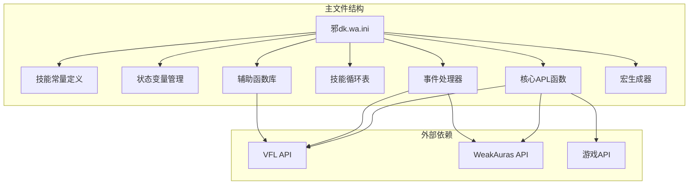
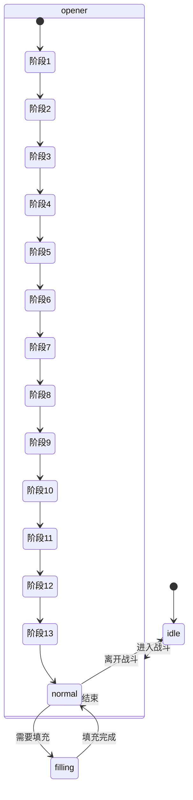
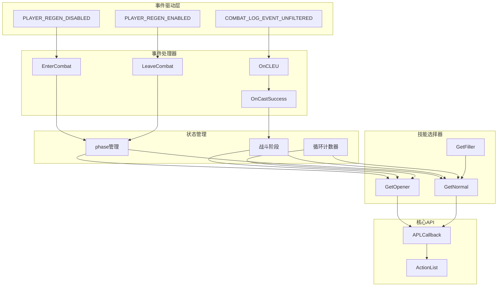
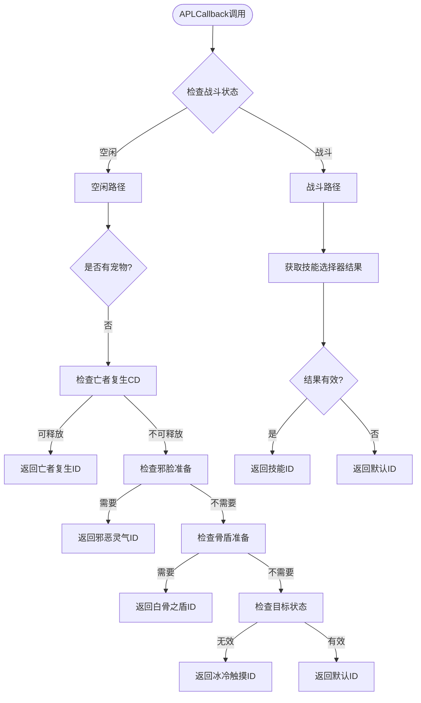
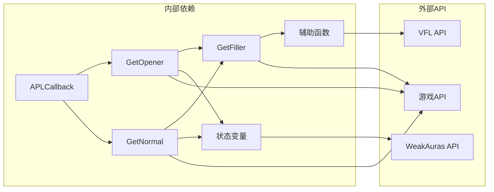

# API参考文档

<cite>
**本文档引用的文件**
- [邪dk.wa.ini](file://邪dk.wa.ini)
</cite>

## 目录
1. [简介](#简介)
2. [项目结构](#项目结构)
3. [核心组件](#核心组件)
4. [架构概览](#架构概览)
5. [详细组件分析](#详细组件分析)
6. [依赖关系分析](#依赖关系分析)
7. [性能考虑](#性能考虑)
8. [故障排除指南](#故障排除指南)
9. [结论](#结论)

## 简介

这是一个为魔兽世界巫妖王版本（Wrath of the Lich King）设计的死亡骑士（邪DK）自动化播放逻辑（APL）脚本。该脚本实现了智能的技能选择器、事件处理机制、配置参数系统和宏生成功能，为玩家提供最优的战斗策略。

## 项目结构

该项目采用单一文件架构，包含以下主要模块：

**图表来源**
- [邪dk.wa.ini:17-599](file://邪dk.wa.ini#L17-L599)

**章节来源**
- [邪dk.wa.ini:17-599](file://邪dk.wa.ini#L17-L599)

## 核心组件

### 技能常量系统

脚本定义了完整的技能常量映射，包括主要技能、天赋技能和物品效果：

| 技能类别 | 技能名称 | 常量名 | ID |
|---------|----------|--------|----|
| 主要技能 | 冰冷触摸 | IC | 49909 |
| 主要技能 | 暗影打击 | PS | 49921 |
| 主要技能 | 鲜血打击 | BS | 49930 |
| 主要技能 | 天灾打击 | SS | 55271 |
| 主要技能 | 血液沸腾 | BB | 48721 |
| 主要技能 | 枯萎凋零 | DN | 49938 |
| 主要技能 | 凋零缠绕 | DC | 49895 |
| 主要技能 | 寒冬号角 | HN | 57623 |
| 主要技能 | 召唤石像鬼 | GA | 49206 |
| 主要技能 | 符文武器增效 | EW | 47568 |
| 主要技能 | 亡者大军 | AR | 42650 |
| 主要技能 | 白骨之盾 | BSH | 49222 |
| 主要技能 | 活力分流 | BT | 45529 |
| 主要技能 | 食尸鬼狂乱 | GF | 63560 |
| 主要技能 | 传染 | PE | 50842 |
| 天赋技能 | 鲜血灵气 | BP | 48266 |
| 天赋技能 | 邪恶灵气 | UP | 48265 |
| 特殊技能 | 亡者复生 | RD | 46584 |

**章节来源**
- [邪dk.wa.ini:21-42](file://邪dk.wa.ini#L21-L42)

### 状态管理系统

系统维护多个全局状态变量来跟踪战斗阶段和条件：

**图表来源**
- [邪dk.wa.ini:45-52](file://邪dk.wa.ini#L45-L52)

**章节来源**
- [邪dk.wa.ini:45-52](file://邪dk.wa.ini#L45-L52)

## 架构概览

**图表来源**
- [邪dk.wa.ini:350-362](file://邪dk.wa.ini#L350-L362)
- [邪dk.wa.ini:252-321](file://邪dk.wa.ini#L252-L321)

## 详细组件分析

### APLCallback函数

APLCallback是整个系统的入口点，负责根据当前状态返回合适的技能ID。

#### 函数签名与返回值
- **函数名**: APLCallback
- **返回值**: 技能ID或特殊值
- **调用时机**: 每个游戏帧被WeakAuras调用

#### 执行流程

**图表来源**
- [邪dk.wa.ini:545-568](file://邪dk.wa.ini#L545-L568)

**章节来源**
- [邪dk.wa.ini:545-568](file://邪dk.wa.ini#L545-L568)

### 技能选择器API

#### GetOpener函数

**功能**: 返回开场战斗序列中的下一个技能

**参数**: 无

**返回值**: 技能对象，包含以下字段：
- `spell`: 技能名称
- `id`: 技能ID
- `r`: 选择原因说明

**调用时机**: 当`phase == "opener"`时

**关键逻辑**:
1. 处理天鬼后的邪脸切换
2. 爆发期手套使用优化
3. 开场序列的动态调整
4. 亡者大军的替代序列

**章节来源**
- [邪dk.wa.ini:457-544](file://邪dk.wa.ini#L457-L544)

#### GetNormal函数

**功能**: 返回常规战斗循环中的下一个技能

**参数**: 无

**返回值**: 技能对象或填充技能

**调用时机**: 当`phase == "normal"`时

**关键逻辑**:
1. 天鬼后邪脸切换检查
2. 战斗中天鬼召唤决策
3. 食尸鬼狂乱的智能补充
4. AOE循环与单体循环切换
5. 手套使用的时机判断

**章节来源**
- [邪dk.wa.ini:379-455](file://邪dk.wa.ini#L379-L455)

#### GetFiller函数

**功能**: 返回空闲时间的填充技能

**参数**: 无

**返回值**: 填充技能对象

**优先级顺序**:
1. 凋零缠绕（当RP≥50且可用）
2. 寒冬号角（当RP<60且可用）
3. 加速手套（爆发期未使用且条件满足）
4. 等待（默认）

**章节来源**
- [邪dk.wa.ini:365-377](file://邪dk.wa.ini#L365-L377)

### 事件处理API

#### EnterCombat函数

**功能**: 战斗开始时的初始化

**参数**: 无

**返回值**: 无

**执行操作**:
1. 设置战斗阶段为"opener"
2. 初始化循环计数器
3. 清理状态标志
4. 检测BOSS战斗
5. 选择合适的开场序列

**章节来源**
- [邪dk.wa.ini:252-276](file://邪dk.wa.ini#L252-L276)

#### LeaveCombat函数

**功能**: 战斗结束时的状态清理

**参数**: 无

**返回值**: 无

**执行操作**:
1. 设置阶段为"idle"
2. 清理最后施放的技能信息

**章节来源**
- [邪dk.wa.ini:278-282](file://邪dk.wa.ini#L278-L282)

#### OnCastSuccess函数

**功能**: 施法成功的事件处理

**参数**:
- `spellName`: 技能名称
- `spellID`: 技能ID

**返回值**: 无

**执行逻辑**:
1. 忽略空闲状态的事件
2. 避免重复处理相同技能
3. 更新天鬼后的邪脸切换标志
4. 更新循环计数器
5. 处理技能期望匹配

**章节来源**
- [邪dk.wa.ini:284-321](file://邪dk.wa.ini#L284-L321)

#### OnCLEU函数

**功能**: COMBAT_LOG_EVENT_UNFILTERED事件的统一处理

**参数**: 无

**返回值**: 无

**处理类型**:
1. SPELL_CAST_SUCCESS: 调用OnCastSuccess
2. SPELL_MISSED/SWING_MISSED: 处理闪避和格挡
3. 其他事件: 忽略

**章节来源**
- [邪dk.wa.ini:323-348](file://邪dk.wa.ini#L323-L348)

### 配置参数API

WAParam.config提供以下配置选项：

| 参数名 | 类型 | 默认值 | 取值范围 | 描述 |
|--------|------|--------|----------|------|
| autoBossBurst | boolean | true | true/false | BOSS战自动爆发模式 |
| usePestilence | boolean | true | true/false | 使用传染技能 |
| pestilenceTargets | number | 2 | 1-∞ | 触发传染的最小目标数 |
| useGlovesAuto | boolean | true | true/false | 自动使用加速手套 |
| useSpeedPotion | boolean | false | true/false | 使用速度药水 |
| useDeathCoil | boolean | true | true/false | 使用凋零缠绕进行泄能 |

**章节来源**
- [邪dk.wa.ini:263-275](file://邪dk.wa.ini#L263-L275)
- [邪dk.wa.ini:400-400](file://邪dk.wa.ini#L400-L400)
- [邪dk.wa.ini:436-438](file://邪dk.wa.ini#L436-L438)
- [邪dk.wa.ini:472-477](file://邪dk.wa.ini#L472-L477)

### 辅助函数参考

#### IsCD函数

**功能**: 检查技能冷却状态

**参数**:
- `spellID`: 技能ID

**返回值**: boolean - 技能是否在冷却中

**实现原理**: 比较技能CD与特定技能CD的差值

**章节来源**
- [邪dk.wa.ini:54-56](file://邪dk.wa.ini#L54-L56)

#### GetRP函数

**功能**: 获取当前鲜血能量值

**参数**: 无

**返回值**: number - 当前RP值

**章节来源**
- [邪dk.wa.ini:58-60](file://邪dk.wa.ini#L58-L60)

#### PestInfo函数

**功能**: 统计可攻击目标的数量

**参数**: 无

**返回值**: number - 可攻击目标数量

**实现逻辑**: 遍历姓名板，过滤敌对且存活的目标

**章节来源**
- [邪dk.wa.ini:62-76](file://邪dk.wa.ini#L62-L76)

#### IsGlovesReady函数

**功能**: 检查加速手套使用的条件

**参数**: 无

**返回值**: boolean - 是否可以使用加速手套

**条件**: BOSS战、启用自动使用、物品CD为0、距离≤5码

**章节来源**
- [邪dk.wa.ini:78-83](file://邪dk.wa.ini#L78-L83)

### 宏生成API

ActionList定义了完整的宏生成规则：

#### ActionList结构

每个元素包含：`{技能ID, 类型, 宏内容, 图标ID}`

**宏类型**:
- `"macro"`: 自定义宏命令
- `"spell"`: 直接施放技能

#### 特殊宏处理

1. **默认宏**: `/startattack\n/cast [nopet] 亡者复生\n/petattack [combat]`
2. **枯萎凋零**: 添加`[@player,nochanneling]`条件
3. **召唤石像鬼**: 包含种族特长和装备使用
4. **亡者大军**: 条件性添加速度药水
5. **加速手套**: 通用热力工程炸药和萨隆邪铁炸弹

**章节来源**
- [邪dk.wa.ini:570-593](file://邪dk.wa.ini#L570-L593)

## 依赖关系分析

**图表来源**
- [邪dk.wa.ini:545-568](file://邪dk.wa.ini#L545-L568)
- [邪dk.wa.ini:365-377](file://邪dk.wa.ini#L365-L377)

**章节来源**
- [邪dk.wa.ini:545-568](file://邪dk.wa.ini#L545-L568)
- [邪dk.wa.ini:365-377](file://邪dk.wa.ini#L365-L377)

## 性能考虑

### 优化策略

1. **事件过滤**: 只处理玩家相关的战斗日志事件
2. **状态缓存**: 避免重复计算常用状态
3. **早退机制**: 在条件不满足时立即返回
4. **智能冷却检测**: 使用VFL API进行精确的CD计算

### 时间复杂度分析

- **APLCallback**: O(1) - 常数时间复杂度
- **技能选择器**: O(1) - 最多遍历固定长度的循环表
- **事件处理器**: O(1) - 单次事件处理
- **辅助函数**: O(1) - 基础API调用

## 故障排除指南

### 常见问题诊断

1. **技能选择异常**
   - 检查WAParam.config配置
   - 验证VFL API是否正常工作
   - 确认WeakAuras版本兼容性

2. **事件处理失效**
   - 确认COMBAT_LOG_EVENT_UNFILTERED事件注册
   - 检查UIParent框架创建
   - 验证事件过滤逻辑

3. **宏生成错误**
   - 检查技能ID映射完整性
   - 验证宏语法格式
   - 确认图标资源存在

### 调试建议

1. 启用WeakAuras调试模式
2. 检查控制台错误输出
3. 验证VFL API响应
4. 测试单个函数的返回值

**章节来源**
- [邪dk.wa.ini:350-362](file://邪dk.wa.ini#L350-L362)

## 结论

这个APL脚本提供了完整的死亡骑士自动化解决方案，具有以下特点：

1. **模块化设计**: 清晰的功能分离和职责划分
2. **智能决策**: 基于战斗状态和条件的动态技能选择
3. **配置灵活**: 丰富的参数选项适应不同玩法需求
4. **易于扩展**: 清晰的架构便于功能增强和bug修复

该脚本为魔兽世界玩家提供了专业级的自动化战斗体验，通过合理的算法设计和事件驱动架构，实现了高效的战斗表现。