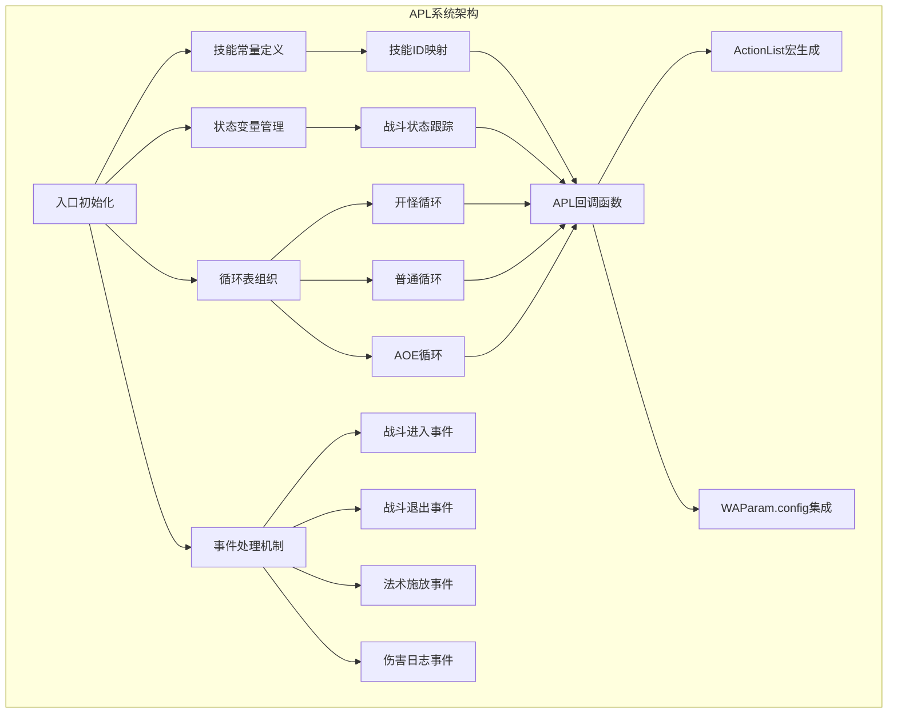
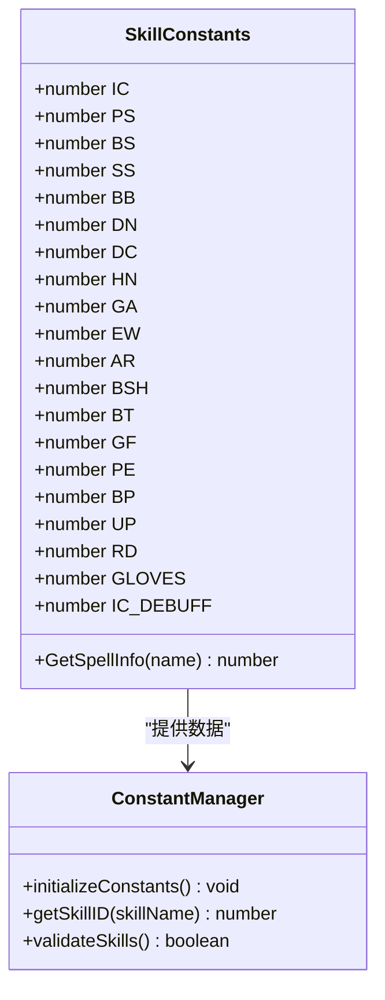
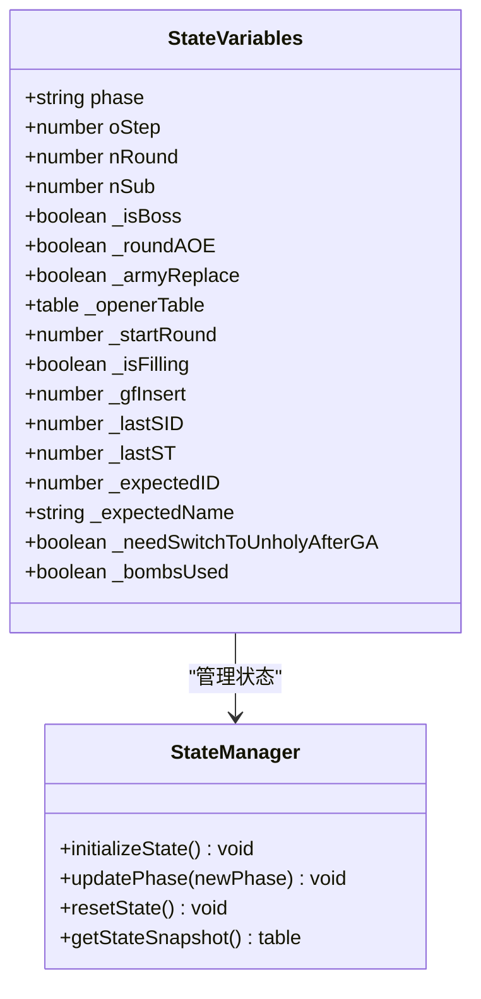
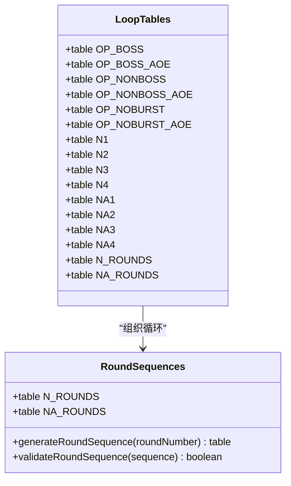
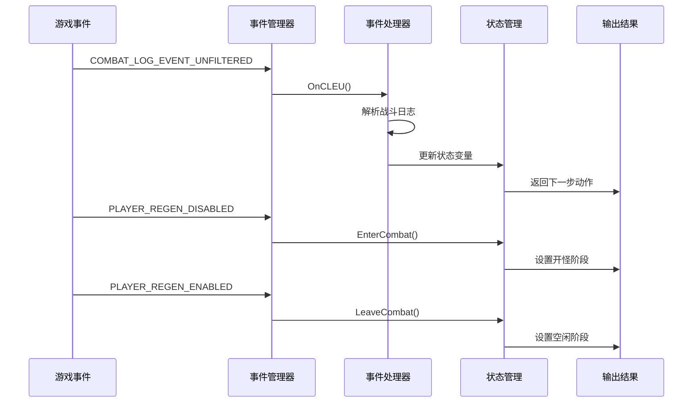
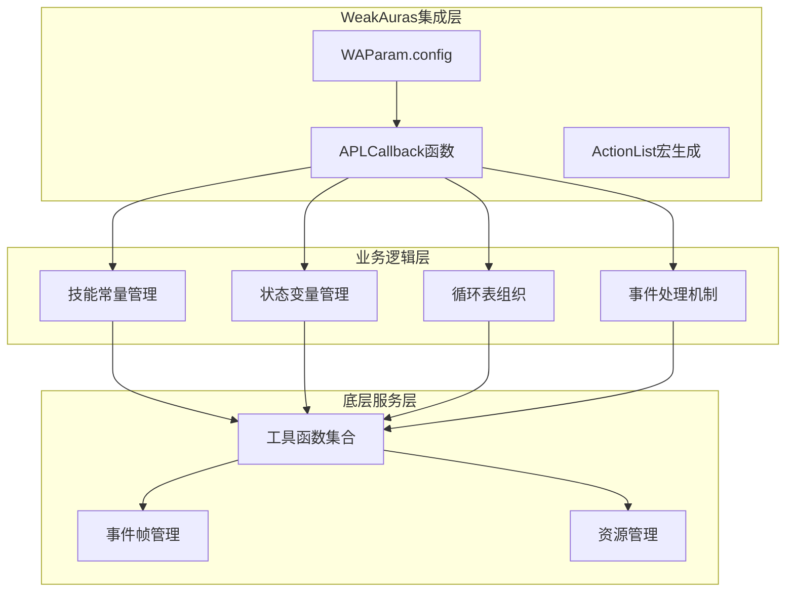
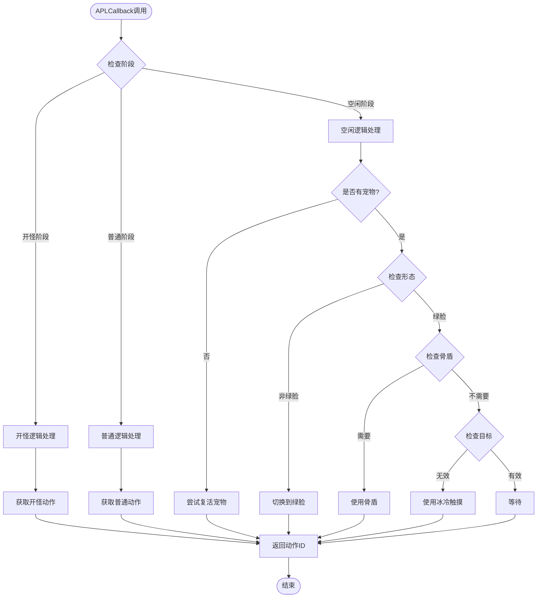
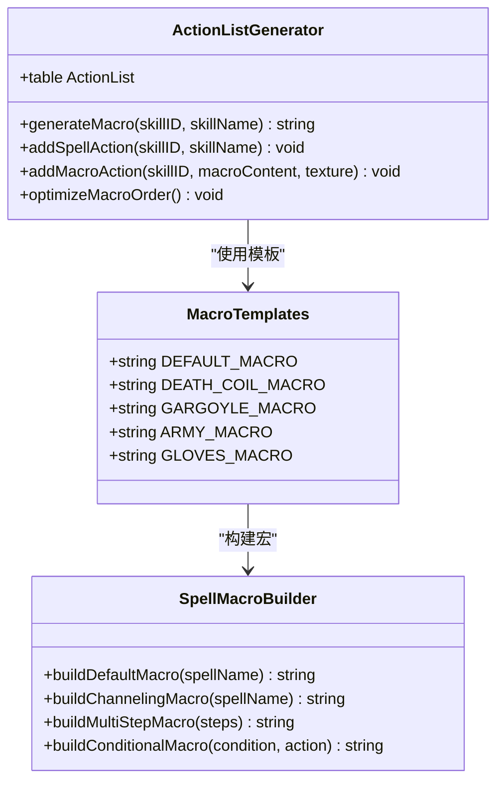
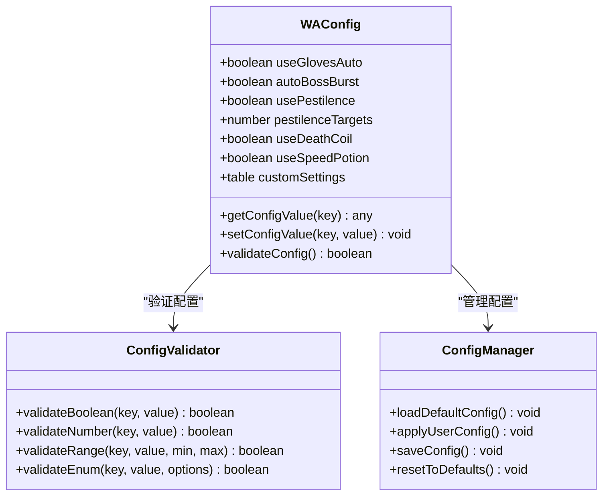
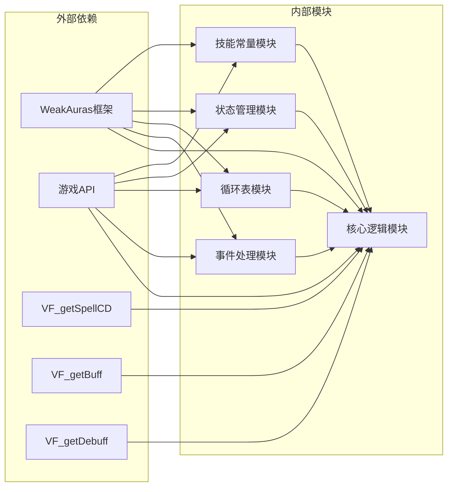

# 代码结构说明

<cite>
**本文档引用的文件**
- [邪dk.wa.ini](file://邪dk.wa.ini)
</cite>

## 目录
1. [简介](#简介)
2. [项目结构](#项目结构)
3. [核心组件](#核心组件)
4. [架构概览](#架构概览)
5. [详细组件分析](#详细组件分析)
6. [依赖关系分析](#依赖关系分析)
7. [性能考虑](#性能考虑)
8. [故障排除指南](#故障排除指南)
9. [结论](#结论)

## 简介

这是一个基于WeakAuras框架的死亡骑士APL（Automated Player Logic）系统实现。该系统针对魔兽世界燃烧的远征经典版本（Wrath of the Lich King）进行了深度优化，特别适配了"泰坦时光服"服务器环境。系统通过Lua脚本实现了智能的技能释放逻辑，包括技能常量管理、状态变量控制、循环表组织和事件处理机制。

## 项目结构

整个APL系统采用单文件架构设计，所有功能都集中在同一个`.ini`文件中，这种设计便于部署和维护：

**图表来源**
- [邪dk.wa.ini:14-15](file://邪dk.wa.ini#L14-L15)
- [邪dk.wa.ini:20-42](file://邪dk.wa.ini#L20-L42)
- [邪dk.wa.ini:44-83](file://邪dk.wa.ini#L44-L83)
- [邪dk.wa.ini:85-250](file://邪dk.wa.ini#L85-L250)
- [邪dk.wa.ini:251-362](file://邪dk.wa.ini#L251-L362)

**章节来源**
- [邪dk.wa.ini:1-606](file://邪dk.wa.ini#L1-L606)

## 核心组件

### 技能常量管理模块

技能常量模块负责定义和管理所有使用的技能ID，确保代码的一致性和可维护性：

**图表来源**
- [邪dk.wa.ini:21-42](file://邪dk.wa.ini#L21-L42)

该模块包含17个主要技能常量和2个辅助常量，涵盖了：
- 主要攻击技能：冰冷触摸、暗影打击、鲜血打击、天灾打击
- 辅助技能：血液沸腾、枯萎凋零、凋零缠绕、寒冬号角
- 召唤技能：召唤石像鬼、亡者大军
- 防护技能：白骨之盾
- 转换技能：活力分流、食尸鬼狂乱
- 灵气技能：鲜血灵气、邪恶灵气
- 复活技能：亡者复生
- 装备技能：加速手套

**章节来源**
- [邪dk.wa.ini:20-42](file://邪dk.wa.ini#L20-L42)

### 状态变量管理模块

状态变量模块管理整个APL系统的运行状态，采用文件作用域局部变量设计：

**图表来源**
- [邪dk.wa.ini:44-52](file://邪dk.wa.ini#L44-L52)

关键状态包括：
- **阶段控制**：`phase` - 控制当前执行阶段（idle/opener/normal）
- **循环指针**：`oStep`、`nRound`、`nSub` - 分别控制开怪步骤、普通循环轮次和子步骤
- **战斗属性**：`_isBoss`、`_roundAOE` - 标识Boss战和AOE条件
- **特殊标志**：`_needSwitchToUnholyAfterGA`、`_bombsUsed` - 控制特定时机的行为

**章节来源**
- [邪dk.wa.ini:44-52](file://邪dk.wa.ini#L44-L52)

### 循环表组织模块

循环表模块定义了完整的技能释放序列，支持多种战斗场景：

**图表来源**
- [邪dk.wa.ini:85-250](file://邪dk.wa.ini#L85-L250)

循环表分为两大类：

1. **开怪循环表**（OP_*系列）
   - BOSS战爆发型循环
   - BOSS战非爆发型循环  
   - 普通怪物循环
   - AOE怪物循环
   - 无爆发循环

2. **普通循环表**（N*系列）
   - N1-N4四种不同的循环模式
   - 支持AOE模式（NA1-NA4）

**章节来源**
- [邪dk.wa.ini:85-250](file://邪dk.wa.ini#L85-L250)

### 事件处理模块

事件处理模块实现了完整的战斗事件监听和响应机制：

**图表来源**
- [邪dk.wa.ini:350-362](file://邪dk.wa.ini#L350-L362)
- [邪dk.wa.ini:251-348](file://邪dk.wa.ini#L251-L348)

事件处理包括：
- **战斗进入事件**：初始化状态变量，确定循环类型
- **战斗退出事件**：清理状态，回到空闲模式
- **法术施放事件**：更新循环指针，处理技能冷却
- **伤害日志事件**：处理未命中情况，调整循环策略

**章节来源**
- [邪dk.wa.ini:251-348](file://邪dk.wa.ini#L251-L348)

## 架构概览

APL系统采用分层架构设计，各模块职责明确，耦合度低：

**图表来源**
- [邪dk.wa.ini:17](file://邪dk.wa.ini#L17)
- [邪dk.wa.ini:552-575](file://邪dk.wa.ini#L552-L575)
- [邪dk.wa.ini:577-605](file://邪dk.wa.ini#L577-L605)

## 详细组件分析

### APLCallback函数实现原理

APLCallback是整个系统的核心函数，负责根据当前状态返回下一步要执行的动作：

**图表来源**
- [邪dk.wa.ini:552-575](file://邪dk.wa.ini#L552-L575)

APLCallback的决策流程体现了以下设计原则：
- **优先级管理**：天鬼后切换绿脸具有最高优先级
- **条件判断**：基于资源状态、冷却时间和战斗环境做出决策
- **回退机制**：当无法执行预期动作时返回默认等待指令

**章节来源**
- [邪dk.wa.ini:552-575](file://邪dk.wa.ini#L552-L575)

### ActionList宏生成机制

ActionList模块负责为每个技能生成对应的宏命令：

**图表来源**
- [邪dk.wa.ini:577-605](file://邪dk.wa.ini#L577-L605)

宏生成机制的特点：
- **条件宏**：使用`[condition]`语法实现智能选择
- **多步骤宏**：复杂技能组合的顺序执行
- **纹理支持**：为每个技能设置对应的图标显示
- **优化排序**：按照技能重要性排序，提高响应速度

**章节来源**
- [邪dk.wa.ini:577-605](file://邪dk.wa.ini#L577-L605)

### WAParam.config配置系统

WAParam.config提供了灵活的用户配置接口：

**图表来源**
- [邪dk.wa.ini:17](file://邪dk.wa.ini#L17)
- [邪dk.wa.ini:263](file://邪dk.wa.ini#L263)

配置选项包括：
- **自动手套**：`useGlovesAuto` - 自动使用加速手套
- **Boss战爆发**：`autoBossBurst` - Boss战自动爆发
- **枯萎凋零**：`usePestilence` - 使用枯萎凋零技能
- **目标数量**：`pestilenceTargets` - AOE触发的目标数量
- **死亡之环**：`useDeathCoil` - 使用死亡之环进行泄能

**章节来源**
- [邪dk.wa.ini:17](file://邪dk.wa.ini#L17)
- [邪dk.wa.ini:263](file://邪dk.wa.ini#L263)

## 依赖关系分析

系统内部依赖关系清晰，模块间耦合度低：

**图表来源**
- [邪dk.wa.ini:17](file://邪dk.wa.ini#L17)
- [邪dk.wa.ini:54-60](file://邪dk.wa.ini#L54-L60)

主要依赖关系：
- **WeakAuras集成**：通过`aura_env`访问WAParam.config
- **游戏API依赖**：使用`GetSpellInfo`、`UnitPower`等函数
- **虚拟函数依赖**：使用`VF_getSpellCD`、`VF_getBuff`等虚拟函数
- **事件系统依赖**：注册和处理各种游戏事件

**章节来源**
- [邪dk.wa.ini:17](file://邪dk.wa.ini#L17)
- [邪dk.wa.ini:54-60](file://邪dk.wa.ini#L54-L60)

## 性能考虑

系统在设计时充分考虑了性能优化：

### 时间复杂度分析
- **技能查询**：O(1) - 通过哈希表直接访问技能ID
- **状态更新**：O(1) - 简单的变量赋值操作
- **循环查找**：O(1) - 数组索引访问，最多4次循环
- **事件处理**：O(1) - 固定的条件判断和分支

### 内存使用优化
- **常量池**：技能ID一次性加载，避免重复查询
- **状态压缩**：使用紧凑的状态变量结构
- **循环表复用**：多个循环共享基础数据结构

### 执行效率优化
- **早期返回**：在不可能的情况下快速退出
- **缓存机制**：避免重复的API调用
- **条件短路**：利用Lua的逻辑运算符特性

## 故障排除指南

### 常见问题及解决方案

**问题1：技能ID不匹配**
- **症状**：APL无法识别某些技能
- **原因**：技能名称与实际名称不一致
- **解决**：检查技能常量定义，确认`GetSpellInfo`返回值

**问题2：循环卡死**
- **症状**：APL在某个步骤无限循环
- **原因**：状态变量更新异常或条件判断错误
- **解决**：检查事件处理逻辑，添加调试输出

**问题3：宏命令失效**
- **症状**：ActionList中的宏无法执行
- **原因**：宏语法错误或条件不满足
- **解决**：验证宏模板，检查WAParam.config配置

**问题4：性能问题**
- **症状**：APL响应缓慢
- **原因**：过多的API调用或复杂的计算
- **解决**：优化条件判断，减少不必要的检查

**章节来源**
- [邪dk.wa.ini:284-348](file://邪dk.wa.ini#L284-L348)
- [邪dk.wa.ini:552-575](file://邪dk.wa.ini#L552-L575)

## 结论

这个APL系统展现了优秀的代码组织和设计原则：

### 设计优势
- **模块化设计**：清晰的功能分离，便于维护和扩展
- **状态机架构**：通过状态变量精确控制执行流程
- **事件驱动**：基于游戏事件的实时响应机制
- **配置灵活**：WAParam.config提供了丰富的用户定制选项

### 技术亮点
- **智能循环管理**：支持多种战斗场景的动态切换
- **优先级控制**：关键动作具有最高优先级
- **错误处理**：完善的边界条件检查和回退机制
- **性能优化**：高效的算法设计和内存使用

### 改进建议
- **单元测试**：增加自动化测试覆盖关键逻辑
- **日志系统**：添加详细的调试信息输出
- **配置验证**：增强WAParam.config的参数验证
- **文档完善**：为每个函数添加详细的注释说明

这个APL系统为魔兽世界经典版本的死亡骑士玩家提供了强大的自动化支持，其设计思路和实现技巧对于其他职业的APL开发具有重要的参考价值。