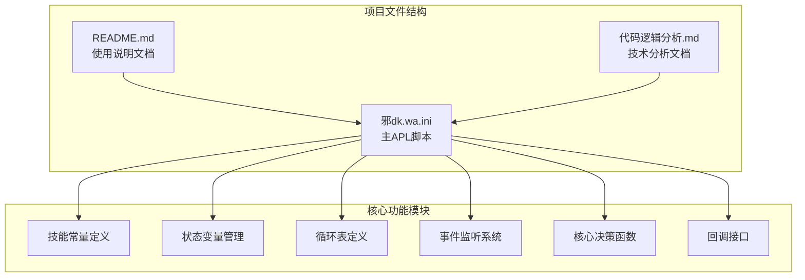
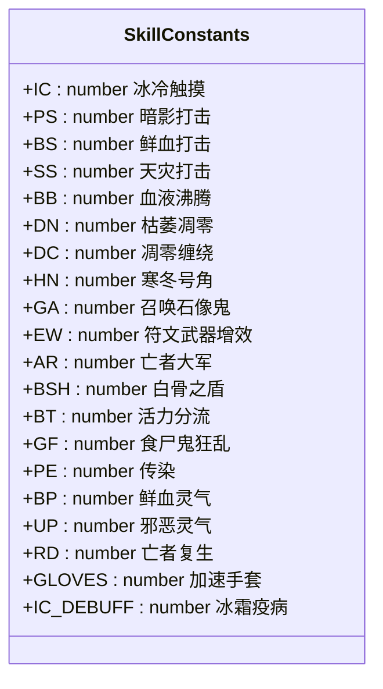
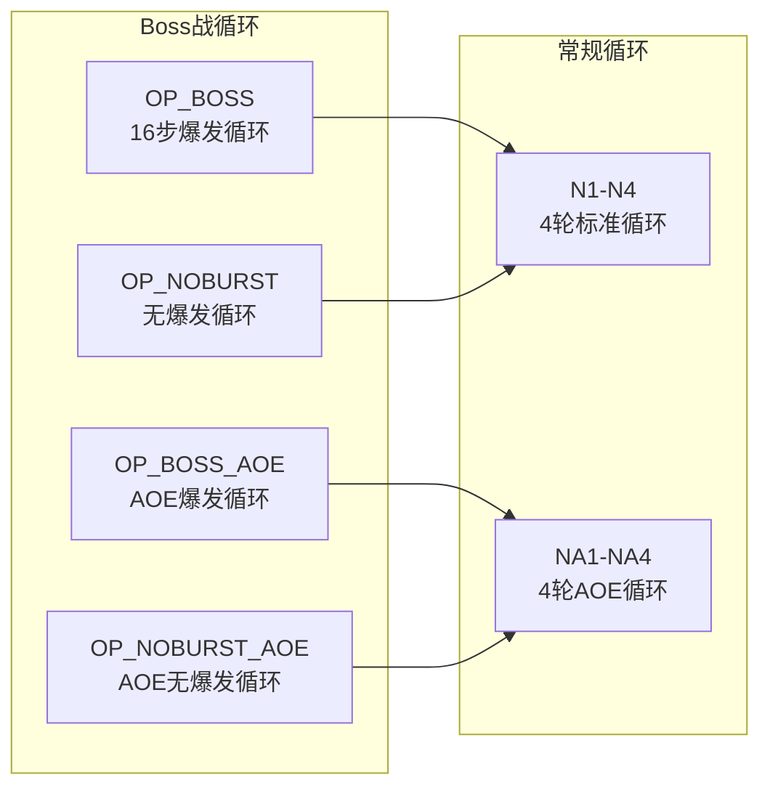
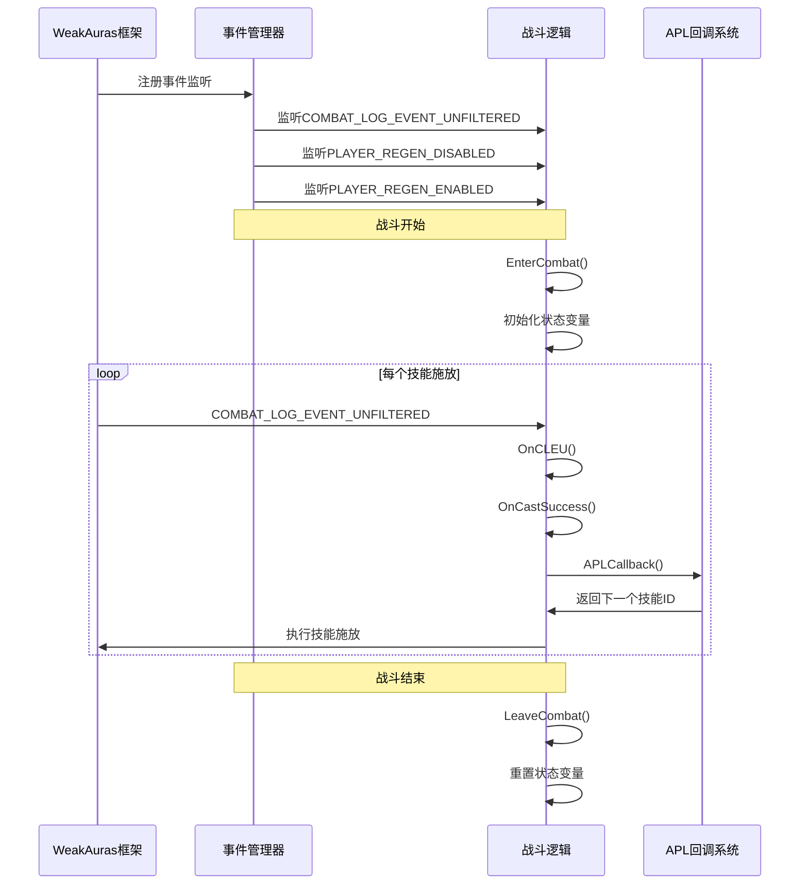
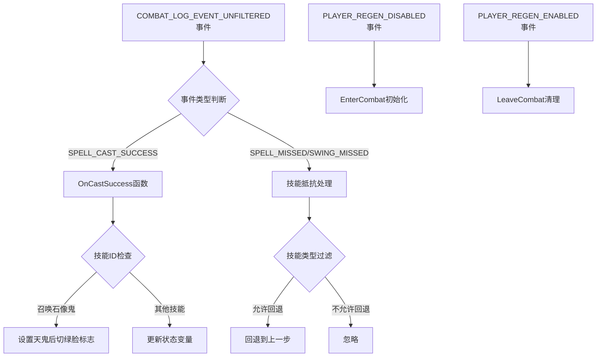
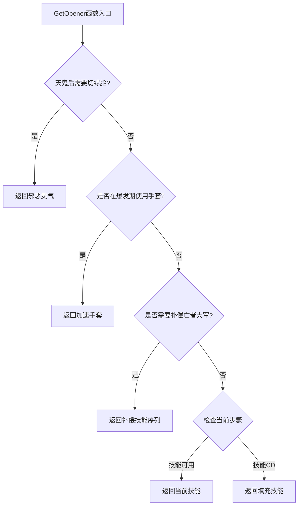
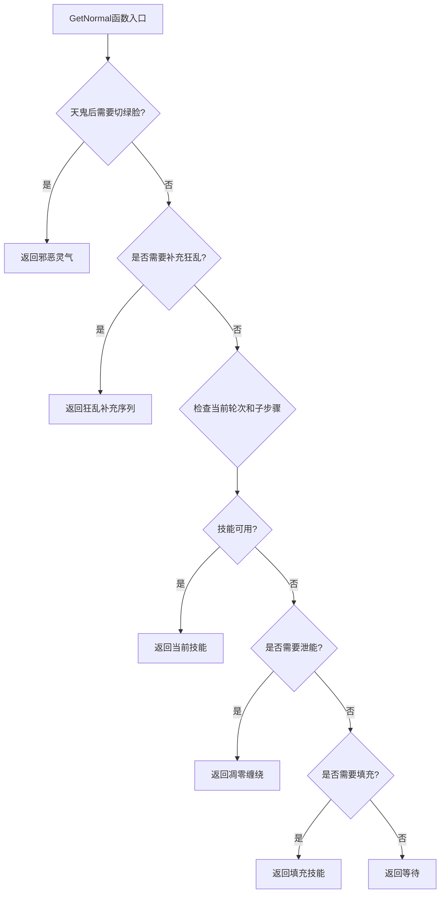
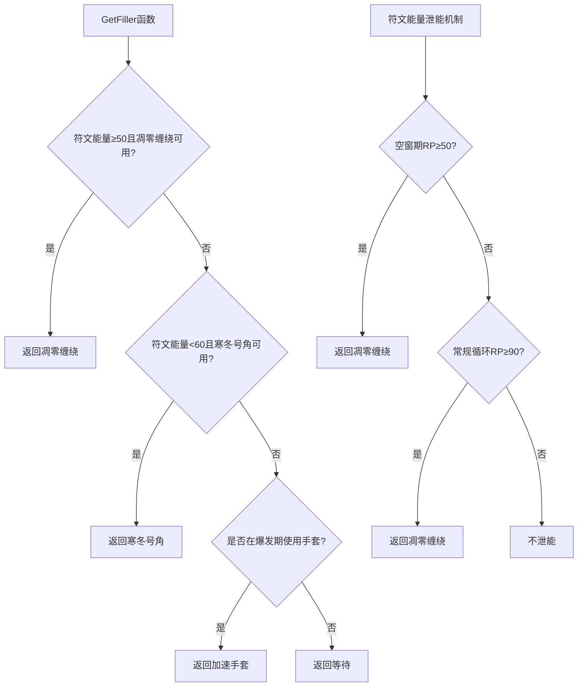
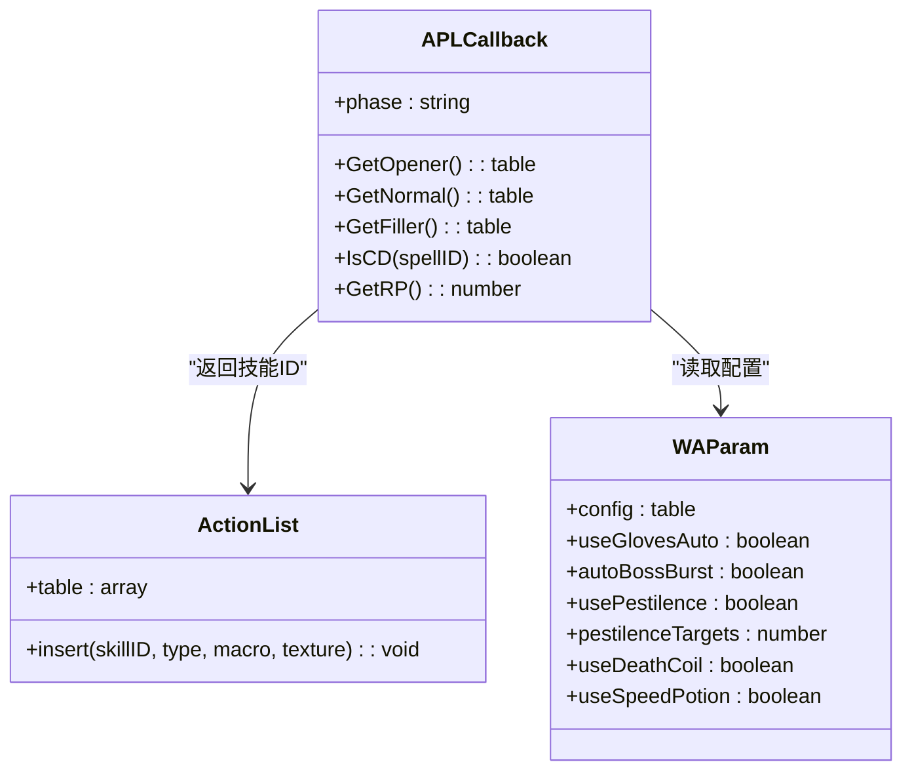
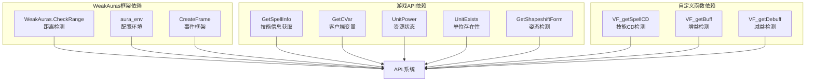

# 开发者参考

<cite>
**本文档引用的文件**
- [邪dk.wa.ini](file://邪dk.wa.ini)
- [README.md](file://README.md)
- [代码逻辑分析.md](file://代码逻辑分析.md)
</cite>

## 目录
1. [简介](#简介)
2. [项目结构](#项目结构)
3. [核心组件](#核心组件)
4. [架构概览](#架构概览)
5. [详细组件分析](#详细组件分析)
6. [依赖关系分析](#依赖关系分析)
7. [性能考量](#性能考量)
8. [故障排除指南](#故障排除指南)
9. [结论](#结论)
10. [附录](#附录)

## 简介

这是一个为魔兽世界泰坦时光服（基于WLK 80级框架）优化的不死亡灵骑士（邪DK）自动输出循环脚本。该系统采用"天打流"核心机制，通过WeakAuras插件实现智能技能优先级管理。项目由原作者"疯狂不龟路"开发，经过"念秋"的深度重构和泰坦时光服适配。

该APL系统提供了完整的战斗自动化解决方案，包括：
- 智能姿态管理（天鬼后自动切绿脸）
- 爆发手法优化（预铺狂乱、智能狂乱补充）
- 动态AOE适配（2目标及以上自动切换到AOE循环）
- 资源管理优化（符文能量泄能、空窗期填充）
- 容错机制（技能抵抗回退、CD填充）

## 项目结构

该项目采用单一文件架构，所有功能集中在 `邪dk.wa.ini` 文件中，配合 `README.md` 和 `代码逻辑分析.md` 文档提供完整的使用说明和技术分析。

**图表来源**
- [邪dk.wa.ini:1-606](file://邪dk.wa.ini#L1-L606)
- [README.md:1-420](file://README.md#L1-L420)
- [代码逻辑分析.md:1-297](file://代码逻辑分析.md#L1-L297)

**章节来源**
- [邪dk.wa.ini:1-606](file://邪dk.wa.ini#L1-L606)
- [README.md:1-420](file://README.md#L1-L420)

## 核心组件

### 技能常量定义模块

系统使用集中化的技能常量定义，通过 `S` 表统一管理所有技能ID：

**图表来源**
- [邪dk.wa.ini:21-42](file://邪dk.wa.ini#L21-L42)

### 状态变量管理系统

系统维护复杂的全局状态变量来跟踪战斗状态：

| 状态变量 | 类型 | 描述 |
|---------|------|------|
| `phase` | string | 当前阶段（idle/opener/normal） |
| `oStep` | number | 开怪循环步骤索引 |
| `nRound` | number | 常规循环轮次索引 |
| `nSub` | number | 常规循环子步骤索引 |
| `_isBoss` | boolean | 是否为Boss战 |
| `_roundAOE` | boolean | 当前是否为AOE循环 |
| `_armyReplace` | number | 亡者大军补偿机制计数 |
| `_openerTable` | table | 当前使用的开怪循环表 |
| `_startRound` | number | 常规循环开始轮次 |
| `_isFilling` | boolean | 是否处于填充状态 |
| `_gfInsert` | number | 狂乱补充机制计数 |
| `_lastSID` | number | 最后施放技能ID |
| `_lastST` | number | 最后施放时间戳 |
| `_expectedID` | number | 期望施放的技能ID |
| `_expectedName` | string | 期望施放的技能名称 |
| `_needSwitchToUnholyAfterGA` | boolean | 天鬼后切绿脸标志 |
| `_bombsUsed` | boolean | 炸弹使用标志 |

**章节来源**
- [邪dk.wa.ini:44-53](file://邪dk.wa.ini#L44-L53)

### 循环表系统

系统定义了多种循环表以适应不同的战斗场景：

**图表来源**
- [邪dk.wa.ini:90-250](file://邪dk.wa.ini#L90-L250)

**章节来源**
- [邪dk.wa.ini:85-250](file://邪dk.wa.ini#L85-L250)

## 架构概览

APL系统采用事件驱动的架构模式，通过WeakAuras框架提供的事件系统实现智能决策。

**图表来源**
- [邪dk.wa.ini:350-362](file://邪dk.wa.ini#L350-L362)
- [邪dk.wa.ini:252-282](file://邪dk.wa.ini#L252-L282)
- [邪dk.wa.ini:354-362](file://邪dk.wa.ini#L354-L362)

## 详细组件分析

### 事件处理系统

事件处理系统是APL的核心，负责监听游戏事件并做出相应反应：

**图表来源**
- [邪dk.wa.ini:323-348](file://邪dk.wa.ini#L323-L348)
- [邪dk.wa.ini:252-282](file://邪dk.wa.ini#L252-L282)

**章节来源**
- [邪dk.wa.ini:323-348](file://邪dk.wa.ini#L323-L348)
- [邪dk.wa.ini:252-282](file://邪dk.wa.ini#L252-L282)

### 核心决策算法

APL的核心决策算法分为开怪循环和常规循环两部分：

#### 开怪循环决策流程

**图表来源**
- [邪dk.wa.ini:457-551](file://邪dk.wa.ini#L457-L551)

#### 常规循环决策流程

**图表来源**
- [邪dk.wa.ini:379-455](file://邪dk.wa.ini#L379-L455)

**章节来源**
- [邪dk.wa.ini:457-551](file://邪dk.wa.ini#L457-L551)
- [邪dk.wa.ini:379-455](file://邪dk.wa.ini#L379-L455)

### 资源管理系统

系统实现了智能的资源管理机制，包括符文能量管理和技能CD填充：

**图表来源**
- [邪dk.wa.ini:365-377](file://邪dk.wa.ini#L365-L377)
- [邪dk.wa.ini:434-438](file://邪dk.wa.ini#L434-L438)

**章节来源**
- [邪dk.wa.ini:365-377](file://邪dk.wa.ini#L365-L377)
- [邪dk.wa.ini:434-438](file://邪dk.wa.ini#L434-L438)

### APL回调接口

APL系统通过回调接口与WeakAuras框架交互：

**图表来源**
- [邪dk.wa.ini:552-575](file://邪dk.wa.ini#L552-L575)
- [README.md:268-275](file://README.md#L268-L275)

**章节来源**
- [邪dk.wa.ini:552-575](file://邪dk.wa.ini#L552-L575)
- [README.md:268-275](file://README.md#L268-L275)

## 依赖关系分析

APL系统依赖于多个外部API和框架组件：

**图表来源**
- [邪dk.wa.ini:17-18](file://邪dk.wa.ini#L17-L18)
- [邪dk.wa.ini:21-42](file://邪dk.wa.ini#L21-L42)
- [README.md:328-331](file://README.md#L328-L331)

**章节来源**
- [邪dk.wa.ini:17-18](file://邪dk.wa.ini#L17-L18)
- [README.md:328-331](file://README.md#L328-L331)

## 性能考量

### 优化策略

系统在多个方面进行了性能优化：

1. **状态缓存机制**：避免重复计算相同的战斗状态
2. **早退出优化**：在条件不满足时立即返回，减少不必要的计算
3. **智能检测**：仅在必要时进行AOE目标检测
4. **CD计算优化**：使用相对CD计算而非绝对CD

### 潜在优化点

根据代码分析，仍有以下优化空间：

1. **PestInfo调用频率**：可以缓存AOE检测结果
2. **IsCD函数优化**：缓存全局CD值
3. **字符串比较优化**：预编译正则表达式模式

**章节来源**
- [代码逻辑分析.md:241-261](file://代码逻辑分析.md#L241-L261)

## 故障排除指南

### 常见问题及解决方案

#### 问题1：技能抵抗导致的循环错误

**症状**：技能被抵抗后循环出现错误

**解决方案**：系统实现了技能抵抗回退机制，自动检测技能抵抗并回退到上一步

**章节来源**
- [代码逻辑分析.md:122-137](file://代码逻辑分析.md#L122-L137)

#### 问题2：手套使用时机不当

**症状**：手套在爆发期未能正确使用

**解决方案**：系统在oStep 8-9期间检查手套使用时机，确保在天鬼后、大军前的最佳时机使用

**章节来源**
- [代码逻辑分析.md:45-65](file://代码逻辑分析.md#L45-L65)

#### 问题3：狂乱buff重复使用

**症状**：食尸鬼狂乱buff重复叠加

**解决方案**：在N4轮次跳过动态狂乱补充，避免重复使用

**章节来源**
- [代码逻辑分析.md:19-41](file://代码逻辑分析.md#L19-L41)

### 调试技巧

1. **启用详细日志**：通过修改系统可以在控制台输出详细的决策过程
2. **逐步调试**：使用断点逐行执行关键函数
3. **状态监控**：观察全局状态变量的变化
4. **性能分析**：使用性能分析工具检测热点函数

## 结论

该APL系统是一个高度优化的魔兽世界自动输出解决方案，具有以下特点：

### 技术优势

1. **架构清晰**：模块化设计，职责分离明确
2. **逻辑严谨**：完善的容错机制和边界条件处理
3. **性能优秀**：多层优化策略确保高效运行
4. **易于扩展**：良好的抽象层次便于功能扩展

### 应用价值

1. **DPS提升**：相比手动循环可提升8-14%的伤害输出
2. **稳定性高**：经过多次迭代优化，系统稳定可靠
3. **适应性强**：支持多种战斗场景和配置选项
4. **维护友好**：清晰的代码结构便于后续维护

### 发展方向

1. **AI增强**：可以考虑引入机器学习算法优化决策
2. **可视化**：添加更丰富的可视化反馈
3. **社区化**：建立社区贡献机制，收集更多使用反馈
4. **跨版本支持**：扩展支持更多魔兽世界版本

## 附录

### API参考文档

#### 公开函数

| 函数名 | 参数 | 返回值 | 描述 |
|--------|------|--------|------|
| `APLCallback` | 无 | number | 主要APL回调函数，返回下一个技能ID |
| `GetOpener` | 无 | table | 开怪循环决策函数 |
| `GetNormal` | 无 | table | 常规循环决策函数 |
| `GetFiller` | 无 | table | 空窗期填充函数 |
| `EnterCombat` | 无 | void | 战斗开始时的初始化函数 |
| `LeaveCombat` | 无 | void | 战斗结束时的清理函数 |
| `OnCastSuccess` | spellName, spellID | void | 技能施放成功的处理函数 |
| `OnCLEU` | 无 | void | 战斗日志事件的处理函数 |

#### 配置参数

| 参数名 | 类型 | 默认值 | 描述 |
|--------|------|--------|------|
| `useGlovesAuto` | boolean | true | 自动使用加速手套/炸弹 |
| `autoBossBurst` | boolean | true | Boss战自动爆发 |
| `usePestilence` | boolean | true | 启用AOE传染功能 |
| `pestilenceTargets` | number | 2 | AOE触发的目标数量阈值 |
| `useDeathCoil` | boolean | true | 启用符文能量泄能 |
| `useSpeedPotion` | boolean | true | 大军时使用速度药水 |

#### 技能常量

系统定义了完整的技能常量表，包含所有相关技能的ID和属性。这些常量通过 `S` 表统一管理，确保代码的一致性和可维护性。

**章节来源**
- [README.md:268-275](file://README.md#L268-L275)
- [邪dk.wa.ini:21-42](file://邪dk.wa.ini#L21-L42)

### 扩展开发指南

#### 添加新技能到循环表

1. **定义技能常量**：在 `S` 表中添加新的技能ID
2. **创建循环步骤**：使用 `mks()` 函数创建新的循环步骤
3. **更新循环表**：将新步骤添加到相应的循环表中
4. **实现决策逻辑**：在 `GetNormal` 或 `GetOpener` 中添加相应的决策条件
5. **测试验证**：进行全面的功能测试和性能测试

#### 修改现有逻辑

1. **分析影响范围**：确定修改对哪些功能产生影响
2. **编写测试用例**：为修改的逻辑编写完整的测试用例
3. **渐进式修改**：采用小步快跑的方式逐步实现修改
4. **回归测试**：确保修改不影响现有功能
5. **性能验证**：验证修改后的性能表现

#### 创建自定义功能

1. **需求分析**：明确自定义功能的具体需求
2. **架构设计**：设计功能的架构和接口
3. **模块实现**：实现核心功能模块
4. **集成测试**：与现有系统进行集成测试
5. **文档完善**：编写完整的使用文档和API文档

### 版本管理策略

#### 版本更新说明

| 版本 | 主要改进 | 修复问题 | 兼容性 |
|------|----------|----------|--------|
| v2.1 | 逻辑优化 | N4轮次狂乱重复、手套使用时机过窄、常规循环手套重复尝试 | 向后兼容 |
| v2.0 | 泰坦时光服适配 | AOE阈值调整、泄能阈值降低、天鬼后自动切绿脸 | 部分破坏性变更 |
| v1.0 | 原始版本 | 基础功能实现 | 不适用 |

#### 测试验证流程

1. **单元测试**：对每个函数进行独立测试
2. **集成测试**：测试模块间的协作功能
3. **回归测试**：确保新功能不影响现有功能
4. **性能测试**：验证系统的性能表现
5. **兼容性测试**：测试不同版本的兼容性

#### 安全修改实践

1. **备份策略**：修改前备份原始代码
2. **代码审查**：进行同行代码审查
3. **测试覆盖**：确保修改有完整的测试覆盖
4. **文档更新**：及时更新相关文档
5. **回滚准备**：准备好快速回滚的方案

### 代码贡献指南

#### 开发环境搭建

1. **基础要求**：安装魔兽世界游戏客户端和WeakAuras插件
2. **开发工具**：准备文本编辑器和版本控制系统
3. **测试环境**：准备测试账号和测试场景
4. **文档工具**：准备文档编写工具

#### 编码规范

1. **命名规范**：使用清晰的变量和函数命名
2. **注释规范**：为复杂逻辑添加详细注释
3. **格式规范**：保持一致的代码格式
4. **错误处理**：完善错误处理和异常捕获

#### 最佳实践建议

1. **模块化设计**：保持功能的模块化和高内聚低耦合
2. **性能优化**：关注性能指标，避免性能瓶颈
3. **可维护性**：编写易懂、易维护的代码
4. **测试驱动**：采用测试驱动的开发方式
5. **文档同步**：确保文档与代码同步更新