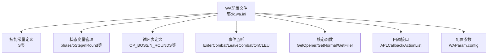
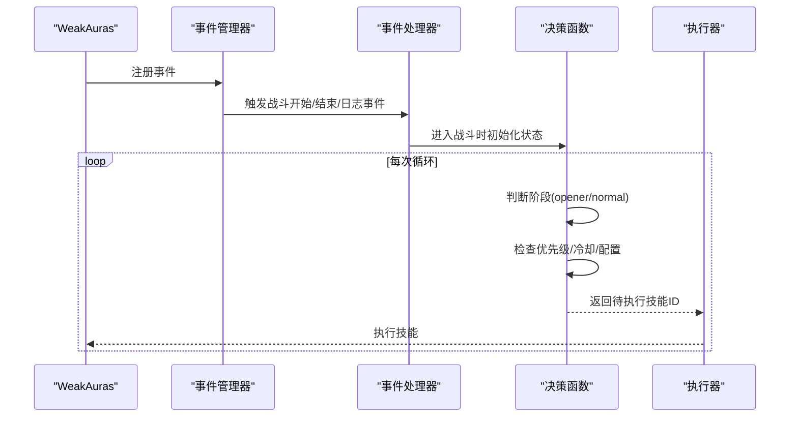
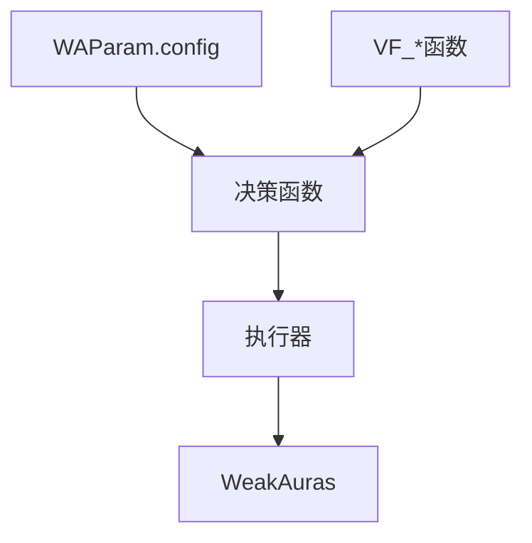

# 扩展开发指南

<cite>
**本文档引用的文件**
- [README.md](file://README.md)
- [代码逻辑分析.md](file://代码逻辑分析.md)
- [邪dk.wa.ini](file://邪dk.wa.ini)
</cite>

## 目录
1. [简介](#简介)
2. [项目结构](#项目结构)
3. [核心组件](#核心组件)
4. [架构概览](#架构概览)
5. [详细组件分析](#详细组件分析)
6. [依赖关系分析](#依赖关系分析)
7. [性能考量](#性能考量)
8. [故障排查指南](#故障排查指南)
9. [结论](#结论)
10. [附录](#附录)

## 简介
本指南面向希望在魔兽世界WLK经典服（时光服）环境下对邪DK APL进行扩展开发的工程师与高级玩家。文档围绕以下目标展开：
- 如何将新技能加入循环表
- 如何修改技能优先级与冷却时间检测逻辑
- 如何扩展事件处理机制、添加新的状态判断条件
- 如何实现自定义的战斗策略
- 如何扩展WAParam.config参数（添加新配置项、默认值与UI集成）
- 安全的代码修改实践（备份策略、测试验证流程、兼容性检查）
- 提供实际扩展示例（添加新技能到循环表的具体步骤与注意事项）

本指南严格基于仓库中的实际代码与文档，确保所有建议均可落地实施。

## 项目结构
该项目由一个WA（WeakAuras）配置文件组成，该文件实现了完整的APL（自动输出循环）逻辑，包含技能常量、状态变量、循环表、事件处理、核心决策函数以及回调接口等模块。

图表来源
- [邪dk.wa.ini:21-42](file://邪dk.wa.ini#L21-L42)
- [邪dk.wa.ini:45-51](file://邪dk.wa.ini#L45-L51)
- [邪dk.wa.ini:86-249](file://邪dk.wa.ini#L86-L249)
- [邪dk.wa.ini:252-362](file://邪dk.wa.ini#L252-L362)
- [邪dk.wa.ini:365-598](file://邪dk.wa.ini#L365-L598)

章节来源
- [README.md:1-420](file://README.md#L1-L420)
- [邪dk.wa.ini:1-599](file://邪dk.wa.ini#L1-L599)

## 核心组件
- 技能常量表（S表）：集中定义所有使用的法术ID，便于统一管理和替换。
- 状态变量：管理战斗阶段、开怪步骤、轮次与子步骤、AOE状态、期望执行的技能等。
- 循环表：定义不同场景下的技能序列（单体/AOE、爆发/蓄力、不同轮次）。
- 事件处理：监听战斗开始/结束与战斗日志事件，驱动循环推进与容错回退。
- 核心决策函数：根据当前状态与配置选择下一步执行的技能。
- 回调接口：向WA暴露可执行的技能ID与动作列表，供WA调用。

章节来源
- [邪dk.wa.ini:21-42](file://邪dk.wa.ini#L21-L42)
- [邪dk.wa.ini:45-51](file://邪dk.wa.ini#L45-L51)
- [邪dk.wa.ini:86-249](file://邪dk.wa.ini#L86-L249)
- [邪dk.wa.ini:252-362](file://邪dk.wa.ini#L252-L362)
- [邪dk.wa.ini:365-598](file://邪dk.wa.ini#L365-L598)

## 架构概览
APL的整体控制流如下：

图表来源
- [邪dk.wa.ini:350-362](file://邪dk.wa.ini#L350-L362)
- [邪dk.wa.ini:252-362](file://邪dk.wa.ini#L252-L362)
- [邪dk.wa.ini:545-568](file://邪dk.wa.ini#L545-L568)

## 详细组件分析

### 技能常量与循环表
- 技能常量表（S表）集中定义所有法术ID，便于后续替换与扩展。
- 循环表分为多组：BOSS单体/AOE、非BOSS单体/AOE、无爆发蓄力、多轮次（N1-N4/NA1-NA4）等。
- 每个循环项通过mks函数封装为统一格式，包含技能名、ID与注释标签。

扩展示例：添加新技能到循环表
- 步骤1：在S表中新增法术ID映射。
- 步骤2：在相应循环表中插入新技能项，注意优先级顺序与上下文（如是否在AOE轮次）。
- 步骤3：在决策函数中确保新技能的冷却检测与配置开关生效。
- 步骤4：在ActionList中为新技能添加宏或动作条配置。
- 注意事项：避免与已有技能冲突；确保新技能在合适场景下才执行；考虑与手/弹/药水等联动。

章节来源
- [邪dk.wa.ini:21-42](file://邪dk.wa.ini#L21-L42)
- [邪dk.wa.ini:86-249](file://邪dk.wa.ini#L86-L249)
- [邪dk.wa.ini:571-596](file://邪dk.wa.ini#L571-L596)

### 冷却时间检测与优先级逻辑
- 冷却检测通过IsCD函数实现，内部结合全局CD差值判断。
- 优先级逻辑集中在决策函数中：天鬼后切绿脸最高优先；AOE切换；爆发期补偿；CD填充；泄能管理；手/弹/药水使用时机等。
- 事件处理OnCLEU负责技能抵抗回退与miss/dodge/parry/resist的容错。

扩展示例：修改冷却时间检测逻辑
- 场景：希望将某技能的“CD判定”从全局CD差值改为更严格的“自身CD”。
- 方法：在IsCD中调整计算方式，或在具体函数中直接调用自身CD查询。
- 注意：确保与其他依赖全局CD差值的逻辑（如全局CD比较）保持一致。

章节来源
- [邪dk.wa.ini:54-56](file://邪dk.wa.ini#L54-L56)
- [邪dk.wa.ini:379-455](file://邪dk.wa.ini#L379-L455)
- [邪dk.wa.ini:457-544](file://邪dk.wa.ini#L457-L544)
- [邪dk.wa.ini:323-348](file://邪dk.wa.ini#L323-L348)

### 事件处理机制扩展
- EnterCombat/LeaveCombat负责初始化/清理状态。
- OnCLEU负责技能成功/失败的响应，包括miss/dodge/parry/resist的回退逻辑。
- 扩展点：可在OnCLEU中增加新的事件分支（如特定DEBUFF触发、目标状态变化等），并在决策函数中读取新状态变量。

扩展示例：添加新的状态判断条件
- 步骤1：在EnterCombat中初始化新状态变量。
- 步骤2：在OnCLEU中根据事件更新状态变量。
- 步骤3：在决策函数中读取状态变量并影响优先级。
- 步骤4：在ActionList中为新条件添加可视化提示或宏。

章节来源
- [邪dk.wa.ini:252-282](file://邪dk.wa.ini#L252-L282)
- [邪dk.wa.ini:323-348](file://邪dk.wa.ini#L323-L348)
- [代码逻辑分析.md:122-138](file://代码逻辑分析.md#L122-L138)

### 自定义战斗策略实现
- 策略入口：APLCallback根据当前阶段返回下一步技能ID。
- 策略分支：opener阶段与normal阶段分别调用不同的决策函数。
- 策略扩展：在决策函数中增加新的条件分支（如基于目标数量、资源阈值、buff剩余时间等），并通过状态变量传递信息。

扩展示例：实现自定义的战斗策略
- 步骤1：在EnterCombat中根据配置决定策略类型（如是否启用新策略）。
- 步骤2：在决策函数中增加策略分支，并设置相应的状态变量。
- 步骤3：在ActionList中为新策略添加宏或动作条配置。
- 步骤4：在OnCLEU中处理与新策略相关的事件。

章节来源
- [邪dk.wa.ini:545-568](file://邪dk.wa.ini#L545-L568)
- [邪dk.wa.ini:379-455](file://邪dk.wa.ini#L379-L455)
- [邪dk.wa.ini:457-544](file://邪dk.wa.ini#L457-L544)

### 配置参数扩展指南（WAParam.config）
- 当前配置项（来自文档）：useGlovesAuto、autoBossBurst、usePestilence、pestilenceTargets、useDeathCoil、useSpeedPotion。
- 添加新配置项的方法：
  - 在WA界面中新增配置项（布尔/数值）。
  - 在代码中通过WAParam.config读取新配置项。
  - 在决策函数中根据新配置项调整逻辑（如冷却检测、技能选择、时机判断）。
  - 在ActionList中为新配置项添加宏或动作条配置。
- 默认值设置：在WA界面中设置默认值；若需在代码中提供默认值，可在初始化时合并默认值。

扩展示例：添加新配置项
- 步骤1：在WA界面中新增配置项（例如useNewSkill）。
- 步骤2：在代码中读取WAParam.config.useNewSkill。
- 步骤3：在决策函数中根据useNewSkill控制新技能的启用与时机。
- 步骤4：在ActionList中为新技能添加宏或动作条配置。

章节来源
- [README.md:268-275](file://README.md#L268-L275)
- [邪dk.wa.ini:263-263](file://邪dk.wa.ini#L263-L263)
- [邪dk.wa.ini:366-366](file://邪dk.wa.ini#L366-L366)
- [邪dk.wa.ini:571-596](file://邪dk.wa.ini#L571-L596)

### 安全的代码修改实践
- 备份策略：每次修改前复制当前文件为备份版本，命名包含日期与版本号。
- 测试验证流程：
  - 小规模测试：在单人副本或训练假人上验证基本逻辑。
  - 场景覆盖：覆盖开怪、常规、爆发、AOE、容错等场景。
  - 数据收集：记录关键指标（DPS、技能命中率、资源利用率）。
  - 回归测试：对比修改前后表现，确保无回归。
- 兼容性检查：
  - 检查与WA版本、VF函数的支持兼容性。
  - 检查与不同服务器（时光服）的兼容性。
  - 检查与宏、动作条、种族特长的兼容性。

章节来源
- [代码逻辑分析.md:264-291](file://代码逻辑分析.md#L264-L291)
- [README.md:326-342](file://README.md#L326-L342)

### 实际扩展示例
- 添加新技能到循环表的具体步骤：
  - 在S表中新增法术ID映射。
  - 在相应循环表中插入新技能项，注意优先级顺序与上下文。
  - 在决策函数中确保新技能的冷却检测与配置开关生效。
  - 在ActionList中为新技能添加宏或动作条配置。
- 修改现有逻辑的注意事项：
  - 保持与现有状态变量的交互一致。
  - 确保事件处理（OnCLEU）与新逻辑兼容。
  - 避免破坏现有的容错机制与优先级链。
  - 对边界情况进行充分测试（如AOE切换、爆发补偿、手/弹/药水时机）。

章节来源
- [邪dk.wa.ini:21-42](file://邪dk.wa.ini#L21-L42)
- [邪dk.wa.ini:86-249](file://邪dk.wa.ini#L86-L249)
- [邪dk.wa.ini:323-348](file://邪dk.wa.ini#L323-L348)
- [代码逻辑分析.md:17-94](file://代码逻辑分析.md#L17-L94)

## 依赖关系分析
- WAParam.config：作为全局配置入口，贯穿所有决策逻辑。
- VF_*系列函数：提供冷却、资源、buff/debuff等状态查询能力。
- WeakAuras：提供宏、动作条、事件系统与UI集成。

图表来源
- [邪dk.wa.ini:17-18](file://邪dk.wa.ini#L17-L18)
- [邪dk.wa.ini:54-56](file://邪dk.wa.ini#L54-L56)
- [README.md:328-331](file://README.md#L328-L331)

章节来源
- [README.md:326-342](file://README.md#L326-L342)
- [邪dk.wa.ini:17-18](file://邪dk.wa.ini#L17-L18)

## 性能考量
- PestInfo调用频率：可考虑缓存结果，仅在目标数量变化时重新检测。
- IsCD函数：若存在全局CD缓存，可减少重复计算。
- 字符串比较：在性能敏感场景可考虑预编译模式或减少比较次数。

章节来源
- [代码逻辑分析.md:241-261](file://代码逻辑分析.md#L241-L261)

## 故障排查指南
- 技能抵抗回退：检查OnCLEU中的miss/dodge/parry/resist处理逻辑，确保排除AOE类技能。
- AOE切换异常：检查PestInfo的目标检测逻辑与WAParam.config.pestilenceTargets。
- 手/弹/药水时机：检查_bombsUsed标志与手/弹/药水的使用条件。
- 爆发补偿：检查ArmyReplace序列与开怪步骤的衔接。

章节来源
- [代码逻辑分析.md:122-162](file://代码逻辑分析.md#L122-L162)
- [邪dk.wa.ini:323-348](file://邪dk.wa.ini#L323-L348)
- [README.md:309-323](file://README.md#L309-L323)

## 结论
本指南提供了从技能扩展、优先级调整、事件处理、配置参数扩展到安全修改实践的完整路径。通过遵循本文档的步骤与注意事项，可以在保证兼容性的前提下，安全地对APL进行定制化扩展，并在实际战斗中验证其有效性。

## 附录
- 相关文档与分析报告：README.md、代码逻辑分析.md
- 核心实现文件：邪dk.wa.ini

章节来源
- [README.md:1-420](file://README.md#L1-L420)
- [代码逻辑分析.md:1-297](file://代码逻辑分析.md#L1-L297)
- [邪dk.wa.ini:1-599](file://邪dk.wa.ini#L1-L599)