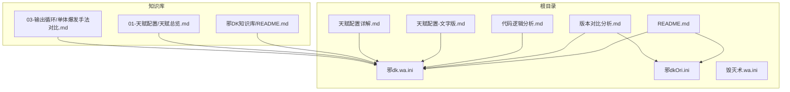
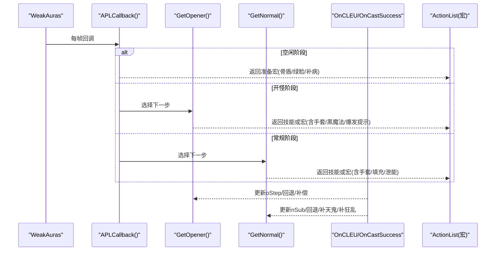
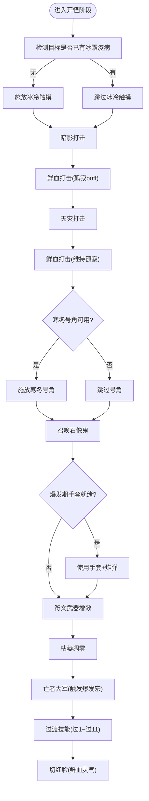
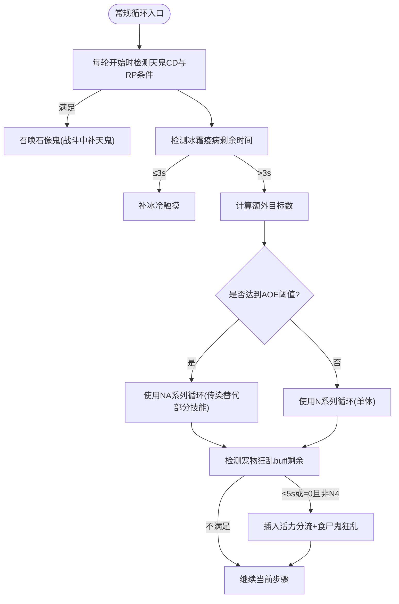
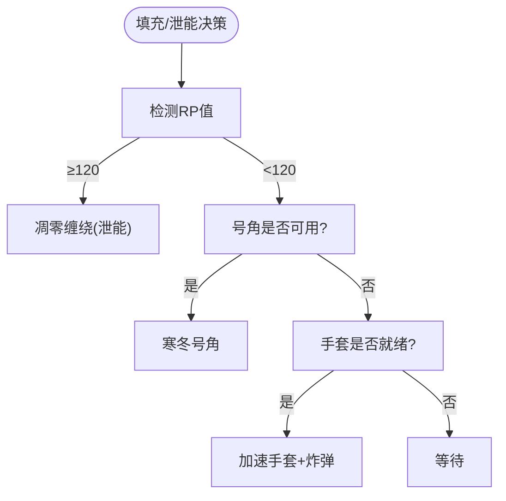
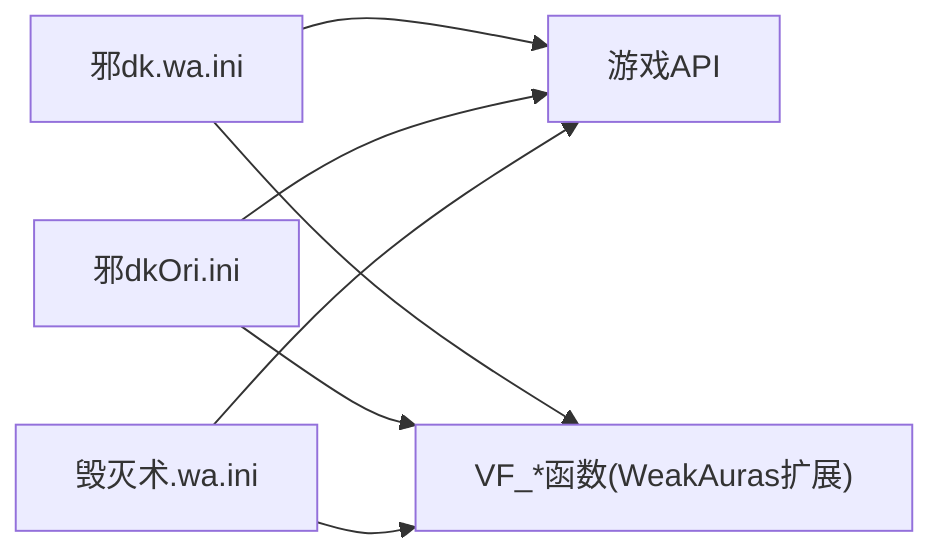

# 版本对比分析文档

<cite>
**本文引用的文件**   
- [README.md](file://README.md)
- [版本对比分析.md](file://版本对比分析.md)
- [代码逻辑分析.md](file://代码逻辑分析.md)
- [天赋配置-文字版.md](file://天赋配置-文字版.md)
- [天赋配置详解.md](file://天赋配置详解.md)
- [邪dk.wa.ini](file://邪dk.wa.ini)
- [邪dkOri.ini](file://邪dkOri.ini)
- [毁灭术.wa.ini](file://毁灭术.wa.ini)
- [邪DK知识库/README.md](file://邪DK知识库/README.md)
- [邪DK知识库/01-天赋配置/天赋总览.md](file://邪DK知识库/01-天赋配置/天赋总览.md)
- [邪DK知识库/03-输出循环/单体爆发手法对比.md](file://邪DK知识库/03-输出循环/单体爆发手法对比.md)
</cite>

## 目录
1. [引言](#引言)
2. [项目结构](#项目结构)
3. [核心组件](#核心组件)
4. [架构总览](#架构总览)
5. [详细组件分析](#详细组件分析)
6. [依赖关系分析](#依赖关系分析)
7. [性能与稳定性考量](#性能与稳定性考量)
8. [故障排查指南](#故障排查指南)
9. [结论与建议](#结论与建议)
10. [附录：关键差异对照表](#附录关键差异对照表)

## 引言
本文件面向“泰坦时光服”（基于WLK 80级框架）的邪DK自动输出循环脚本，围绕原始版本与优化版本的差异进行系统化对比。内容涵盖代码结构、数据流、处理逻辑、集成点、错误处理与性能特征，并提供可视化图示帮助读者快速理解。

## 项目结构
仓库包含两个主要方向的实现与文档：
- 邪DK APL（WeakAuras脚本）：提供自动化技能序列、状态机、事件监听与宏生成
- 配套文档：天赋/雕文说明、输出循环策略、版本对比与代码逻辑分析

图表来源
- [README.md:1-545](file://README.md#L1-L545)
- [版本对比分析.md:1-491](file://版本对比分析.md#L1-L491)
- [代码逻辑分析.md:1-297](file://代码逻辑分析.md#L1-L297)
- [天赋配置-文字版.md:1-359](file://天赋配置-文字版.md#L1-L359)
- [天赋配置详解.md:1-614](file://天赋配置详解.md#L1-L614)
- [邪dk.wa.ini:1-645](file://邪dk.wa.ini#L1-L645)
- [邪dkOri.ini:1-561](file://邪dkOri.ini#L1-L561)
- [邪DK知识库/README.md:1-161](file://邪DK知识库/README.md#L1-L161)
- [邪DK知识库/01-天赋配置/天赋总览.md:1-178](file://邪DK知识库/01-天赋配置/天赋总览.md#L1-L178)
- [邪DK知识库/03-输出循环/单体爆发手法对比.md:1-269](file://邪DK知识库/03-输出循环/单体爆发手法对比.md#L1-L269)

章节来源
- [README.md:1-545](file://README.md#L1-L545)
- [邪DK知识库/README.md:1-161](file://邪DK知识库/README.md#L1-L161)

## 核心组件
- 技能常量与ID映射：统一通过GetSpellInfo动态获取或回退硬编码，确保跨语言/本地化兼容
- 状态机：phase/opener/normal/idle，oStep/nRound/nSub控制开怪与常规循环进度
- 循环表：OP_BOSS/OP_BOSS_AOE/N_ROUNDS/NA_ROUNDS等，定义不同场景下的技能序列
- 事件系统：COMBAT_LOG_EVENT_UNFILTERED驱动OnCastSuccess/OnCLEU，维护期望技能与实际执行一致性
- 填充与泄能：空窗期填充（号角/手套/等待）、RP阈值泄能（凋零缠绕）
- 宏生成：为特定技能注入宏（如亡者大军、手套+炸弹），减少手动操作
- 配置项：useGlovesAuto/autoBossBurst/usePestilence/pestilenceTargets/useDeathCoil/useSpeedPotion等

章节来源
- [邪dk.wa.ini:20-92](file://邪dk.wa.ini#L20-L92)
- [邪dk.wa.ini:93-258](file://邪dk.wa.ini#L93-L258)
- [邪dk.wa.ini:259-374](file://邪dk.wa.ini#L259-L374)
- [邪dk.wa.ini:375-590](file://邪dk.wa.ini#L375-L590)
- [邪dk.wa.ini:591-645](file://邪dk.wa.ini#L591-L645)

## 架构总览
整体采用“事件驱动 + 状态机 + 循环表”的APL模式，结合WA回调与宏拼装，形成从战斗开始到结束的自动化输出流程。

图表来源
- [邪dk.wa.ini:259-374](file://邪dk.wa.ini#L259-L374)
- [邪dk.wa.ini:375-590](file://邪dk.wa.ini#L375-L590)
- [邪dk.wa.ini:591-645](file://邪dk.wa.ini#L591-L645)

## 详细组件分析

### 组件A：开怪爆发循环（OP_BOSS vs OP_BOSS_AOE）
- 原始版本在开怪时释放食尸鬼狂乱与活力分流，占用2个GCD；优化版本移除这两步，改为战斗前预铺30秒狂乱，并在N4轮次或动态补充机制下维持覆盖
- 优化版本引入“天鬼后切绿脸”，让天鬼享受实时急速增益（泰坦时光服特性）
- 优化版本在oStep 7-9之间主动检查并插入“加速手套+炸弹”，确保亡者大军享受完整15秒急速
- 优化版本修复寒冬号角CD判断位置（原版本误判oStep==8，实际应为oStep==6）

图表来源
- [邪dk.wa.ini:98-123](file://邪dk.wa.ini#L98-L123)
- [邪dk.wa.ini:483-590](file://邪dk.wa.ini#L483-L590)
- [版本对比分析.md:18-66](file://版本对比分析.md#L18-L66)
- [版本对比分析.md:270-299](file://版本对比分析.md#L270-L299)

章节来源
- [邪dk.wa.ini:98-123](file://邪dk.wa.ini#L98-L123)
- [邪dk.wa.ini:483-590](file://邪dk.wa.ini#L483-L590)
- [版本对比分析.md:18-66](file://版本对比分析.md#L18-L66)
- [版本对比分析.md:270-299](file://版本对比分析.md#L270-L299)

### 组件B：常规循环与AOE切换（N_ROUNDS/NA_ROUNDS）
- 四轮换行：N1→N2→N3→N4，其中N4固定包含一次食尸鬼狂乱以维持宠物增伤
- 动态AOE切换：当额外目标数≥配置阈值（默认2）时切换到NA系列循环，使用传染扩散疾病
- 动态狂乱补充：若宠物狂乱剩余≤5秒或已消失，且不在N4轮次（或N4但已消失），则优先插入活力分流+食尸鬼狂乱
- 冰霜疫病保活：当冰霜疫病剩余≤3秒时优先补冰冷触摸，适配“冰冷之爪”天赋要求

图表来源
- [邪dk.wa.ini:190-257](file://邪dk.wa.ini#L190-L257)
- [邪dk.wa.ini:391-481](file://邪dk.wa.ini#L391-L481)
- [版本对比分析.md:110-157](file://版本对比分析.md#L110-L157)

章节来源
- [邪dk.wa.ini:190-257](file://邪dk.wa.ini#L190-L257)
- [邪dk.wa.ini:391-481](file://邪dk.wa.ini#L391-L481)
- [版本对比分析.md:110-157](file://版本对比分析.md#L110-L157)

### 组件C：资源管理与容错
- 符文能量泄能：空窗期阈值60（适配RP上限130），循环中阈值120，避免溢出浪费
- 填充优先级：凋零缠绕 → 寒冬号角 → 加速手套 → 等待
- 抵抗回退：对MISS/DODGE/PARRY/RESIST事件，按阶段回退oStep或nSub，排除AOE类技能
- 亡者大军失败补偿：若大军被抵抗，插入3个替代技能后再恢复流程

图表来源
- [邪dk.wa.ini:375-389](file://邪dk.wa.ini#L375-L389)
- [邪dk.wa.ini:391-481](file://邪dk.wa.ini#L391-L481)
- [邪dk.wa.ini:334-359](file://邪dk.wa.ini#L334-L359)
- [邪dk.wa.ini:530-558](file://邪dk.wa.ini#L530-L558)

章节来源
- [邪dk.wa.ini:375-389](file://邪dk.wa.ini#L375-L389)
- [邪dk.wa.ini:391-481](file://邪dk.wa.ini#L391-L481)
- [邪dk.wa.ini:334-359](file://邪dk.wa.ini#L334-L359)
- [邪dk.wa.ini:530-558](file://邪dk.wa.ini#L530-L558)

### 组件D：宏与外部集成
- 黑魔法宏：在oStep 8-9提示使用，包含凋零缠绕、工程炸药/炸弹、切换黑魔法武器
- 爆发宏：在oStep 10提示使用，包含种族特长、饰品、速度药水、切换十字军武器
- 亡者大军宏：移除手套（已在爆发期使用），保留速度药水开关
- 手套宏：一键使用10号位物品+通用热力工程炸药+萨隆邪铁炸弹

章节来源
- [邪dk.wa.ini:505-521](file://邪dk.wa.ini#L505-L521)
- [邪dk.wa.ini:626-638](file://邪dk.wa.ini#L626-L638)
- [README.md:153-217](file://README.md#L153-L217)

### 组件E：天赋与雕文适配
- 冰霜系：强化冰冷触摸、符文能量掌握（RP上限130）、黑冰、冰冷之爪（需全程冰霜疫病）、无尽寒冬
- 邪恶系：险恶攻击、恶毒、蔓延、病变、贪婪亡者、骨疽、血染之刃、亡者之夜、邪恶虫群、不纯、食尸鬼主宰、孤寂、食尸鬼狂乱、墓穴热病、白骨之盾、游荡疫病、黑色热疫使者、瑞文戴尔之怒、召唤石像鬼
- 雕文：枯萎凋零雕文、食尸鬼雕文、黑暗死亡雕文；小雕文包括亡者大军、亡者复生、传染

章节来源
- [天赋配置详解.md:1-614](file://天赋配置详解.md#L1-L614)
- [天赋配置-文字版.md:1-359](file://天赋配置-文字版.md#L1-L359)
- [邪DK知识库/01-天赋配置/天赋总览.md:1-178](file://邪DK知识库/01-天赋配置/天赋总览.md#L1-L178)

## 依赖关系分析
- 脚本间耦合：
  - 优化版与原始版共享相同的状态机与事件模型，差异集中在循环表、阈值与宏组装
  - 毁灭术脚本独立于邪DK脚本，仅作为同类APL参考
- 外部依赖：
  - WeakAuras框架（VF_getSpellCD/VF_getBuff/VF_getDebuff等）
  - 游戏API（CombatLogGetCurrentEventInfo、UnitPower、GetShapeshiftForm等）

图表来源
- [邪dk.wa.ini:1-20](file://邪dk.wa.ini#L1-L20)
- [邪dkOri.ini:1-20](file://邪dkOri.ini#L1-L20)
- [毁灭术.wa.ini:1-20](file://毁灭术.wa.ini#L1-L20)

章节来源
- [邪dk.wa.ini:1-20](file://邪dk.wa.ini#L1-L20)
- [邪dkOri.ini:1-20](file://邪dkOri.ini#L1-L20)
- [毁灭术.wa.ini:1-20](file://毁灭术.wa.ini#L1-L20)

## 性能与稳定性考量
- 性能优化点：
  - 降低AOE阈值至2（适配25人副本环境）
  - 降低泄能阈值以适应高急速成长（空窗期60，循环中120）
  - 扩大手套使用时机窗口（oStep 7-9），减少错过爆发期的概率
- 稳定性增强：
  - 修复寒冬号角CD判断位置，避免卡住循环
  - 增加pcall保护（在相关遍历中），防止焦点目标导致nameplate访问异常
  - 完善抵抗回退与亡者大军失败补偿，提升容错性

章节来源
- [版本对比分析.md:200-226](file://版本对比分析.md#L200-L226)
- [版本对比分析.md:229-267](file://版本对比分析.md#L229-L267)
- [版本对比分析.md:270-299](file://版本对比分析.md#L270-L299)
- [版本对比分析.md:302-338](file://版本对比分析.md#L302-L338)
- [代码逻辑分析.md:17-95](file://代码逻辑分析.md#L17-L95)

## 故障排查指南
- 常见问题与定位：
  - 狂乱重复：N4轮次与动态补充冲突，修复为N4跳过动态补充
  - 手套时机过窄：将检查窗口从单步扩展到oStep 7-9
  - 常规循环手套重复尝试：增加_bombsUsed标志，避免一场战斗多次使用
  - 寒冬号角卡住：修正oStep判断位置，CD时直接跳过
  - nameplate遍历卡死：添加安全退出逻辑，避免无效单位导致崩溃
- 建议排查步骤：
  - 确认配置参数是否正确（useGlovesAuto/autoBossBurst/usePestilence/pestilenceTargets/useDeathCoil/useSpeedPotion）
  - 核对天赋与雕文是否与文档一致（尤其是RP上限、冰冷之爪、食尸鬼狂乱、召唤石像鬼）
  - 观察战斗日志中的SPELL_MISSED/SPELL_CAST_SUCCESS事件，验证回退与补偿逻辑是否生效

章节来源
- [代码逻辑分析.md:17-95](file://代码逻辑分析.md#L17-L95)
- [代码逻辑分析.md:97-177](file://代码逻辑分析.md#L97-L177)
- [版本对比分析.md:302-338](file://版本对比分析.md#L302-L338)

## 结论与建议
- 优化版本在多个维度显著优于原始版本：
  - DPS提升：天鬼后切绿脸(+3-5%)、预铺狂乱(+2-3%)、炸弹最佳时机(+1-2%)、智能泄能(+1-2%)，合计约8-14%
  - Bug修复：寒冬号角CD判断、nameplate遍历安全、狂乱重复与遗漏
  - 泰坦时光服专属优化：AOE阈值、泄能阈值、天鬼实时急速增益
- 建议：
  - 泰坦时光服玩家强烈推荐使用优化版本
  - 其他WLK怀旧服玩家可根据需要调整AOE阈值与泄能阈值，必要时恢复同符文组互替机制
  - 追求极致DPS的玩家应全面采用优化版本

章节来源
- [版本对比分析.md:392-491](file://版本对比分析.md#L392-L491)
- [README.md:453-465](file://README.md#L453-L465)

## 附录：关键差异对照表
- 开怪爆发循环：
  - 原始：起3狂乱、起5分流；优化：移除，改战斗前预铺
  - 优化新增：oStep 7-9手套+炸弹；天鬼后切绿脸
- 狂乱管理：
  - 原始：仅在N4固定释放；优化：动态补充（≤5秒或消失），N4跳过动态补充
- 炸弹时机：
  - 原始：在大军宏中使用；优化：爆发期主动插入，确保大军享受完整急速
- AOE阈值：
  - 原始：≥2目标（1额外）；优化：≥3目标（2额外）
- 泄能阈值：
  - 原始：空窗55/循环100；优化：空窗60/循环120（适配RP上限130）
- 寒冬号角CD：
  - 原始：误判oStep==8；优化：正确判断oStep==6
- nameplate遍历：
  - 原始：可能卡死；优化：安全退出（pcall保护）

章节来源
- [版本对比分析.md:18-66](file://版本对比分析.md#L18-L66)
- [版本对比分析.md:110-157](file://版本对比分析.md#L110-L157)
- [版本对比分析.md:160-197](file://版本对比分析.md#L160-L197)
- [版本对比分析.md:200-226](file://版本对比分析.md#L200-L226)
- [版本对比分析.md:229-267](file://版本对比分析.md#L229-L267)
- [版本对比分析.md:270-299](file://版本对比分析.md#L270-L299)
- [版本对比分析.md:302-338](file://版本对比分析.md#L302-L338)