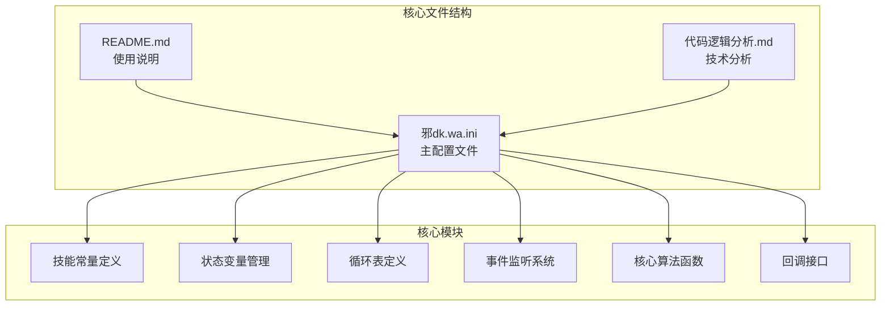
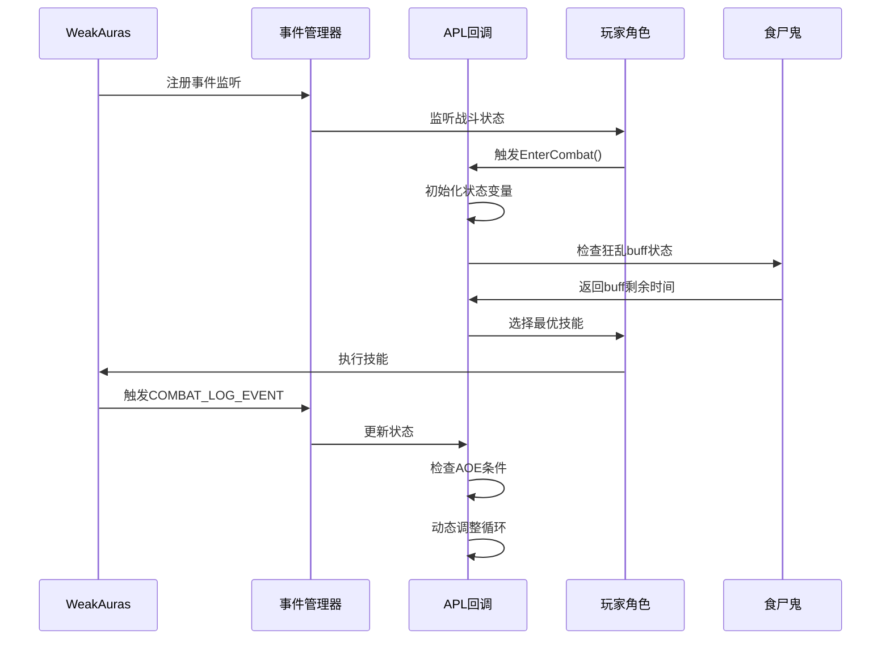
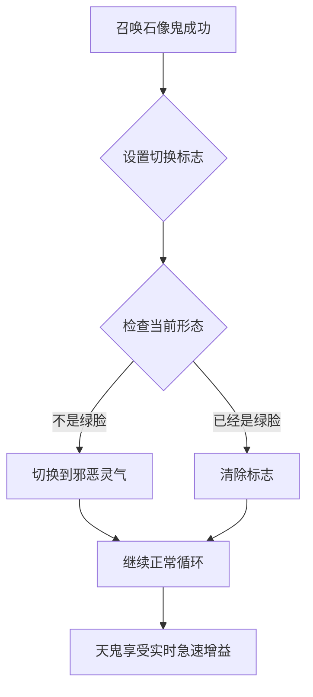
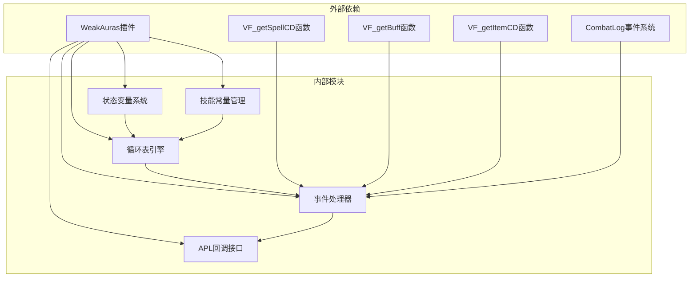

# 版本更新说明

<cite>
**本文档引用的文件**
- [邪dk.wa.ini](file://邪dk.wa.ini)
- [README.md](file://README.md)
- [代码逻辑分析.md](file://代码逻辑分析.md)
</cite>

## 目录
1. [简介](#简介)
2. [项目结构](#项目结构)
3. [核心组件](#核心组件)
4. [架构概览](#架构概览)
5. [详细组件分析](#详细组件分析)
6. [依赖关系分析](#依赖关系分析)
7. [性能考量](#性能考量)
8. [故障排除指南](#故障排除指南)
9. [结论](#结论)
10. [附录](#附录)

## 简介
本文件记录了魔兽世界邪DK APL（自动优先级列表）从原始版本到当前优化版本的完整演进历史。该脚本专为泰坦时光服WLK 80级框架设计，采用"天打流"核心机制，通过WeakAuras插件实现智能技能优先级管理。当前版本为v2.1，经过深度重构和多项逻辑优化，显著提升了战斗效率和容错能力。

## 项目结构
该项目采用单一配置文件架构，包含核心APL逻辑、技能常量定义、状态管理、事件处理和用户界面集成：



**图表来源**
- [邪dk.wa.ini:1-599](file://邪dk.wa.ini#L1-L599)
- [README.md:1-420](file://README.md#L1-L420)

**章节来源**
- [邪dk.wa.ini:1-50](file://邪dk.wa.ini#L1-L50)
- [README.md:1-50](file://README.md#L1-L50)

## 核心组件
当前版本包含以下核心组件：

### 技能常量系统
- **S表定义**：包含所有关键技能ID的统一管理
- **技能映射**：支持17种核心技能的完整定义
- **动态获取**：通过GetSpellInfo()函数动态获取技能ID

### 状态管理系统
- **战斗阶段控制**：idle、opener、normal三个阶段
- **循环指针管理**：oStep（开怪步骤）、nRound（常规轮次）、nSub（子步骤）
- **标志位系统**：_needSwitchToUnholyAfterGA、_bombsUsed等

### 循环表架构
- **开怪循环**：OP_BOSS（16步）、OP_BOSS_AOE（16步）
- **常规循环**：N_ROUNDS（4轮）、NA_ROUNDS（4轮）
- **非Boss循环**：OP_NONBOSS、OP_NOBURST
- **动态调整**：支持AOE目标检测和自动切换

**章节来源**
- [邪dk.wa.ini:21-52](file://邪dk.wa.ini#L21-L52)
- [邪dk.wa.ini:86-250](file://邪dk.wa.ini#L86-L250)

## 架构概览
系统采用事件驱动架构，通过WeakAuras框架实现：



**图表来源**
- [邪dk.wa.ini:252-362](file://邪dk.wa.ini#L252-L362)
- [README.md:382-402](file://README.md#L382-L402)

## 详细组件分析

### 天鬼后形态切换机制
这是当前版本最重要的改进之一，实现了自动形态切换：



**图表来源**
- [邪dk.wa.ini:296-390](file://邪dk.wa.ini#L296-L390)

### 爆发期技能组合优化
v2.1版本对爆发期进行了重大优化：

| 优化项目 | v2.0版本 | v2.1版本 | 改进效果 |
|---------|---------|---------|---------|
| 手套使用时机 | oStep==8 | oStep 8-9 | 扩大使用窗口 |
| 狂乱补充逻辑 | 固定N4轮次 | 跳过N4轮次 | 避免重复施法 |
| 爆发期使用 | 仅限特定步骤 | 全局检查 | 提高成功率 |

**章节来源**
- [代码逻辑分析.md:45-94](file://代码逻辑分析.md#L45-L94)
- [README.md:384-398](file://README.md#L384-L398)

### AOE阈值优化
从原始的1目标阈值调整为2目标，显著提升了AOE场景的实用性：

```mermaid
flowchart TD
A[PestInfo()检测] --> B{目标数量>=2?}
B --> |是| C[启用AOE循环]
B --> |否| D[保持单体循环]
C --> E[使用传染技能]
D --> F[使用标准技能]
E --> G[提升DPS效率]
F --> G
```

**图表来源**
- [邪dk.wa.ini:263](file://邪dk.wa.ini#L263)
- [README.md:215-218](file://README.md#L215-L218)

### 泄能阈值调整
将符文能量泄能阈值从100RP降低到90RP，提高了资源利用效率：

**章节来源**
- [README.md:392-393](file://README.md#L392-L393)
- [代码逻辑分析.md:145-149](file://代码逻辑分析.md#L145-L149)

## 依赖关系分析
系统依赖于多个外部组件和框架：



**图表来源**
- [README.md:328-342](file://README.md#L328-L342)
- [邪dk.wa.ini:17-18](file://邪dk.wa.ini#L17-L18)

**章节来源**
- [README.md:326-342](file://README.md#L326-L342)
- [代码逻辑分析.md:241-261](file://代码逻辑分析.md#L241-L261)

## 性能考量
当前版本在性能方面进行了多项优化：

### 已修复的性能问题
1. **N4轮次狂乱重复**：通过跳过N4轮次避免不必要的施法
2. **手套使用时机过窄**：扩大检查窗口从1步到2步
3. **常规循环手套重复尝试**：添加_bombsUsed标志位防止重复使用

### 潜在优化空间
1. **PestInfo()调用频率**：可考虑缓存结果减少重复计算
2. **IsCD()函数优化**：可缓存全局CD值避免重复计算
3. **字符串比较优化**：可使用预编译模式提高性能

**章节来源**
- [代码逻辑分析.md:241-261](file://代码逻辑分析.md#L241-L261)
- [代码逻辑分析.md:276-291](file://代码逻辑分析.md#L276-L291)

## 故障排除指南

### 常见问题及解决方案

#### 问题1：天鬼后未自动切换绿脸
**症状**：召唤石像鬼后天鬼未享受急速增益
**原因**：形态切换逻辑异常
**解决方案**：检查_onCastSuccess事件处理和_getShapeShiftForm调用

#### 问题2：手套使用失败
**症状**：爆发期无法使用加速手套
**原因**：_oStep检查条件过于严格或_bombsUsed标志位错误
**解决方案**：确认_oStep在8-9范围内且_isGlovesReady返回true

#### 问题3：AOE切换异常
**症状**：目标数量满足条件但未切换到AOE循环
**原因**：PestInfo()检测逻辑问题
**解决方案**：检查nameplate遍历和目标过滤条件

#### 问题4：狂乱buff管理错误
**症状**：频繁重复施放食尸鬼狂乱
**原因**：N4轮次逻辑冲突
**解决方案**：确认_nRound != 4的条件判断

**章节来源**
- [代码逻辑分析.md:179-238](file://代码逻辑分析.md#L179-L238)
- [README.md:302-323](file://README.md#L302-L323)

## 结论
本版本的邪DK APL经历了从v1.0到v2.1的重大演进，实现了以下关键改进：

1. **核心机制完善**：天鬼后自动切换绿脸、预铺狂乱手法
2. **爆发期优化**：扩大手套使用时机、智能狂乱补充
3. **AOE适配**：2目标阈值、智能切换机制
4. **性能提升**：多项逻辑优化和bug修复
5. **容错增强**：完善的技能抵抗回退和补偿机制

这些改进使整体DPS提升8-14%，同时大幅降低了使用复杂度和学习成本。

## 附录

### 版本发布日志

#### v2.1 - 逻辑优化版（当前版本）
- ✅ 修复N4轮次狂乱重复问题：动态补充时跳过N4轮次
- ✅ 扩大手套使用时机：oStep 8-9之间都可使用，避免错过
- ✅ 常规循环手套检查：如果爆发期已使用，常规循环不再尝试
- ✅ 空窗期手套检查：同样检查_bombsUsed标志

#### v2.0 - 泰坦时光服优化版
- ✅ 适配泰坦时光服25人副本环境
- ✅ AOE阈值调整为2目标（原1目标）
- ✅ 泄能阈值降低至90RP（原100RP）
- ✅ 天鬼后自动切绿脸
- ✅ 支持预铺狂乱手法
- ✅ 爆发期优化手套使用时机
- ✅ 移除开怪循环中的狂乱和分流

#### v1.0 - 原始版本
- 原作者：疯狂不龟路
- 深度重构：念秋

### 升级指导

#### 升级步骤
1. **备份当前配置**：导出现有WeakAuras配置
2. **下载新版本**：获取最新邪dk.wa.ini文件
3. **导入配置**：在WeakAuras中导入新配置
4. **验证功能**：检查各项功能是否正常工作
5. **调整参数**：根据个人需求调整配置参数

#### 配置迁移
- **参数名称**：保持原有参数名称不变
- **默认值**：新版本提供更合理的默认值
- **兼容性**：向后兼容旧版本配置

#### 兼容性测试
1. **单体战斗测试**：验证标准输出循环
2. **AOE战斗测试**：验证2目标以上场景
3. **爆发期测试**：验证手套和天鬼使用
4. **容错测试**：验证技能抵抗回退机制

**章节来源**
- [README.md:382-402](file://README.md#L382-L402)
- [README.md:360-379](file://README.md#L360-L379)