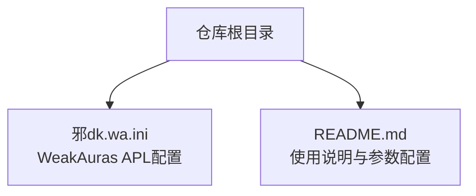
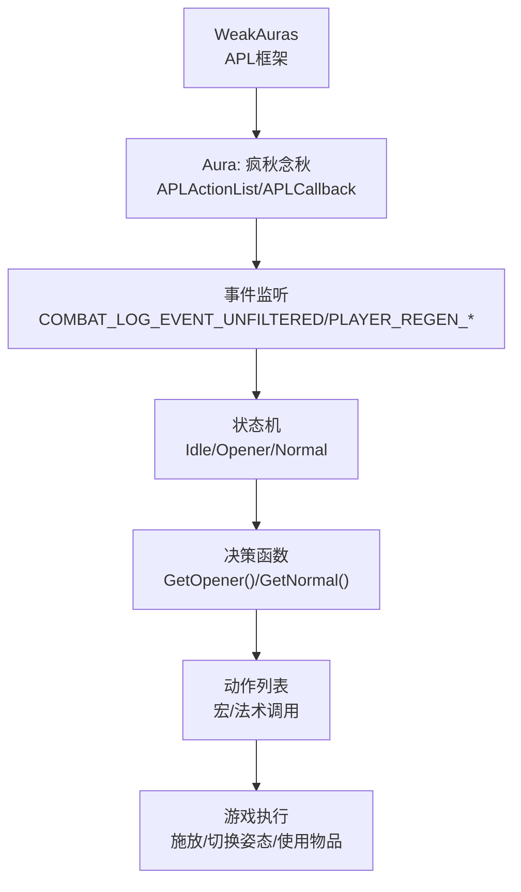
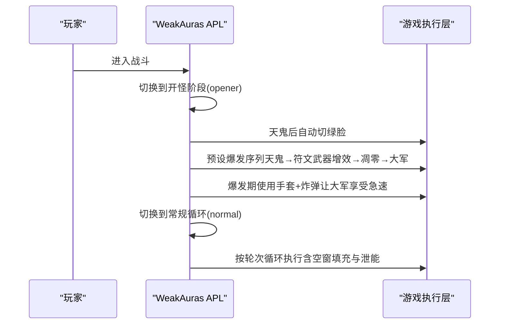
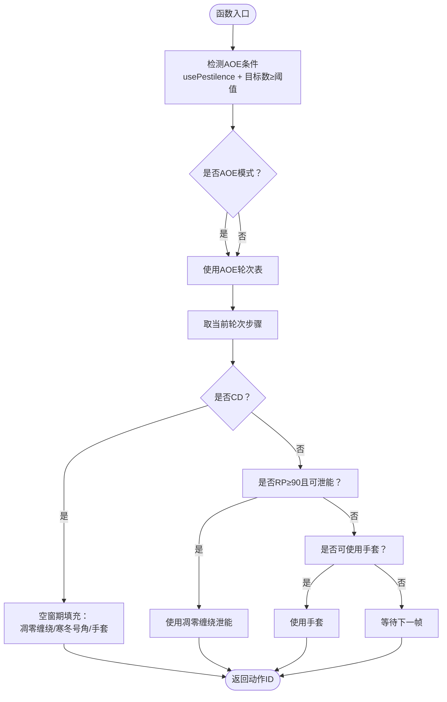
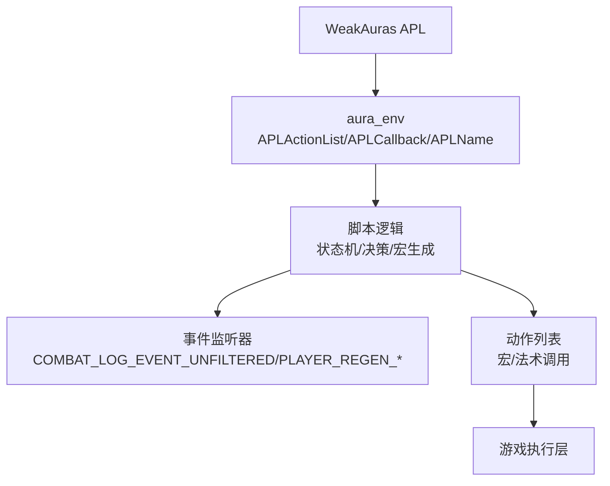

# 快速开始

<cite>
**本文引用的文件**
- [README.md](file://README.md)
- [邪dk.wa.ini](file://邪dk.wa.ini)
</cite>

## 目录
1. [简介](#简介)
2. [项目结构](#项目结构)
3. [核心组件](#核心组件)
4. [架构总览](#架构总览)
5. [详细组件分析](#详细组件分析)
6. [依赖关系分析](#依赖关系分析)
7. [性能考量](#性能考量)
8. [故障排除指南](#故障排除指南)
9. [结论](#结论)
10. [附录](#附录)

## 简介
本指南面向魔兽世界“燃烧远征”（WLK 80级框架）玩家，帮助你快速安装并使用“邪DK天打流”自动战斗脚本（WeakAuras APL）。该脚本专为“泰坦重铸·时光”服务器优化，提供自动爆发、姿态切换、AOE适配、资源管理与容错机制，显著降低操作门槛并提升输出效率。

- 适用版本：魔兽世界“燃烧远征”（WLK 80级框架）
- 服务器：泰坦重铸「时光」服务器
- 插件：WeakAuras（需配合特定自定义函数支持）

## 项目结构
仓库包含一个核心配置文件与一份完整的使用说明文档，便于快速导入与上手。

图表来源
- [README.md](file://README.md)
- [邪dk.wa.ini](file://邪dk.wa.ini)

章节来源
- [README.md](file://README.md)
- [邪dk.wa.ini](file://邪dk.wa.ini)

## 核心组件
- 弱点：脚本通过WA的aura_env访问WAParam.config进行参数化控制，因此需要在WA中正确设置参数。
- 关键逻辑：
  - 战斗状态机：空闲→开怪爆发→常规循环，依据目标类型与AOE阈值动态切换。
  - 自动姿态切换：天鬼后自动切绿脸；开怪前准备绿脸；开怪后切血脸。
  - 爆发期优化：移除开怪循环中的狂乱/分流，改为战斗前预铺；在天鬼后、大军前使用手套+炸弹。
  - 资源管理：RP≥90时强制泄能；空窗期智能填充；容错回退。

章节来源
- [README.md](file://README.md)
- [邪dk.wa.ini](file://邪dk.wa.ini)

## 架构总览
下图展示了脚本在游戏中的运行架构与交互路径。

图表来源
- [README.md](file://README.md)
- [邪dk.wa.ini](file://邪dk.wa.ini)

## 详细组件分析

### 环境与兼容性要求
- 游戏版本：必须为“燃烧远征”（WLK 80级框架），脚本会在启动时校验项目ID。
- 服务器：专为“泰坦重铸·时光”服务器优化，适配其副本节奏与阈值。
- 插件：需要安装WeakAuras，并具备脚本依赖的自定义函数（例如VF_getSpellCD/VF_getBuff等）。

章节来源
- [README.md](file://README.md)
- [邪dk.wa.ini](file://邪dk.wa.ini)

### 安装与导入步骤
1. 复制配置文件内容
   - 打开文件“邪dk.wa.ini”，复制全部内容。
2. 在游戏中打开WeakAuras
   - 输入命令打开WA界面。
3. 导入配置
   - 在WA界面中选择“导入”，粘贴已复制的内容，确认导入成功。
4. 验证导入
   - 在WA中找到名为“疯狂念秋”的Aura，展开查看其配置项与动作列表。

章节来源
- [README.md](file://README.md)
- [邪dk.wa.ini](file://邪dk.wa.ini)

### 基本配置说明（WAParam.config）
在WA中找到“疯狂念秋”Aura，展开“选项”面板，勾选以下参数以启用相应功能：
- useGlovesAuto：启用自动手套/炸弹使用
- autoBossBurst：启用Boss自动爆发
- usePestilence：启用AOE（传染）功能
- pestilenceTargets：AOE触发目标数量阈值（默认2）
- useDeathCoil：启用RP≥90时的泄能（凋零缠绕）
- useSpeedPotion：在亡者大军时使用速度药水

章节来源
- [README.md](file://README.md)
- [邪dk.wa.ini](file://邪dk.wa.ini)

### 基本使用流程
1. 战斗前准备
   - 预铺狂乱（倒数8秒时手动点击预铺宏）。
   - 确保绿脸（天鬼需要绿脸的急速增益）。
   - 骨盾覆盖（提前开启白骨之盾）。
2. 开怪与战斗
   - 开怪时WA接管，按爆发循环自动执行。
   - 常规阶段完全自动化，专注走位与机制。
3. 战斗中干预
   - 如需紧急位移或打断，可在必要时手动干预。

章节来源
- [README.md](file://README.md)
- [邪dk.wa.ini](file://邪dk.wa.ini)

### 关键流程时序（开怪爆发）

图表来源
- [README.md](file://README.md)
- [邪dk.wa.ini](file://邪dk.wa.ini)

### 决策算法流程（空窗期填充与AOE判定）

图表来源
- [README.md](file://README.md)
- [邪dk.wa.ini](file://邪dk.wa.ini)

## 依赖关系分析
- WeakAuras APL框架：通过aura_env暴露APLActionList与APLCallback，WA负责调度与执行。
- 自定义函数依赖：脚本使用VF_getSpellCD、VF_getBuff、VF_getItemCD等函数（由WA框架或特定前置模块提供）。
- 游戏事件：通过注册“战斗日志/重生禁用/重生启用”事件驱动状态机切换。

图表来源
- [README.md](file://README.md)
- [邪dk.wa.ini](file://邪dk.wa.ini)

章节来源
- [README.md](file://README.md)
- [邪dk.wa.ini](file://邪dk.wa.ini)

## 性能考量
- AOE阈值：默认2目标以上才切换AOE，减少误判与无效切换。
- 泄能阈值：RP≥90时强制泄能，避免溢出造成的GCD浪费。
- 爆发期优化：移除开怪循环中的狂乱/分流，改为预铺与爆发期使用，提高爆发效率。
- 容错机制：技能抵抗/未命中时自动回退一步，保证连贯性。

章节来源
- [README.md](file://README.md)
- [邪dk.wa.ini](file://邪dk.wa.ini)

## 故障排除指南
- 无法导入WA配置
  - 确认已复制完整文件内容并在WA中粘贴导入。
  - 检查WA版本是否支持所需特性。
- 未显示“疯狂念秋”Aura
  - 导入后在WA中查找并展开“选项”面板，确认参数已加载。
- 参数未生效
  - 在WA中勾选WAParam.config相关选项并保存。
- 服务器不兼容
  - 确认游戏版本为“燃烧远征”（WLK 80级框架），否则脚本会直接返回。
- 依赖函数缺失
  - 确保WA具备VF_getSpellCD/VF_getBuff/VF_getItemCD等函数支持。
- 手套/炸弹不可用
  - 确认在≤5码范围内且目标可命中；手套CD为1分钟，每场战斗通常仅使用一次。
- 预铺宏未生效
  - 按照提示在开怪前8秒手动点击预铺宏（绿脸+骨盾+狂乱）。

章节来源
- [README.md](file://README.md)
- [邪dk.wa.ini](file://邪dk.wa.ini)

## 结论
通过本指南，你可以快速完成脚本安装、参数配置与基础使用。建议先在普通副本或训练假人上验证各项功能，再在正式副本中应用。根据实际环境微调WAParam.config参数，可进一步提升稳定性与输出表现。

## 附录

### 常用术语
- APL：自动优先级列表（Action Priority List）
- WA：WeakAuras插件
- RP：符文能量
- AOE：范围攻击（以“传染”为核心）
- 预铺：在战斗开始前提前施放关键增益

### 快速对照表（关键参数）
- useGlovesAuto：自动使用手套/炸弹
- autoBossBurst：Boss战自动爆发
- usePestilence：AOE开关
- pestilenceTargets：AOE触发目标数
- useDeathCoil：RP泄能
- useSpeedPotion：大军时使用速度药水

章节来源
- [README.md](file://README.md)
- [邪dk.wa.ini](file://邪dk.wa.ini)