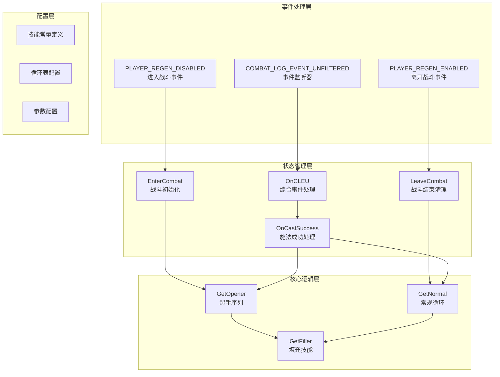
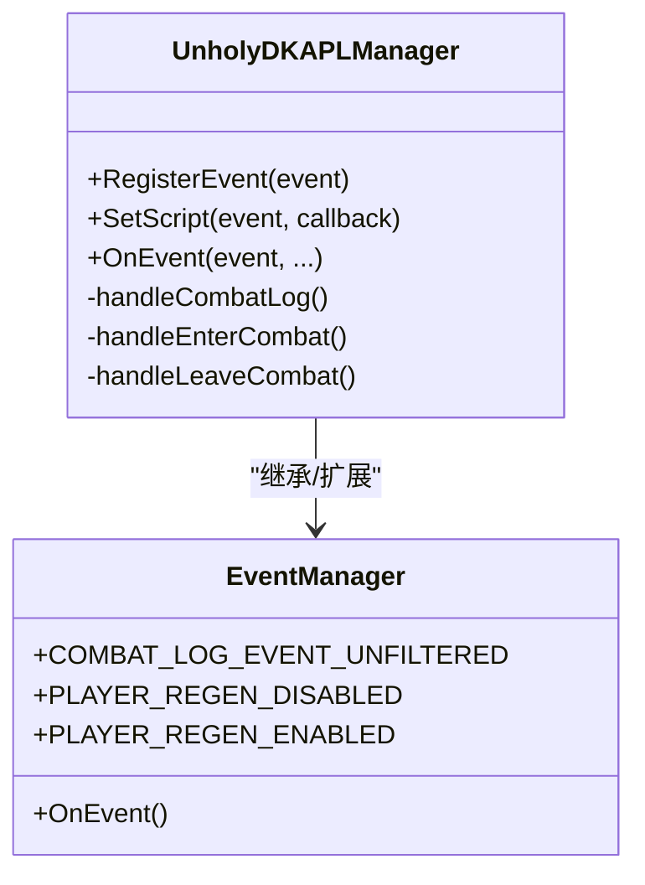
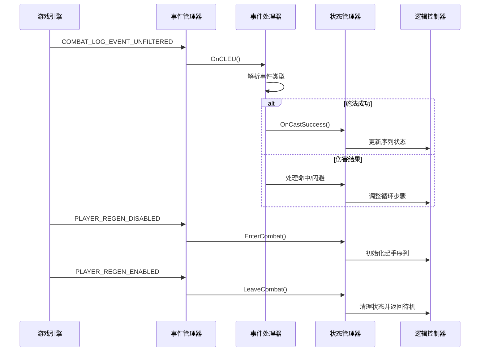
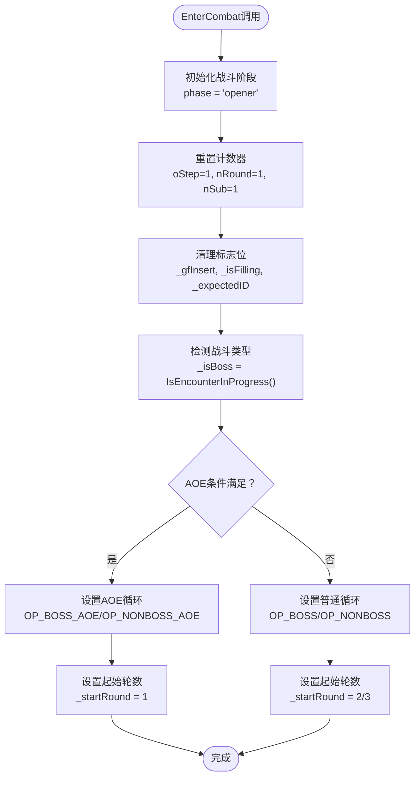
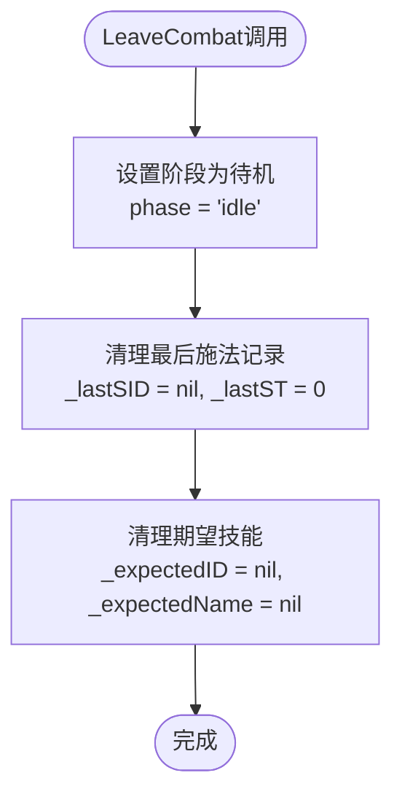
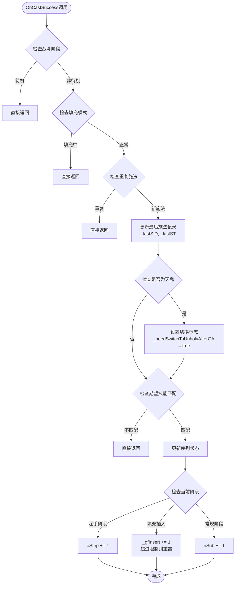
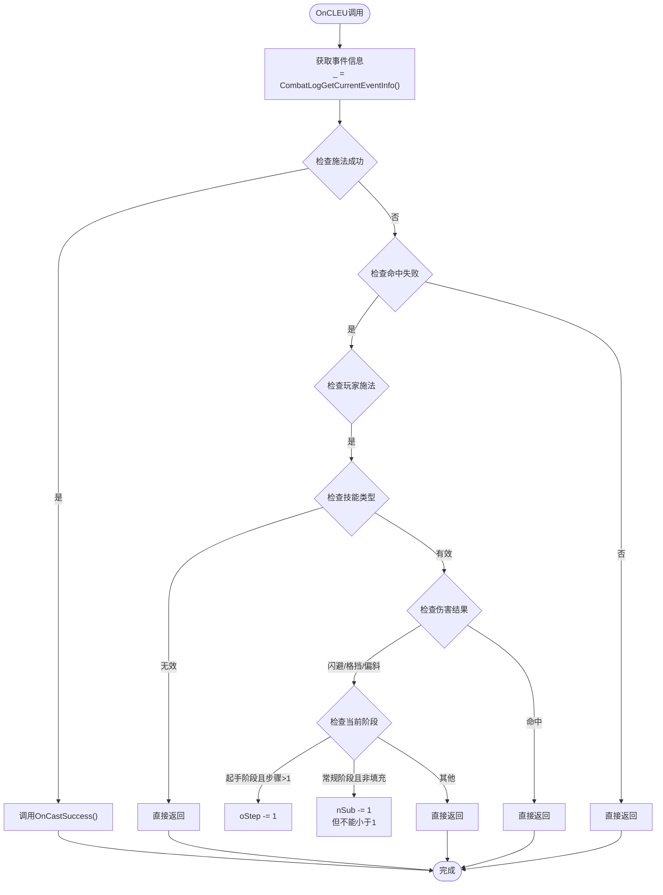
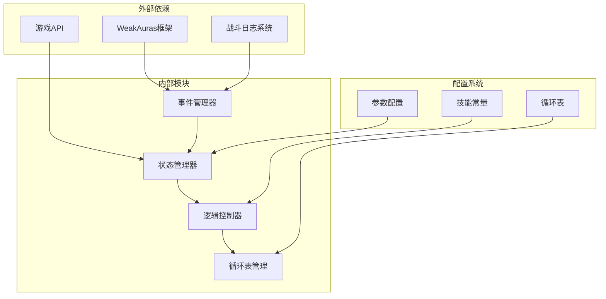

# 事件处理机制

<cite>
**本文档引用的文件**
- [邪dk.wa.ini](file://邪dk.wa.ini)
</cite>

## 目录
1. [简介](#简介)
2. [项目结构](#项目结构)
3. [核心组件](#核心组件)
4. [架构概览](#架构概览)
5. [详细组件分析](#详细组件分析)
6. [依赖关系分析](#依赖关系分析)
7. [性能考量](#性能考量)
8. [故障排除指南](#故障排除指南)
9. [结论](#结论)

## 简介

本文档详细分析了魔兽世界死亡骑士自动战斗脚本的事件处理机制。该脚本基于WeakAuras框架，实现了对COMBAT_LOG_EVENT_UNFILTERED事件的深度处理，包括战斗状态管理、技能施放跟踪、伤害结果处理等功能。系统通过事件驱动的方式实现精确的战斗序列控制和状态同步。

## 项目结构

该脚本采用单一文件架构，包含以下主要模块：

**图表来源**
- [邪dk.wa.ini:251-362](file://邪dk.wa.ini#L251-L362)

**章节来源**
- [邪dk.wa.ini:1-599](file://邪dk.wa.ini#L1-L599)

## 核心组件

### 事件监听器管理器

系统创建了一个专用的事件管理器框架来统一处理所有战斗相关事件：

**图表来源**
- [邪dk.wa.ini:350-362](file://邪dk.wa.ini#L350-L362)

### 战斗状态管理系统

系统维护了完整的战斗状态机，包括多个关键状态变量：

| 状态变量 | 类型 | 描述 | 默认值 |
|---------|------|------|--------|
| phase | 字符串 | 当前战斗阶段 | "idle" |
| oStep | 数字 | 起手序列步骤 | 1 |
| nRound | 数字 | 常规循环轮数 | 1 |
| nSub | 数字 | 常规循环子步骤 | 1 |
| _isBoss | 布尔值 | 是否为Boss战斗 | 动态检测 |
| _roundAOE | 布尔值 | 是否使用AOE循环 | 动态计算 |
| _needSwitchToUnholyAfterGA | 布尔值 | 天鬼后切换绿脸标志 | nil |
| _bombsUsed | 布尔值 | 爆发期炸弹使用标志 | nil |

**章节来源**
- [邪dk.wa.ini:44-52](file://邪dk.wa.ini#L44-L52)
- [邪dk.wa.ini:251-282](file://邪dk.wa.ini#L251-L282)

## 架构概览

系统采用事件驱动的分层架构，通过COMBAT_LOG_EVENT_UNFILTERED事件实现精确的战斗状态控制：

**图表来源**
- [邪dk.wa.ini:350-362](file://邪dk.wa.ini#L350-L362)
- [邪dk.wa.ini:323-348](file://邪dk.wa.ini#L323-L348)

## 详细组件分析

### EnterCombat事件处理机制

EnterCombat函数负责战斗开始时的状态初始化：

**图表来源**
- [邪dk.wa.ini:252-276](file://邪dk.wa.ini#L252-L276)

EnterCombat的核心职责：
1. **阶段初始化**：将战斗阶段设置为"opener"（起手阶段）
2. **计数器重置**：重置所有循环相关的计数器
3. **标志清理**：清理所有临时状态标志
4. **战斗类型检测**：自动识别Boss战和普通战斗
5. **循环策略选择**：根据战斗类型和配置选择合适的循环表

**章节来源**
- [邪dk.wa.ini:252-276](file://邪dk.wa.ini#L252-L276)

### LeaveCombat事件处理机制

LeaveCombat函数负责战斗结束后的状态清理：

**图表来源**
- [邪dk.wa.ini:278-282](file://邪dk.wa.ini#L278-L282)

LeaveCombat的主要功能：
1. **阶段转换**：将战斗阶段切换到"idle"（待机）
2. **状态清理**：清除所有与当前战斗相关的状态信息
3. **资源释放**：为下一次战斗做好准备

**章节来源**
- [邪dk.wa.ini:278-282](file://邪dk.wa.ini#L278-L282)

### OnCastSuccess事件处理机制

OnCastSuccess函数处理技能施放成功的事件：

**图表来源**
- [邪dk.wa.ini:284-321](file://邪dk.wa.ini#L284-L321)

OnCastSuccess的关键特性：
1. **重复事件防护**：防止同一技能在短时间内重复处理
2. **序列状态更新**：根据当前阶段更新相应的计数器
3. **特殊技能处理**：对天鬼施放进行特殊标记处理
4. **期望技能验证**：确保实际施放的技能与预期一致

**章节来源**
- [邪dk.wa.ini:284-321](file://邪dk.wa.ini#L284-L321)

### OnCLEU综合事件处理逻辑

OnCLEU函数作为COMBAT_LOG_EVENT_UNFILTERED事件的统一处理入口：

**图表来源**
- [邪dk.wa.ini:323-348](file://邪dk.wa.ini#L323-L348)

OnCLEU的处理策略：
1. **技能施放跟踪**：专门处理玩家施放成功的技能
2. **伤害结果补偿**：对闪避、格挡、偏斜等未命中的伤害进行序列回退
3. **智能过滤**：排除无效技能和玩家自身的伤害
4. **阶段感知**：根据不同战斗阶段采取不同的补偿策略

**章节来源**
- [邪dk.wa.ini:323-348](file://邪dk.wa.ini#L323-L348)

## 依赖关系分析

系统通过弱引用和全局变量实现模块间的松耦合设计：

**图表来源**
- [邪dk.wa.ini:17-42](file://邪dk.wa.ini#L17-L42)

**章节来源**
- [邪dk.wa.ini:17-42](file://邪dk.wa.ini#L17-L42)

## 性能考量

### 事件处理优化策略

1. **事件过滤优化**：只处理玩家相关的战斗日志事件，避免不必要的处理
2. **重复事件检测**：通过时间戳和技能ID双重检查防止重复处理
3. **内存管理**：及时清理不再使用的状态变量和标志位
4. **计算优化**：使用缓存和预计算减少重复计算

### 性能监控指标

建议关注以下关键指标：
- 事件处理延迟：从事件发生到处理完成的时间
- 内存使用：状态变量和临时对象的内存占用
- CPU使用率：事件处理函数的执行时间占比
- 错误率：事件丢失或处理错误的比例

## 故障排除指南

### 常见问题诊断

1. **事件未被正确处理**
   - 检查事件管理器是否正确注册
   - 验证OnCLEU函数的事件解析逻辑
   - 确认战斗日志权限设置

2. **战斗状态异常**
   - 检查EnterCombat和LeaveCombat的调用时机
   - 验证状态变量的初始化和清理
   - 确认阶段转换的条件判断

3. **序列执行错误**
   - 检查OnCastSuccess的技能验证逻辑
   - 验证序列状态更新的原子性
   - 确认期望技能与实际施放的一致性

### 调试方法

1. **事件追踪**：启用详细的事件日志输出
2. **状态监控**：定期打印关键状态变量的值
3. **性能分析**：使用性能分析工具检测瓶颈
4. **单元测试**：为关键函数编写独立的测试用例

**章节来源**
- [邪dk.wa.ini:350-362](file://邪dk.wa.ini#L350-L362)

## 结论

该死亡骑士自动战斗脚本通过精心设计的事件处理机制，实现了高精度的战斗序列控制。系统的核心优势包括：

1. **精确的状态管理**：通过EnterCombat和LeaveCombat实现完整的战斗生命周期管理
2. **智能的序列控制**：利用OnCastSuccess和OnCLEU实现动态的技能序列调整
3. **高效的事件处理**：通过事件过滤和重复检测确保处理效率
4. **灵活的配置系统**：支持多种战斗场景和循环策略的自适应调整

该机制为魔兽世界死亡骑士的自动化战斗提供了可靠的基础设施，能够适应各种战斗环境和挑战等级的需求。