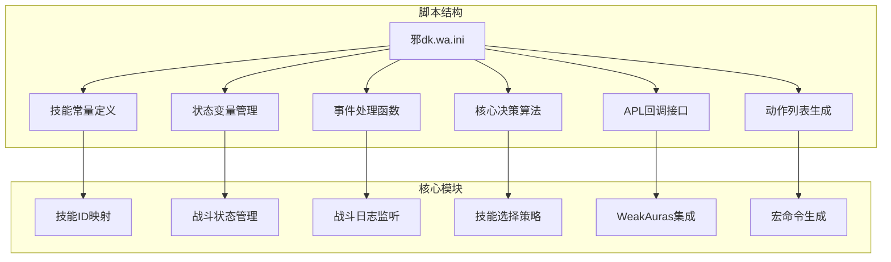
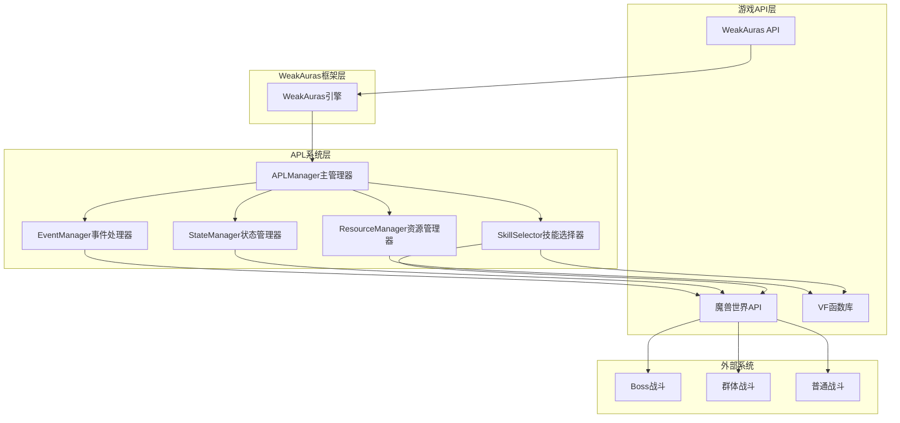
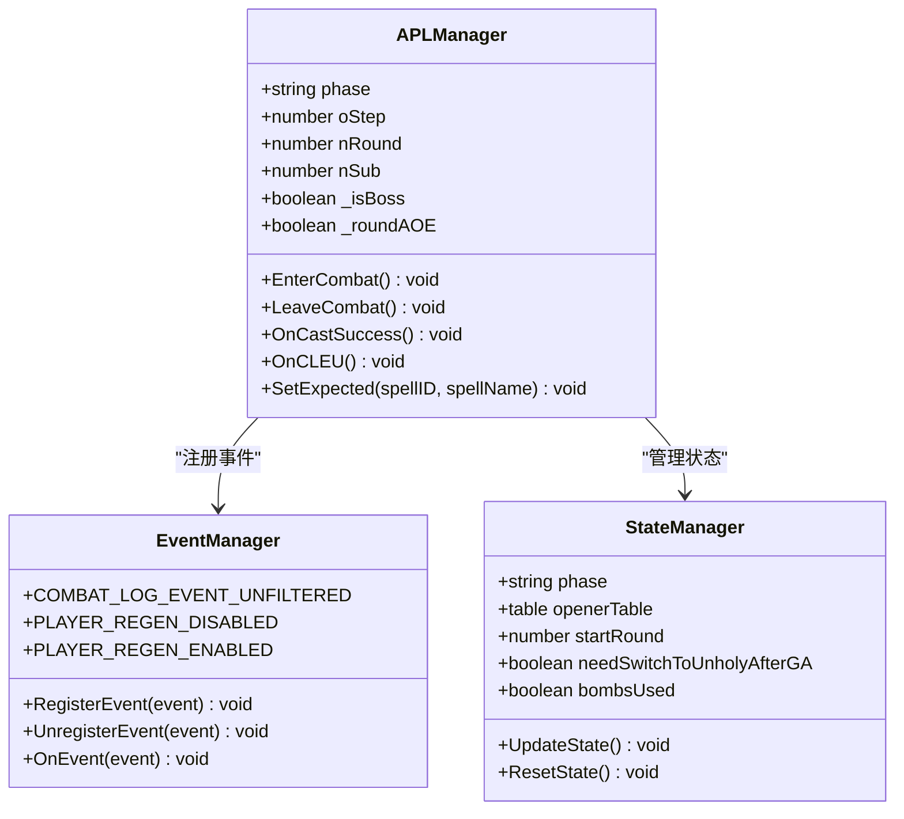
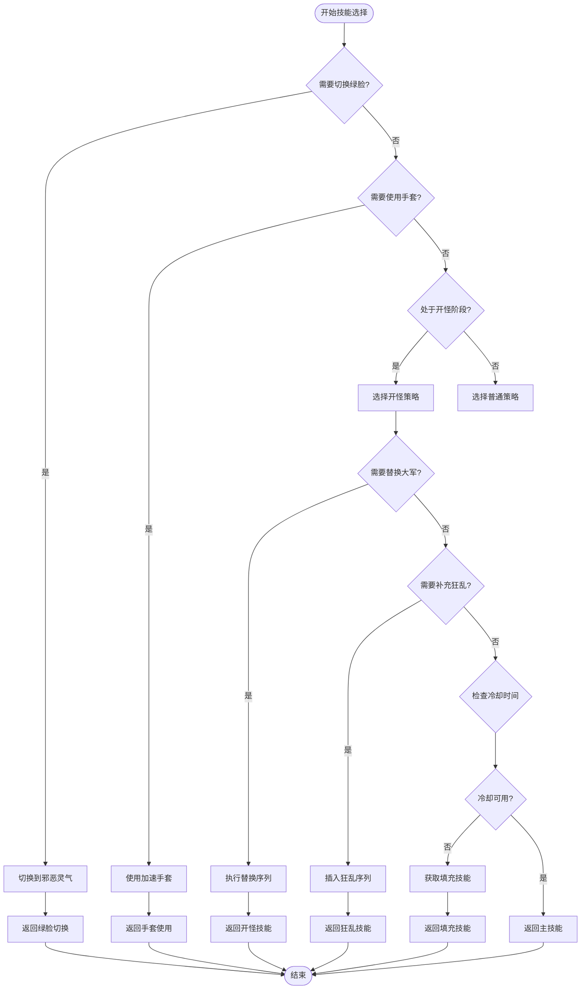
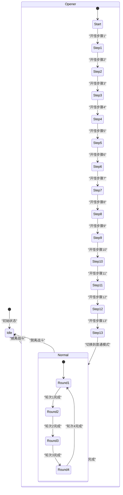
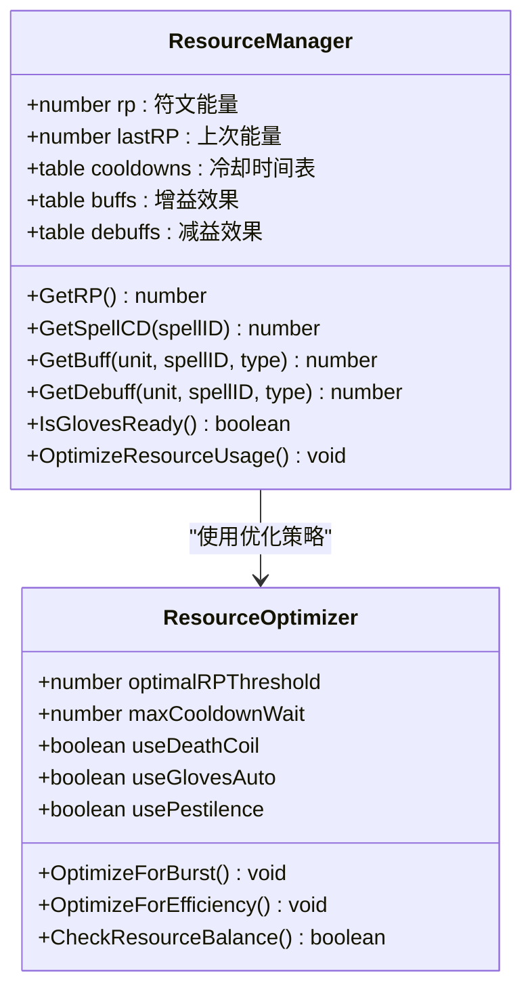
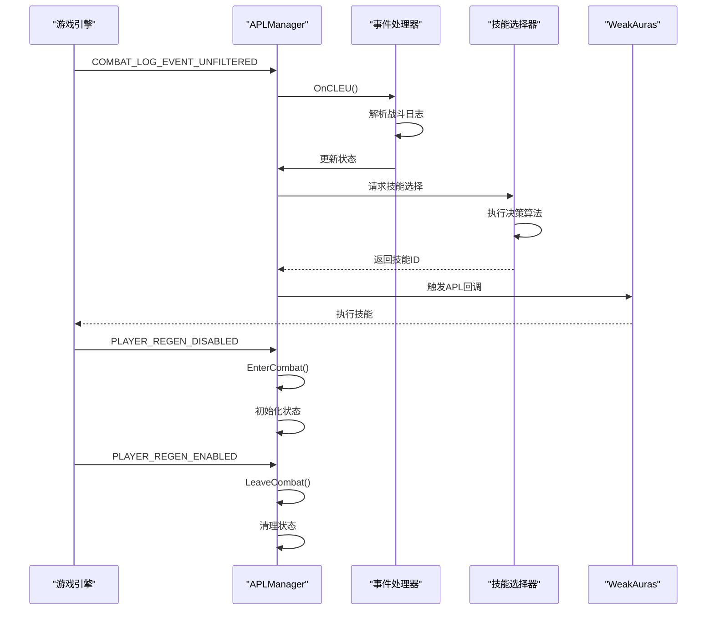
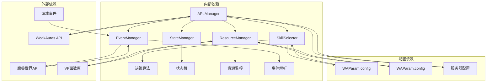

# 技术架构

<cite>
**本文档引用的文件**
- [邪dk.wa.ini](file://邪dk.wa.ini)
</cite>

## 目录
1. [简介](#简介)
2. [项目结构](#项目结构)
3. [核心组件](#核心组件)
4. [架构总览](#架构总览)
5. [详细组件分析](#详细组件分析)
6. [依赖关系分析](#依赖关系分析)
7. [性能考量](#性能考量)
8. [故障排除指南](#故障排除指南)
9. [结论](#结论)

## 简介
本文件为死亡骑士自动战斗脚本的技术架构文档，基于WeakAuras框架下的APL（Action Priority List）实现。该系统采用事件驱动架构，通过状态机模式管理战斗阶段，结合策略模式实现不同场景下的技能选择逻辑。系统主要面向魔兽世界燃烧的远征（Wrath of the Lich King）版本，针对时光服服务器进行了专门优化。

## 项目结构
该脚本采用单文件架构设计，所有功能集中在单一配置文件中，便于部署和维护：

**图表来源**
- [邪dk.wa.ini:1-600](file://邪dk.wa.ini#L1-L600)

**章节来源**
- [邪dk.wa.ini:1-600](file://邪dk.wa.ini#L1-L600)

## 核心组件
系统由以下核心组件构成：

### 主管理器（APLManager）
- **职责**：作为事件入口点，统一管理所有游戏事件
- **实现**：创建UIParent帧并注册战斗日志事件
- **生命周期**：随游戏界面加载而初始化

### 技能选择器（SkillSelector）
- **职责**：根据当前状态和条件选择最优技能
- **实现**：包含开怪阶段和普通阶段两套策略
- **智能逻辑**：动态调整技能顺序以适应战斗情况

### 状态管理器（StateManager）
- **职责**：维护战斗状态机和全局状态变量
- **状态类型**：空闲、开怪、普通战斗
- **状态转换**：基于事件驱动的状态迁移

### 资源管理器（ResourceManager）
- **职责**：监控和管理角色资源状态
- **资源类型**：符文能量、冷却时间、增益效果
- **优化策略**：智能分配和使用资源

### 事件处理器（EventManager）
- **职责**：监听和处理游戏事件
- **事件类型**：战斗开始、结束、技能施放、命中结果
- **响应机制**：异步事件处理和状态更新

**章节来源**
- [邪dk.wa.ini:350-362](file://邪dk.wa.ini#L350-L362)
- [邪dk.wa.ini:45-52](file://邪dk.wa.ini#L45-L52)

## 架构总览
系统采用分层架构设计，各组件职责明确且耦合度低：

**图表来源**
- [邪dk.wa.ini:17-42](file://邪dk.wa.ini#L17-L42)
- [邪dk.wa.ini:350-362](file://邪dk.wa.ini#L350-L362)

## 详细组件分析

### APLManager主管理器
APLManager是整个系统的协调中心，负责事件的统一接收和分发：

**图表来源**
- [邪dk.wa.ini:350-362](file://邪dk.wa.ini#L350-L362)
- [邪dk.wa.ini:252-282](file://邪dk.wa.ini#L252-L282)

### SkillSelector技能选择器
技能选择器实现了复杂的决策逻辑，包含多种战斗场景的策略：

**图表来源**
- [邪dk.wa.ini:378-449](file://邪dk.wa.ini#L378-L449)
- [邪dk.wa.ini:451-544](file://邪dk.wa.ini#L451-L544)

### StateManager状态管理器
状态管理器实现了完整的状态机模式，管理战斗的不同阶段：

**图表来源**
- [邪dk.wa.ini:45-52](file://邪dk.wa.ini#L45-L52)
- [邪dk.wa.ini:252-282](file://邪dk.wa.ini#L252-L282)

### ResourceManager资源管理器
资源管理器负责监控和优化资源使用：

**图表来源**
- [邪dk.wa.ini:58-83](file://邪dk.wa.ini#L58-L83)
- [邪dk.wa.ini:365-376](file://邪dk.wa.ini#L365-L376)

### EventManager事件处理器
事件处理器实现了完整的事件驱动机制：

**图表来源**
- [邪dk.wa.ini:354-362](file://邪dk.wa.ini#L354-L362)
- [邪dk.wa.ini:284-348](file://邪dk.wa.ini#L284-L348)

**章节来源**
- [邪dk.wa.ini:350-362](file://邪dk.wa.ini#L350-L362)
- [邪dk.wa.ini:252-282](file://邪dk.wa.ini#L252-L282)
- [邪dk.wa.ini:378-449](file://邪dk.wa.ini#L378-L449)

## 依赖关系分析
系统依赖关系清晰，主要依赖于WeakAuras框架和魔兽世界API：

**图表来源**
- [邪dk.wa.ini:17-42](file://邪dk.wa.ini#L17-L42)
- [邪dk.wa.ini:350-362](file://邪dk.wa.ini#L350-L362)

**章节来源**
- [邪dk.wa.ini:17-42](file://邪dk.wa.ini#L17-L42)
- [邪dk.wa.ini:350-362](file://邪dk.wa.ini#L350-L362)

## 性能考量
系统在设计时充分考虑了性能优化：

### 时间复杂度分析
- **技能选择算法**：O(1) 平均时间复杂度，基于状态查询和条件判断
- **事件处理**：O(1) 时间复杂度，直接事件分发机制
- **状态管理**：O(1) 状态转换，线性状态机设计

### 内存使用优化
- **局部变量**：所有状态变量均为文件作用域局部变量，减少内存占用
- **函数闭包**：避免不必要的闭包创建，提高垃圾回收效率
- **缓存策略**：合理使用VF函数库的缓存机制

### 实时性能优化
- **事件过滤**：只处理玩家相关的战斗日志事件
- **智能延迟**：避免重复触发相同事件
- **批量处理**：合并相似的事件处理逻辑

## 故障排除指南
常见问题及解决方案：

### 事件处理异常
**问题症状**：技能选择不正确或状态混乱
**可能原因**：
- 事件处理顺序错误
- 状态变量未正确重置
- 冷却时间计算错误

**解决方法**：
1. 检查事件注册顺序
2. 验证状态重置逻辑
3. 使用调试输出验证冷却时间

### 技能选择错误
**问题症状**：在关键时刻使用了错误的技能
**可能原因**：
- 条件判断逻辑错误
- 资源状态监控不准确
- 状态转换时机不当

**解决方法**：
1. 检查条件判断语句
2. 验证资源监控函数
3. 调整状态转换逻辑

### 性能问题
**问题症状**：脚本响应缓慢或卡顿
**可能原因**：
- 过多的字符串操作
- 不必要的函数调用
- 事件处理过于频繁

**解决方法**：
1. 优化字符串拼接操作
2. 减少函数调用次数
3. 实现事件节流机制

**章节来源**
- [邪dk.wa.ini:284-348](file://邪dk.wa.ini#L284-L348)
- [邪dk.wa.ini:365-376](file://邪dk.wa.ini#L365-L376)

## 结论
该死亡骑士自动战斗脚本采用了成熟的设计模式和技术架构：

### 设计优势
- **模块化设计**：各组件职责明确，易于维护和扩展
- **事件驱动**：响应式架构，实时处理游戏变化
- **状态机模式**：清晰的状态管理和转换逻辑
- **策略模式**：灵活的技能选择策略，适应不同战斗场景

### 技术创新
- **智能资源管理**：基于条件的资源优化使用
- **自适应策略**：根据战斗情况动态调整技能顺序
- **多场景支持**：同时支持Boss战、群体战和普通战斗

### 改进建议
- **配置化**：增加更多可配置选项
- **日志系统**：添加详细的调试日志
- **单元测试**：建立自动化测试框架
- **性能监控**：添加运行时性能指标

该系统为WeakAuras框架下的APL实现提供了优秀的参考范例，展示了如何在限制环境下实现复杂的AI逻辑。