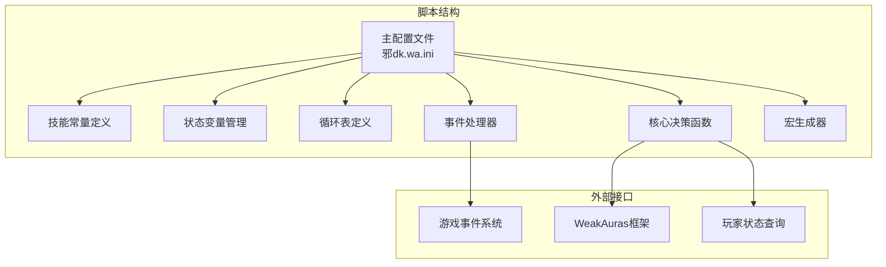
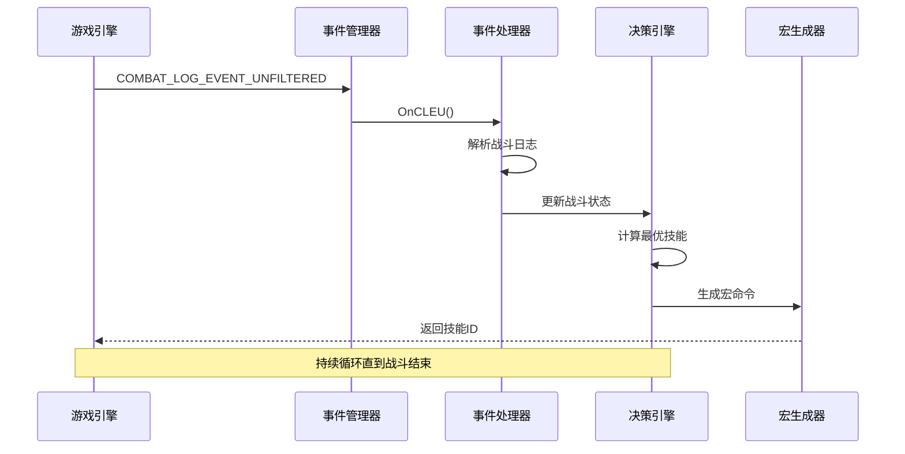
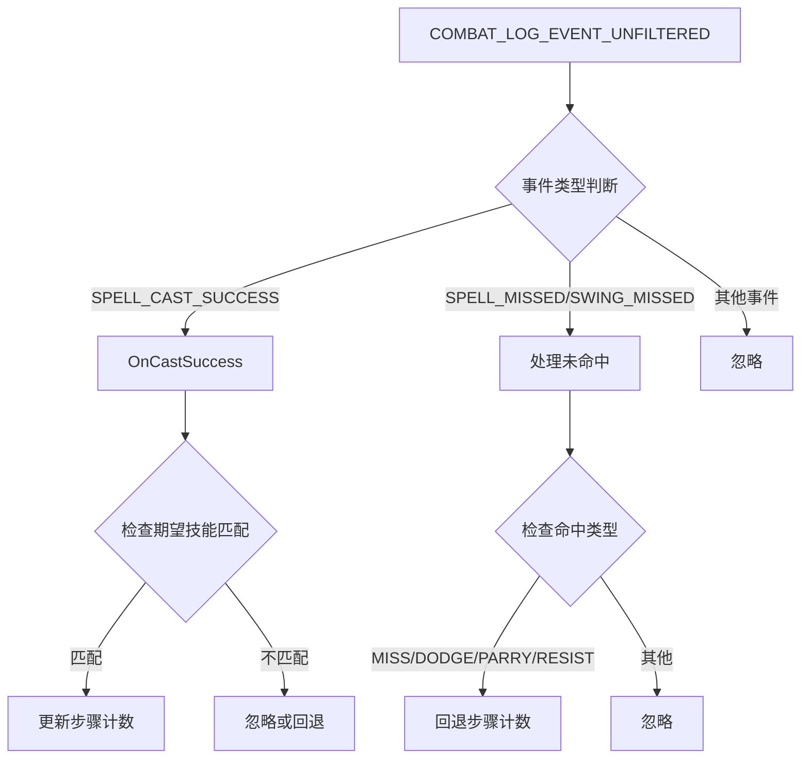
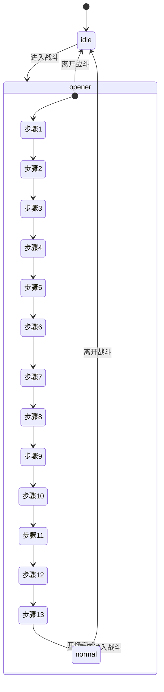
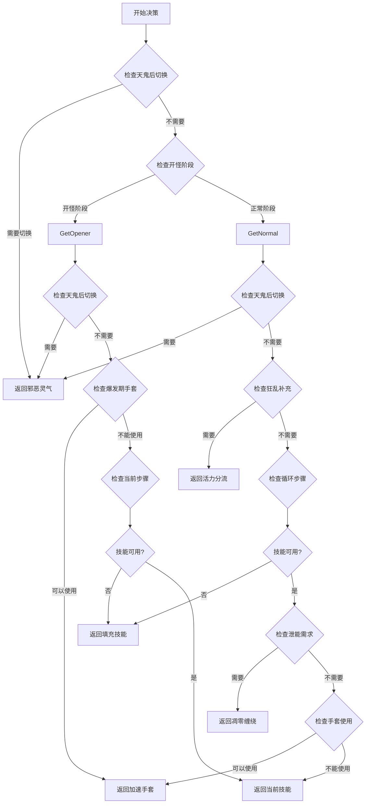
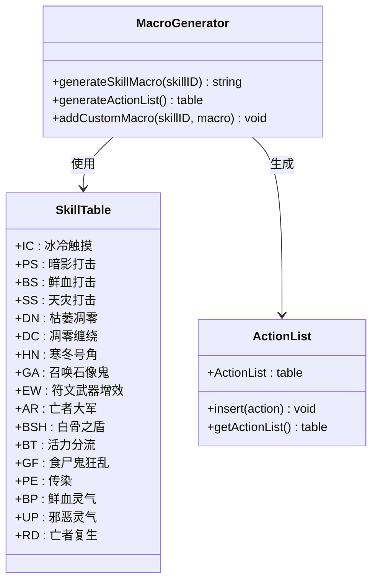
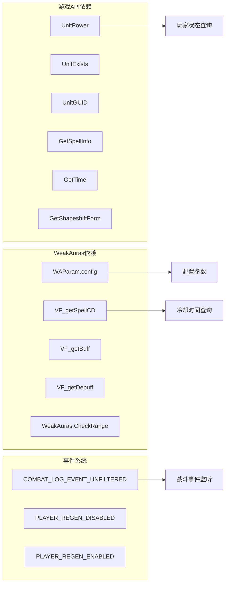
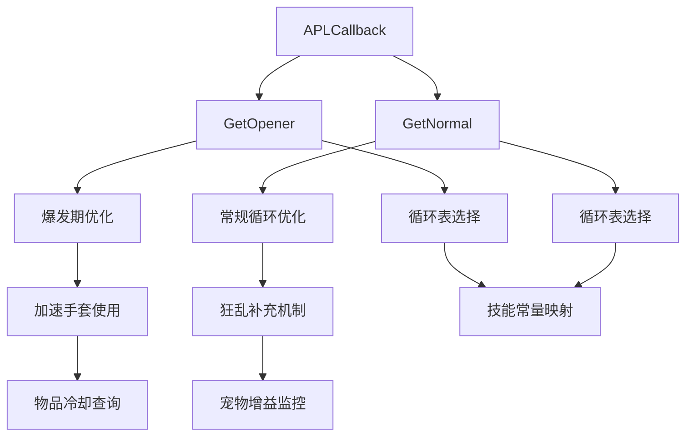

# 数据流分析

<cite>
**本文档引用的文件**
- [邪dk.wa.ini](file://邪dk.wa.ini)
</cite>

## 目录
1. [简介](#简介)
2. [项目结构](#项目结构)
3. [核心组件](#核心组件)
4. [架构概览](#架构概览)
5. [详细组件分析](#详细组件分析)
6. [依赖关系分析](#依赖关系分析)
7. [性能考量](#性能考量)
8. [故障排除指南](#故障排除指南)
9. [结论](#结论)

## 简介

这是一个为魔兽世界巫妖王之怒版本设计的死亡骑士自动战斗脚本。该脚本实现了复杂的战斗AI逻辑，包括开怪阶段、正常战斗阶段和爆发期管理。脚本通过事件驱动的方式监听游戏状态变化，并根据当前战斗情况动态生成最优的技能执行序列。

## 项目结构

该项目采用单一文件架构，所有功能都集中在同一个配置文件中：

**图表来源**
- [邪dk.wa.ini:14-599](file://邪dk.wa.ini#L14-L599)

**章节来源**
- [邪dk.wa.ini:14-599](file://邪dk.wa.ini#L14-L599)

## 核心组件

### 技能常量系统

脚本定义了完整的技能常量映射，包括：
- 主要攻击技能：冰冷触摸、暗影打击、鲜血打击、天灾打击
- 辅助技能：血液沸腾、枯萎凋零、凋零缠绕、寒冬号角
- 特殊技能：召唤石像鬼、符文武器增效、亡者大军、白骨之盾
- 被动技能：活力分流、食尸鬼狂乱、传染、鲜血灵气、邪恶灵气
- 物品技能：加速手套（-112）

### 状态管理系统

维护关键的战斗状态变量：
- 战斗阶段：idle（空闲）、opener（开怪）、normal（正常）
- 循环计数：oStep（开怪步骤）、nRound（正常轮次）、nSub（子步骤）
- BOSS识别：_isBoss、_roundAOE
- 技能替换：_armyReplace
- 缓存控制：_isFilling、_gfInsert
- 最终执行：_lastSID、_lastST
- 预期技能：_expectedID、_expectedName

**章节来源**
- [邪dk.wa.ini:21-53](file://邪dk.wa.ini#L21-L53)
- [邪dk.wa.ini:45-52](file://邪dk.wa.ini#L45-L52)

## 架构概览

脚本采用事件驱动的架构模式，通过注册游戏事件来响应战斗状态变化：

**图表来源**
- [邪dk.wa.ini:350-362](file://邪dk.wa.ini#L350-L362)
- [邪dk.wa.ini:323-348](file://邪dk.wa.ini#L323-L348)

## 详细组件分析

### 事件处理系统

#### 战斗日志事件处理

**图表来源**
- [邪dk.wa.ini:323-348](file://邪dk.wa.ini#L323-L348)
- [邪dk.wa.ini:284-321](file://邪dk.wa.ini#L284-L321)

#### 战斗状态转换

**图表来源**
- [邪dk.wa.ini:252-282](file://邪dk.wa.ini#L252-L282)
- [邪dk.wa.ini:457-544](file://邪dk.wa.ini#L457-L544)

**章节来源**
- [邪dk.wa.ini:252-282](file://邪dk.wa.ini#L252-L282)
- [邪dk.wa.ini:350-362](file://邪dk.wa.ini#L350-L362)

### 决策计算引擎

#### 技能选择算法

**图表来源**
- [邪dk.wa.ini:379-455](file://邪dk.wa.ini#L379-L455)
- [邪dk.wa.ini:457-544](file://邪dk.wa.ini#L457-L544)

#### 循环表组织结构

脚本定义了多种循环表来适应不同的战斗场景：

| 循环类型 | 描述 | 关键特征 |
|---------|------|----------|
| OP_BOSS | BOSS战标准循环 | 包含完整爆发序列 |
| OP_BOSS_AOE | BOSS战AOE循环 | 2目标起传染 |
| OP_NONBOSS | 普通怪物循环 | 简化序列 |
| OP_NONBOSS_AOE | 普通怪物AOE循环 | 传染优化 |
| OP_NOBURST | 无爆发循环 | 适合低等级环境 |
| N1-N4 | 正常战斗轮次 | 四种不同轮次 |
| NA1-NA4 | AOE正常轮次 | 对应AOE版本 |

**章节来源**
- [邪dk.wa.ini:85-250](file://邪dk.wa.ini#L85-L250)

### 宏生成系统

#### 技能宏生成流程

**图表来源**
- [邪dk.wa.ini:570-592](file://邪dk.wa.ini#L570-L592)

**章节来源**
- [邪dk.wa.ini:570-592](file://邪dk.wa.ini#L570-L592)

## 依赖关系分析

### 外部依赖

脚本依赖于以下外部系统和API：

**图表来源**
- [邪dk.wa.ini:17-18](file://邪dk.wa.ini#L17-L18)
- [邪dk.wa.ini:58-76](file://邪dk.wa.ini#L58-L76)
- [邪dk.wa.ini:350-362](file://邪dk.wa.ini#L350-L362)

### 内部依赖关系

**图表来源**
- [邪dk.wa.ini:545-568](file://邪dk.wa.ini#L545-L568)
- [邪dk.wa.ini:457-544](file://邪dk.wa.ini#L457-L544)
- [邪dk.wa.ini:379-455](file://邪dk.wa.ini#L379-L455)

**章节来源**
- [邪dk.wa.ini:545-568](file://邪dk.wa.ini#L545-L568)

## 性能考量

### 数据缓存策略

脚本实现了多层缓存机制来优化性能：

1. **技能冷却缓存**：通过`IsCD`函数缓存技能冷却状态
2. **玩家状态缓存**：记录最近一次施法的技能ID和时间戳
3. **循环状态缓存**：维护当前循环的轮次和子步骤状态
4. **配置参数缓存**：通过WAParam.config访问配置参数

### 性能优化措施

1. **事件过滤**：只处理玩家相关的战斗日志事件
2. **快速路径**：对于常见情况使用直接判断而非复杂计算
3. **早退机制**：在条件不满足时立即返回，避免不必要的计算
4. **批量处理**：将相似的技能组合归类到循环表中统一处理

### 内存管理

- 使用局部变量减少全局污染
- 及时清理不再使用的状态标志
- 合理使用table结构存储循环数据

## 故障排除指南

### 常见问题诊断

#### 技能执行异常

**症状**：技能执行顺序错误或跳过某些技能
**可能原因**：
1. 战斗日志解析失败
2. 冷却时间查询异常
3. 循环状态同步问题

**解决方法**：
1. 检查事件监听是否正常工作
2. 验证冷却时间查询函数
3. 确认循环计数器状态

#### 爆发期优化失效

**症状**：加速手套未在正确时机使用
**可能原因**：
1. BOSS识别错误
2. 手套冷却状态异常
3. 距离条件不满足

**解决方法**：
1. 检查BOSS检测逻辑
2. 验证物品冷却查询
3. 确认距离检查条件

#### AOE循环不触发

**症状**：传染技能未按预期使用
**可能原因**：
1. 敌人数量统计错误
2. AOE阈值配置不当
3. 传染技能冷却状态异常

**解决方法**：
1. 检查敌人数量统计逻辑
2. 调整AOE阈值配置
3. 验证技能冷却状态

**章节来源**
- [邪dk.wa.ini:262-275](file://邪dk.wa.ini#L262-L275)
- [邪dk.wa.ini:398-400](file://邪dk.wa.ini#L398-L400)
- [邪dk.wa.ini:78-83](file://邪dk.wa.ini#L78-L83)

## 结论

这个死亡骑士自动战斗脚本展现了高度复杂的数据流处理能力。通过精心设计的事件驱动架构、多层状态管理和智能决策算法，实现了对各种战斗场景的自适应处理。

### 主要优势

1. **模块化设计**：清晰分离事件处理、状态管理和决策计算
2. **灵活配置**：通过配置参数支持不同的战斗风格
3. **智能优化**：针对特定版本（WLK 80级）进行深度优化
4. **性能友好**：实现多层缓存和优化策略

### 关键改进点

1. **错误处理**：可以增加更完善的异常处理机制
2. **调试支持**：添加更多的调试信息输出
3. **配置验证**：增加配置参数的有效性检查
4. **性能监控**：添加性能指标的收集和报告

该脚本为魔兽世界战斗AI提供了优秀的参考实现，展示了如何在复杂的游戏中实现智能化的自动战斗系统。