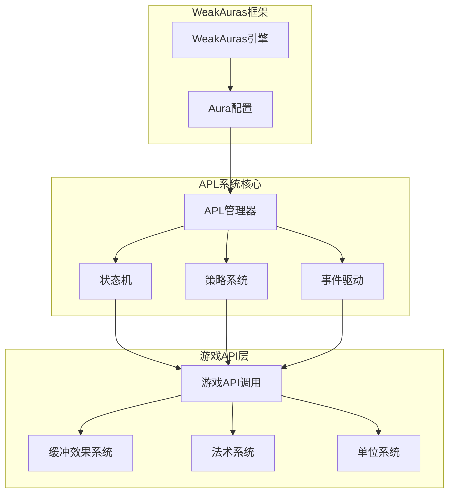
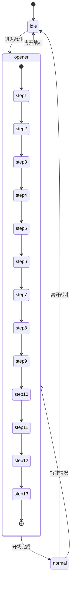
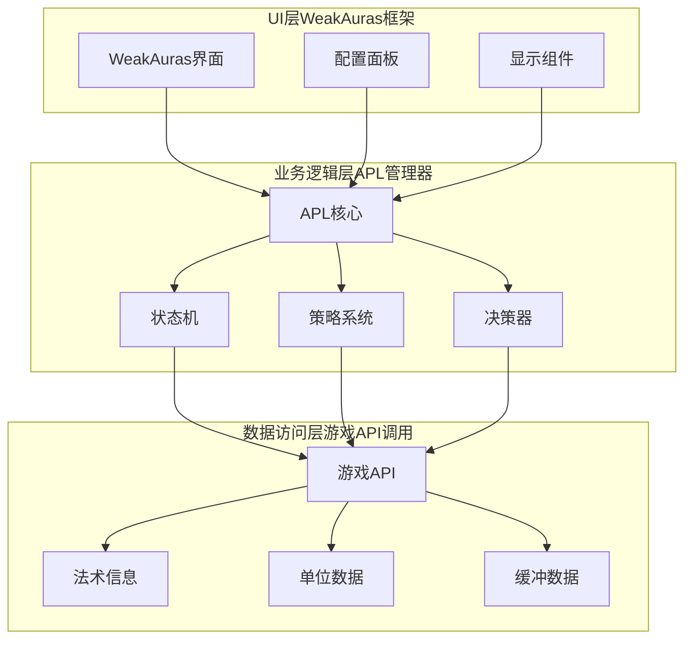
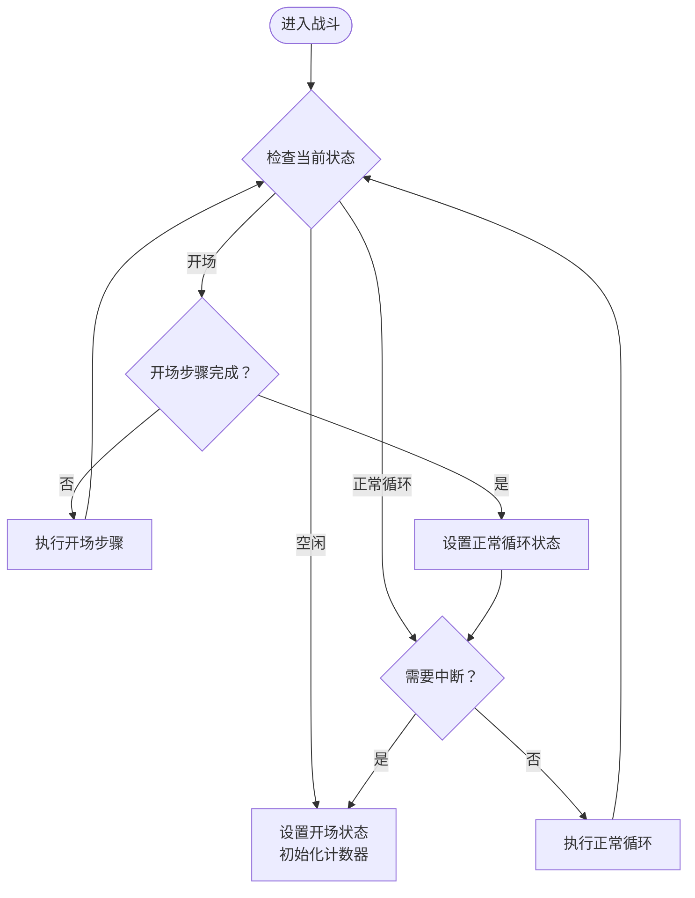
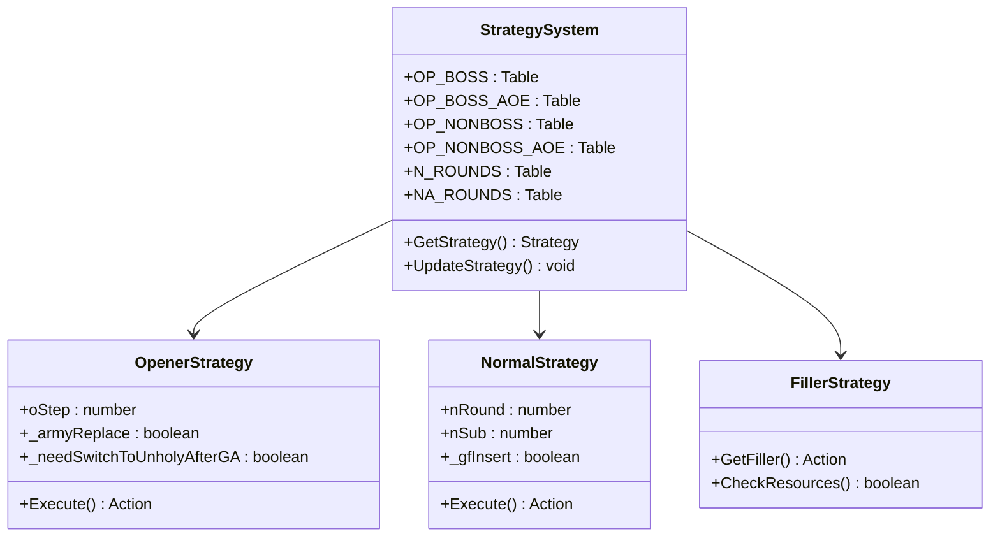
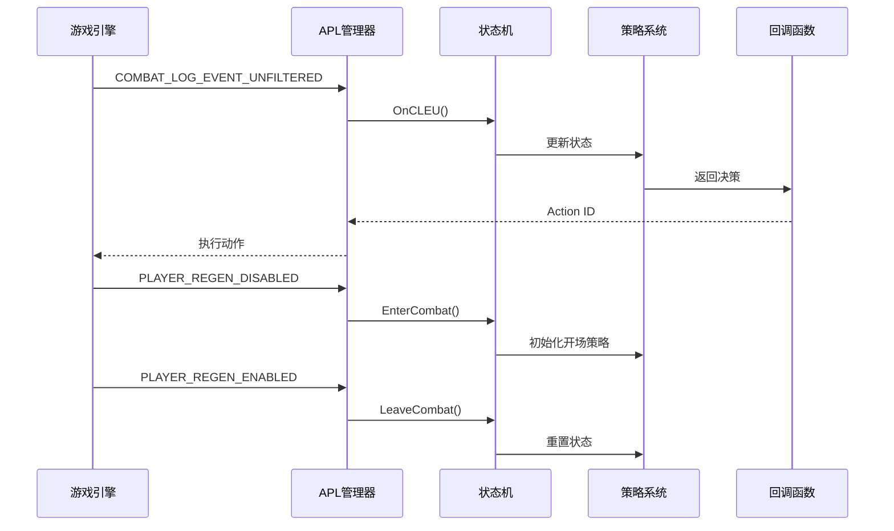
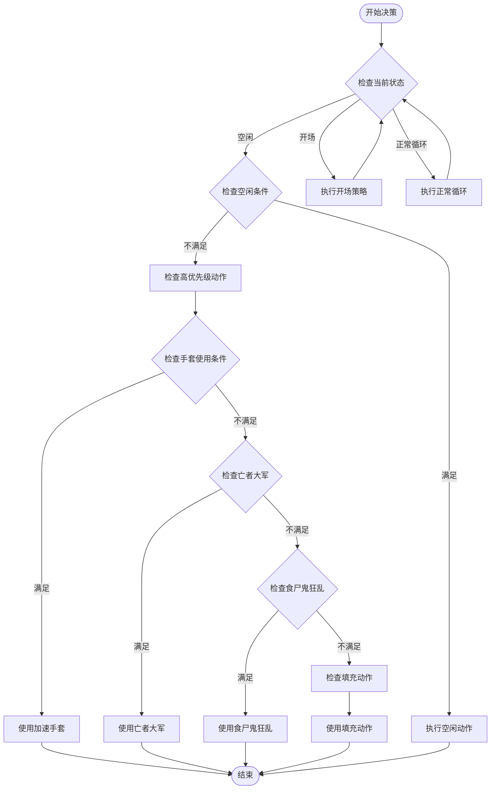
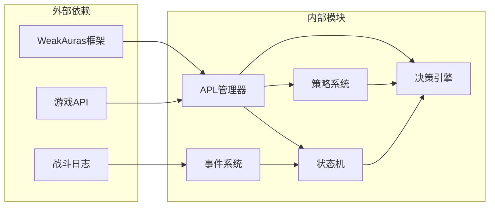

# 整体架构设计

<cite>
**本文档引用的文件**
- [邪dk.wa.ini](file://邪dk.wa.ini)
</cite>

## 目录
1. [引言](#引言)
2. [项目结构](#项目结构)
3. [核心组件](#核心组件)
4. [架构总览](#架构总览)
5. [详细组件分析](#详细组件分析)
6. [依赖关系分析](#依赖关系分析)
7. [性能考虑](#性能考虑)
8. [故障排除指南](#故障排除指南)
9. [结论](#结论)

## 引言

这是一个基于WeakAuras框架的死亡骑士自动战斗脚本，采用APL（Action Priority List）系统实现。该脚本结合了状态机模式、策略模式和事件驱动架构，为玩家提供智能化的战斗决策支持。系统针对泰坦时光服服务器进行了专门优化，包括AOE阈值调整和能量管理策略。

## 项目结构

该项目采用单文件架构设计，所有逻辑都集中在单一的配置文件中：

**图表来源**
- [邪dk.wa.ini:350-362](file://邪dk.wa.ini#L350-L362)

**章节来源**
- [邪dk.wa.ini:1-606](file://邪dk.wa.ini#L1-L606)

## 核心组件

### APL管理器（APL Manager）

APL管理器是整个系统的核心控制器，负责协调各个子系统的运作。它实现了以下关键功能：

- **状态管理**：维护当前战斗阶段（空闲、开场、正常循环）
- **事件处理**：监听并响应游戏事件
- **决策协调**：协调状态机和策略系统的决策结果
- **配置管理**：处理用户配置参数

### 状态机（State Machine）

系统采用有限状态机模式，定义了三种主要状态：

**图表来源**
- [邪dk.wa.ini:252-282](file://邪dk.wa.ini#L252-L282)

### 策略系统（Strategy Pattern）

策略系统通过预定义的循环表实现不同的战斗策略：

- **BOSS战策略**：包含爆发期和非爆发期两种变体
- **普通战策略**：针对非精英目标的优化循环
- **AOE策略**：基于目标数量的范围攻击策略
- **填充策略**：资源管理和空窗期处理

**章节来源**
- [邪dk.wa.ini:85-250](file://邪dk.wa.ini#L85-L250)

## 架构总览

该系统采用了混合架构模式，将多种设计模式有机结合：

**图表来源**
- [邪dk.wa.ini:350-362](file://邪dk.wa.ini#L350-L362)

### 架构设计理念

系统选择这种架构组合的原因：

1. **状态机模式**：提供清晰的状态转换逻辑，便于理解和维护
2. **策略模式**：支持灵活的战斗策略切换，适应不同战斗场景
3. **事件驱动架构**：实时响应游戏变化，提高系统响应性

## 详细组件分析

### 状态机实现

状态机通过全局状态变量管理当前战斗阶段：

**图表来源**
- [邪dk.wa.ini:252-282](file://邪dk.wa.ini#L252-L282)

### 策略系统架构

策略系统通过预定义的循环表实现不同的战斗策略：

**图表来源**
- [邪dk.wa.ini:85-250](file://邪dk.wa.ini#L85-L250)

### 事件驱动架构

系统通过WeakAuras事件系统实现实时响应：

**图表来源**
- [邪dk.wa.ini:350-362](file://邪dk.wa.ini#L350-L362)

**章节来源**
- [邪dk.wa.ini:284-348](file://邪dk.wa.ini#L284-L348)

### 决策算法流程

系统的核心决策算法采用优先级队列模式：

**图表来源**
- [邪dk.wa.ini:364-551](file://邪dk.wa.ini#L364-L551)

**章节来源**
- [邪dk.wa.ini:364-575](file://邪dk.wa.ini#L364-L575)

## 依赖关系分析

系统的主要依赖关系如下：

**图表来源**
- [邪dk.wa.ini:17-42](file://邪dk.wa.ini#L17-L42)

### 可扩展性设计

系统在设计时充分考虑了可扩展性：

1. **配置驱动**：通过配置参数支持不同服务器环境
2. **策略插件化**：新的战斗策略可以轻松添加到现有框架中
3. **事件扩展**：新的游戏事件可以方便地集成到事件系统中
4. **状态机扩展**：新的战斗状态可以添加到状态机中

**章节来源**
- [邪dk.wa.ini:14-15](file://邪dk.wa.ini#L14-L15)

## 性能考虑

### 时间复杂度分析

- **状态检查**：O(1) - 使用全局状态变量进行快速状态判断
- **策略查找**：O(1) - 通过索引直接访问预定义的循环表
- **事件处理**：O(1) - 每个事件只进行必要的状态更新
- **决策计算**：O(n) - 其中n为可用动作的数量

### 空间复杂度分析

- **状态存储**：O(1) - 使用少量全局变量存储状态信息
- **策略缓存**：O(m) - m为预定义策略的数量
- **事件队列**：O(k) - k为同时处理的事件数量

### 性能优化策略

1. **延迟加载**：只有在需要时才初始化复杂的策略数据
2. **缓存机制**：缓存常用的法术信息和状态查询结果
3. **批量处理**：合并相似的事件处理逻辑
4. **内存管理**：及时清理不再使用的临时变量

## 故障排除指南

### 常见问题及解决方案

1. **动作执行失败**
   - 检查法术冷却时间
   - 验证角色状态（是否有合适的形态）
   - 确认目标有效性

2. **状态同步问题**
   - 重新进入战斗以重置状态机
   - 检查事件监听器是否正常工作
   - 验证配置参数设置

3. **性能问题**
   - 减少不必要的配置项
   - 优化事件处理逻辑
   - 检查是否有内存泄漏

**章节来源**
- [邪dk.wa.ini:284-348](file://邪dk.wa.ini#L284-L348)

## 结论

该死亡骑士自动战斗脚本通过精心设计的混合架构模式，成功实现了智能化的战斗决策系统。系统采用状态机模式提供清晰的状态管理，策略模式支持灵活的战斗策略，事件驱动架构确保实时响应能力。

### 架构优势

1. **模块化设计**：各组件职责明确，便于维护和扩展
2. **实时响应**：事件驱动架构确保对游戏变化的快速响应
3. **可配置性**：通过配置参数支持不同的服务器环境和版本
4. **性能优化**：采用多种优化策略确保系统运行效率

### 技术权衡分析

1. **性能vs功能**：通过缓存和延迟加载在性能和功能完整性之间取得平衡
2. **复杂度vs可维护性**：虽然架构相对复杂，但提供了良好的可维护性
3. **灵活性vs稳定性**：高度可配置的设计增加了系统的灵活性，但也需要更严格的测试

该架构为类似的游戏自动化脚本提供了优秀的参考模型，展示了如何在复杂的实时环境中实现智能决策系统。