# 核心组件说明

<cite>
**本文档引用的文件**
- [邪dk.wa.ini](file://邪dk.wa.ini)
</cite>

## 目录
1. [简介](#简介)
2. [项目结构](#项目结构)
3. [核心组件](#核心组件)
4. [架构概览](#架构概览)
5. [详细组件分析](#详细组件分析)
6. [依赖关系分析](#依赖关系分析)
7. [性能考虑](#性能考虑)
8. [故障排除指南](#故障排除指南)
9. [结论](#结论)

## 简介

这是一个基于魔兽世界燃烧的远征经典版（Wrath of the Lich King）的死亡骑士自动战斗脚本。该脚本实现了完整的APL（Action Priority List）系统，通过事件驱动的方式自动管理死亡骑士的战斗行为，包括技能选择、状态转换、资源管理和形态切换等功能。

该脚本采用模块化设计，将复杂的战斗逻辑分解为多个独立的功能模块，每个模块负责特定的职责，通过事件机制进行协调和通信。

## 项目结构

整个脚本是一个单一的配置文件，包含了所有必要的功能实现：

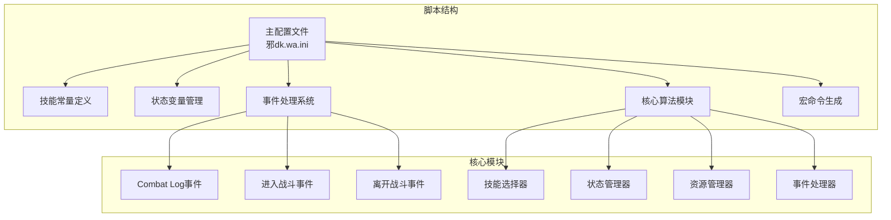

**图表来源**
- [邪dk.wa.ini:1-606](file://邪dk.wa.ini#L1-L606)

**章节来源**
- [邪dk.wa.ini:1-606](file://邪dk.wa.ini#L1-L606)

## 核心组件

该脚本实现了以下核心组件：

### 1. APLManager 主管理器
- **职责**: 整个APL系统的协调中心，负责事件注册、状态管理和组件协调
- **实现**: 通过创建一个UI框架并注册各种游戏事件来实现
- **关键特性**: 事件驱动架构、状态机管理、组件间通信

### 2. SkillSelector 技能选择器
- **职责**: 根据当前战斗状态和资源情况选择最优技能
- **实现**: 包含开怪阶段和普通循环两个不同的选择策略
- **关键特性**: 优先级判断、冷却时间检查、资源消耗评估

### 3. StateManager 状态管理器
- **职责**: 管理角色的战斗状态转换
- **实现**: 维护状态机，处理状态间的转换条件
- **关键特性**: 空闲、开怪、普通循环、填充模式四种状态

### 4. ResourceManager 资源管理器
- **职责**: 监控和管理角色的各种资源
- **实现**: 符文能量监控、冷却时间管理和形态切换控制
- **关键特性**: 实时资源跟踪、智能资源分配

### 5. EventManager 事件处理器
- **职责**: 处理游戏中的各种事件
- **实现**: 监听Combat Log事件、战斗开始/结束事件
- **关键特性**: 事件过滤、状态更新、错误处理

**章节来源**
- [邪dk.wa.ini:350-362](file://邪dk.wa.ini#L350-L362)
- [邪dk.wa.ini:364-575](file://邪dk.wa.ini#L364-L575)

## 架构概览

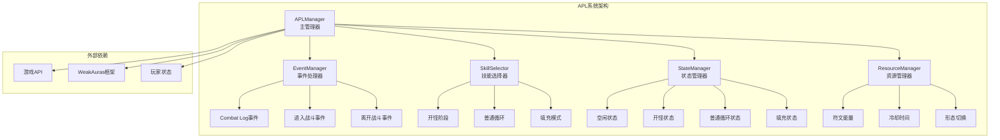

**图表来源**
- [邪dk.wa.ini:350-362](file://邪dk.wa.ini#L350-L362)
- [邪dk.wa.ini:251-348](file://邪dk.wa.ini#L251-L348)

## 详细组件分析

### APLManager 主管理器

APLManager是整个系统的中枢，负责协调各个组件的工作。

#### 接口规范

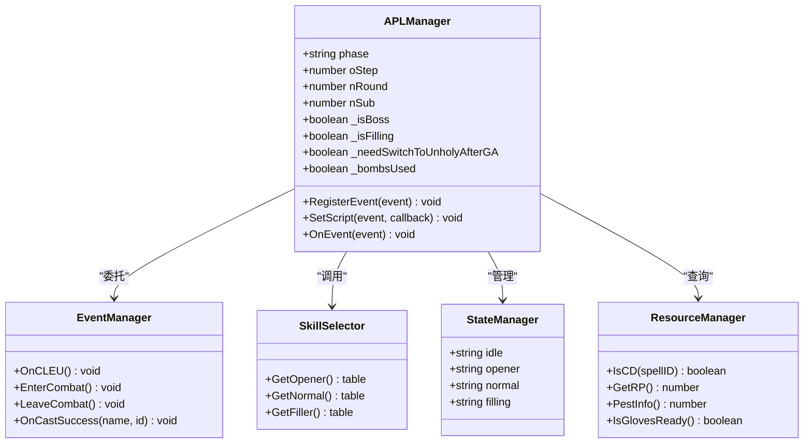

**图表来源**
- [邪dk.wa.ini:350-362](file://邪dk.wa.ini#L350-L362)
- [邪dk.wa.ini:251-348](file://邪dk.wa.ini#L251-L348)
- [邪dk.wa.ini:364-575](file://邪dk.wa.ini#L364-L575)

#### 内部数据结构

APLManager维护以下关键状态变量：

| 变量名 | 类型 | 描述 | 默认值 |
|--------|------|------|--------|
| phase | string | 当前战斗阶段 | "idle" |
| oStep | number | 开怪阶段步骤计数 | 1 |
| nRound | number | 普通循环轮次 | 1 |
| nSub | number | 普通循环子步骤 | 1 |
| _isBoss | boolean | 是否为Boss战斗 | false |
| _isFilling | boolean | 是否处于填充模式 | false |
| _needSwitchToUnholyAfterGA | boolean | 天鬼后切换绿脸标志 | nil |
| _bombsUsed | boolean | 炸弹使用标记 | nil |

#### 事件注册机制

APLManager通过以下方式注册事件：

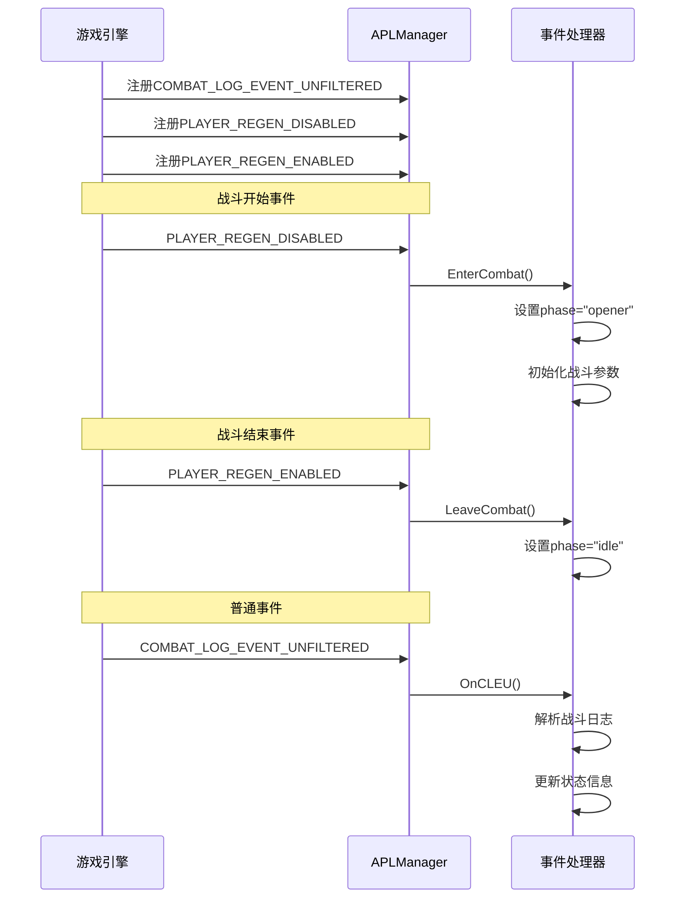

**图表来源**
- [邪dk.wa.ini:350-362](file://邪dk.wa.ini#L350-L362)
- [邪dk.wa.ini:251-348](file://邪dk.wa.ini#L251-L348)

**章节来源**
- [邪dk.wa.ini:350-362](file://邪dk.wa.ini#L350-L362)
- [邪dk.wa.ini:251-348](file://邪dk.wa.ini#L251-L348)

### SkillSelector 技能选择器

SkillSelector是核心的决策模块，负责根据当前状态选择最优技能。

#### 工作机制

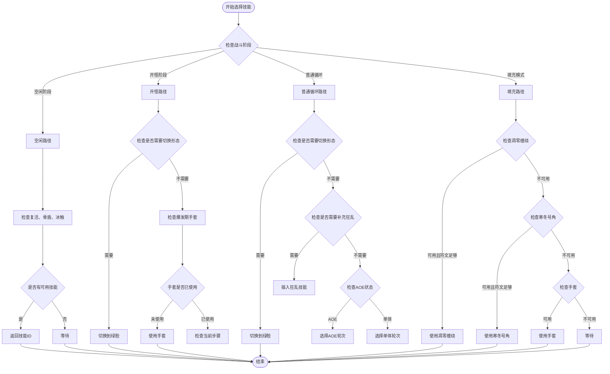

**图表来源**
- [邪dk.wa.ini:364-575](file://邪dk.wa.ini#L364-L575)

#### 技能优先级判断

技能选择遵循严格的优先级规则：

1. **最高优先级**: 形态切换（特别是天鬼后的绿脸切换）
2. **爆发期优化**: 爆发期使用手套获得额外伤害
3. **战斗效率**: 根据目标数量选择AOE或单体技能
4. **资源管理**: 平衡符文能量消耗和技能冷却
5. **战术需求**: 根据战斗阶段调整技能使用策略

#### 冷却时间检查

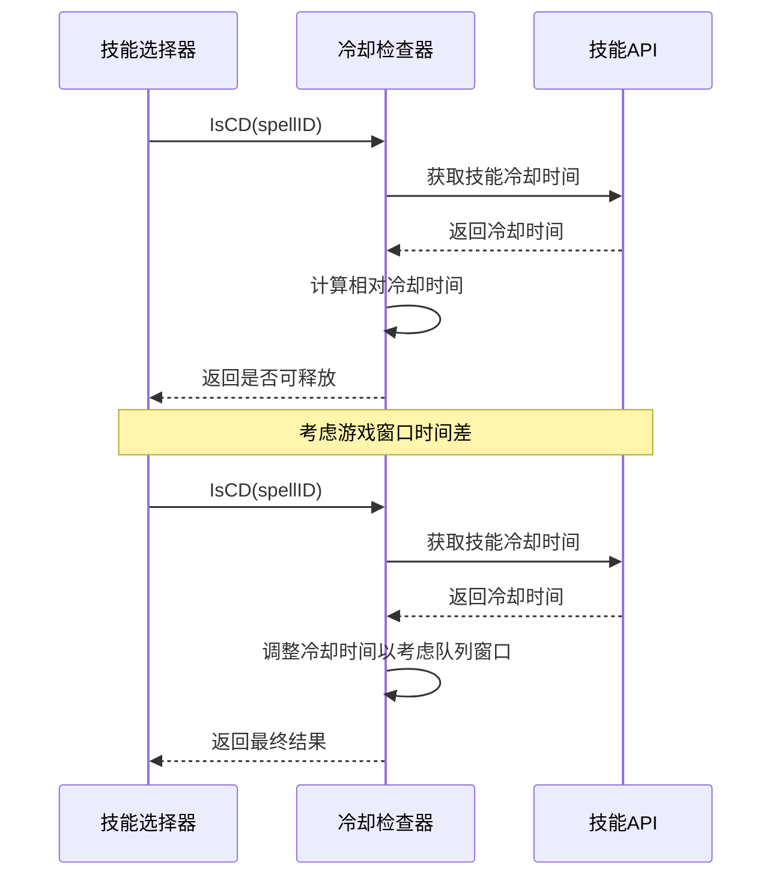

**图表来源**
- [邪dk.wa.ini:54-56](file://邪dk.wa.ini#L54-L56)

#### 资源消耗评估

资源管理包括多个维度：

| 资源类型 | 检查点 | 阈值 | 作用 |
|----------|--------|------|------|
| 符文能量 | GetRP() | 50/60/90 | 控制技能释放时机 |
| 冷却时间 | IsCD() | 相对时间差 | 避免重复计算 |
| 形态状态 | GetShapeshiftForm() | 当前形态 | 确保正确的形态切换 |
| 手套状态 | VF_getItemCD() | 0/冷却中 | 管理爆发期装备使用 |

**章节来源**
- [邪dk.wa.ini:364-575](file://邪dk.wa.ini#L364-L575)

### StateManager 状态管理器

StateManager负责维护和转换角色的战斗状态。

#### 状态转换逻辑

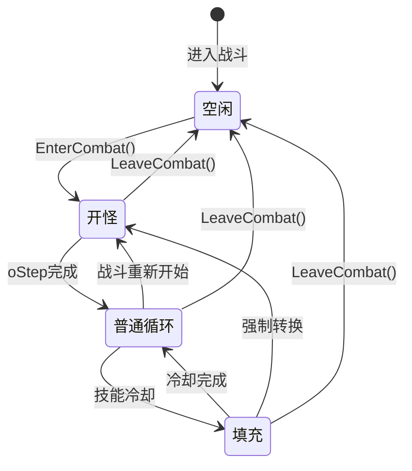

#### 切换条件分析

| 状态转换 | 触发条件 | 条件检查 | 动作 |
|----------|----------|----------|------|
| 空闲→开怪 | EnterCombat() | 战斗开始事件 | 初始化战斗参数 |
| 开怪→普通循环 | oStep完成 | oStep超出范围 | 设置nRound=nStart |
| 普通循环→填充 | 技能冷却 | IsCD(step.id) | 设置_isFilling=true |
| 填充→普通循环 | 冷却完成 | not IsCD(step.id) | 设置_isFilling=false |
| 开怪→开怪 | 手套使用 | _bombsUsed=true | 强制转换到下一阶段 |

#### 状态变量管理

状态管理器维护以下关键变量：

| 变量名 | 类型 | 用途 | 生命周期 |
|--------|------|------|----------|
| phase | string | 当前状态 | 整个脚本运行期间 |
| oStep | number | 开怪步骤 | 仅在开怪阶段有效 |
| nRound | number | 普通循环轮次 | 仅在普通循环阶段有效 |
| nSub | number | 子步骤索引 | 仅在普通循环阶段有效 |
| _isFilling | boolean | 填充模式标志 | 临时状态 |
| _needSwitchToUnholyAfterGA | boolean | 形态切换标志 | 临时状态 |

**章节来源**
- [邪dk.wa.ini:251-348](file://邪dk.wa.ini#L251-L348)

### ResourceManager 资源管理器

ResourceManager专门负责监控和管理角色的各种资源状态。

#### 符文能量监控

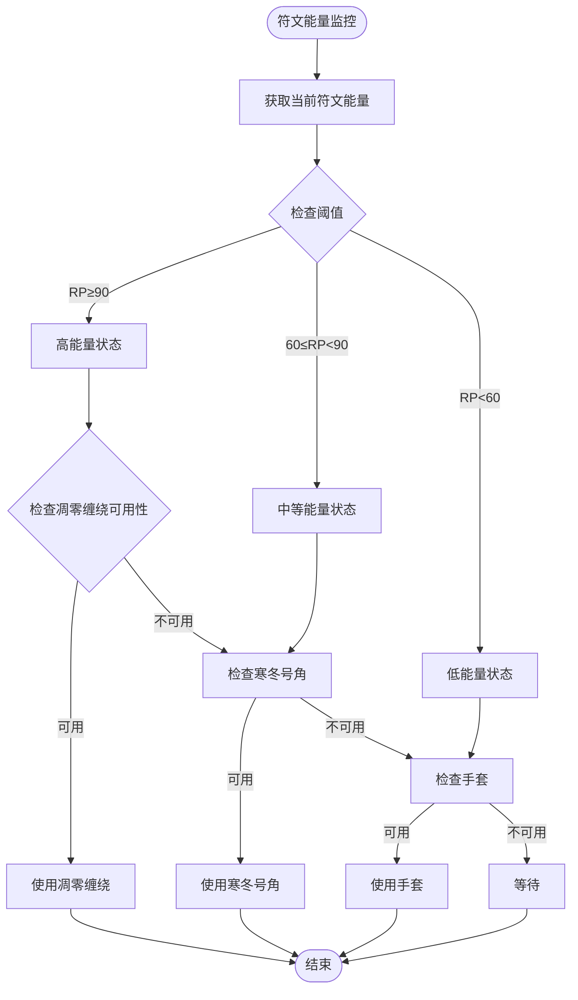

**图表来源**
- [邪dk.wa.ini:58-60](file://邪dk.wa.ini#L58-L60)
- [邪dk.wa.ini:365-377](file://邪dk.wa.ini#L365-L377)

#### 冷却时间管理

ResourceManager使用统一的冷却检查机制：

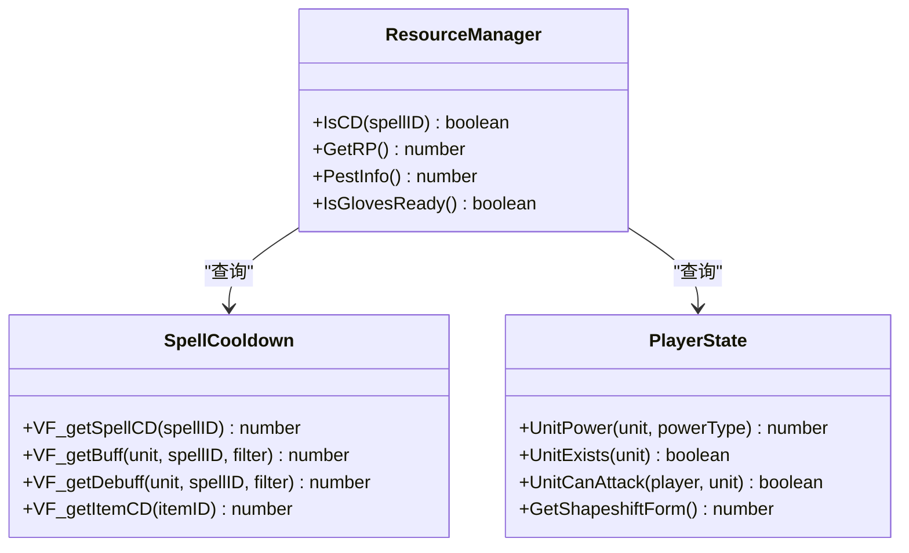

**图表来源**
- [邪dk.wa.ini:54-56](file://邪dk.wa.ini#L54-L56)
- [邪dk.wa.ini:58-83](file://邪dk.wa.ini#L58-L83)

#### 形态切换控制

ResourceManager负责管理死亡骑士的三种形态切换：

| 形态 | ID | 触发条件 | 用途 |
|------|----|----------|------|
| 红脸 | 1 | 使用鲜血灵气 | 提升近战输出 |
| 绿脸 | 3 | 使用邪恶灵气 | 提升法术输出 |
| 蓝脸 | 2 | 使用血性狂怒 | 提升生存能力 |

形态切换的决策逻辑：

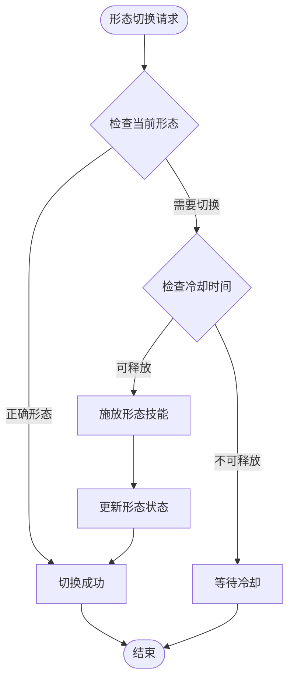

**图表来源**
- [邪dk.wa.ini:382-390](file://邪dk.wa.ini#L382-L390)
- [邪dk.wa.ini:460-468](file://邪dk.wa.ini#L460-L468)

**章节来源**
- [邪dk.wa.ini:54-83](file://邪dk.wa.ini#L54-L83)

### EventManager 事件处理器

EventManager负责监听和响应游戏中的各种事件。

#### 事件监听机制

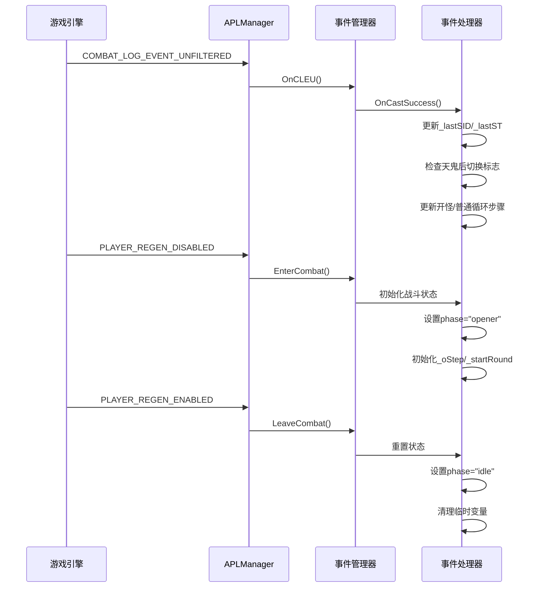

**图表来源**
- [邪dk.wa.ini:350-362](file://邪dk.wa.ini#L350-L362)
- [邪dk.wa.ini:251-348](file://邪dk.wa.ini#L251-L348)

#### 事件响应机制

事件处理器采用分层处理机制：

1. **Combat Log事件**: 解析战斗日志，提取技能施放信息
2. **Miss事件**: 处理未命中的情况，调整技能序列
3. **进入战斗事件**: 初始化战斗状态和参数
4. **离开战斗事件**: 清理状态，回到空闲模式

#### 错误处理策略

事件处理器包含完善的错误处理机制：

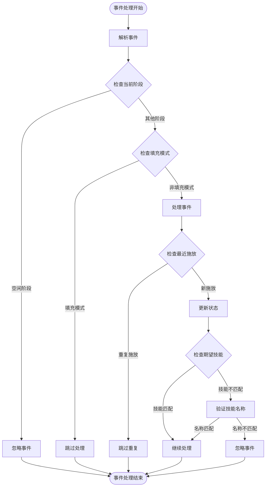

**图表来源**
- [邪dk.wa.ini:284-348](file://邪dk.wa.ini#L284-L348)

**章节来源**
- [邪dk.wa.ini:251-348](file://邪dk.wa.ini#L251-L348)

## 依赖关系分析

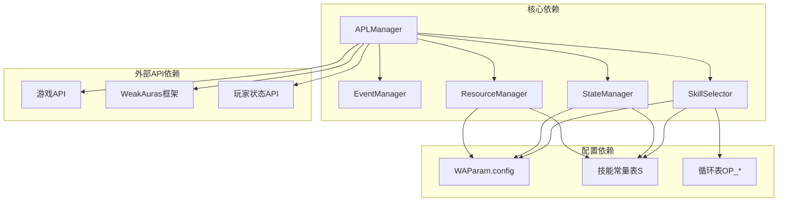

**图表来源**
- [邪dk.wa.ini:17-42](file://邪dk.wa.ini#L17-L42)
- [邪dk.wa.ini:350-362](file://邪dk.wa.ini#L350-L362)

### 组件耦合度分析

| 组件 | 内聚性 | 耦合度 | 依赖关系 |
|------|--------|--------|----------|
| APLManager | 高 | 中等 | 事件管理、技能选择、状态管理 |
| EventManager | 高 | 低 | 游戏API、状态管理 |
| SkillSelector | 高 | 中等 | 配置参数、资源管理、状态信息 |
| StateManager | 高 | 低 | 配置参数、状态变量 |
| ResourceManager | 高 | 低 | 游戏API、配置参数 |

### 循环依赖风险

该系统设计避免了循环依赖：
- APLManager作为协调中心，其他组件都依赖于它
- 各组件保持单一职责，没有相互依赖
- 通过回调和事件机制进行通信

**章节来源**
- [邪dk.wa.ini:17-42](file://邪dk.wa.ini#L17-L42)

## 性能考虑

### 时间复杂度分析

1. **技能选择**: O(1) - 固定的优先级检查序列
2. **状态转换**: O(1) - 基于条件判断的状态转移
3. **资源检查**: O(1) - 直接的API调用和比较操作
4. **事件处理**: O(1) - 单次事件的线性处理

### 空间复杂度分析

- **状态变量**: O(1) - 固定数量的状态变量
- **技能表**: O(n) - n为技能序列长度，通常较小
- **循环表**: O(m) - m为不同循环组合的数量，固定为常数

### 优化策略

1. **缓存机制**: 缓存常用的API调用结果
2. **早期退出**: 在满足条件时立即返回，避免不必要的计算
3. **批量处理**: 合并相似的检查操作
4. **延迟初始化**: 按需初始化昂贵的计算资源

## 故障排除指南

### 常见问题诊断

#### 问题1: 技能选择错误
**症状**: 角色执行了错误的技能序列
**可能原因**:
- 状态变量未正确更新
- 冷却时间检查失败
- 形态切换时机不当

**解决方案**:
1. 检查EnterCombat()是否正确初始化状态
2. 验证IsCD()函数的冷却时间计算
3. 确认形态切换逻辑的触发条件

#### 问题2: 战斗状态异常
**症状**: 角色无法从空闲状态进入战斗
**可能原因**:
- 事件监听器未正确注册
- EnterCombat()函数未被调用
- 战斗检测逻辑错误

**解决方案**:
1. 确认APLManager是否正确注册了所有事件
2. 检查PLAYER_REGEN_DISABLED事件处理
3. 验证IsEncounterInProgress()的返回值

#### 问题3: 资源管理失效
**症状**: 符文能量显示不正确或技能释放时机错误
**可能原因**:
- GetRP()函数返回错误值
- 冷却时间计算包含队列窗口误差
- 资源阈值设置不当

**解决方案**:
1. 检查UnitPower() API调用
2. 验证VF_getSpellCD()与队列窗口的结合
3. 调整资源阈值以适应不同服务器

### 调试技巧

1. **状态监控**: 定期打印关键状态变量的值
2. **事件追踪**: 记录重要的事件发生时间和处理结果
3. **性能分析**: 监控技能选择的执行时间
4. **日志记录**: 详细记录决策过程和条件判断

**章节来源**
- [邪dk.wa.ini:251-348](file://邪dk.wa.ini#L251-L348)
- [邪dk.wa.ini:364-575](file://邪dk.wa.ini#L364-L575)

## 结论

这个死亡骑士自动战斗脚本展现了优秀的软件工程实践：

### 设计优势

1. **模块化设计**: 清晰的职责分离，便于维护和扩展
2. **事件驱动架构**: 响应式的事件处理机制
3. **状态机管理**: 明确的状态转换逻辑
4. **优先级算法**: 合理的技能选择策略

### 技术亮点

1. **多阶段战斗策略**: 针对不同战斗场景的优化
2. **资源智能管理**: 平衡输出和生存能力
3. **形态切换优化**: 根据战斗需求动态调整
4. **爆发期优化**: 充分利用战斗窗口期

### 改进建议

1. **配置化**: 将更多参数配置化，提高灵活性
2. **日志系统**: 增强调试和监控能力
3. **单元测试**: 添加自动化测试用例
4. **性能监控**: 实现运行时性能分析

该脚本为魔兽世界死亡骑士的自动化战斗提供了完整而高效的解决方案，体现了现代游戏脚本开发的最佳实践。