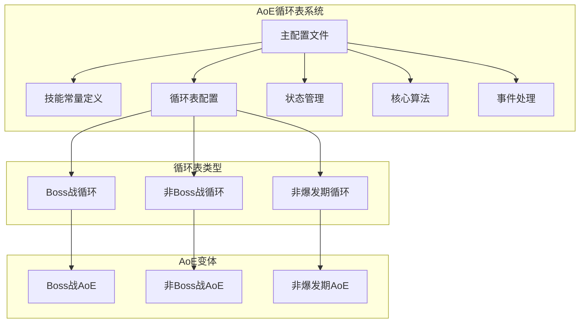
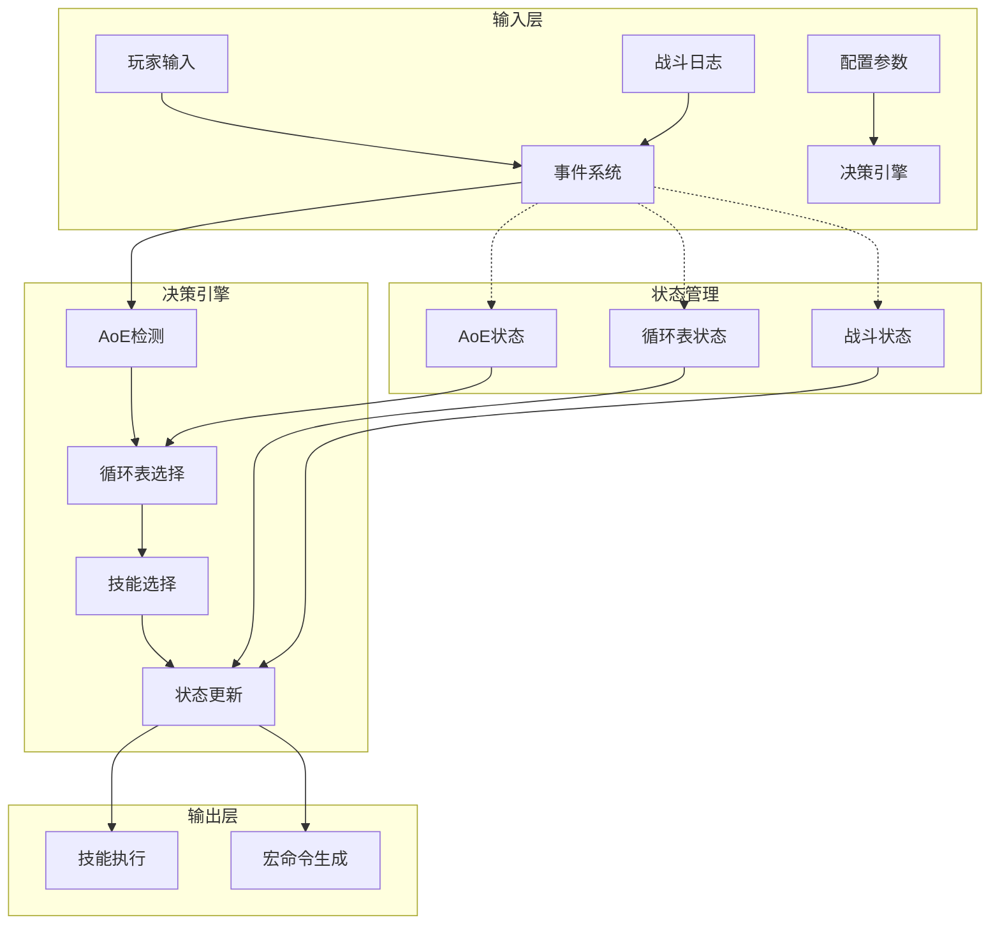
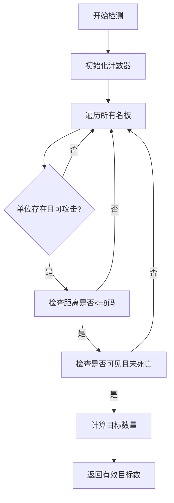
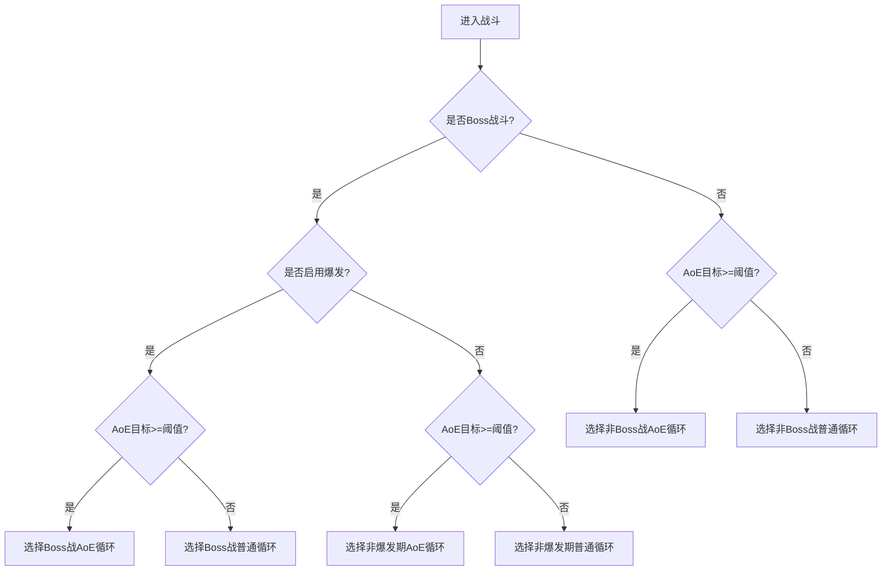
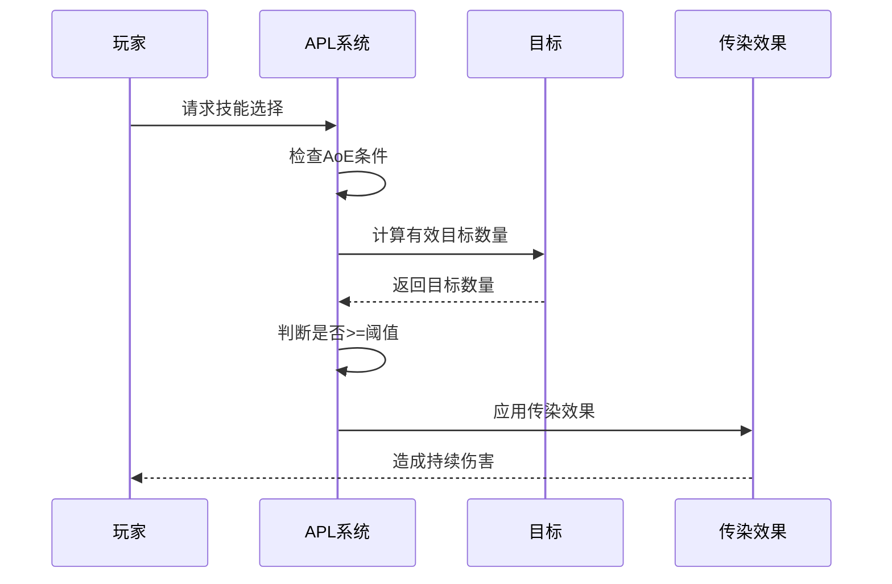
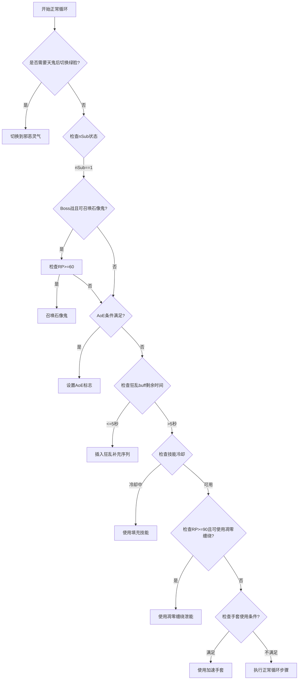
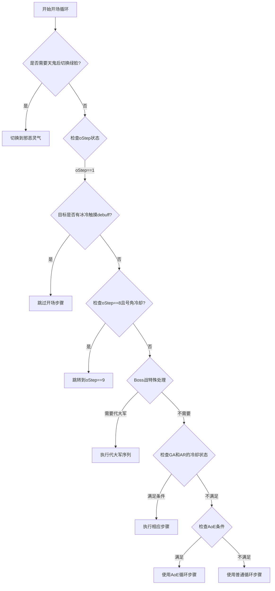
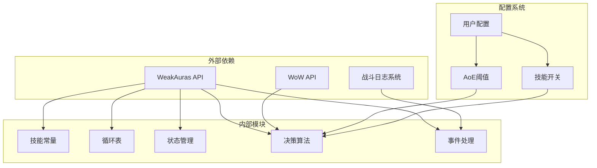
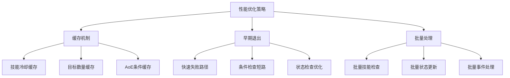

# AoE循环表

<cite>
**本文档引用的文件**
- [邪dk.wa.ini](file://邪dk.wa.ini)
</cite>

## 目录
1. [简介](#简介)
2. [项目结构](#项目结构)
3. [核心组件](#核心组件)
4. [架构概览](#架构概览)
5. [详细组件分析](#详细组件分析)
6. [依赖关系分析](#依赖关系分析)
7. [性能考虑](#性能考虑)
8. [故障排除指南](#故障排除指南)
9. [结论](#结论)
10. [附录](#附录)

## 简介

本文档深入解析魔兽世界巫妖王时代（Wrath of the Lich King）版本中邪DK的AoE循环表系统。该系统实现了三种主要的AoE循环模式：OP_NONBOSS_AOE（非Boss战AoE循环）、OP_BOSS_AOE（Boss战AoE循环）和OP_NOBURST_AOE（非爆发期AoE循环）。文档详细解释了AoE检测机制、循环表选择算法、AoE循环表与单目标循环表的区别，以及关键技能组合的使用时机和策略。

该代码库基于WeakAuras环境，提供了完整的AoE循环表实现，包括技能常量定义、状态管理、循环表配置和智能决策逻辑。

## 项目结构

该项目采用单一配置文件结构，所有AoE循环表逻辑都集中在同一个`.ini`文件中：

**图表来源**
- [邪dk.wa.ini:85-181](file://邪dk.wa.ini#L85-L181)

**章节来源**
- [邪dk.wa.ini:1-599](file://邪dk.wa.ini#L1-L599)

## 核心组件

### 技能常量定义

系统首先定义了所有相关技能的常量，包括：
- 基础攻击技能：冰冷触摸、暗影打击、鲜血打击、天灾打击
- 辅助技能：血液沸腾、枯萎凋零、凋零缠绕、寒冬号角
- 召唤技能：召唤石像鬼、亡者大军
- 被动技能：白骨之盾、活力分流、食尸鬼狂乱
- 特殊技能：传染、鲜血灵气、邪恶灵气、亡者复生
- 装备技能：加速手套（物品）

这些常量通过`GetSpellInfo`函数获取，并存储在全局表`S`中，便于后续引用。

**章节来源**
- [邪dk.wa.ini:21-42](file://邪dk.wa.ini#L21-L42)

### 循环表配置

系统定义了六种主要的循环表类型：

1. **Boss战循环表**：包含完整的爆发序列
2. **非Boss战循环表**：简化的基础循环
3. **非爆发期循环表**：包含食尸鬼狂乱和活力分流
4. **Boss战AoE循环表**：在Boss战中使用AoE技能
5. **非Boss战AoE循环表**：在非Boss战中使用AoE技能
6. **非爆发期AoE循环表**：在非爆发期使用AoE技能

每种循环表都是由`mks`函数创建的步骤数组，每个步骤包含技能ID、显示名称和注释信息。

**章节来源**
- [邪dk.wa.ini:86-181](file://邪dk.wa.ini#L86-L181)

### 状态管理系统

系统维护多个全局状态变量来跟踪当前战斗阶段和条件：

- `phase`: 当前阶段（idle/opener/normal）
- `_isBoss`: 是否为Boss战斗
- `_roundAOE`: 当前是否使用AoE循环
- `_needSwitchToUnholyAfterGA`: 天鬼后切换绿脸的标志
- `_bombsUsed`: 炸弹是否已使用
- `oStep`: 开场循环步骤计数器
- `nRound/nSub`: 正常循环的轮次和子步骤

**章节来源**
- [邪dk.wa.ini:44-52](file://邪dk.wa.ini#L44-L52)

## 架构概览

**图表来源**
- [邪dk.wa.ini:251-362](file://邪dk.wa.ini#L251-L362)

系统采用分层架构设计，从输入事件到最终技能执行形成了清晰的处理流程。

## 详细组件分析

### AoE检测机制

AoE检测机制通过`PestInfo()`函数实现，该函数扫描当前屏幕上的敌对单位，计算有效目标数量：

**图表来源**
- [邪dk.wa.ini:62-76](file://邪dk.wa.ini#L62-L76)

检测逻辑的关键特点：
- 使用`WeakAuras.CheckRange`进行精确的距离检测
- 过滤掉重复的目标（通过GUID去重）
- 自动排除玩家自身
- 返回值减1以排除玩家自身

**章节来源**
- [邪dk.wa.ini:62-76](file://邪dk.wa.ini#L62-L76)

### 循环表选择算法

循环表选择算法根据战斗类型和AoE条件动态决定使用哪种循环表：

**图表来源**
- [邪dk.wa.ini:263-275](file://邪dk.wa.ini#L263-L275)

选择算法的核心逻辑：
- Boss战优先考虑爆发期和AoE使用
- 非Boss战使用更保守的AoE阈值（默认2个目标）
- 非爆发期循环包含食尸鬼狂乱和活力分流
- AoE循环使用传染技能替代部分基础攻击

**章节来源**
- [邪dk.wa.ini:263-275](file://邪dk.wa.ini#L263-L275)

### AoE循环表与单目标循环表的区别

#### 技能优先级差异

| 技能 | 单目标循环 | AoE循环 | 差异说明 |
|------|------------|---------|----------|
| 基础攻击 | 冰冷触摸/暗影打击/鲜血打击 | 冰冷触摸/暗影打击/传染 | AoE循环用传染替代鲜血打击 |
| 中期技能 | 天灾打击/鲜血打击 | 天灾打击/鲜血打击 | 基本保持一致 |
| 爆发技能 | 寒冬号角/召唤石像鬼 | 寒冬号角/召唤石像鬼 | 基本保持一致 |
| 结束技能 | 血液沸腾/鲜血灵气 | 枯萎凋零/鲜血灵气 | 结束阶段用枯萎凋零替代血液沸腾 |

#### AoE阈值设置

系统支持灵活的AoE阈值配置：
- Boss战默认AoE阈值：2个目标
- 非Boss战默认AoE阈值：2个目标
- 可通过配置参数调整阈值大小

#### 资源管理策略

AoE循环表在资源管理方面有以下特点：
- AoE循环中使用枯萎凋零作为泄能手段
- 传染技能提供额外的伤害输出
- 爆发期使用手套增强伤害
- 非爆发期包含食尸鬼狂乱和活力分流

**章节来源**
- [邪dk.wa.ini:150-181](file://邪dk.wa.ini#L150-L181)

### 关键技能组合分析

#### 传染技能使用时机

传染技能在AoE循环中扮演重要角色，其使用时机经过精心设计：

**图表来源**
- [邪dk.wa.ini:120](file://邪dk.wa.ini#L120)

#### 枯萎凋零的使用策略

枯萎凋零在AoE循环中用于：
- AoE循环结束阶段的爆发输出
- 泄能机制的重要组成部分
- 提供稳定的伤害输出

#### 食尸鬼狂乱的集成

食尸鬼狂乱在非爆发期循环中：
- 作为主要的爆发技能
- 与活力分流配合使用
- 在特定轮次中自动补充

**章节来源**
- [邪dk.wa.ini:116-181](file://邪dk.wa.ini#L116-L181)

### 核心算法实现

#### GetNormal()函数分析

`GetNormal()`函数实现了正常战斗阶段的技能选择逻辑：

**图表来源**
- [邪dk.wa.ini:379-455](file://邪dk.wa.ini#L379-L455)

#### GetOpener()函数分析

开场循环函数负责战斗开始阶段的技能序列：

**图表来源**
- [邪dk.wa.ini:457-544](file://邪dk.wa.ini#L457-L544)

**章节来源**
- [邪dk.wa.ini:379-544](file://邪dk.wa.ini#L379-L544)

## 依赖关系分析

**图表来源**
- [邪dk.wa.ini:17-18](file://邪dk.wa.ini#L17-L18)

系统的主要依赖关系：
- 强依赖WeakAuras环境提供的API函数
- 依赖WoW标准API进行游戏状态查询
- 依赖战斗日志系统进行事件监听
- 依赖用户配置参数进行行为调整

**章节来源**
- [邪dk.wa.ini:17-18](file://邪dk.wa.ini#L17-L18)

## 性能考虑

### 内存使用优化

系统采用紧凑的数据结构设计：
- 所有循环表使用固定长度数组，减少内存碎片
- 技能常量使用全局表共享，避免重复分配
- 状态变量集中管理，便于垃圾回收

### 计算效率优化

关键优化点：
- 技能冷却状态缓存，避免重复查询
- 目标数量计算结果缓存
- AoE条件判断结果缓存
- 早期退出机制减少不必要的计算

### 网络延迟处理

系统通过以下方式处理网络延迟：
- 使用SpellQueueWindow参数考虑技能排队延迟
- 实现事件驱动的状态更新机制
- 提供容错处理防止重复施法

## 故障排除指南

### 常见问题诊断

#### AoE循环不触发

**可能原因**：
- AoE阈值设置过高
- 目标数量检测失败
- 配置参数未正确设置

**解决方法**：
- 检查`WAParam.config.pestilenceTargets`配置
- 验证`PestInfo()`函数返回值
- 确认AoE功能已启用

#### 技能顺序错误

**可能原因**：
- 循环表索引错误
- 状态变量同步问题
- 事件处理延迟

**解决方法**：
- 检查循环表定义的步骤顺序
- 验证状态变量更新逻辑
- 查看事件处理函数的执行顺序

#### 资源管理异常

**可能原因**：
- RP计算错误
- 技能冷却状态不准确
- 泄能机制失效

**解决方法**：
- 验证`GetRP()`函数的实现
- 检查技能冷却检测逻辑
- 确认泄能阈值设置合理

**章节来源**
- [邪dk.wa.ini:284-348](file://邪dk.wa.ini#L284-L348)

### 调试技巧

#### 日志记录

系统提供了详细的调试信息输出：
- 每个技能选择都有对应的注释标识
- 状态变化时会记录相关信息
- 错误情况会有明确的提示信息

#### 性能监控

建议使用以下方法监控性能：
- 监控循环表选择频率
- 跟踪技能执行成功率
- 分析事件处理延迟

## 结论

该AoE循环表系统展现了高度的模块化设计和智能化决策能力。通过精心设计的AoE检测机制、灵活的循环表选择算法和高效的资源管理策略，系统能够在不同战斗环境下自动选择最优的技能组合。

系统的主要优势包括：
- **自适应性强**：能够根据战斗环境自动调整策略
- **可配置性高**：支持多种参数调整以适应不同需求
- **性能优化好**：采用多种优化技术确保流畅运行
- **易于维护**：清晰的代码结构和完善的注释

未来可以考虑的改进方向：
- 增加更多战斗场景的支持
- 优化AoE阈值的动态调整机制
- 扩展到其他职业的AoE循环支持

## 附录

### 配置参数说明

| 参数名 | 默认值 | 说明 |
|--------|--------|------|
| `usePestilence` | true | 是否启用AoE功能 |
| `autoBossBurst` | true | Boss战是否自动爆发 |
| `useGlovesAuto` | true | 是否自动使用加速手套 |
| `useDeathCoil` | true | 是否使用凋零缠绕泄能 |
| `useSpeedPotion` | false | 是否使用速度药水 |
| `pestilenceTargets` | 2 | AoE使用的最小目标数 |

### 技能优先级表

| 优先级 | 技能 | 用途 |
|--------|------|------|
| 1 | 邪恶灵气 | 形态切换 |
| 2 | 召唤石像鬼 | 爆发期核心技能 |
| 3 | 枯萎凋零 | AoE爆发和泄能 |
| 4 | 传染 | AoE伤害输出 |
| 5 | 食尸鬼狂乱 | 非爆发期爆发 |
| 6 | 活力分流 | 资源补充 |

### 使用示例

要修改AoE循环表，可以通过以下方式进行：

1. **调整AoE阈值**：修改`WAParam.config.pestilenceTargets`
2. **添加新技能**：在相应的循环表中添加新的步骤
3. **修改技能顺序**：调整循环表中步骤的排列顺序
4. **自定义条件**：扩展条件检查逻辑以适应特殊需求