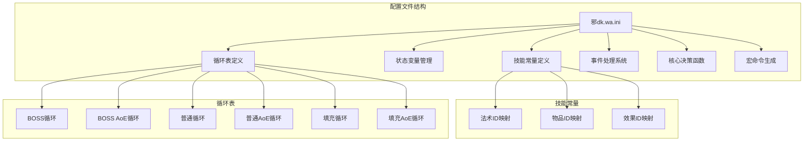
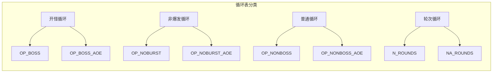
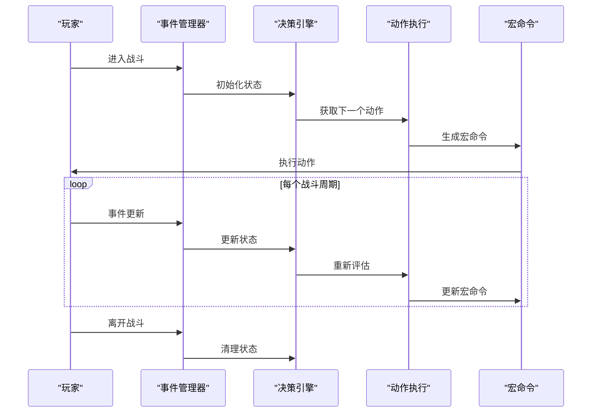
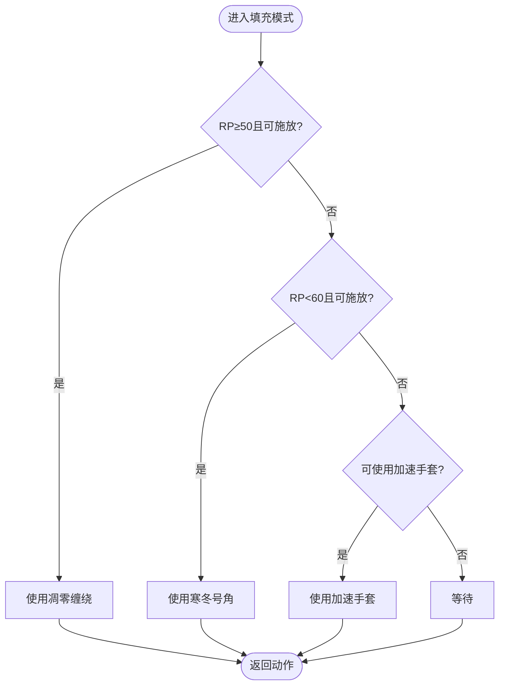
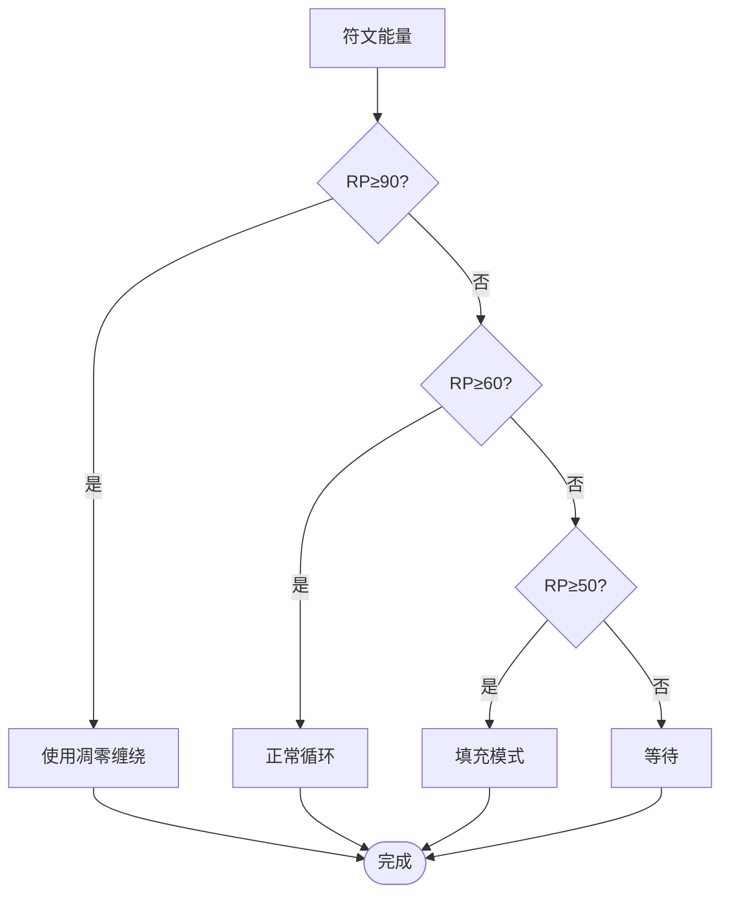
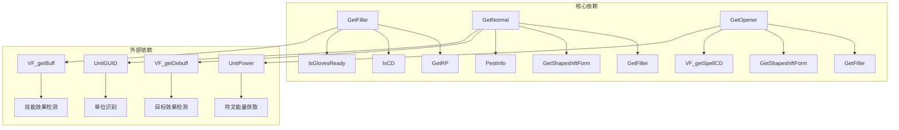

# 填充技能表

<cite>
**本文档引用的文件**
- [邪dk.wa.ini](file://邪dk.wa.ini)
</cite>

## 目录
1. [简介](#简介)
2. [项目结构](#项目结构)
3. [核心组件](#核心组件)
4. [架构概览](#架构概览)
5. [详细组件分析](#详细组件分析)
6. [依赖关系分析](#依赖关系分析)
7. [性能考量](#性能考量)
8. [故障排除指南](#故障排除指南)
9. [结论](#结论)

## 简介

本文档深入解析魔兽世界巫妖王之怒版本中邪DK的填充技能表系统。该系统实现了两种核心循环模式：OP_NOBURST（非爆发期开怪循环）和OP_NOBURST_AOE（非爆发期AoE开怪循环）。填充技能表作为主循环的核心组成部分，负责在技能冷却期间提供最优的替代动作，确保资源效率最大化和伤害输出持续性。

该配置文件采用Lua语言编写，集成了WeakAuras的APL（Action Priority List）系统，通过智能的状态管理和动态决策机制，实现了高度优化的战斗循环。系统特别针对泰坦时光服服务器进行了专门优化，包括AOE阈值调整和泄能阈值优化。

## 项目结构

该项目是一个单一的配置文件，包含了完整的APL系统实现：



**图表来源**
- [邪dk.wa.ini:21-42](file://邪dk.wa.ini#L21-L42)
- [邪dk.wa.ini:85-181](file://邪dk.wa.ini#L85-L181)

**章节来源**
- [邪dk.wa.ini:1-603](file://邪dk.wa.ini#L1-L603)

## 核心组件

### 技能常量系统

系统定义了完整的技能常量映射，包括所有主要法术、物品和效果的ID映射：

- **法术常量**：冰冷触摸、暗影打击、鲜血打击、天灾打击、血液沸腾、枯萎凋零、凋零缠绕、寒冬号角、召唤石像鬼、符文武器增效、亡者大军、白骨之盾、活力分流、食尸鬼狂乱、传染、鲜血灵气、邪恶灵气、亡者复生
- **物品常量**：加速手套（ID: -112）
- **效果常量**：冰冷触摸debuff效果ID

这些常量为整个APL系统的决策提供了基础数据支撑。

**章节来源**
- [邪dk.wa.ini:21-42](file://邪dk.wa.ini#L21-L42)

### 状态管理系统

系统维护了复杂的状态变量来跟踪战斗进程：

- **阶段控制**：idle（空闲）、opener（开怪）、normal（常规）
- **循环计数**：oStep（开怪步骤）、nRound（常规轮次）、nSub（轮次子步骤）
- **战斗状态**：_isBoss（是否为BOSS战）、_roundAOE（AOE状态）、_armyReplace（大军替换）
- **特殊标记**：_needSwitchToUnholyAfterGA（天鬼后切换标记）、_bombsUsed（炸弹使用标记）

**章节来源**
- [邪dk.wa.ini:44-52](file://邪dk.wa.ini#L44-L52)

### 循环表系统

系统定义了六种核心循环表，每种都有对应的单目标和AoE变体：



**图表来源**
- [邪dk.wa.ini:85-181](file://邪dk.wa.ini#L85-L181)

**章节来源**
- [邪dk.wa.ini:85-181](file://邪dk.wa.ini#L85-L181)

## 架构概览

APL系统采用分层架构设计，实现了清晰的关注点分离：



**图表来源**
- [邪dk.wa.ini:350-362](file://邪dk.wa.ini#L350-L362)
- [邪dk.wa.ini:549-572](file://邪dk.wa.ini#L549-L572)

系统的核心流程包括：

1. **事件监听**：监控战斗日志和玩家状态变化
2. **状态管理**：维护复杂的战斗状态和循环计数
3. **决策制定**：根据当前状态选择最优动作
4. **动作执行**：生成相应的宏命令或直接执行

**章节来源**
- [邪dk.wa.ini:350-362](file://邪dk.wa.ini#L350-L362)
- [邪dk.wa.ini:549-572](file://邪dk.wa.ini#L549-L572)

## 详细组件分析

### 填充技能表核心算法

填充技能表（GetFiller函数）实现了智能的空窗期动作选择：



**图表来源**
- [邪dk.wa.ini:365-377](file://邪dk.wa.ini#L365-L377)

填充算法的关键特性：

1. **优先级排序**：凋零缠绕 > 寒冬号角 > 加速手套 > 等待
2. **资源管理**：基于符文能量阈值进行决策
3. **时机判断**：避免在爆发期使用加速手套
4. **冷却检测**：智能检测技能冷却状态

**章节来源**
- [邪dk.wa.ini:365-377](file://邪dk.wa.ini#L365-L377)

### 非爆发期循环表（OP_NOBURST）

OP_NOBURST定义了标准的非爆发期开怪循环：

| 步骤 | 动作 | 说明 |
|------|------|------|
| 1 | 冰冷触摸 | 开怪第一击 |
| 2 | 暗影打击 | 连续攻击 |
| 3 | 食尸鬼狂乱 | 增加爆发潜力 |
| 4 | 鲜血打击 | 建立连击 |
| 5 | 活力分流 | 补充爆发能力 |
| 6 | 天灾打击 | 强力输出 |
| 7 | 鲜血打击 | 维持连击 |
| 8 | 寒冬号角 | 提供团队增益 |
| 9 | 凋零缠绕 | 空窗期动作 |
| 10 | 枯萎凋零 | 主要伤害技能 |

**章节来源**
- [邪dk.wa.ini:158-169](file://邪dk.wa.ini#L158-L169)

### 非爆发期AoE循环表（OP_NOBURST_AOE）

OP_NOBURST_AOE针对多目标战斗进行了优化：

| 步骤 | 动作 | 说明 |
|------|------|------|
| 1 | 冰冷触摸 | 开怪第一击 |
| 2 | 暗影打击 | 连续攻击 |
| 3 | 食尸鬼狂乱 | 增加爆发潜力 |
| 4 | 传染 | AoE伤害技能 |
| 5 | 活力分流 | 补充爆发能力 |
| 6 | 天灾打击 | 强力输出 |
| 7 | 鲜血打击 | 维持连击 |
| 8 | 寒冬号角 | 提供团队增益 |
| 9 | 凋零缠绕 | 空窗期动作 |
| 10 | 枯萎凋零 | 主要伤害技能 |

**章节来源**
- [邪dk.wa.ini:170-181](file://邪dk.wa.ini#L170-L181)

### 关键技能组合分析

#### 凋零缠绕（Death Coil）使用策略

凋零缠绕在填充技能表中扮演双重角色：

1. **空窗期填充**：当RP≥50且技能可用时优先使用
2. **泄能机制**：当RP≥90时用于消耗多余符文能量
3. **冷却管理**：避免在关键时刻被冷却限制

#### 寒冬号角（Howling Blast）使用策略

寒冬号角主要用于：
- **空窗期维持**：当RP<60时提供稳定的输出
- **团队增益**：为团队提供伤害加成
- **资源管理**：帮助维持符文能量平衡

#### 加速手套（Gloves）使用策略

加速手套的使用时机非常关键：
- **避免爆发期使用**：在OP_BOSS循环中避免使用
- **空窗期补充**：在填充模式下提供额外伤害
- **时机优化**：仅在特定距离和条件下使用

**章节来源**
- [邪dk.wa.ini:365-377](file://邪dk.wa.ini#L365-L377)
- [邪dk.wa.ini:436-447](file://邪dk.wa.ini#L436-L447)

### 资源管理策略

系统实现了多层次的资源管理机制：



**图表来源**
- [邪dk.wa.ini:365-377](file://邪dk.wa.ini#L365-L377)

**章节来源**
- [邪dk.wa.ini:365-377](file://邪dk.wa.ini#L365-L377)

## 依赖关系分析

APL系统内部存在复杂的依赖关系：



**图表来源**
- [邪dk.wa.ini:54-60](file://邪dk.wa.ini#L54-L60)
- [邪dk.wa.ini:365-377](file://邪dk.wa.ini#L365-L377)

**章节来源**
- [邪dk.wa.ini:54-60](file://邪dk.wa.ini#L54-L60)
- [邪dk.wa.ini:365-377](file://邪dk.wa.ini#L365-L377)

## 性能考量

### 冷却检测优化

系统采用了高效的冷却检测机制：

- **SpellQueueWindow集成**：利用游戏内置的冷却窗口参数
- **CD计算优化**：通过相对时间差减少计算开销
- **缓存机制**：避免重复的技能状态查询

### 决策树优化

决策算法经过精心优化以提高响应速度：

- **短路求值**：优先检查最可能的条件分支
- **状态缓存**：避免重复的状态计算
- **条件简化**：合并相似的检查逻辑

### 内存使用优化

系统在内存使用方面也进行了优化：

- **局部变量**：大量使用局部变量减少全局查找
- **表结构**：使用紧凑的数据结构存储循环信息
- **字符串处理**：最小化字符串操作和分配

## 故障排除指南

### 常见问题诊断

#### 循环卡顿问题

**症状**：APL在某些情况下出现延迟或卡顿

**可能原因**：
1. 冷却检测过于频繁
2. 宏命令生成过程阻塞
3. 事件处理冲突

**解决方案**：
- 检查SpellQueueWindow设置
- 简化宏命令结构
- 验证事件注册状态

#### 技能选择错误

**症状**：APL选择了不合适的技能

**可能原因**：
1. 状态变量同步问题
2. 条件判断逻辑错误
3. 技能ID映射错误

**解决方案**：
- 检查状态变量初始化
- 验证条件判断逻辑
- 确认技能ID正确性

#### 资源管理异常

**症状**：符文能量管理不当

**可能原因**：
1. RP计算错误
2. 冷却检测失效
3. 阈值设置不当

**解决方案**：
- 验证RP获取函数
- 检查冷却检测逻辑
- 调整资源阈值

**章节来源**
- [邪dk.wa.ini:284-348](file://邪dk.wa.ini#L284-L348)

### 调试技巧

#### 日志记录

建议添加详细的日志记录来跟踪APL行为：

```lua
-- 示例：添加调试输出
if WAParam.config.debugMode then
    print("Debug: Phase =", phase, "Step =", oStep, "RP =", GetRP())
end
```

#### 性能分析

使用以下方法分析APL性能：

1. **事件频率监控**：跟踪事件处理频率
2. **决策时间测量**：测量决策函数执行时间
3. **内存使用跟踪**：监控内存分配情况

#### 配置验证

定期验证配置设置的有效性：

1. **技能ID验证**：确认所有技能ID正确
2. **阈值测试**：验证资源阈值设置
3. **循环完整性**：检查循环表完整性

## 结论

该填充技能表系统展现了高级APL设计的最佳实践。通过精心设计的状态管理、智能的决策算法和高效的资源管理，实现了在复杂战斗环境中的最优表现。

系统的主要优势包括：

1. **模块化设计**：清晰的功能分离便于维护和扩展
2. **智能决策**：基于实时状态的动态决策机制
3. **性能优化**：高效的算法实现和内存管理
4. **灵活性**：支持多种战斗场景和配置选项

对于开发者而言，该系统提供了优秀的参考模型，展示了如何在实际游戏中实现复杂的AI决策系统。对于用户而言，该系统提供了稳定可靠的自动化战斗体验，显著提升了游戏效率和可玩性。