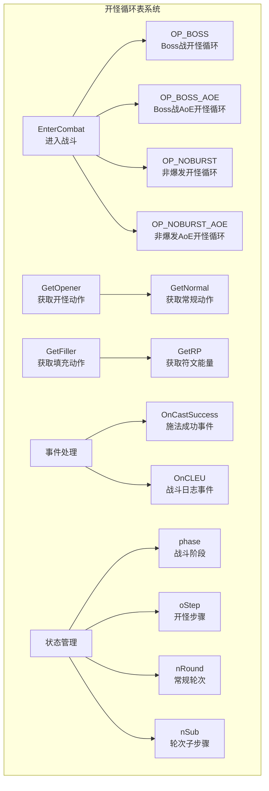
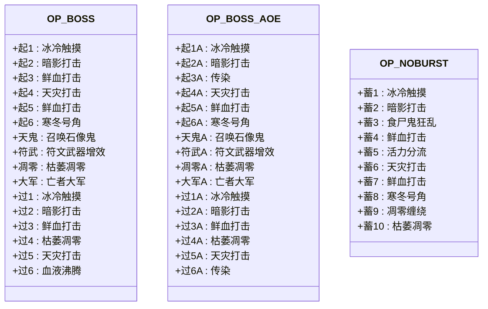
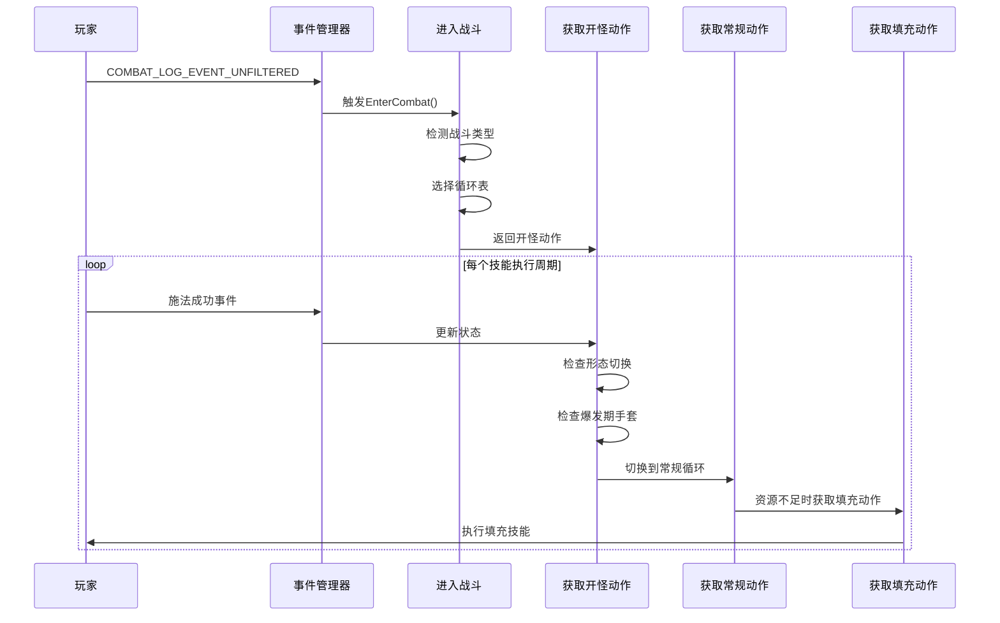
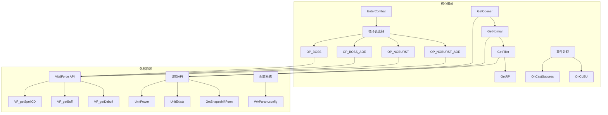

# 开怪循环表

<cite>
**本文档引用的文件**
- [邪dk.wa.ini](file://邪dk.wa.ini)
</cite>

## 目录
1. [简介](#简介)
2. [项目结构](#项目结构)
3. [核心组件](#核心组件)
4. [架构概览](#架构概览)
5. [详细组件分析](#详细组件分析)
6. [依赖关系分析](#依赖关系分析)
7. [性能考量](#性能考量)
8. [故障排除指南](#故障排除指南)
9. [结论](#结论)

## 简介

本文档深入解析魔兽世界巫妖王之怒版本中邪DK的开怪循环表系统。该系统实现了两种核心的开怪循环表：OP_BOSS（Boss战开怪循环）和OP_BOSS_AOE（Boss战AoE开怪循环），为玩家提供了智能化的战斗策略执行框架。

该开怪循环表系统具有以下特点：
- **智能识别战斗类型**：自动区分Boss战和普通怪物战斗
- **动态循环切换**：根据战斗状态和资源情况动态调整技能序列
- **爆发期优化**：针对不同战斗阶段提供最优的技能执行时机
- **形态切换逻辑**：智能管理邪脸、红脸和绿脸之间的形态转换
- **资源管理**：精确控制符文能量、鲜血和死亡符文的使用

## 项目结构

整个开怪循环表系统采用模块化设计，主要包含以下核心部分：

**图表来源**
- [邪dk.wa.ini:252-282](file://邪dk.wa.ini#L252-L282)
- [邪dk.wa.ini:85-181](file://邪dk.wa.ini#L85-L181)

**章节来源**
- [邪dk.wa.ini:1-606](file://邪dk.wa.ini#L1-L606)

## 核心组件

### 技能常量定义

系统首先定义了所有相关技能的常量，包括：
- **基础攻击技能**：冰冷触摸、暗影打击、鲜血打击、天灾打击
- **爆发技能**：血液沸腾、枯萎凋零、凋零缠绕
- **辅助技能**：寒冬号角、召唤石像鬼、符文武器增效、亡者大军
- **形态技能**：白骨之盾、活力分流、食尸鬼狂乱
- **灵气技能**：鲜血灵气、邪恶灵气

### 循环表结构

系统实现了多种循环表以适应不同的战斗场景：

**图表来源**
- [邪dk.wa.ini:90-181](file://邪dk.wa.ini#L90-L181)

**章节来源**
- [邪dk.wa.ini:21-42](file://邪dk.wa.ini#L21-L42)
- [邪dk.wa.ini:90-181](file://邪dk.wa.ini#L90-L181)

## 架构概览

开怪循环表系统采用事件驱动的架构模式，通过战斗事件和状态变化来驱动技能执行决策。

**图表来源**
- [邪dk.wa.ini:350-362](file://邪dk.wa.ini#L350-L362)
- [邪dk.wa.ini:252-282](file://邪dk.wa.ini#L252-L282)
- [邪dk.wa.ini:457-551](file://邪dk.wa.ini#L457-L551)

## 详细组件分析

### OP_BOSS（Boss战开怪循环）

OP_BOSS是专为Boss战设计的开怪循环表，具有以下特征：

#### 触发条件
- Boss战识别：通过`IsEncounterInProgress()`或休息状态下目标等级为-1来判断
- 自动爆发：当启用`autoBossBurst`配置时，使用OP_BOSS循环
- AoE条件：当目标数量≥2且启用`usePestilence`时，自动切换到OP_BOSS_AOE

#### 执行顺序
1. **起始阶段**：冰冷触摸 → 暗影打击 → 鲜血打击 → 天灾打击 → 鲜血打击 → 寒冬号角
2. **天鬼阶段**：召唤石像鬼 → 符文武器增效 → 枯萎凋零 → 亡者大军
3. **爆发阶段**：重复执行技能序列，直到血液沸腾

#### 关键优化策略
- **食尸鬼狂乱预铺**：在战斗前预铺30秒狂乱buff，开怪时不重复使用
- **活力分流延迟**：在狂乱buff即将结束时才使用活力分流进行补充
- **手套优化**：在召唤石像鬼后、亡者大军前使用手套，让大军享受15秒急速buff

**章节来源**
- [邪dk.wa.ini:90-115](file://邪dk.wa.ini#L90-L115)
- [邪dk.wa.ini:264-271](file://邪dk.wa.ini#L264-L271)
- [邪dk.wa.ini:470-477](file://邪dk.wa.ini#L470-L477)

### OP_BOSS_AOE（Boss战AoE开怪循环）

OP_BOSS_AOE是针对多目标战斗优化的开怪循环表：

#### 触发条件
- 目标数量≥2（默认阈值）
- 启用`usePestilence`配置
- Boss战环境

#### 执行差异
- **起始阶段**：将"鲜血打击"替换为"传染"技能
- **爆发阶段**：同样将"天灾打击"替换为"传染"技能
- **形态切换**：在循环末尾使用"鲜血灵气"进行形态切换

#### 性能优势
- **AoE优化**：传染技能对多个目标造成伤害，提高整体输出效率
- **资源利用**：更好地利用多目标环境下的技能效果
- **爆发协调**：AoE循环与Boss战的爆发机制更好地协调

**章节来源**
- [邪dk.wa.ini:116-141](file://邪dk.wa.ini#L116-L141)
- [邪dk.wa.ini:263-271](file://邪dk.wa.ini#L263-L271)

### 与普通循环表的区别

#### 技能执行时机
- **普通循环表**：严格按照固定顺序执行，不考虑战斗环境变化
- **开怪循环表**：根据战斗状态动态调整技能执行顺序
- **AoE循环表**：针对多目标环境优化技能选择

#### 爆发期处理
- **普通循环表**：爆发期通常使用固定技能序列
- **开怪循环表**：爆发期通过形态切换和技能组合最大化输出
- **AoE循环表**：爆发期重点使用AoE技能提高整体伤害

#### 形态切换逻辑
- **普通循环表**：形态切换较少见
- **开怪循环表**：智能管理邪脸、红脸和绿脸之间的切换
- **AoE循环表**：根据AoE需求调整形态切换时机

**章节来源**
- [邪dk.wa.ini:142-181](file://邪dk.wa.ini#L142-L181)
- [邪dk.wa.ini:381-390](file://邪dk.wa.ini#L381-L390)

### 关键技能组合分析

#### 食尸鬼狂乱（GF）使用时机
- **预铺策略**：在战斗前预铺30秒狂乱buff，避免开怪时浪费
- **补充策略**：当狂乱buff剩余时间≤5秒时自动补充
- **避免重复**：在N4轮次中跳过，避免重复使用

#### 活力分流（BT）使用时机
- **延迟使用**：等狂乱buff快消失时再补充
- **资源管理**：避免在开怪时浪费宝贵的活力分流
- **循环优化**：与食尸鬼狂乱配合形成最佳爆发组合

#### 寒冬号角（HN）使用时机
- **空窗期填充**：在技能冷却期间使用寒冬号角
- **爆发期优化**：在合适的时机使用以获得最大收益
- **资源平衡**：平衡符文能量消耗与输出收益

**章节来源**
- [邪dk.wa.ini:93-95](file://邪dk.wa.ini#L93-L95)
- [邪dk.wa.ini:401-405](file://邪dk.wa.ini#L401-L405)
- [邪dk.wa.ini:369-371](file://邪dk.wa.ini#L369-L371)

## 依赖关系分析

开怪循环表系统具有清晰的依赖层次结构：

**图表来源**
- [邪dk.wa.ini:54-60](file://邪dk.wa.ini#L54-L60)
- [邪dk.wa.ini:252-282](file://邪dk.wa.ini#L252-L282)
- [邪dk.wa.ini:457-551](file://邪dk.wa.ini#L457-L551)

### 状态管理机制

系统通过多个状态变量来跟踪战斗进程：

| 状态变量 | 类型 | 描述 | 使用场景 |
|---------|------|------|----------|
| `phase` | 字符串 | 当前战斗阶段（idle/opener/normal） | 控制整体流程 |
| `oStep` | 数字 | 开怪步骤索引 | OP_BOSS循环进度 |
| `nRound` | 数字 | 常规循环轮次 | GetNormal循环进度 |
| `nSub` | 数字 | 轮次子步骤 | GetNormal内部进度 |
| `_isBoss` | 布尔值 | 是否为Boss战 | 循环表选择依据 |
| `_gfInsert` | 数字 | 食尸鬼狂乱插入标记 | 补充狂乱时机 |
| `_bombsUsed` | 布尔值 | 爆发期手套使用标记 | 手套使用优化 |

**章节来源**
- [邪dk.wa.ini:45-52](file://邪dk.wa.ini#L45-L52)
- [邪dk.wa.ini:252-275](file://邪dk.wa.ini#L252-L275)

## 性能考量

### 时间复杂度分析

系统的主循环采用O(1)时间复杂度，因为：
- 每个循环步骤都是固定长度的数组访问
- 条件判断仅涉及简单的数值比较和布尔运算
- 事件处理函数在每次调用时都进行快速分支判断

### 空间复杂度分析

- **循环表存储**：每个循环表占用固定大小的内存空间
- **状态变量**：使用少量局部变量存储状态信息
- **事件缓存**：通过事件队列避免重复计算

### 优化策略

#### 循环表优化
1. **预编译技能ID**：在脚本初始化时就确定所有技能ID
2. **缓存CD信息**：减少对VitalForce API的频繁调用
3. **智能状态检查**：避免不必要的状态查询

#### 内存优化
1. **循环表复用**：不同循环表共享相同的数据结构
2. **事件处理优化**：及时清理不再使用的状态变量
3. **资源池管理**：避免频繁的内存分配和释放

**章节来源**
- [邪dk.wa.ini:86-88](file://邪dk.wa.ini#L86-L88)
- [邪dk.wa.ini:54-56](file://邪dk.wa.ini#L54-L56)

## 故障排除指南

### 常见问题及解决方案

#### 问题1：技能执行顺序错误
**症状**：技能按错误顺序执行
**可能原因**：
- 循环表索引越界
- 状态变量更新失败
- 事件处理延迟

**解决方案**：
1. 检查循环表的边界条件
2. 验证状态变量的正确更新
3. 确认事件处理的及时性

#### 问题2：形态切换失败
**症状**：无法从红脸切换到绿脸
**可能原因**：
- 形态检查逻辑错误
- 技能冷却时间判断不当
- 事件响应延迟

**解决方案**：
1. 检查`GetShapeshiftForm()`的返回值
2. 验证形态切换的优先级
3. 确认切换时机的准确性

#### 问题3：爆发期手套使用不当
**症状**：手套在错误时机使用
**可能原因**：
- 爆发期判断逻辑错误
- 手套使用标记未正确更新
- 目标距离检查失败

**解决方案**：
1. 验证爆发期的判断条件
2. 检查`_bombsUsed`标记的状态
3. 确认距离和冷却条件的正确性

**章节来源**
- [邪dk.wa.ini:323-348](file://邪dk.wa.ini#L323-L348)
- [邪dk.wa.ini:470-477](file://邪dk.wa.ini#L470-L477)

### 调试方法

#### 日志记录
系统提供了丰富的调试信息输出：
- **循环步骤**：显示当前执行的技能名称和编号
- **状态变化**：记录状态变量的更新情况
- **事件处理**：追踪战斗事件的处理过程

#### 性能监控
- **执行时间**：监控每个循环步骤的执行耗时
- **内存使用**：跟踪内存分配和回收情况
- **事件频率**：统计事件处理的频率和延迟

#### 实时监控
1. **状态面板**：查看当前的循环表选择和状态变量
2. **技能冷却**：监控关键技能的冷却时间
3. **资源状态**：跟踪符文能量和形态状态

**章节来源**
- [邪dk.wa.ini:284-321](file://邪dk.wa.ini#L284-L321)
- [邪dk.wa.ini:552-575](file://邪dk.wa.ini#L552-L575)

## 结论

开怪循环表系统展现了高度智能化的战斗策略执行能力。通过精心设计的循环表结构、事件驱动的架构模式和智能的状态管理机制，该系统能够：

1. **自适应战斗环境**：根据Boss战和普通战斗的不同特点提供最优的技能执行策略
2. **优化资源利用**：精确控制技能的使用时机，最大化输出效率
3. **智能形态管理**：自动管理不同形态间的切换，确保最佳的战斗效果
4. **高效事件处理**：通过事件驱动的方式实现低延迟的技能执行

该系统的设计理念体现了现代游戏AI的核心原则：通过规则化的决策逻辑和智能化的状态管理，为玩家提供稳定可靠的自动化战斗支持。对于想要深入了解魔兽世界战斗机制或开发类似系统的开发者来说，这是一个优秀的参考案例。