# 技能循环表详解

<cite>
**本文档引用的文件**
- [邪dk.wa.ini](file://邪dk.wa.ini)
</cite>

## 目录
1. [简介](#简介)
2. [项目结构](#项目结构)
3. [核心组件](#核心组件)
4. [架构概览](#架构概览)
5. [详细组件分析](#详细组件分析)
6. [依赖关系分析](#依赖关系分析)
7. [性能考虑](#性能考虑)
8. [故障排除指南](#故障排除指南)
9. [结论](#结论)

## 简介

本文档深入解析了《魔兽世界》巫妖王之怒版本中死亡骑士的技能循环表系统。该系统实现了复杂的多阶段循环策略，包括开怪循环表、普通循环表、填充技能表和AoE循环表，为不同战斗场景提供了最优的技能执行序列。

该实现基于WeakAuras的APL（Action Priority List）系统，通过智能的状态管理和动态决策机制，实现了从开怪到战斗的无缝过渡，以及在单体和群体战斗间的自动切换。

## 项目结构

该项目采用单一配置文件的形式，包含了完整的技能循环表实现：

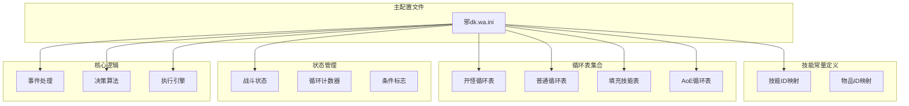

**图表来源**
- [邪dk.wa.ini:21-42](file://邪dk.wa.ini#L21-L42)
- [邪dk.wa.ini:85-250](file://邪dk.wa.ini#L85-L250)

**章节来源**
- [邪dk.wa.ini:1-606](file://邪dk.wa.ini#L1-L606)

## 核心组件

### 技能常量定义

系统首先定义了所有相关技能的ID映射，包括主要攻击技能、爆发技能、辅助技能和物品效果：

- **攻击技能**: 冰冷触摸(IC)、暗影打击(PS)、鲜血打击(BS)、天灾打击(SS)
- **爆发技能**: 血液沸腾(BB)、枯萎凋零(DN)、凋零缠绕(DC)、寒冬号角(HN)
- **召唤技能**: 召唤石像鬼(GA)、亡者大军(AR)
- **增益技能**: 符文武器增效(EW)、白骨之盾(BSH)、活力分流(BT)、食尸鬼狂乱(GF)
- **特殊技能**: 传染(PE)、鲜血灵气(BP)、邪恶灵气(UP)、亡者复生(RD)
- **物品效果**: 加速手套(GLOVES)

**章节来源**
- [邪dk.wa.ini:21-42](file://邪dk.wa.ini#L21-L42)

### 循环表集合

系统实现了四种主要类型的循环表，每种都有对应的单体和AoE变体：

#### 开怪循环表 (OP_BOSS & OP_BOSS_AOE)
- **设计理念**: 专注于战斗开始阶段的高爆发输出
- **触发条件**: 进入战斗且识别为Boss战
- **执行顺序**: 开怪技能 → 石像鬼 → 武器增效 → 群攻技能 → 大军 → 过渡阶段
- **优化策略**: 预留活力分流和食尸鬼狂乱用于战斗后期补充

#### 普通循环表 (N1-N4 & NA1-NA4)
- **设计理念**: 标准化的日常战斗循环
- **触发条件**: 普通怪物或非Boss Boss
- **执行顺序**: 固定轮次循环，每轮包含特定技能序列
- **优化策略**: 动态调整轮次以适应不同的战斗节奏

#### 填充技能表 (OP_NOBURST & OP_NOBURST_AOE)
- **设计理念**: 非爆发模式下的稳定输出
- **触发条件**: 自动爆发关闭或特定配置
- **执行顺序**: 填充技能 → 标准循环 → 爆发技能
- **优化策略**: 使用凋零缠绕进行泄能，保持资源平衡

#### AoE循环表
- **设计理念**: 群体战斗的高效输出
- **触发条件**: 目标数量达到配置阈值
- **执行顺序**: 传染技能 → 群攻技能 → 标准循环
- **优化策略**: 优先使用传染进行快速传播

**章节来源**
- [邪dk.wa.ini:85-250](file://邪dk.wa.ini#L85-L250)

## 架构概览

系统采用分层架构设计，实现了清晰的职责分离：

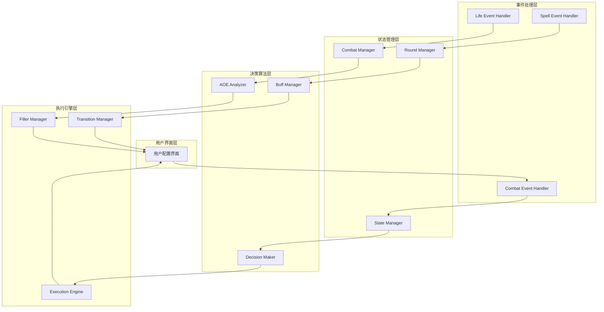

**图表来源**
- [邪dk.wa.ini:251-362](file://邪dk.wa.ini#L251-L362)
- [邪dk.wa.ini:364-575](file://邪dk.wa.ini#L364-L575)

## 详细组件分析

### 状态管理系统

系统维护了多个关键状态变量来跟踪当前的战斗阶段和执行状态：

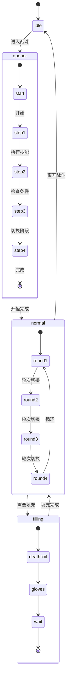

**图表来源**
- [邪dk.wa.ini:44-52](file://邪dk.wa.ini#L44-L52)
- [邪dk.wa.ini:252-282](file://邪dk.wa.ini#L252-L282)

#### 循环表选择算法

系统根据战斗类型和配置自动选择最适合的循环表：

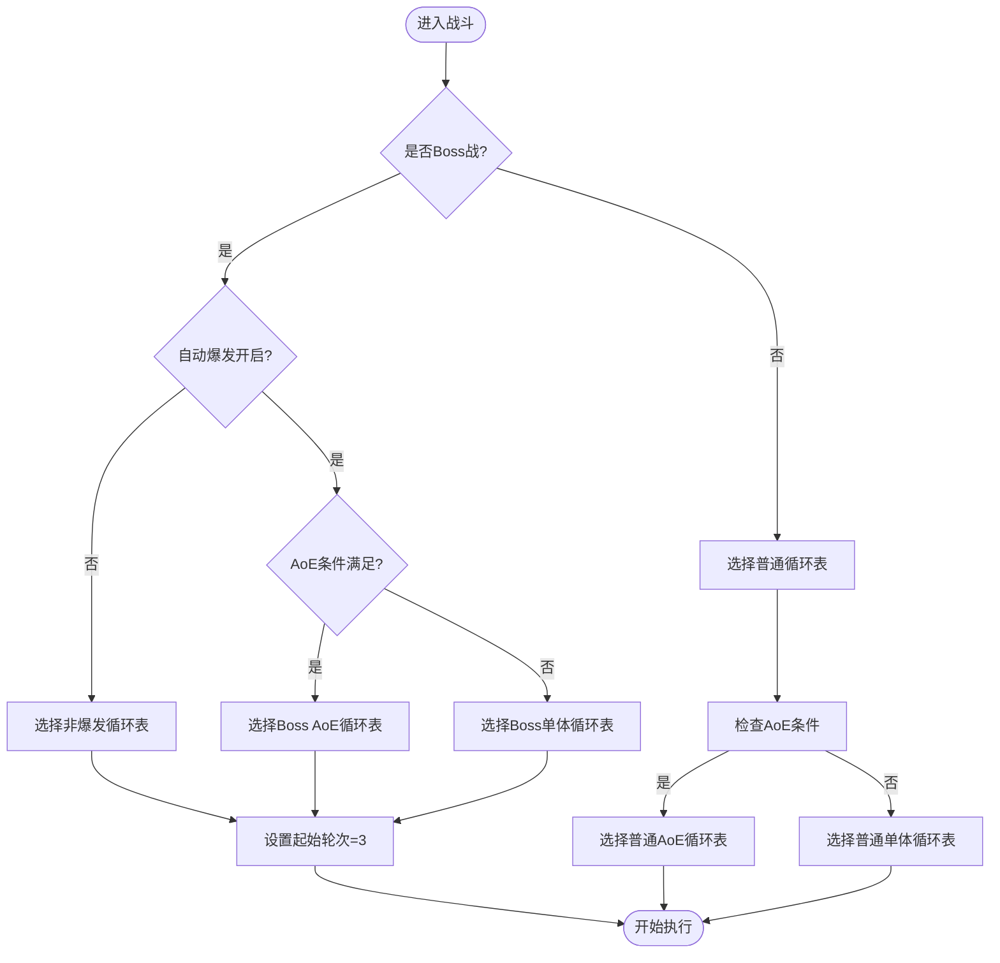

**图表来源**
- [邪dk.wa.ini:262-275](file://邪dk.wa.ini#L262-L275)

**章节来源**
- [邪dk.wa.ini:252-275](file://邪dk.wa.ini#L252-L275)

### 技能执行序列详解

#### 开怪循环表执行流程

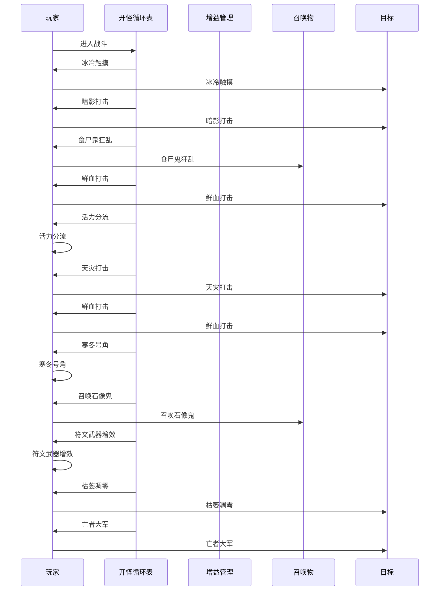

**图表来源**
- [邪dk.wa.ini:90-115](file://邪dk.wa.ini#L90-L115)
- [邪dk.wa.ini:116-141](file://邪dk.wa.ini#L116-L141)

#### 普通循环表执行流程

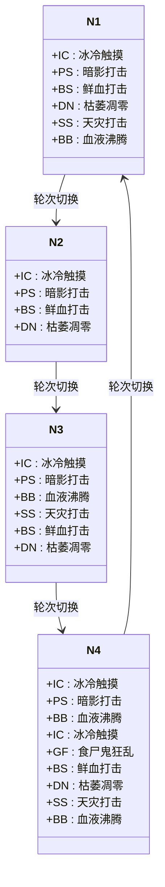

**图表来源**
- [邪dk.wa.ini:182-214](file://邪dk.wa.ini#L182-L214)

**章节来源**
- [邪dk.wa.ini:182-214](file://邪dk.wa.ini#L182-L214)

### AoE检测机制

系统实现了智能的AoE检测机制，能够根据当前环境中的敌对单位数量自动切换到AoE循环：

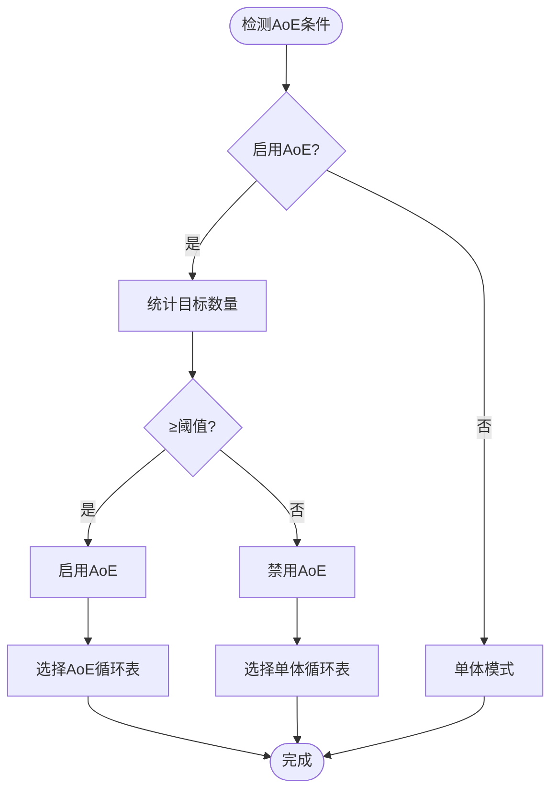

**图表来源**
- [邪dk.wa.ini:62-76](file://邪dk.wa.ini#L62-L76)
- [邪dk.wa.ini:263](file://邪dk.wa.ini#L263)

#### AoE循环表选择算法

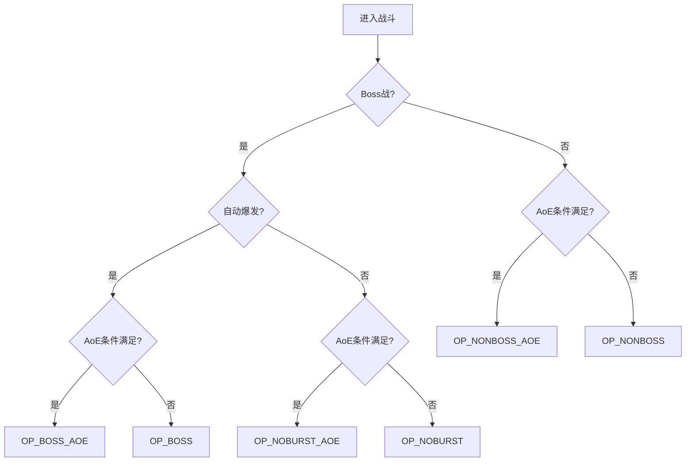

**图表来源**
- [邪dk.wa.ini:264-275](file://邪dk.wa.ini#L264-L275)

**章节来源**
- [邪dk.wa.ini:262-275](file://邪dk.wa.ini#L262-L275)

### 循环表切换逻辑

系统实现了复杂的循环表切换机制，能够在不同战斗阶段间无缝过渡：

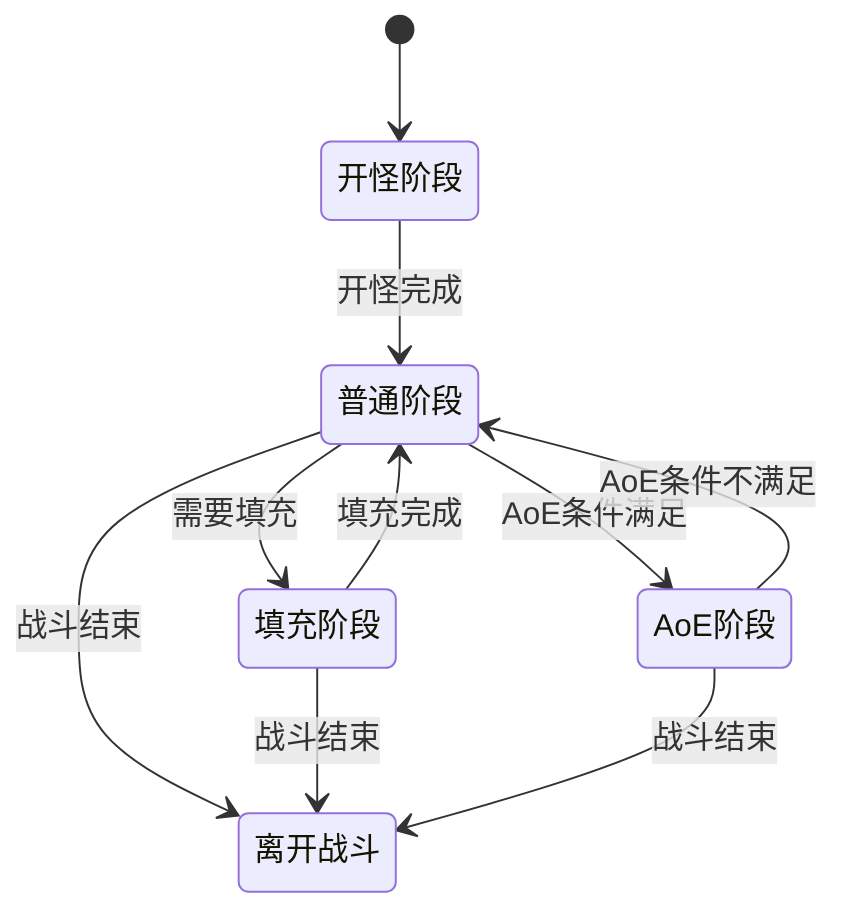

**图表来源**
- [邪dk.wa.ini:524-527](file://邪dk.wa.ini#L524-L527)
- [邪dk.wa.ini:252-282](file://邪dk.wa.ini#L252-L282)

#### 状态转换触发条件

| 触发条件 | 条件表达式 | 触发动作 |
|---------|-----------|---------|
| 进入战斗 | PLAYER_REGEN_DISABLED | 设置phase="opener" |
| 离开战斗 | PLAYER_REGEN_ENABLED | 设置phase="idle" |
| 开怪完成 | oStep > table长度 | 切换到normal阶段 |
| 需要填充 | CD冷却中且有填充技能 | 切换到filling阶段 |
| AoE条件满足 | 目标数量≥阈值 | 切换到AoE循环表 |
| 爆发期结束 | 手套使用完成 | 继续标准循环 |

**章节来源**
- [邪dk.wa.ini:354-362](file://邪dk.wa.ini#L354-L362)
- [邪dk.wa.ini:524-527](file://邪dk.wa.ini#L524-L527)

## 依赖关系分析

系统的核心依赖关系体现了清晰的模块化设计：

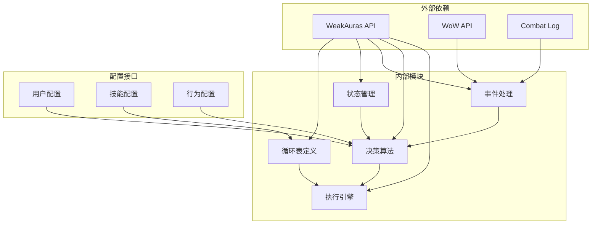

**图表来源**
- [邪dk.wa.ini:17](file://邪dk.wa.ini#L17)
- [邪dk.wa.ini:350-362](file://邪dk.wa.ini#L350-L362)

### 关键函数依赖链

系统的关键函数形成了清晰的调用链：

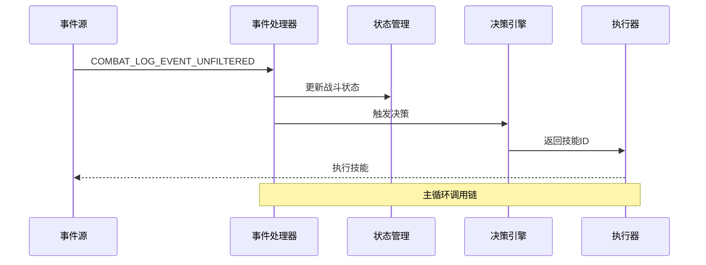

**图表来源**
- [邪dk.wa.ini:354-362](file://邪dk.wa.ini#L354-L362)
- [邪dk.wa.ini:552-575](file://邪dk.wa.ini#L552-L575)

**章节来源**
- [邪dk.wa.ini:354-362](file://邪dk.wa.ini#L354-L362)
- [邪dk.wa.ini:552-575](file://邪dk.wa.ini#L552-L575)

## 性能考虑

### 计算复杂度分析

系统的时间复杂度主要取决于以下因素：

- **循环表查找**: O(1) - 使用索引访问固定长度数组
- **AoE检测**: O(n) - 需要遍历所有可见目标
- **状态更新**: O(1) - 基本的变量赋值操作
- **决策算法**: O(1) - 基于条件判断的分支选择

空间复杂度为O(k)，其中k为循环表中技能的数量。

### 优化策略

1. **缓存机制**: 缓存AoE检测结果，避免重复计算
2. **早期退出**: 在条件满足时立即返回，减少不必要的检查
3. **批量处理**: 合并相似的条件检查操作
4. **延迟初始化**: 按需创建和销毁临时对象

### 内存管理

系统采用了高效的内存管理模式：
- 使用局部变量减少全局状态
- 及时清理不再使用的状态标志
- 避免创建不必要的临时对象

## 故障排除指南

### 常见问题诊断

#### 循环表不正确的问题

**症状**: 系统总是选择错误的循环表
**可能原因**:
1. AoE阈值设置不当
2. Boss识别逻辑错误
3. 配置参数未正确加载

**解决方法**:
1. 检查WAParam.config.usePestilence设置
2. 验证PestInfo()函数的返回值
3. 确认IsEncounterInProgress()的返回状态

#### 技能执行顺序异常

**症状**: 技能执行顺序不符合预期
**可能原因**:
1. oStep计数器同步问题
2. nRound轮次管理错误
3. 条件判断逻辑缺陷

**解决方法**:
1. 检查OnCastSuccess()事件处理
2. 验证状态转换条件
3. 确认循环表索引边界

#### 性能问题

**症状**: 系统响应缓慢或卡顿
**可能原因**:
1. AoE检测过于频繁
2. 事件处理过多
3. 内存泄漏

**解决方法**:
1. 实施AoE检测缓存
2. 优化事件过滤逻辑
3. 添加内存清理机制

**章节来源**
- [邪dk.wa.ini:284-348](file://邪dk.wa.ini#L284-L348)

### 调试技巧

#### 日志记录

建议添加以下关键点的日志记录：
- 循环表选择过程
- 状态转换触发条件
- 技能执行决策
- 错误处理路径

#### 性能监控

使用以下指标监控系统性能：
- 事件处理延迟
- 决策算法执行时间
- 内存使用情况
- CPU占用率

#### 配置验证

定期验证以下配置项：
- 技能冷却时间
- 目标数量阈值
- 形态切换条件
- 物品使用时机

## 结论

该技能循环表系统展现了高度的工程化设计，通过精心设计的循环表结构、智能的状态管理和灵活的决策算法，实现了在复杂战斗环境中的最优技能执行策略。

系统的成功之处在于：

1. **模块化设计**: 清晰的职责分离和接口定义
2. **智能决策**: 基于战斗状态和环境条件的动态选择
3. **性能优化**: 高效的数据结构和算法实现
4. **可扩展性**: 易于添加新的循环表和功能特性

该实现为其他职业的技能循环表开发提供了优秀的参考模板，展示了如何在实际游戏中实现复杂的自动化决策系统。