# 普通循环表

<cite>
**本文档引用的文件**
- [邪dk.wa.ini](file://邪dk.wa.ini)
</cite>

## 目录
1. [简介](#简介)
2. [项目结构](#项目结构)
3. [核心组件](#核心组件)
4. [架构概览](#架构概览)
5. [详细组件分析](#详细组件分析)
6. [依赖关系分析](#依赖关系分析)
7. [性能考量](#性能考量)
8. [故障排除指南](#故障排除指南)
9. [结论](#结论)

## 简介

本文档深入解析魔兽世界巫妖王之怒版本中死亡骑士（邪DK）的普通循环表系统。该系统实现了四种不同类型的循环表：N1-N4（单目标普通循环）和NA1-NA4（AoE普通循环），并提供了智能的循环切换逻辑、技能执行序列管理和性能优化策略。

该循环表系统采用Lua脚本编写，集成了WeakAuras的APL（Action Priority List）框架，为玩家提供自动化的技能执行指导。系统能够根据战斗环境动态调整循环策略，包括单目标战斗、多目标AoE战斗、爆发期和非爆发期的不同处理方式。

## 项目结构

该项目是一个单一的Lua配置文件，包含了完整的死亡骑士循环表实现：

```mermaid
graph TB
subgraph "主配置文件"
A[邪dk.wa.ini]
end
subgraph "技能常量定义"
B[S = {IC, PS, BS, SS, BB, DN, DC, HN, GA, EW, AR, BSH, BT, GF, PE, BP, UP}]
end
subgraph "循环表集合"
C[N_ROUNDS = {N1, N2, N3, N4}]
D[NA_ROUNDS = {NA1, NA2, NA3, NA4}]
end
subgraph "战斗阶段"
E[EnterCombat]
F[LeaveCombat]
G[OnCastSuccess]
H[OnCLEU]
end
subgraph "核心函数"
I[GetNormal]
J[GetOpener]
K[GetFiller]
L[APLCallback]
end
A --> B
A --> C
A --> D
A --> E
A --> F
A --> G
A --> H
A --> I
A --> J
A --> K
A --> L
```

**图表来源**
- [邪dk.wa.ini:21-42](file://邪dk.wa.ini#L21-L42)
- [邪dk.wa.ini:182-247](file://邪dk.wa.ini#L182-L247)
- [邪dk.wa.ini:252-362](file://邪dk.wa.ini#L252-L362)

**章节来源**
- [邪dk.wa.ini:1-606](file://邪dk.wa.ini#L1-L606)

## 核心组件

### 技能常量系统

系统定义了完整的技能常量映射，包括所有死亡骑士可用的技能ID：

- **伤害技能**: 冰冷触摸(IC)、暗影打击(PS)、鲜血打击(BS)、天灾打击(SS)、枯萎凋零(DN)
- **爆发技能**: 血液沸腾(BB)、食尸鬼狂乱(GF)、活力分流(BT)
- **辅助技能**: 寒冬号角(HN)、召唤石像鬼(GA)、符文武器增效(EW)、亡者大军(AR)
- **护甲技能**: 白骨之盾(BSH)
- **灵气技能**: 鲜血灵气(BP)、邪恶灵气(UP)
- **复活技能**: 亡者复生(RD)
- **特殊物品**: 加速手套(GLOVES)

### 循环表分类体系

系统实现了两套完整的循环表体系：

#### 单目标循环表 (N1-N4)
- **N1**: 基础单目标循环，包含完整的六步序列
- **N2**: 简化单目标循环，减少步骤数量
- **N3**: 中等复杂度单目标循环，平衡效率与稳定性
- **N4**: 高效单目标循环，包含爆发期技能组合

#### AoE循环表 (NA1-NA4)
- **NA1**: 基础AoE循环，使用传染技能替代鲜血打击
- **NA2**: 简化AoE循环，专注于核心AoE技能
- **NA3**: 中等复杂度AoE循环，平衡AoE效率与单目标技能
- **NA4**: 高效AoE循环，包含完整的爆发期AoE组合

**章节来源**
- [邪dk.wa.ini:21-42](file://邪dk.wa.ini#L21-L42)
- [邪dk.wa.ini:182-247](file://邪dk.wa.ini#L182-L247)

## 架构概览

系统采用分层架构设计，实现了清晰的功能分离：

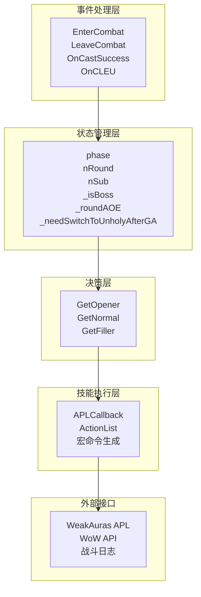

**图表来源**
- [邪dk.wa.ini:252-362](file://邪dk.wa.ini#L252-L362)
- [邪dk.wa.ini:364-575](file://邪dk.wa.ini#L364-L575)

### 状态机设计

系统实现了三阶段的状态机：

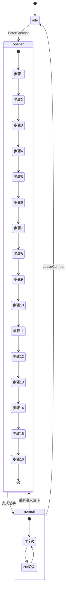

**图表来源**
- [邪dk.wa.ini:45-51](file://邪dk.wa.ini#L45-L51)
- [邪dk.wa.ini:252-282](file://邪dk.wa.ini#L252-L282)

**章节来源**
- [邪dk.wa.ini:45-51](file://邪dk.wa.ini#L45-L51)
- [邪dk.wa.ini:252-282](file://邪dk.wa.ini#L252-L282)

## 详细组件分析

### 循环表触发条件

#### BOSS战循环表选择
系统根据以下条件自动选择合适的循环表：

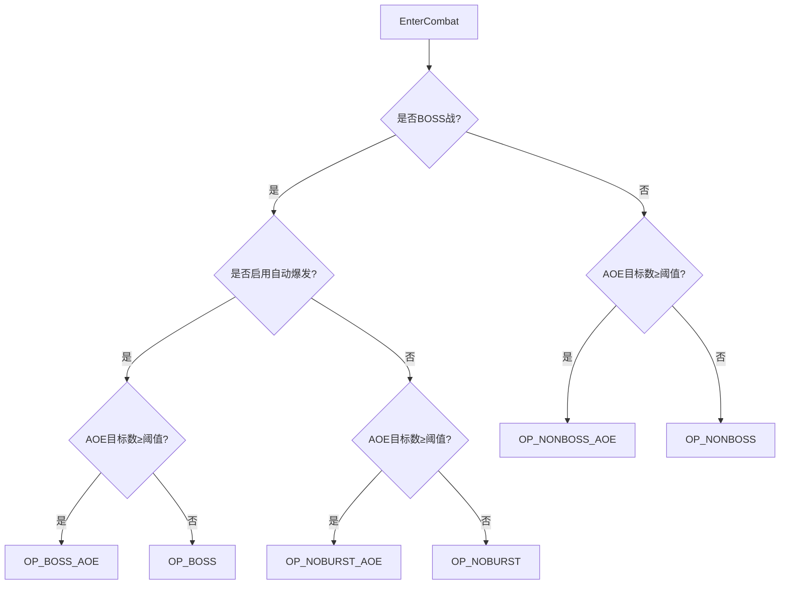

**图表来源**
- [邪dk.wa.ini:262-275](file://邪dk.wa.ini#L262-L275)

#### AOI目标检测机制
系统使用PestInfo函数检测周围敌人的数量：

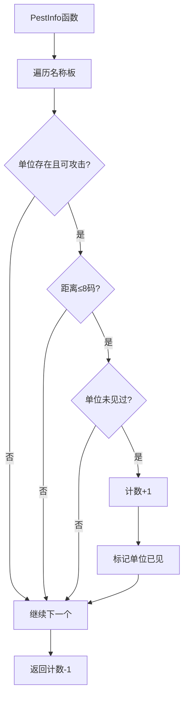

**图表来源**
- [邪dk.wa.ini:62-76](file://邪dk.wa.ini#L62-L76)

**章节来源**
- [邪dk.wa.ini:262-275](file://邪dk.wa.ini#L262-L275)
- [邪dk.wa.ini:62-76](file://邪dk.wa.ini#L62-L76)

### 执行顺序与优化策略

#### N1-N4循环表执行顺序

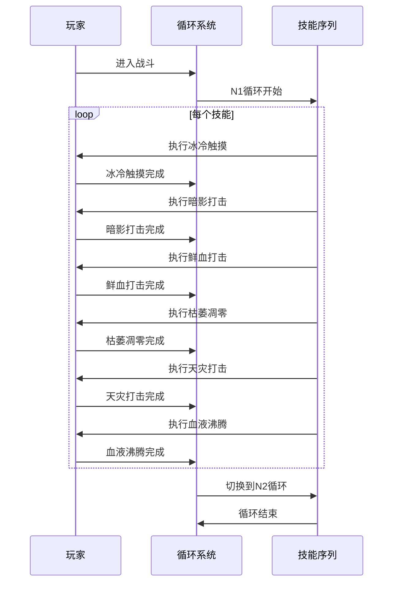

**图表来源**
- [邪dk.wa.ini:182-214](file://邪dk.wa.ini#L182-L214)

#### NA1-NA4循环表执行顺序

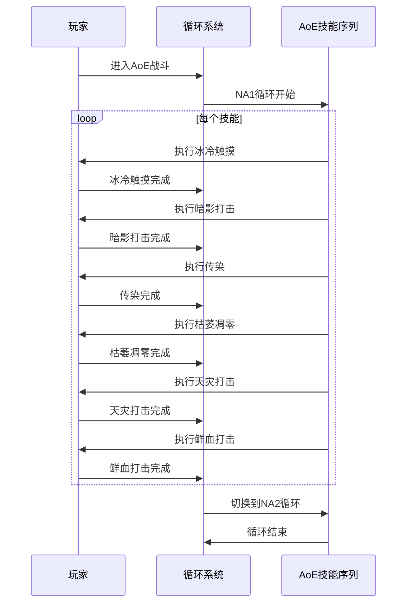

**图表来源**
- [邪dk.wa.ini:215-247](file://邪dk.wa.ini#L215-L247)

**章节来源**
- [邪dk.wa.ini:182-247](file://邪dk.wa.ini#L182-L247)

### 循环切换逻辑

#### 单目标到AoE循环的状态转换

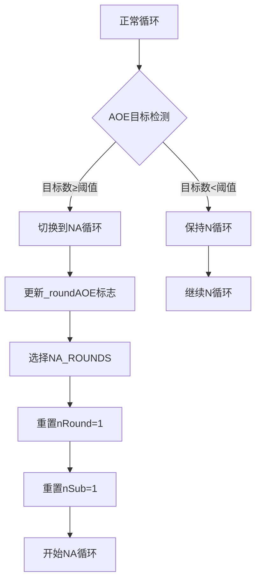

**图表来源**
- [邪dk.wa.ini:398-400](file://邪dk.wa.ini#L398-L400)
- [邪dk.wa.ini:423-425](file://邪dk.wa.ini#L423-L425)

#### 天鬼后的形态切换

系统实现了智能的形态切换逻辑：

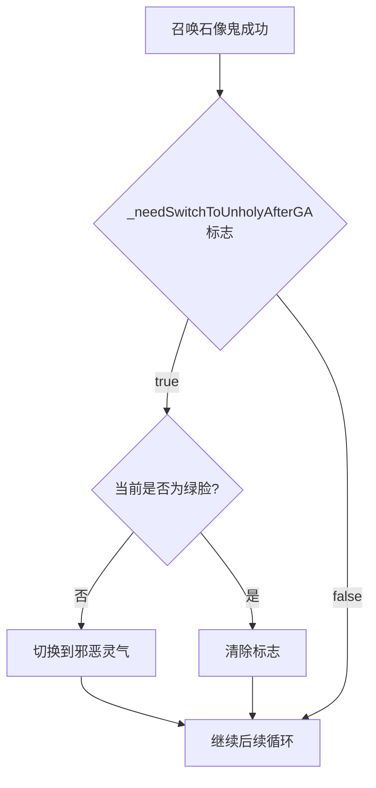

**图表来源**
- [邪dk.wa.ini:297-299](file://邪dk.wa.ini#L297-L299)
- [邪dk.wa.ini:382-390](file://邪dk.wa.ini#L382-L390)

**章节来源**
- [邪dk.wa.ini:297-299](file://邪dk.wa.ini#L297-L299)
- [邪dk.wa.ini:382-390](file://邪dk.wa.ini#L382-L390)

### 技能执行序列分析

#### 爆发期优化策略

系统实现了复杂的爆发期优化机制：

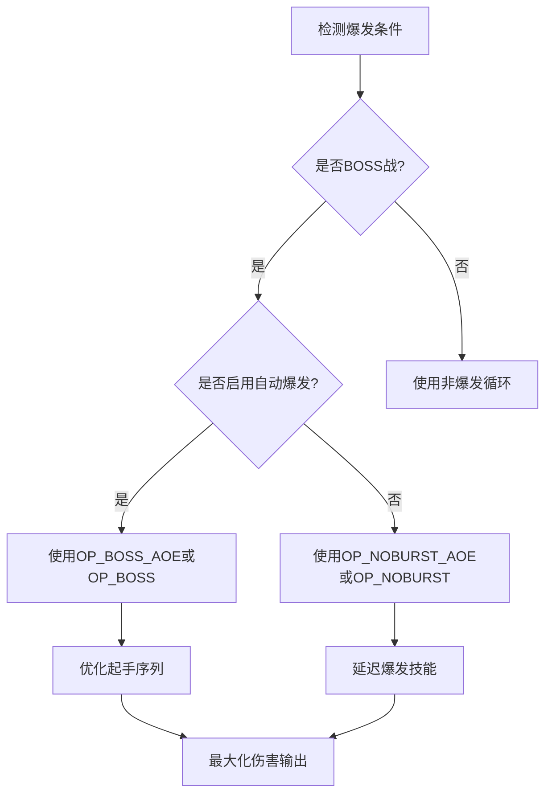

**图表来源**
- [邪dk.wa.ini:264-271](file://邪dk.wa.ini#L264-L271)

#### 空窗期填充机制

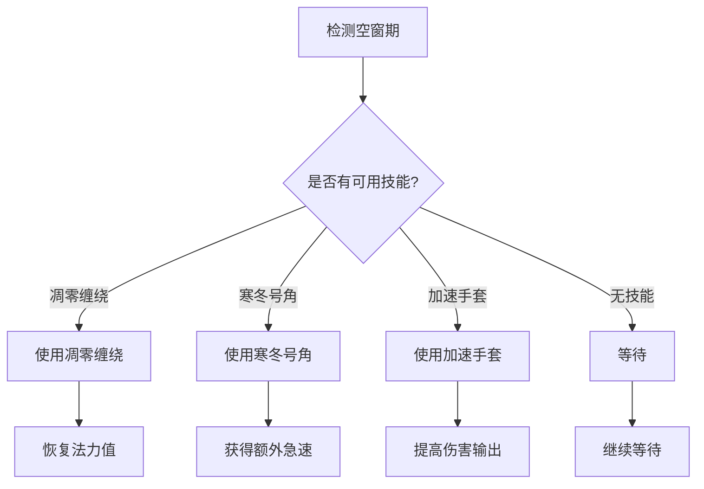

**图表来源**
- [邪dk.wa.ini:365-377](file://邪dk.wa.ini#L365-L377)

**章节来源**
- [邪dk.wa.ini:264-271](file://邪dk.wa.ini#L264-L271)
- [邪dk.wa.ini:365-377](file://邪dk.wa.ini#L365-L377)

## 依赖关系分析

### 外部依赖

系统依赖于多个外部组件：

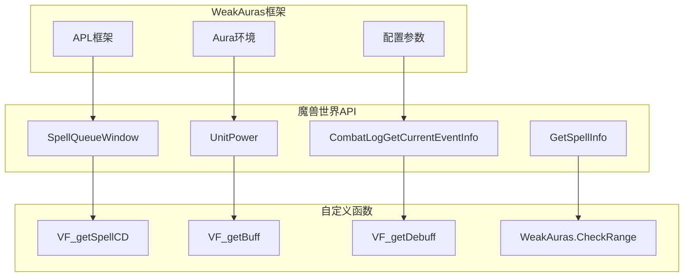

**图表来源**
- [邪dk.wa.ini:17-18](file://邪dk.wa.ini#L17-L18)
- [邪dk.wa.ini:54-56](file://邪dk.wa.ini#L54-L56)

### 内部依赖关系

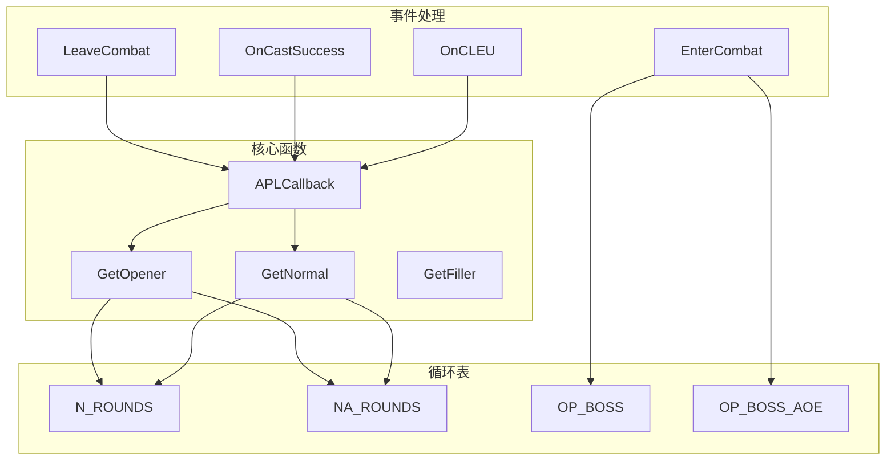

**图表来源**
- [邪dk.wa.ini:552-575](file://邪dk.wa.ini#L552-L575)
- [邪dk.wa.ini:364-455](file://邪dk.wa.ini#L364-L455)

**章节来源**
- [邪dk.wa.ini:552-575](file://邪dk.wa.ini#L552-L575)
- [邪dk.wa.ini:364-455](file://邪dk.wa.ini#L364-L455)

## 性能考量

### 时间复杂度分析

系统的时间复杂度主要取决于以下因素：

- **循环表查找**: O(1) - 使用数组索引直接访问
- **技能冷却检测**: O(1) - 通过VF_getSpellCD函数获取
- **AOE目标检测**: O(n) - 遍历最多40个名称板
- **状态机切换**: O(1) - 基于条件判断的状态转换

### 内存使用优化

系统采用了多项内存优化策略：

1. **常量池设计**: 所有技能ID存储在全局常量表中
2. **循环表复用**: 使用共享的循环表结构减少内存分配
3. **状态变量复用**: 通过全局状态变量避免频繁的对象创建
4. **延迟初始化**: 技能信息仅在需要时获取

### 实时性能监控

系统提供了多种性能监控机制：

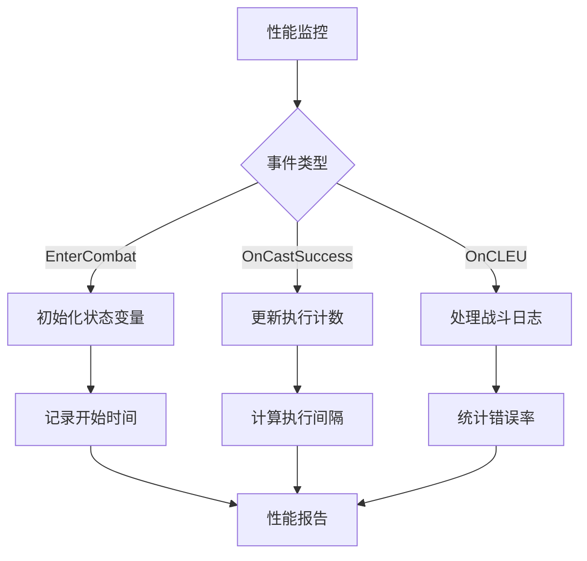

**图表来源**
- [邪dk.wa.ini:252-362](file://邪dk.wa.ini#L252-L362)

## 故障排除指南

### 常见问题诊断

#### 循环表不工作

**症状**: 循环表完全不执行任何技能
**可能原因**:
1. WeakAuras APL框架未正确加载
2. 技能ID映射错误
3. 状态变量初始化失败

**解决方案**:
1. 检查APL框架是否启用
2. 验证技能ID是否正确映射
3. 确认EnterCombat函数正常执行

#### 技能执行顺序错误

**症状**: 技能按错误顺序执行
**可能原因**:
1. nSub变量未正确递增
2. 循环表索引越界
3. 状态机状态异常

**解决方案**:
1. 检查OnCastSuccess事件处理
2. 验证循环表边界条件
3. 重置循环状态变量

#### AOE检测失效

**症状**: 系统无法正确识别AOE目标
**可能原因**:
1. PestInfo函数返回错误结果
2. 目标检测范围设置不当
3. 名称板过滤逻辑错误

**解决方案**:
1. 调整目标检测阈值
2. 检查距离计算逻辑
3. 验证单位过滤条件

**章节来源**
- [邪dk.wa.ini:284-348](file://邪dk.wa.ini#L284-L348)
- [邪dk.wa.ini:62-76](file://邪dk.wa.ini#L62-L76)

### 调试方法

#### 日志记录系统

系统提供了详细的日志记录功能：

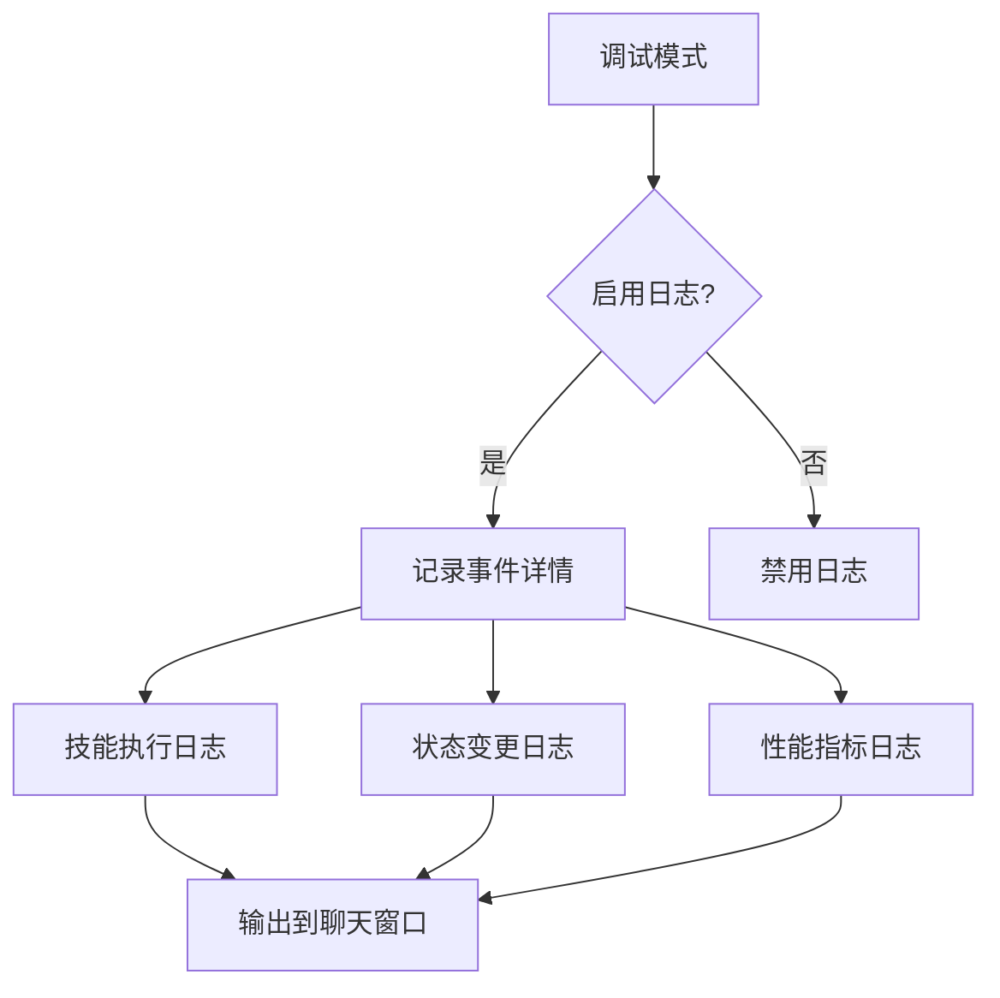

#### 性能分析工具

建议使用以下工具进行性能分析：
1. WeakAuras内置的性能监控
2. WoW自带的性能统计
3. 第三方性能分析插件

**章节来源**
- [邪dk.wa.ini:284-348](file://邪dk.wa.ini#L284-L348)

## 结论

该死亡骑士普通循环表系统展现了高度的工程化设计和实用性。通过精心设计的循环表体系、智能的状态转换机制和完善的性能优化策略，系统能够在各种战斗环境中提供最优的技能执行方案。

系统的主要优势包括：
- **模块化设计**: 清晰的功能分离便于维护和扩展
- **智能化决策**: 基于战斗环境的动态循环选择
- **性能优化**: 多层次的性能优化确保流畅运行
- **易于调试**: 完善的日志记录和错误处理机制

对于开发者而言，该系统提供了优秀的参考模板，展示了如何在复杂的游戏中实现高效的自动化决策系统。对于玩家而言，该系统能够显著提升游戏体验和战斗效率。