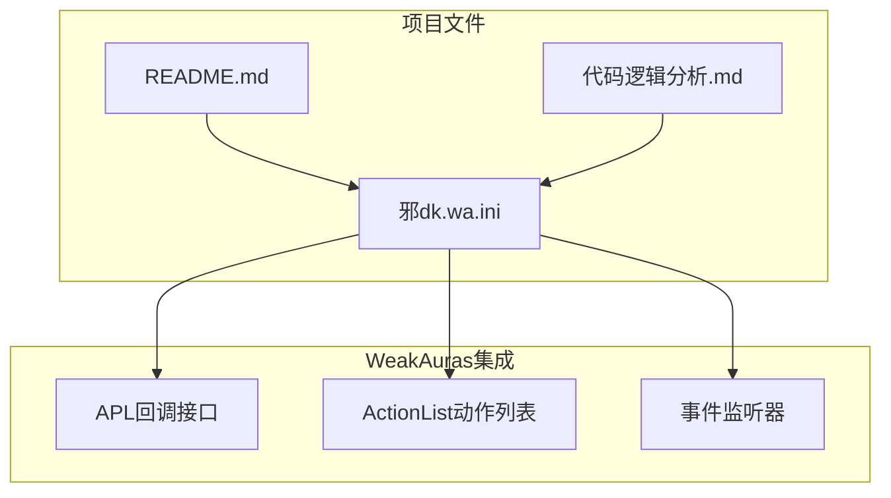
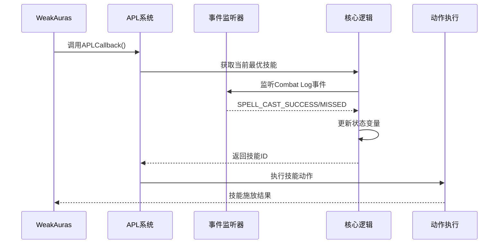
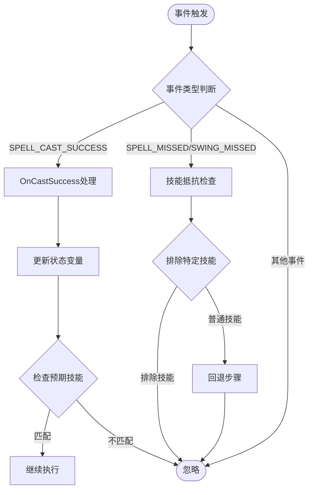
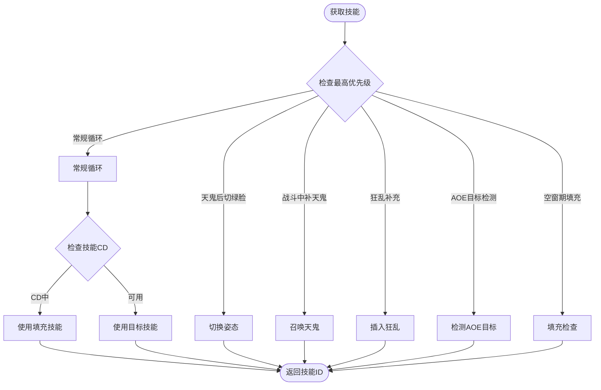
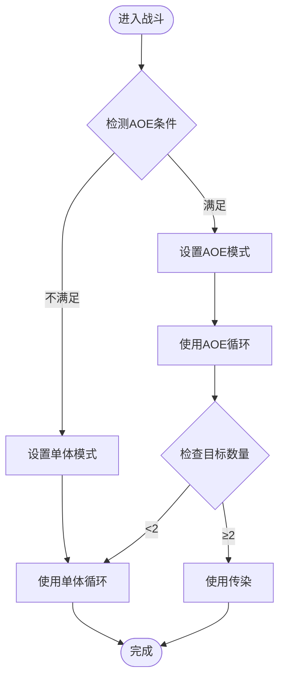
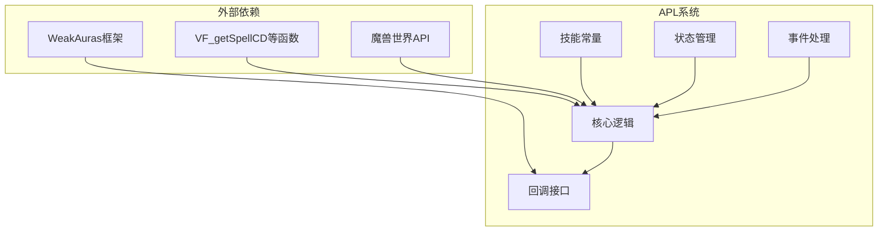

# 故障排除指南

<cite>
**本文档引用的文件**
- [README.md](file://README.md)
- [代码逻辑分析.md](file://代码逻辑分析.md)
- [邪dk.wa.ini](file://邪dk.wa.ini)
</cite>

## 目录
1. [简介](#简介)
2. [项目结构](#项目结构)
3. [核心组件](#核心组件)
4. [架构概览](#架构概览)
5. [详细组件分析](#详细组件分析)
6. [依赖关系分析](#依赖关系分析)
7. [性能考虑](#性能考虑)
8. [故障排除指南](#故障排除指南)
9. [结论](#结论)
10. [附录](#附录)

## 简介
本指南面向使用邪DK天打流APL脚本的玩家，提供全面的故障排除方法。涵盖安装失败、配置错误、技能执行异常等问题的诊断与修复，以及调试方法、性能优化建议、兼容性问题处理、问题报告模板和预防性维护策略。

## 项目结构
该仓库包含一个完整的WeakAuras插件配置文件，实现了邪DK在泰坦时光服环境下的自动输出循环。项目结构简洁，主要由以下文件组成：
- README.md：项目概述、特性说明、使用流程、配置参数和已知问题
- 代码逻辑分析.md：对APL代码逻辑的深入分析，包含已修复问题和性能优化建议
- 邪dk.wa.ini：WeakAuras插件的APL配置文件，包含技能常量、状态变量、循环表、事件处理和核心函数

**图表来源**
- [README.md:1-420](file://README.md#L1-L420)
- [代码逻辑分析.md:1-297](file://代码逻辑分析.md#L1-L297)
- [邪dk.wa.ini:1-606](file://邪dk.wa.ini#L1-L606)

**章节来源**
- [README.md:1-420](file://README.md#L1-L420)
- [代码逻辑分析.md:1-297](file://代码逻辑分析.md#L1-L297)
- [邪dk.wa.ini:1-606](file://邪dk.wa.ini#L1-L606)

## 核心组件
APL系统由以下核心组件构成：

### 技能常量定义
- 定义所有使用的技能ID和相关常量
- 包括主控技能（冰冷触摸、暗影打击、鲜血打击、天灾打击等）
- 包括辅助技能（枯萎凋零、凋零缠绕、寒冬号角等）
- 包括装备和增益效果（白骨之盾、活力分流、食尸鬼狂乱等）

### 状态变量管理
- phase：当前阶段（idle/normal/opener）
- oStep/nRound/nSub：开怪循环的步骤、轮次和子步骤索引
- _isBoss/_roundAOE：战斗类型和AOE状态标记
- _gfInsert/_isFilling：狂乱补充和填充状态
- _bombsUsed：手套使用标记

### 循环表定义
- OP_BOSS/OP_BOSS_AOE：Boss战开怪循环（单体/AOE）
- OP_NONBOSS/OP_NONBOSS_AOE：非Boss战循环
- OP_NOBURST/OP_NOBURST_AOE：蓄力开怪循环
- N_ROUNDS/NA_ROUNDS：常规输出循环的四轮组

### 事件监听
- EnterCombat/LeaveCombat：进入/离开战斗状态
- OnCLEU：Combat Log事件处理
- OnCastSuccess：法术施放成功处理

### 核心函数
- GetOpener：开怪循环决策
- GetNormal：常规循环决策
- GetFiller：空窗期填充逻辑
- APLCallback：WeakAuras回调接口

**章节来源**
- [邪dk.wa.ini:21-83](file://邪dk.wa.ini#L21-L83)
- [邪dk.wa.ini:85-250](file://邪dk.wa.ini#L85-L250)
- [邪dk.wa.ini:251-362](file://邪dk.wa.ini#L251-L362)
- [邪dk.wa.ini:364-575](file://邪dk.wa.ini#L364-L575)

## 架构概览
APL系统采用事件驱动架构，通过WeakAuras的回调机制实现智能技能优先级管理。

**图表来源**
- [邪dk.wa.ini:350-362](file://邪dk.wa.ini#L350-L362)
- [邪dk.wa.ini:284-348](file://邪dk.wa.ini#L284-L348)
- [邪dk.wa.ini:552-575](file://邪dk.wa.ini#L552-L575)

## 详细组件分析

### 事件处理机制
事件处理是APL系统的核心，负责实时跟踪战斗状态和技能施放情况。

**图表来源**
- [邪dk.wa.ini:323-348](file://邪dk.wa.ini#L323-L348)
- [邪dk.wa.ini:284-321](file://邪dk.wa.ini#L284-L321)

### 技能优先级决策
技能决策采用分层优先级策略，确保最优技能选择。

**图表来源**
- [邪dk.wa.ini:379-455](file://邪dk.wa.ini#L379-L455)
- [邪dk.wa.ini:365-377](file://邪dk.wa.ini#L365-L377)
- [邪dk.wa.ini:457-551](file://邪dk.wa.ini#L457-L551)

### AOE切换机制
AOE切换基于目标检测和配置参数实现智能切换。

**图表来源**
- [邪dk.wa.ini:262-276](file://邪dk.wa.ini#L262-L276)
- [邪dk.wa.ini:62-76](file://邪dk.wa.ini#L62-L76)

**章节来源**
- [邪dk.wa.ini:251-362](file://邪dk.wa.ini#L251-L362)
- [邪dk.wa.ini:364-575](file://邪dk.wa.ini#L364-L575)

## 依赖关系分析
APL系统对外部依赖严格，主要依赖WeakAuras框架和特定的函数支持。

**图表来源**
- [README.md:328-331](file://README.md#L328-L331)
- [代码逻辑分析.md:1-13](file://代码逻辑分析.md#L1-L13)

### 已知依赖限制
- 需要安装WeakAuras插件
- 需要VF_getSpellCD等自定义函数支持
- 建议使用哀冬虚空之花框架
- 需要特定版本的魔兽世界客户端

**章节来源**
- [README.md:326-342](file://README.md#L326-L342)
- [代码逻辑分析.md:1-13](file://代码逻辑分析.md#L1-L13)

## 性能考虑
虽然APL系统设计精良，但仍有一些潜在的性能优化空间：

### 当前性能瓶颈
1. **PestInfo调用频率**：每轮开始时都会调用，可考虑缓存结果
2. **IsCD函数计算**：每次都需要计算全局CD差值
3. **字符串比较操作**：OnCLEU中使用find()进行字符串匹配

### 优化建议
1. **目标检测缓存**：缓存PestInfo结果，仅在目标数量变化时重新检测
2. **CD值缓存**：缓存全局CD值，减少重复计算
3. **字符串匹配优化**：使用预编译的正则表达式模式

**章节来源**
- [代码逻辑分析.md:241-261](file://代码逻辑分析.md#L241-L261)

## 故障排除指南

### 安装失败问题

#### 问题现象
- WeakAuras插件无法识别APL配置
- 导入WA时出现错误提示
- APL在游戏内不显示

#### 诊断步骤
1. **检查WeakAuras版本**
   - 确认已安装最新版本的WeakAuras
   - 检查是否支持APL功能

2. **验证配置文件完整性**
   - 确认文件末尾有正确的结束标记
   - 检查语法是否正确

3. **检查游戏版本兼容性**
   - 确认使用的是WLK 80级框架
   - 验证服务器类型为泰坦时光服

#### 解决方案
1. **重新导入配置**
   - 复制完整配置内容
   - 在WA界面中重新导入
   - 确认导入成功后再重启游戏

2. **检查依赖函数**
   - 确保VF_getSpellCD等函数可用
   - 验证相关插件已正确加载

**章节来源**
- [README.md:360-378](file://README.md#L360-L378)
- [README.md:328-331](file://README.md#L328-L331)

### 配置错误问题

#### 问题现象
- 技能执行不符合预期
- AOE切换不生效
- 手套使用时机错误

#### 诊断步骤
1. **检查配置参数**
   - 验证useGlovesAuto参数设置
   - 确认autoBossBurst参数状态
   - 检查usePestilence和pestilenceTargets设置

2. **验证工程物品**
   - 确认拥有加速手套
   - 检查工程学专业等级
   - 验证萨隆邪铁炸弹可用性

3. **检查种族特长**
   - 确认对应种族的天鬼宏
   - 验证大军宏的种族要求

#### 解决方案
1. **重新配置参数**
   - 在WA中找到"疯狂念秋"aura
   - 展开选项面板进行配置
   - 保存配置后重新登录

2. **准备必需物品**
   - 确保工程学专业达到要求
   - 准备足够的工程物品
   - 验证物品在背包中的可用性

**章节来源**
- [README.md:264-275](file://README.md#L264-L275)
- [README.md:333-341](file://README.md#L333-L341)

### 技能执行异常问题

#### 问题现象
- 技能被抵抗或未命中
- 狂乱buff管理异常
- AOE技能使用不当

#### 诊断步骤
1. **检查技能抵抗回退**
   - 观察技能抵抗时的回退行为
   - 验证回退机制是否正常工作

2. **监控狂乱buff状态**
   - 检查buff剩余时间检测
   - 验证补充逻辑的触发条件

3. **验证AOE切换时机**
   - 检查目标检测逻辑
   - 确认AOE阈值设置正确

#### 解决方案
1. **调整AOE阈值**
   - 将pestilenceTargets设置为2
   - 确保至少2个额外目标才切换AOE

2. **检查狂乱补充逻辑**
   - 确认N4轮次跳过动态补充
   - 验证手套使用时机优化

3. **验证技能抵抗处理**
   - 确认排除特定技能的处理
   - 检查回退步骤的正确性

**章节来源**
- [代码逻辑分析.md:17-94](file://代码逻辑分析.md#L17-L94)
- [代码逻辑分析.md:179-238](file://代码逻辑分析.md#L179-L238)

### 调试方法

#### 查看脚本日志
1. **启用WeakAuras调试模式**
   - 在WA设置中启用详细日志
   - 观察技能执行过程

2. **监控状态变量变化**
   - 跟踪phase、oStep、nRound等变量
   - 检查状态转换是否符合预期

3. **记录事件处理**
   - 观察Combat Log事件的处理
   - 验证技能施放和抵抗事件

#### 监控技能执行状态
1. **使用WA内置监控**
   - 查看技能优先级显示
   - 监控当前选择的技能

2. **检查宏命令执行**
   - 验证宏命令的正确性
   - 确认种族特长的自动应用

3. **观察动作列表**
   - 检查ActionList的构建
   - 验证每个技能的宏命令

#### 分析事件处理问题
1. **检查事件注册**
   - 确认COMBAT_LOG_EVENT_UNFILTERED事件
   - 验证PLAYER_REGEN_ENABLED/DISABLED事件

2. **验证事件处理逻辑**
   - 检查SPELL_CAST_SUCCESS处理
   - 验证SPELL_MISSED事件处理

3. **调试回调接口**
   - 确认APLCallback返回正确的技能ID
   - 验证ActionList的完整性

**章节来源**
- [邪dk.wa.ini:350-362](file://邪dk.wa.ini#L350-L362)
- [邪dk.wa.ini:284-348](file://邪dk.wa.ini#L284-L348)
- [README.md:360-378](file://README.md#L360-L378)

### 性能优化建议

#### 减少CPU占用
1. **优化目标检测**
   - 缓存PestInfo结果
   - 仅在目标数量变化时重新检测

2. **减少字符串比较**
   - 使用预编译的正则表达式
   - 避免频繁的字符串查找操作

3. **优化CD检测**
   - 缓存全局CD值
   - 减少重复的CD计算

#### 优化循环频率
1. **延迟初始化**
   - 延迟加载非必要组件
   - 按需创建临时变量

2. **批量处理事件**
   - 合并相似的事件处理
   - 减少事件处理的频率

3. **智能缓存策略**
   - 实现LRU缓存机制
   - 设置合理的缓存失效时间

#### 提高响应速度
1. **优化技能决策算法**
   - 使用更高效的优先级队列
   - 减少不必要的计算步骤

2. **改进事件处理**
   - 使用异步事件处理
   - 实现事件批处理机制

3. **增强错误处理**
   - 添加超时保护机制
   - 实现优雅降级策略

**章节来源**
- [代码逻辑分析.md:241-261](file://代码逻辑分析.md#L241-L261)

### 兼容性问题

#### 与其他插件的冲突
1. **WeakAuras版本冲突**
   - 确保使用兼容的WA版本
   - 验证APL功能的可用性

2. **第三方插件干扰**
   - 检查是否有技能替换插件
   - 验证宏命令的执行顺序

3. **UI框架兼容性**
   - 确认与各种UI框架的兼容性
   - 验证布局和显示的正确性

#### 版本不匹配问题
1. **魔兽世界版本**
   - 确认使用WLK 80级框架
   - 验证服务器类型为泰坦时光服

2. **插件版本**
   - 检查WeakAuras的版本要求
   - 验证相关依赖插件的版本

3. **数据包兼容性**
   - 确认技能ID的一致性
   - 验证buff效果的兼容性

#### 解决方案
1. **隔离冲突插件**
   - 禁用可能冲突的插件
   - 使用独立的测试环境

2. **版本升级**
   - 升级到最新版本的插件
   - 确保所有依赖项都已更新

3. **配置调整**
   - 修改冲突的配置参数
   - 适应不同版本的行为差异

**章节来源**
- [README.md:326-342](file://README.md#L326-L342)

### 问题报告模板

#### 基本信息
- **插件版本**：APL版本号
- **WeakAuras版本**：WA版本号
- **魔兽世界版本**：游戏版本
- **服务器类型**：泰坦时光服

#### 环境信息
- **角色信息**：职业、等级、天赋
- **装备信息**：主要装备、宝石
- **宏命令**：相关宏命令的内容

#### 问题描述
- **问题现象**：详细描述问题的具体表现
- **重现步骤**：列出重现问题的详细步骤
- **期望结果**：描述期望的正常行为
- **实际结果**：描述实际发生的情况

#### 日志信息
- **WA日志**：相关的时间戳和事件
- **错误信息**：具体的错误消息
- **状态截图**：相关界面的状态截图

#### 附加信息
- **配置文件**：相关的配置参数
- **插件列表**：已安装的插件列表
- **其他信息**：任何相关的背景信息

### 社区支持渠道
- **WA作者**：念秋
- **原APL作者**：疯狂不龟路
- **反馈邮箱**：通过WA插件页面联系作者
- **社区论坛**：WeakAuras官方论坛
- **GitHub Issues**：项目GitHub页面的Issues

**章节来源**
- [README.md:405-410](file://README.md#L405-L410)

### 预防性维护

#### 定期检查清单
1. **插件更新检查**
   - 检查WeakAuras版本更新
   - 验证APL配置的兼容性

2. **配置验证**
   - 检查配置参数的有效性
   - 验证工程物品的可用性

3. **性能监控**
   - 监控APL的性能表现
   - 检查内存使用情况

4. **功能测试**
   - 定期测试关键功能
   - 验证技能执行的正确性

#### 维护建议
1. **定期备份配置**
   - 备份当前的配置文件
   - 保存重要的宏命令

2. **清理无用插件**
   - 移除不再使用的插件
   - 减少资源占用

3. **优化性能设置**
   - 调整日志级别
   - 关闭不必要的功能

4. **更新依赖项**
   - 及时更新相关插件
   - 保持版本同步

**章节来源**
- [README.md:360-378](file://README.md#L360-L378)

## 结论
本故障排除指南提供了针对邪DK天打流APL系统的全面问题解决方法。通过理解APL的架构设计、掌握调试技巧、实施性能优化和处理兼容性问题，用户可以有效解决使用过程中遇到的各种问题。建议用户定期进行预防性维护，保持插件和配置的最新状态，以获得最佳的游戏体验。

## 附录

### 常见问题解答
1. **为什么技能总是被抵抗？**
   - 检查AOE阈值设置
   - 验证目标检测逻辑
   - 确认技能抵抗回退机制

2. **手套为什么没有使用？**
   - 检查useGlovesAuto参数
   - 验证手套装束的CD状态
   - 确认目标距离条件

3. **AOE切换不生效？**
   - 检查pestilenceTargets设置
   - 验证目标数量检测
   - 确认AOE循环表的正确性

### 快速修复清单
- [ ] 检查WeakAuras版本
- [ ] 验证配置参数设置
- [ ] 确认工程物品可用
- [ ] 测试基本功能
- [ ] 检查日志输出
- [ ] 更新到最新版本