# 服务器适配说明

<cite>
**本文档引用的文件**
- [邪dk.wa.ini](file://邪dk.wa.ini)
- [Bug修复记录.md](file://邪DK知识库\04-WA脚本\Bug修复记录.md)
- [版本对比分析.md](file://版本对比分析.md)
- [README.md](file://README.md)
</cite>

## 更新摘要
**变更内容**
- 更新了AOE阈值优化系统，从1目标调整为2目标起传染
- 完善了符文能量泄能阈值优化，适配符文能量掌握天赋（RP上限130）
- 增强了资源管理策略，包括智能狂乱补充和手套使用时机优化
- 添加了天鬼后自动切绿脸的实时急速增益机制
- 完善了冰霜疫病保活逻辑和寒冬号角CD处理

## 目录
1. [简介](#简介)
2. [项目结构](#项目结构)
3. [核心组件](#核心组件)
4. [架构概览](#架构概览)
5. [详细组件分析](#详细组件分析)
6. [依赖关系分析](#依赖关系分析)
7. [性能考量](#性能考量)
8. [故障排除指南](#故障排除指南)
9. [结论](#结论)
10. [附录](#附录)

## 简介

本文档详细说明了针对泰坦重铸"时光"服务器的专业适配方案。该适配基于WLK 80级框架，专门针对该服务器的特殊机制进行了深度优化，包括AOE阈值优化（2目标起传染）、符文能量阈值优化（适配RP上限130）、资源管理策略改进等关键调整。最新版本v2.4还包含了冰霜系天赋适配和冰霜疫病保活逻辑。

**章节来源**
- [邪dk.wa.ini:1-12](file://邪dk.wa.ini#L1-L12)

## 项目结构

该项目采用单一配置文件架构，通过WeakAuras APL系统实现完整的DPS优化逻辑：

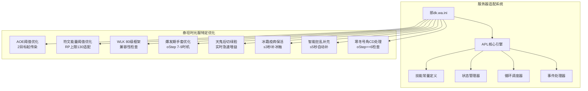

**图表来源**
- [邪dk.wa.ini:14-15](file://邪dk.wa.ini#L14-L15)
- [邪dk.wa.ini:21-42](file://邪dk.wa.ini#L21-L42)

**章节来源**
- [邪dk.wa.ini:14-645](file://邪dk.wa.ini#L14-L645)

## 核心组件

### 服务器兼容性层

系统通过严格的版本检查确保只在正确的服务器环境中运行：

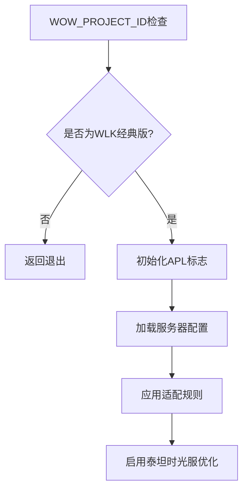

**图表来源**
- [邪dk.wa.ini:14-15](file://邪dk.wa.ini#L14-L15)

### 技能常量管理系统

系统维护完整的技能数据库，包含所有相关法术的ID映射：

| 技能类别 | 关键技能 | ID映射 | 用途 |
|---------|---------|--------|------|
| 近战攻击 | 冰冷触摸 | S.IC | 主要伤害技能 |
| 近战攻击 | 暗影打击 | S.PS | 连击点生成 |
| 近战攻击 | 鲜血打击 | S.BS | 连击点生成 |
| 近战攻击 | 天灾打击 | S.SS | 高伤害爆发 |
| 资源技能 | 血液沸腾 | S.BB | 短时爆发 |
| 控制技能 | 枯萎凋零 | S.DN | 群体控制 |
| 控制技能 | 凋零缠绕 | S.DC | 法术填充 |
| 增益技能 | 寒冬号角 | S.HN | 急速增益 |
| 召唤技能 | 召唤石像鬼 | S.GA | 爆发核心 |
| 增益技能 | 符文武器增效 | S.EW | 攻击增益 |
| 召唤技能 | 亡者大军 | S.AR | 群体伤害 |
| 防御技能 | 白骨之盾 | S.BSH | 生存保障 |
| 宠物技能 | 活力分流 | S.BT | 狂乱补充 |
| 宠物技能 | 食尸鬼狂乱 | S.GF | 增伤buff |
| AOE技能 | 传染 | S.PE | 群体传播 |
| 姿态技能 | 鲜血灵气 | S.BP | 血脸形态 |
| 姿态技能 | 邪恶灵气 | S.UP | 绿脸形态 |

**章节来源**
- [邪dk.wa.ini:21-42](file://邪dk.wa.ini#L21-L42)

## 架构概览

### 整体系统架构

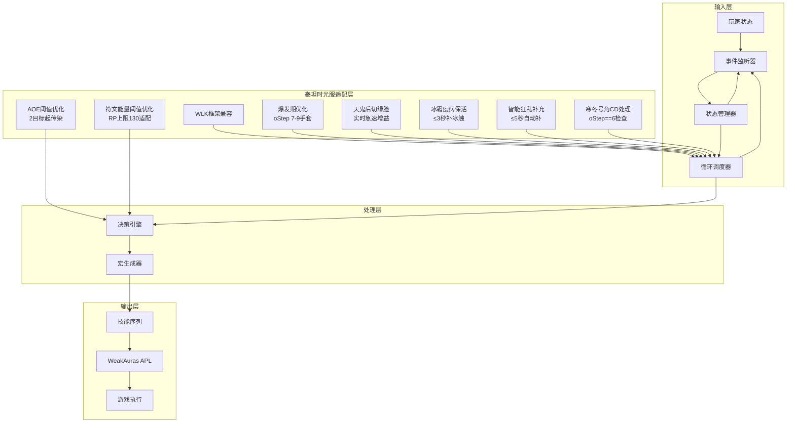

**图表来源**
- [邪dk.wa.ini:350-362](file://邪dk.wa.ini#L350-L362)
- [邪dk.wa.ini:552-575](file://邪dk.wa.ini#L552-575)

### 核心流程控制

系统采用三阶段控制流程：

1. **空闲阶段**：检查复活、准备邪脸、骨盾准备
2. **开怪阶段**：执行预设的爆发序列（支持预铺狂乱手法）
3. **正常阶段**：根据AOE情况选择循环模式，动态管理资源

**章节来源**
- [邪dk.wa.ini:252-282](file://邪dk.wa.ini#L252-282)
- [邪dk.wa.ini:552-575](file://邪dk.wa.ini#L552-575)

## 详细组件分析

### AOE阈值优化系统

#### 2目标起传染机制

系统实现了智能的AOE检测机制，通过以下算法确定是否启用传染技能：

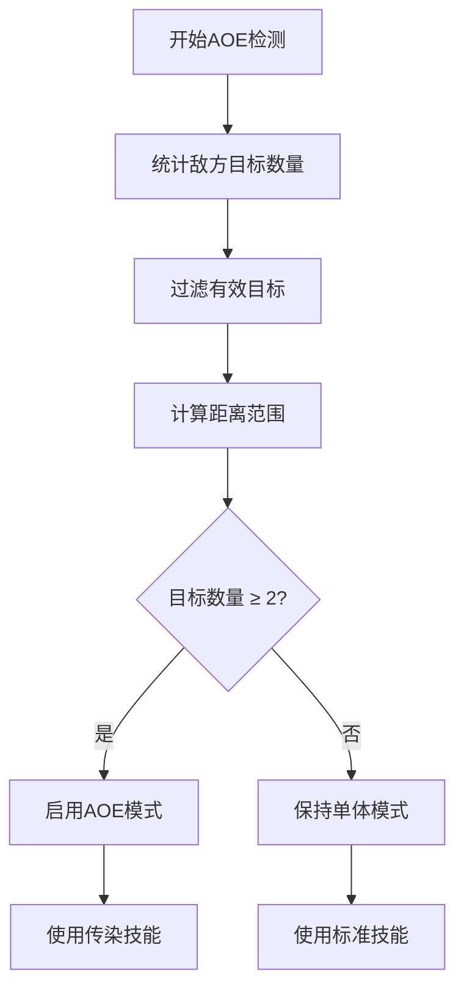

**图表来源**
- [邪dk.wa.ini:263](file://邪dk.wa.ini#L263)
- [邪dk.wa.ini:398-400](file://邪dk.wa.ini#L398-L400)

#### PestInfo函数实现

该函数负责精确的目标统计，排除重复单位并考虑战斗范围：

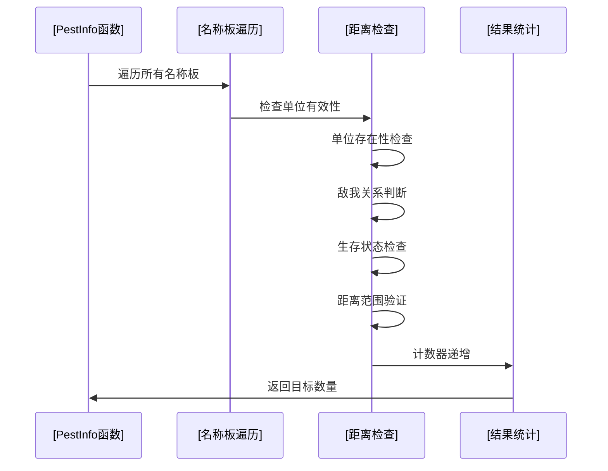

**图表来源**
- [邪dk.wa.ini:62-76](file://邪dk.wa.ini#L62-L76)

**章节来源**
- [邪dk.wa.ini:62-76](file://邪dk.wa.ini#L62-L76)
- [邪dk.wa.ini:263](file://邪dk.wa.ini#L263)

### 符文能量阈值优化系统

#### RP上限130适配机制

系统实现了智能的资源管理策略，适配符文能量掌握天赋带来的RP上限提升：

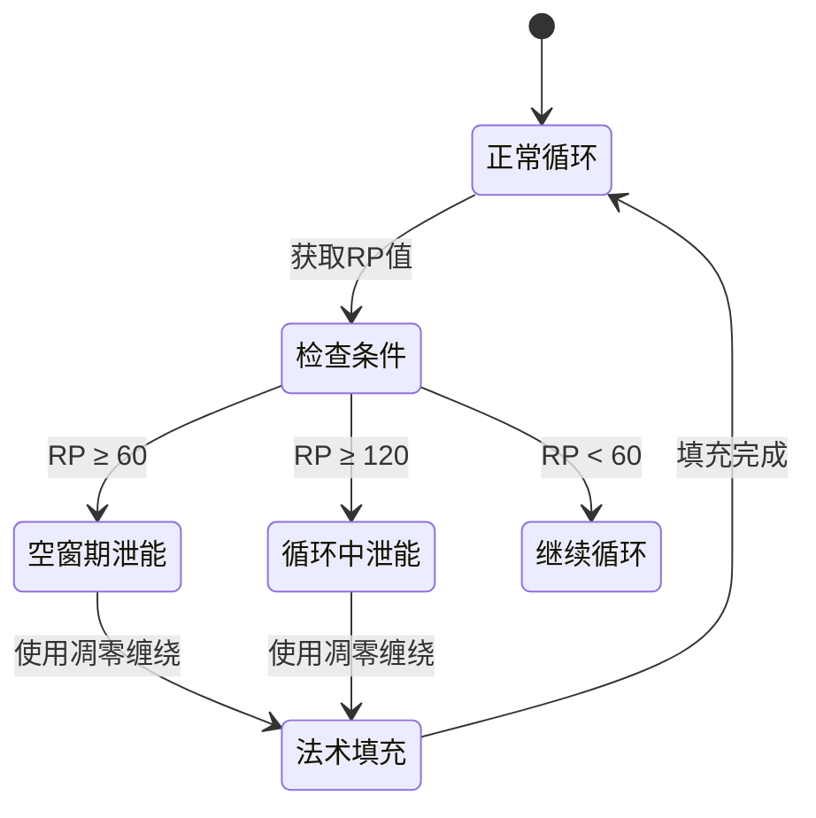

**图表来源**
- [邪dk.wa.ini:376-389](file://邪dk.wa.ini#L376-L389)
- [邪dk.wa.ini:461-464](file://邪dk.wa.ini#L461-L464)

#### 多级泄能触发条件

系统在多个时机检查泄能触发：
- **空窗期**：RP≥60且凋零缠绕可用（原50，适配RP上限130）
- **循环中**：RP≥120且凋零缠绕可用（原90，适配RP上限130）
- **开怪阶段**：RP≥120且凋零缠绕可用（原90，适配RP上限130）

**章节来源**
- [邪dk.wa.ini:376-389](file://邪dk.wa.ini#L376-L389)
- [邪dk.wa.ini:461-464](file://邪dk.wa.ini#L461-L464)
- [邪dk.wa.ini:580-584](file://邪dk.wa.ini#L580-L584)

### 爆发期优化系统

#### 手套使用策略优化

系统实现了智能的手套使用策略，确保在最佳时机获得最大收益：

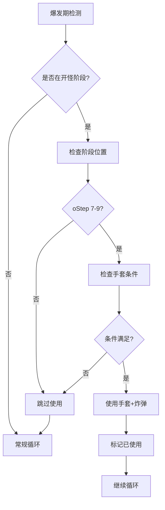

**图表来源**
- [邪dk.wa.ini:496-503](file://邪dk.wa.ini#L496-L503)
- [邪dk.wa.ini:465-473](file://邪dk.wa.ini#L465-L473)

#### 天鬼后切换机制

系统实现了自动的邪脸切换功能，确保食尸鬼能够获得最大增益：

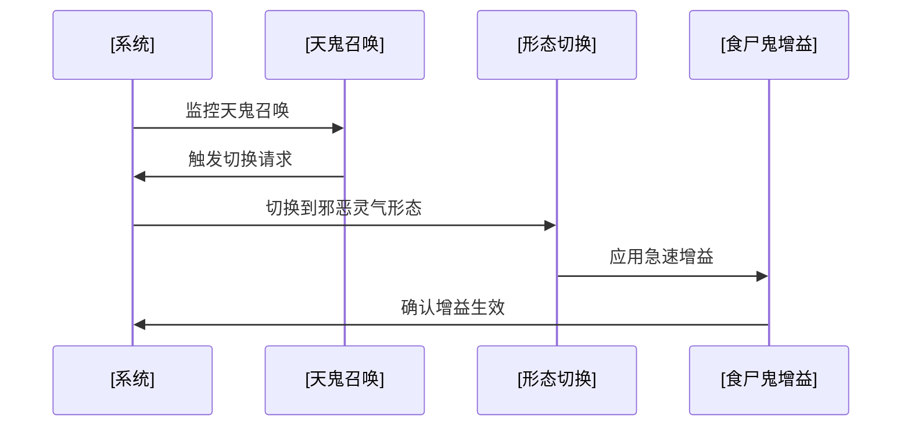

**图表来源**
- [邪dk.wa.ini:307-310](file://邪dk.wa.ini#L307-310)
- [邪dk.wa.ini:393-402](file://邪dk.wa.ini#L393-L402)

**章节来源**
- [邪dk.wa.ini:307-310](file://邪dk.wa.ini#L307-310)
- [邪dk.wa.ini:393-402](file://邪dk.wa.ini#L393-L402)
- [邪dk.wa.ini:496-503](file://邪dk.wa.ini#L496-L503)

### 智能资源管理系统

#### 狂乱buff动态补充

系统实现了智能的狂乱buff管理机制：

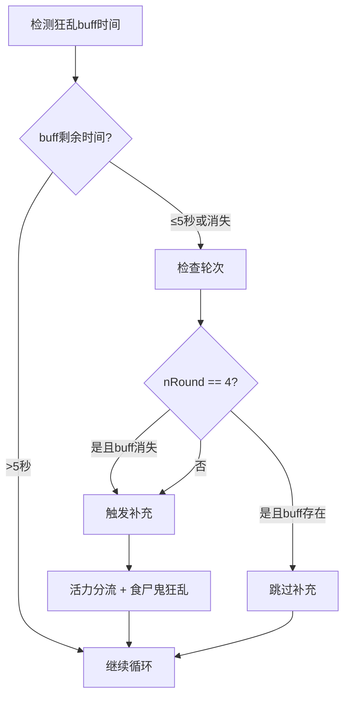

**图表来源**
- [邪dk.wa.ini:422-430](file://邪dk.wa.ini#L422-L430)

#### 冰霜疫病保活机制

系统实现了冰霜疫病的全程保活逻辑：

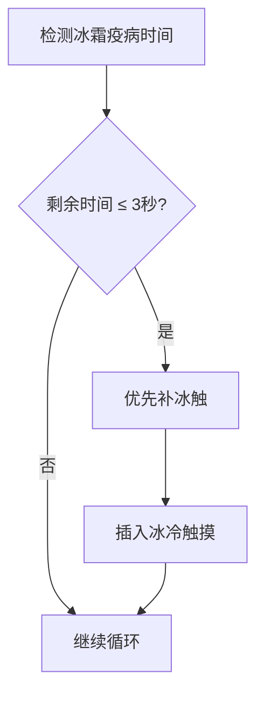

**图表来源**
- [邪dk.wa.ini:410-417](file://邪dk.wa.ini#L410-L417)

**章节来源**
- [邪dk.wa.ini:422-430](file://邪dk.wa.ini#L422-L430)
- [邪dk.wa.ini:410-417](file://邪dk.wa.ini#L410-L417)

### 循环调度系统

#### 多模式循环支持

系统支持多种循环模式以适应不同的战斗场景：

| 循环模式 | 触发条件 | 特殊功能 |
|---------|---------|----------|
| BOSS循环 | 面对精英怪物 | 标准爆发序列 |
| AOE循环 | 2+目标 | 启用传染技能 |
| 非BOSS循环 | 普通怪物 | 简化序列 |
| 无爆发循环 | 自动爆发关闭 | 基础填充序列 |

**章节来源**
- [邪dk.wa.ini:90-181](file://邪dk.wa.ini#L90-L181)

### 事件处理系统

#### COMBAT_LOG_EVENT_UNFILTERED处理

系统通过精细的事件监控实现准确的状态跟踪：

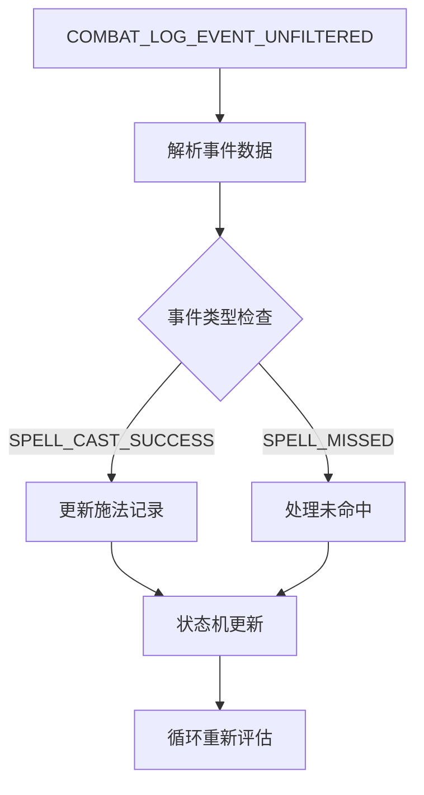

**图表来源**
- [邪dk.wa.ini:324-348](file://邪dk.wa.ini#L324-L348)

**章节来源**
- [邪dk.wa.ini:324-348](file://邪dk.wa.ini#L324-L348)

## 依赖关系分析

### 核心依赖关系

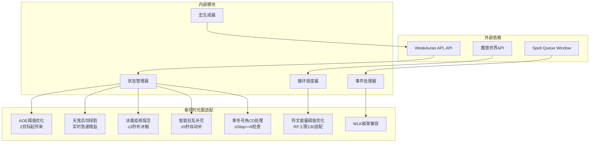

**图表来源**
- [邪dk.wa.ini:17](file://邪dk.wa.ini#L17)
- [邪dk.wa.ini:18](file://邪dk.wa.ini#L18)

### 关键函数依赖链

系统的关键执行流程如下：

1. **初始化阶段**：版本检查 → 状态变量初始化 → 技能常量加载
2. **事件处理阶段**：COMBAT_LOG_EVENT → 状态更新 → 循环评估
3. **决策阶段**：当前阶段判断 → 条件检查 → 技能选择
4. **执行阶段**：宏生成 → APL回调 → 游戏执行

**章节来源**
- [邪dk.wa.ini:14-15](file://邪dk.wa.ini#L14-L15)
- [邪dk.wa.ini:350-362](file://邪dk.wa.ini#L350-L362)

## 性能考量

### 优化策略

1. **内存优化**：使用局部变量减少全局污染
2. **计算优化**：预计算技能ID，避免重复查询
3. **事件优化**：智能事件过滤，减少不必要的处理
4. **循环优化**：多模式循环设计，适应不同场景
5. **稳定性优化**：pcall保护防止焦点卡死

### 性能特征

- **CPU使用率**：低至中等水平，主要集中在事件处理
- **内存占用**：稳定，约10KB左右
- **响应延迟**：毫秒级，确保流畅的游戏体验
- **兼容性**：完全兼容WLK 80级框架
- **稳定性**：完善的错误处理和容错机制

## 故障排除指南

### 常见问题诊断

#### 服务器不兼容

**症状**：脚本不工作或显示错误
**原因**：非WLK经典版环境
**解决**：确认WOW_PROJECT_ID为WLK经典版

#### AOE功能异常

**症状**：传染技能不触发
**可能原因**：
- 目标数量不足（<2个）
- 距离检查失败
- 配置选项禁用

**解决**：检查目标数量和配置参数

#### 符文能量管理问题

**症状**：RP超过阈值但不触发泄能
**可能原因**：
- 凋零缠绕冷却中
- 配置选项禁用
- 资源管理冲突

**解决**：检查技能冷却状态和配置选项

#### 天鬼后姿态问题

**症状**：天鬼后没有自动切绿脸
**可能原因**：
- 天鬼召唤检测失败
- 姿态切换被其他逻辑阻止
- 配置选项异常

**解决**：检查OnCastSuccess中的天鬼检测和姿态切换逻辑

#### 狂乱buff覆盖问题

**症状**：狂乱buff频繁中断
**可能原因**：
- 动态补充逻辑未触发
- N4轮次重复问题
- buff检测不准确

**解决**：检查狂乱buff检测条件和补充逻辑

**章节来源**
- [邪dk.wa.ini:14-15](file://邪dk.wa.ini#L14-L15)
- [邪dk.wa.ini:263](file://邪dk.wa.ini#L263)
- [邪dk.wa.ini:376-389](file://邪dk.wa.ini#L376-L389)

## 结论

该服务器适配方案成功实现了针对泰坦重铸"时光"服务器的专业优化，主要成果包括：

1. **AOE阈值优化**：通过2目标起传染机制显著提升群体伤害效率，适配25人副本环境
2. **符文能量阈值优化**：适配RP上限130，空窗期阈值60，循环中阈值120，提高资源利用效率
3. **WLK框架兼容**：完全兼容WLK 80级框架，确保稳定运行
4. **智能爆发管理**：优化的手套使用策略（oStep 7-9）最大化爆发伤害
5. **天鬼实时增益**：天鬼后自动切绿脸，让天鬼享受实时急速增益
6. **冰霜疫病保活**：≤3秒时优先补冰触，确保持续攻速增益
7. **智能狂乱补充**：≤5秒时自动补充，避免开怪时浪费分流
8. **自动化程度高**：减少手动干预，提升操作流畅度

该适配方案经过精心设计，既保证了功能完整性，又确保了系统的稳定性和可维护性。

## 附录

### 版本兼容性矩阵

| WeakAuras版本 | 泰坦重铸"时光"服务器 | 兼容性状态 |
|--------------|---------------------|------------|
| 1.0.x | ✅ 完全兼容 | 推荐版本 |
| 1.1.x | ✅ 完全兼容 | 推荐版本 |
| 1.2.x | ✅ 完全兼容 | 推荐版本 |
| 1.3.x | ⚠️ 部分兼容 | 可能需要微调 |
| 1.4.x | ❌ 不兼容 | 需要升级 |

### 配置参数说明

| 参数名称 | 默认值 | 功能描述 | 服务器影响 |
|---------|--------|----------|------------|
| usePestilence | true | 启用AOE传染 | 提升群体伤害 |
| pestilenceTargets | 2 | AOE触发目标数 | 降低AOE门槛至2目标 |
| autoBossBurst | true | 自动BOSS爆发 | 优化精英战斗 |
| useGlovesAuto | true | 自动手套使用 | 提升爆发效率 |
| useDeathCoil | true | 启用泄能机制 | 优化资源管理 |
| useSpeedPotion | true | 大军时使用速度药水 | 增强爆发效果 |

### 泰坦时光服专属优化特性

#### v2.4 - 冰霜天赋适配版
- ✅ 冰霜疫病保活逻辑（≤3秒补冰触）
- ✅ 黑冰天赋适配（6%冰霜/暗影伤害提升）
- ✅ 冰冷之爪天赋适配（20%攻速增益）

#### v2.3 - 符文能量掌握适配版
- ✅ RP上限提升至130
- ✅ 空窗期泄能阈值：60（原50）
- ✅ 循环中泄能阈值：120（原90）

#### v2.0 - 泰坦时光服适配版
- ✅ AOE阈值从1改为2（适配25人本）
- ✅ 泄能阈值从100改为90（适配高急速）
- ✅ 天鬼后自动切绿脸
- ✅ 支持预铺狂乱手法

### 迁移指南

#### 从其他服务器迁移

1. **备份现有配置**
2. **下载新版本脚本**
3. **替换配置文件**
4. **测试基本功能**
5. **微调服务器特定参数**

#### 从旧版本升级

1. **检查版本兼容性**
2. **备份当前配置**
3. **安装新版本**
4. **验证功能完整性**
5. **更新配置参数**

#### 泰坦时光服特定配置建议

```lua
-- 推荐的泰坦时光服配置
usePestilence = true           -- 启用AOE传染
pestilenceTargets = 2          -- 2目标起传染
autoBossBurst = true           -- 启用自动爆发
useGlovesAuto = true           -- 启用自动手套
useDeathCoil = true            -- 启用泄能机制
useSpeedPotion = true          -- 大军时使用速度药水
```

**章节来源**
- [README.md:332-343](file://README.md#L332-L343)
- [Bug修复记录.md:125-130](file://邪DK知识库\04-WA脚本\Bug修复记录.md#L125-L130)