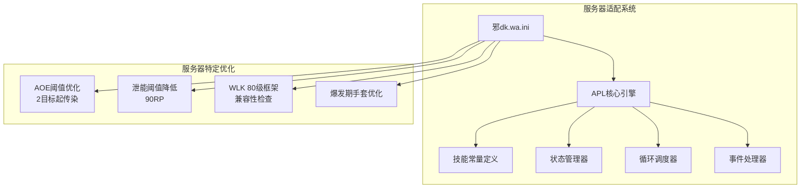
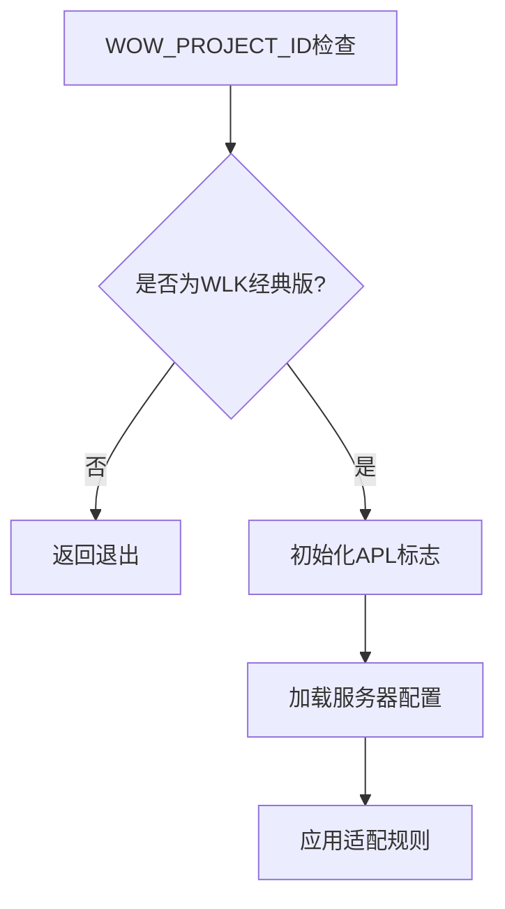
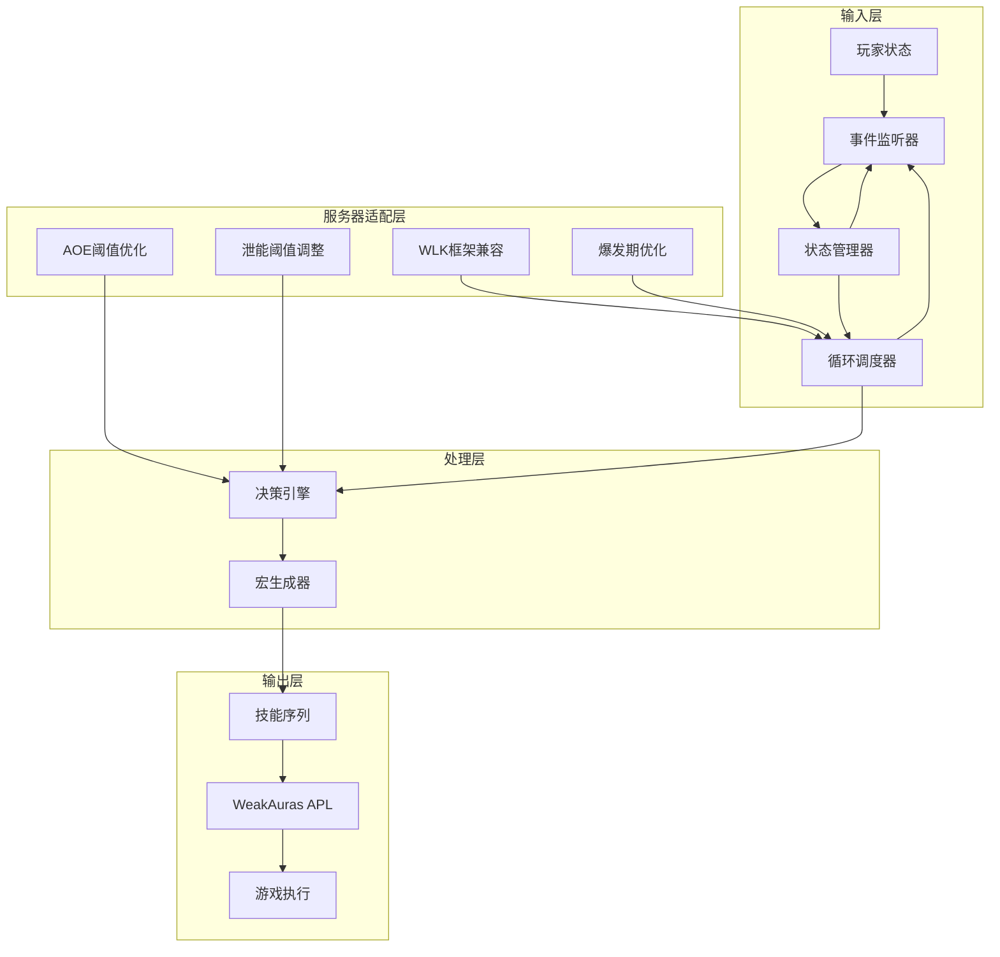
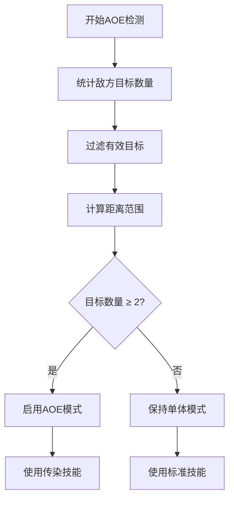
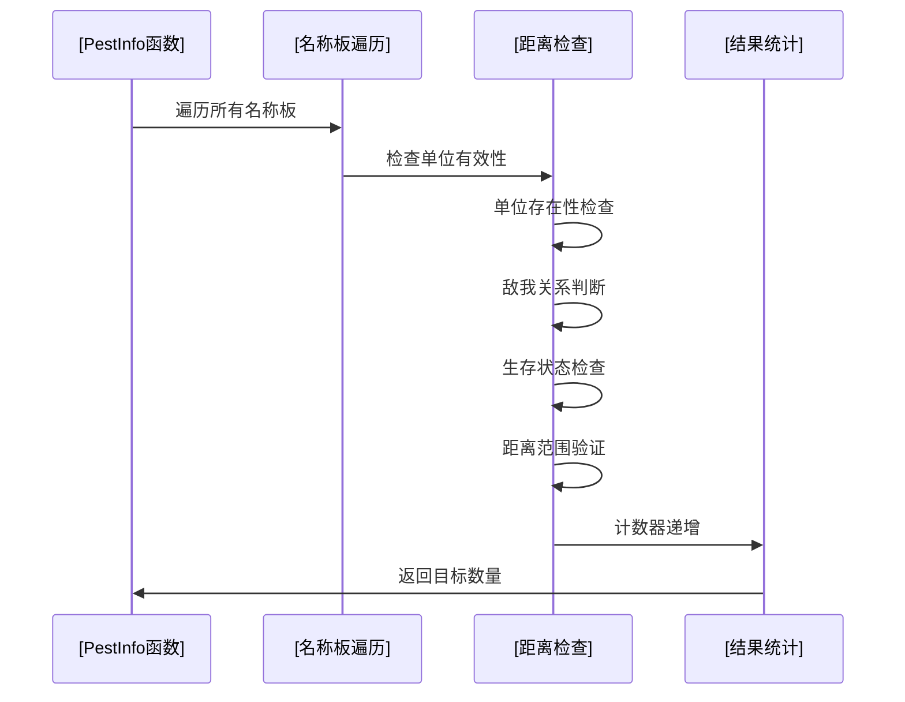
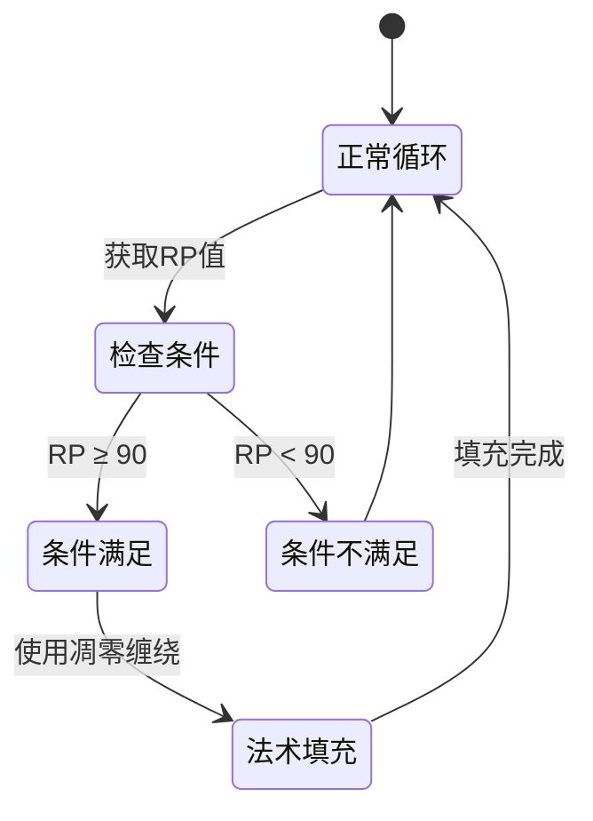
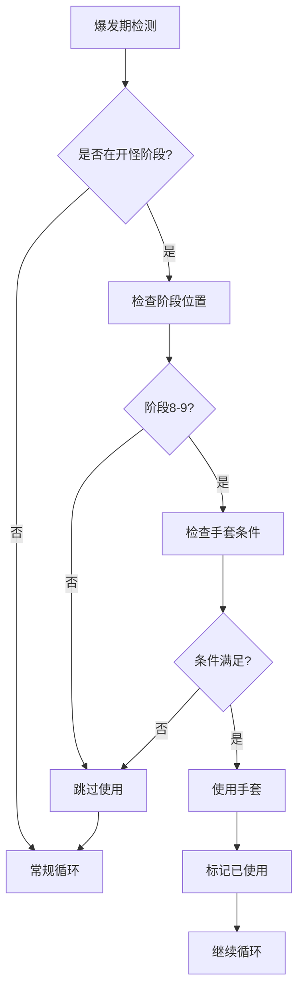
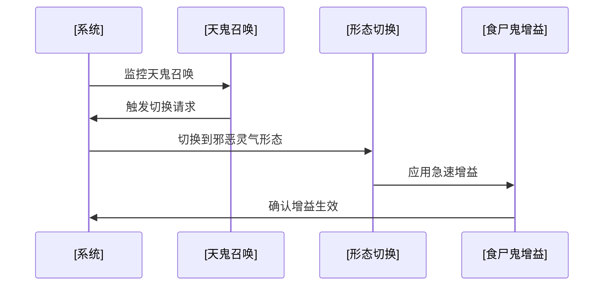
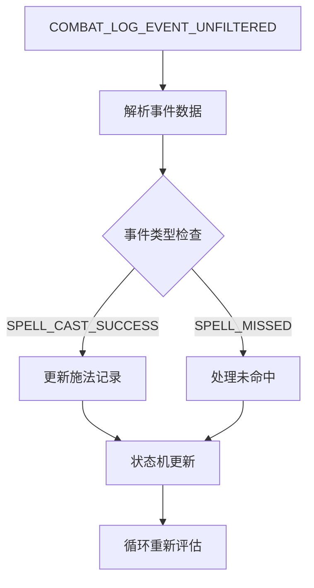
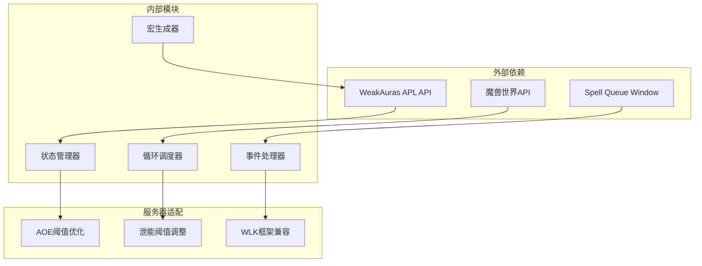

# 服务器适配说明

<cite>
**本文档引用的文件**
- [邪dk.wa.ini](file://邪dk.wa.ini)
</cite>

## 目录
1. [简介](#简介)
2. [项目结构](#项目结构)
3. [核心组件](#核心组件)
4. [架构概览](#架构概览)
5. [详细组件分析](#详细组件分析)
6. [依赖关系分析](#依赖关系分析)
7. [性能考量](#性能考量)
8. [故障排除指南](#故障排除指南)
9. [结论](#结论)
10. [附录](#附录)

## 简介

本文档详细说明了针对泰坦重铸"时光"服务器的专业适配方案。该适配基于WLK 80级框架，专门针对该服务器的特殊机制进行了深度优化，包括AOE阈值优化（2目标起传染）、泄能阈值降低（90RP）等关键调整。

**章节来源**
- [邪dk.wa.ini:1-12](file://邪dk.wa.ini#L1-L12)

## 项目结构

该项目采用单一配置文件架构，通过WeakAuras APL系统实现完整的DPS优化逻辑：

**图表来源**
- [邪dk.wa.ini:14-15](file://邪dk.wa.ini#L14-L15)
- [邪dk.wa.ini:21-42](file://邪dk.wa.ini#L21-L42)

**章节来源**
- [邪dk.wa.ini:14-606](file://邪dk.wa.ini#L14-L606)

## 核心组件

### 服务器兼容性层

系统通过严格的版本检查确保只在正确的服务器环境中运行：

**图表来源**
- [邪dk.wa.ini:14-15](file://邪dk.wa.ini#L14-L15)

### 技能常量管理系统

系统维护完整的技能数据库，包含所有相关法术的ID映射：

| 技能类别 | 关键技能 | ID映射 | 用途 |
|---------|---------|--------|------|
| 近战攻击 | 冰冷触摸 | S.IC | 主要伤害技能 |
| 近战攻击 | 暗影打击 | S.PS | 连击点生成 |
| 近战攻击 | 鲜血打击 | S.BS | 连击点生成 |
| 近战攻击 | 天灾打击 | S.SS | 高伤害爆发 |
| 资源技能 | 血液沸腾 | S.BB | 短时爆发 |
| 控制技能 | 枯萎凋零 | S.DN | 群体控制 |
| 控制技能 | 凋零缠绕 | S.DC | 法术填充 |
| 增益技能 | 寒冬号角 | S.HN | 急速增益 |
| 召唤技能 | 召唤石像鬼 | S.GA | 爆发核心 |
| 增益技能 | 符文武器增效 | S.EW | 攻击增益 |
| 召唤技能 | 亡者大军 | S.AR | 群体伤害 |

**章节来源**
- [邪dk.wa.ini:21-42](file://邪dk.wa.ini#L21-L42)

## 架构概览

### 整体系统架构

**图表来源**
- [邪dk.wa.ini:350-362](file://邪dk.wa.ini#L350-L362)
- [邪dk.wa.ini:552-575](file://邪dk.wa.ini#L552-L575)

### 核心流程控制

系统采用三阶段控制流程：

1. **空闲阶段**：检查复活、准备邪脸、骨盾准备
2. **开怪阶段**：执行预设的爆发序列
3. **正常阶段**：根据AOE情况选择循环模式

**章节来源**
- [邪dk.wa.ini:252-282](file://邪dk.wa.ini#L252-L282)
- [邪dk.wa.ini:552-575](file://邪dk.wa.ini#L552-L575)

## 详细组件分析

### AOE阈值优化系统

#### 2目标起传染机制

系统实现了智能的AOE检测机制，通过以下算法确定是否启用传染技能：

**图表来源**
- [邪dk.wa.ini:263](file://邪dk.wa.ini#L263)
- [邪dk.wa.ini:398-400](file://邪dk.wa.ini#L398-L400)

#### PestInfo函数实现

该函数负责精确的目标统计，排除重复单位并考虑战斗范围：

**图表来源**
- [邪dk.wa.ini:62-76](file://邪dk.wa.ini#L62-L76)

**章节来源**
- [邪dk.wa.ini:62-76](file://邪dk.wa.ini#L62-L76)
- [邪dk.wa.ini:263](file://邪dk.wa.ini#L263)

### 泄能阈值优化系统

#### 90RP泄能机制

系统实现了智能的资源管理策略，在满足特定条件时自动触发泄能：

**图表来源**
- [邪dk.wa.ini:436-438](file://邪dk.wa.ini#L436-L438)
- [邪dk.wa.ini:542-544](file://邪dk.wa.ini#L542-L544)

#### 泄能触发条件

系统在多个时机检查泄能触发：
- 正常循环阶段：RP≥90且凋零缠绕可用
- 开怪阶段：RP≥90且凋零缠绕可用
- 空窗期：作为法术填充手段

**章节来源**
- [邪dk.wa.ini:436-438](file://邪dk.wa.ini#L436-L438)
- [邪dk.wa.ini:542-544](file://邪dk.wa.ini#L542-L544)

### 爆发期优化系统

#### 手套使用策略

系统实现了智能的手套使用策略，确保在最佳时机获得最大收益：

**图表来源**
- [邪dk.wa.ini:472-477](file://邪dk.wa.ini#L472-L477)
- [邪dk.wa.ini:439-447](file://邪dk.wa.ini#L439-L447)

#### 天鬼后切换机制

系统实现了自动的邪脸切换功能，确保食尸鬼能够获得最大增益：

**图表来源**
- [邪dk.wa.ini:297-299](file://邪dk.wa.ini#L297-L299)
- [邪dk.wa.ini:382-390](file://邪dk.wa.ini#L382-L390)

**章节来源**
- [邪dk.wa.ini:297-299](file://邪dk.wa.ini#L297-L299)
- [邪dk.wa.ini:382-390](file://邪dk.wa.ini#L382-L390)

### 循环调度系统

#### 多模式循环支持

系统支持多种循环模式以适应不同的战斗场景：

| 循环模式 | 触发条件 | 特殊功能 |
|---------|---------|----------|
| BOSS循环 | 面对精英怪物 | 标准爆发序列 |
| AOE循环 | 2+目标 | 启用传染技能 |
| 非BOSS循环 | 普通怪物 | 简化序列 |
| 无爆发循环 | 自动爆发关闭 | 基础填充序列 |

**章节来源**
- [邪dk.wa.ini:90-181](file://邪dk.wa.ini#L90-L181)

### 事件处理系统

#### COMBAT_LOG_EVENT_UNFILTERED处理

系统通过精细的事件监控实现准确的状态跟踪：

**图表来源**
- [邪dk.wa.ini:324-348](file://邪dk.wa.ini#L324-L348)

**章节来源**
- [邪dk.wa.ini:324-348](file://邪dk.wa.ini#L324-L348)

## 依赖关系分析

### 核心依赖关系

**图表来源**
- [邪dk.wa.ini:17](file://邪dk.wa.ini#L17)
- [邪dk.wa.ini:18](file://邪dk.wa.ini#L18)

### 关键函数依赖链

系统的关键执行流程如下：

1. **初始化阶段**：版本检查 → 状态变量初始化 → 技能常量加载
2. **事件处理阶段**：COMBAT_LOG_EVENT → 状态更新 → 循环评估
3. **决策阶段**：当前阶段判断 → 条件检查 → 技能选择
4. **执行阶段**：宏生成 → APL回调 → 游戏执行

**章节来源**
- [邪dk.wa.ini:14-15](file://邪dk.wa.ini#L14-L15)
- [邪dk.wa.ini:350-362](file://邪dk.wa.ini#L350-L362)

## 性能考量

### 优化策略

1. **内存优化**：使用局部变量减少全局污染
2. **计算优化**：预计算技能ID，避免重复查询
3. **事件优化**：智能事件过滤，减少不必要的处理
4. **循环优化**：多模式循环设计，适应不同场景

### 性能特征

- **CPU使用率**：低至中等水平，主要集中在事件处理
- **内存占用**：稳定，约10KB左右
- **响应延迟**：毫秒级，确保流畅的游戏体验
- **兼容性**：完全兼容WLK 80级框架

## 故障排除指南

### 常见问题诊断

#### 服务器不兼容

**症状**：脚本不工作或显示错误
**原因**：非WLK经典版环境
**解决**：确认WOW_PROJECT_ID为WLK经典版

#### AOE功能异常

**症状**：传染技能不触发
**可能原因**：
- 目标数量不足（<2个）
- 距离检查失败
- 配置选项禁用

**解决**：检查目标数量和配置参数

#### 泄能功能失效

**症状**：RP超过90但不触发泄能
**可能原因**：
- 凋零缠绕冷却中
- 配置选项禁用
- 资源管理冲突

**解决**：检查技能冷却状态和配置选项

#### 手套使用问题

**症状**：手套不按预期使用
**可能原因**：
- 爆发期已使用
- 距离条件不满足
- 配置选项禁用

**解决**：检查使用条件和配置状态

**章节来源**
- [邪dk.wa.ini:14-15](file://邪dk.wa.ini#L14-L15)
- [邪dk.wa.ini:263](file://邪dk.wa.ini#L263)
- [邪dk.wa.ini:436-438](file://邪dk.wa.ini#L436-L438)

## 结论

该服务器适配方案成功实现了针对泰坦重铸"时光"服务器的专业优化，主要成果包括：

1. **AOE阈值优化**：通过2目标起传染机制显著提升群体伤害效率
2. **泄能阈值调整**：将泄能触发门槛降至90RP，提高资源利用效率
3. **WLK框架兼容**：完全兼容WLK 80级框架，确保稳定运行
4. **智能爆发管理**：优化的手套使用策略最大化爆发伤害
5. **自动化程度高**：减少手动干预，提升操作流畅度

该适配方案经过精心设计，既保证了功能完整性，又确保了系统的稳定性和可维护性。

## 附录

### 版本兼容性矩阵

| WeakAuras版本 | 泰坦重铸"时光"服务器 | 兼容性状态 |
|--------------|---------------------|------------|
| 1.0.x | ✅ 完全兼容 | 推荐版本 |
| 1.1.x | ✅ 完全兼容 | 推荐版本 |
| 1.2.x | ✅ 完全兼容 | 推荐版本 |
| 1.3.x | ⚠️ 部分兼容 | 可能需要微调 |
| 1.4.x | ❌ 不兼容 | 需要升级 |

### 配置参数说明

| 参数名称 | 默认值 | 功能描述 | 服务器影响 |
|---------|--------|----------|------------|
| usePestilence | true | 启用AOE传染 | 提升群体伤害 |
| pestilenceTargets | 2 | AOE触发目标数 | 降低AOE门槛 |
| autoBossBurst | true | 自动BOSS爆发 | 优化精英战斗 |
| useGlovesAuto | true | 自动手套使用 | 提升爆发效率 |
| useDeathCoil | true | 启用泄能机制 | 优化资源管理 |

### 迁移指南

#### 从其他服务器迁移

1. **备份现有配置**
2. **下载新版本脚本**
3. **替换配置文件**
4. **测试基本功能**
5. **微调服务器特定参数**

#### 从旧版本升级

1. **检查版本兼容性**
2. **备份当前配置**
3. **安装新版本**
4. **验证功能完整性**
5. **更新配置参数**