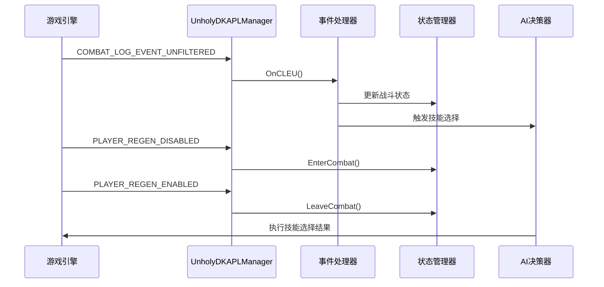
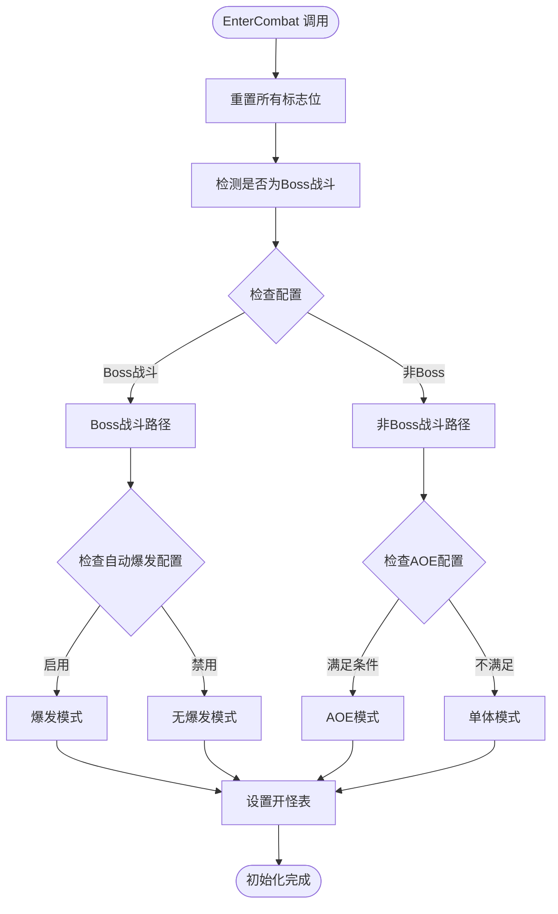
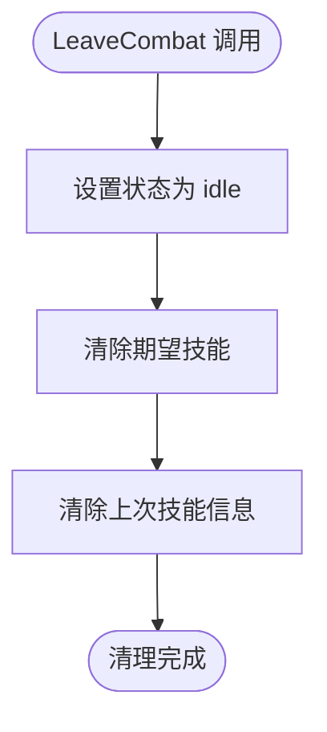
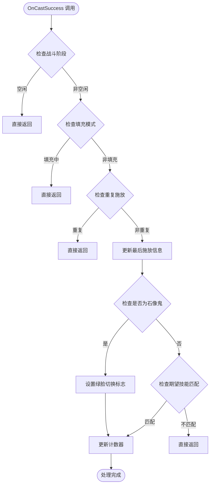
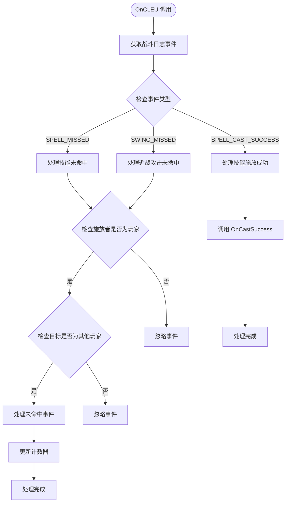
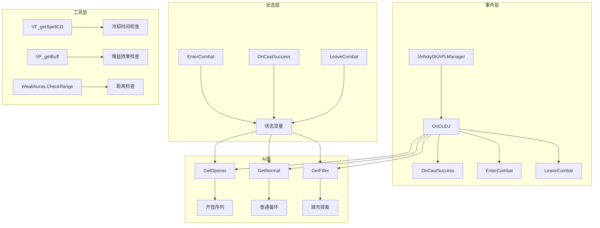

# 事件处理系统

<cite>
**本文档引用的文件**
- [邪dk.wa.ini](file://邪dk.wa.ini)
</cite>

## 目录
1. [简介](#简介)
2. [项目结构](#项目结构)
3. [核心组件](#核心组件)
4. [架构概览](#架构概览)
5. [详细组件分析](#详细组件分析)
6. [依赖关系分析](#依赖关系分析)
7. [性能考量](#性能考量)
8. [故障排除指南](#故障排除指南)
9. [结论](#结论)

## 简介

这是一个基于魔兽世界燃烧远征经典版（Wrath of the Lich King）的死亡骑士自动战斗脚本事件处理系统。该系统实现了完整的战斗事件监听、技能施放事件响应和错误处理机制，通过COMBAT_LOG_EVENT_UNFILTERED事件处理、状态变更处理和异常情况处理逻辑，为玩家提供智能化的战斗辅助。

系统采用Lua脚本语言编写，集成了WeakAuras框架，提供了从基础战斗到高级爆发的完整自动化解决方案。

## 项目结构

该代码库采用单一文件结构，包含完整的事件处理系统实现：

```mermaid
graph TB
subgraph "事件处理系统"
A[主管理器 Frame] --> B[COMBAT_LOG_EVENT_UNFILTERED 监听]
A --> C[PLAYER_REGEN_ENABLED 监听]
A --> D[PLAYER_REGEN_DISABLED 监听]
B --> E[OnCLEU 函数]
C --> F[LeaveCombat 函数]
D --> G[EnterCombat 函数]
E --> H[OnCastSuccess 函数]
E --> I[错误处理逻辑]
J[状态管理] --> K[阶段控制]
J --> L[计数器管理]
J --> M[标志位管理]
N[核心算法] --> O[开怪序列]
N --> P[普通循环]
N --> Q[填充技能]
</subgraph>
```

**图表来源**
- [邪dk.wa.ini:350-362](file://邪dk.wa.ini#L350-L362)
- [邪dk.wa.ini:251-321](file://邪dk.wa.ini#L251-L321)

**章节来源**
- [邪dk.wa.ini:1-599](file://邪dk.wa.ini#L1-L599)

## 核心组件

### 事件管理器

系统的核心是一个名为 `UnholyDKAPLManager` 的UIFrame实例，负责统一管理所有事件：

- **事件注册**：注册COMBAT_LOG_EVENT_UNFILTERED、PLAYER_REGEN_ENABLED、PLAYER_REGEN_DISABLED三个关键事件
- **事件分发**：根据事件类型调用相应的处理函数
- **生命周期管理**：维护整个事件处理系统的运行状态

### 战斗状态管理

系统实现了完整的战斗状态机，包括：

- **空闲状态（idle）**：非战斗状态，执行基础操作
- **开怪状态（opener）**：战斗开始时的特殊序列
- **正常状态（normal）**：常规战斗循环

### 技能常量定义

系统定义了完整的技能常量映射，包括：
- 冰冷触摸（IC）
- 暗影打击（PS）
- 鲜血打击（BS）
- 天灾打击（SS）
- 血液沸腾（BB）
- 枯萎凋零（DN）
- 凋零缠绕（DC）
- 寒冬号角（HN）
- 召唤石像鬼（GA）
- 符文武器增效（EW）
- 亡者大军（AR）
- 白骨之盾（BSH）
- 活力分流（BT）
- 食尸鬼狂乱（GF）
- 传染（PE）
- 鲜血灵气（BP）
- 邪恶灵气（UP）

**章节来源**
- [邪dk.wa.ini:20-42](file://邪dk.wa.ini#L20-L42)
- [邪dk.wa.ini:350-362](file://邪dk.wa.ini#L350-L362)

## 架构概览

系统采用事件驱动架构，通过弱回调机制实现：



**图表来源**
- [邪dk.wa.ini:354-362](file://邪dk.wa.ini#L354-L362)
- [邪dk.wa.ini:252-282](file://邪dk.wa.ini#L252-L282)

## 详细组件分析

### EnterCombat 事件处理

EnterCombat函数负责战斗开始时的状态初始化：



**图表来源**
- [邪dk.wa.ini:252-276](file://邪dk.wa.ini#L252-L276)

EnterCombat的关键功能包括：
- **状态重置**：清空所有战斗相关的标志位和计数器
- **战斗类型检测**：判断当前战斗是Boss还是普通怪物
- **配置检查**：根据用户设置选择合适的战斗策略
- **开怪表选择**：为不同战斗场景选择最优的技能序列

**章节来源**
- [邪dk.wa.ini:252-276](file://邪dk.wa.ini#L252-L276)

### LeaveCombat 事件处理

LeaveCombat函数负责战斗结束时的状态清理：



**图表来源**
- [邪dk.wa.ini:278-282](file://邪dk.wa.ini#L278-L282)

LeaveCombat的主要职责：
- **状态转换**：将系统从战斗状态切换到空闲状态
- **资源清理**：释放所有战斗期间占用的临时数据
- **内存管理**：确保不会产生内存泄漏

**章节来源**
- [邪dk.wa.ini:278-282](file://邪dk.wa.ini#L278-L282)

### OnCastSuccess 技能施放响应

OnCastSuccess函数处理成功的技能施放事件：



**图表来源**
- [邪dk.wa.ini:284-321](file://邪dk.wa.ini#L284-L321)

OnCastSuccess的处理逻辑：
- **阶段检查**：确保只在非空闲状态下处理技能施放
- **重复检测**：防止同一技能的重复处理
- **期望匹配**：验证实际施放的技能与预期一致
- **状态更新**：根据技能类型更新相应的计数器

**章节来源**
- [邪dk.wa.ini:284-321](file://邪dk.wa.ini#L284-L321)

### OnCLEU COMBAT_LOG_EVENT_UNFILTERED 处理

OnCLEU函数是COMBAT_LOG_EVENT_UNFILTERED事件的主要处理器：



**图表来源**
- [邪dk.wa.ini:323-348](file://邪dk.wa.ini#L323-L348)

OnCLEU的复杂处理逻辑：
- **事件过滤**：只处理玩家相关的战斗事件
- **类型分发**：根据事件类型调用相应的处理函数
- **异常处理**：忽略特定技能的未命中事件
- **状态同步**：根据战斗日志更新内部状态

**章节来源**
- [邪dk.wa.ini:323-348](file://邪dk.wa.ini#L323-L348)

### 错误处理机制

系统实现了多层次的错误处理机制：

#### 事件过滤错误处理
- **空闲状态过滤**：防止在非战斗状态下处理战斗事件
- **重复施放检测**：避免同一技能的重复处理
- **期望技能验证**：确保技能施放符合预期

#### 异常情况处理
- **未命中事件**：智能处理技能未命中的情况
- **战斗状态异常**：处理战斗状态转换过程中的异常
- **技能冷却检查**：确保技能施放的时机正确

#### 恢复策略
- **状态重置**：在异常情况下重置相关状态
- **计数器修正**：自动修正因异常导致的计数偏差
- **标志位清理**：清理异常产生的临时标志

**章节来源**
- [邪dk.wa.ini:284-321](file://邪dk.wa.ini#L284-L321)
- [邪dk.wa.ini:323-348](file://邪dk.wa.ini#L323-L348)

## 依赖关系分析

系统采用模块化设计，各组件之间的依赖关系如下：



**图表来源**
- [邪dk.wa.ini:350-362](file://邪dk.wa.ini#L350-L362)
- [邪dk.wa.ini:252-282](file://邪dk.wa.ini#L252-L282)

**章节来源**
- [邪dk.wa.ini:350-362](file://邪dk.wa.ini#L350-L362)

## 性能考量

### 事件处理优化

系统在性能方面采用了多项优化策略：

#### 事件过滤优化
- **早期返回**：在空闲状态或重复施放时立即返回
- **条件短路**：使用逻辑运算符实现快速条件检查
- **缓存机制**：缓存常用的技能信息和状态查询

#### 内存管理
- **局部变量**：使用局部变量减少全局查找
- **状态重置**：及时清理不再使用的临时数据
- **垃圾回收**：避免创建不必要的对象

#### 计算优化
- **预计算常量**：将技能ID等常量存储在局部变量中
- **条件合并**：合并相似的条件检查逻辑
- **循环优化**：优化状态查询和检查逻辑

### 资源使用监控

系统提供了以下监控机制：
- **冷却时间检查**：使用VF_getSpellCD函数检查技能冷却
- **增益效果监控**：使用VF_getBuff函数监控增益效果
- **距离检测**：使用WeakAuras.CheckRange函数进行距离检查

**章节来源**
- [邪dk.wa.ini:54-60](file://邪dk.wa.ini#L54-L60)
- [邪dk.wa.ini:365-377](file://邪dk.wa.ini#L365-L377)

## 故障排除指南

### 常见问题诊断

#### 事件处理问题
**症状**：技能施放事件无法被正确识别
**可能原因**：
- 事件注册失败
- 施放者ID匹配错误
- 事件类型识别错误

**解决方法**：
- 检查事件注册代码
- 验证UnitGUID("player")的正确性
- 确认事件类型字符串的准确性

#### 状态同步问题
**症状**：技能计数器出现偏差
**可能原因**：
- 重复施放检测过于严格
- 期望技能匹配失败
- 状态重置不完全

**解决方法**：
- 调整重复施放检测的时间窗口
- 检查期望技能名称的准确性
- 确保LeaveCombat函数被正确调用

#### 性能问题
**症状**：系统响应缓慢或卡顿
**可能原因**：
- 事件处理逻辑过于复杂
- 频繁的状态查询
- 内存泄漏

**解决方法**：
- 简化事件处理逻辑
- 减少不必要的状态查询
- 检查并修复内存泄漏

### 调试方法

#### 日志记录
系统可以通过以下方式添加调试信息：
- 在关键函数入口添加参数检查
- 记录状态变化的详细信息
- 监控事件处理的性能指标

#### 测试策略
- **单元测试**：为每个事件处理器编写独立的测试
- **集成测试**：测试事件处理链的整体行为
- **压力测试**：模拟高频率事件的处理场景

#### 监控指标
- **事件处理延迟**：测量从事件发生到处理完成的时间
- **内存使用**：监控系统内存的使用情况
- **CPU占用**：跟踪事件处理对CPU的影响

**章节来源**
- [邪dk.wa.ini:323-348](file://邪dk.wa.ini#L323-L348)
- [邪dk.wa.ini:252-282](file://邪dk.wa.ini#L252-L282)

## 结论

这个死亡骑士自动战斗脚本事件处理系统展现了优秀的软件工程实践：

### 技术亮点
- **事件驱动架构**：采用事件驱动的设计模式，具有良好的可扩展性
- **状态机实现**：清晰的状态管理和转换逻辑
- **错误处理机制**：多层次的错误检测和恢复策略
- **性能优化**：在保证功能完整性的同时注重性能表现

### 设计优势
- **模块化设计**：各组件职责明确，耦合度低
- **可维护性**：代码结构清晰，易于理解和修改
- **可扩展性**：为未来的功能扩展预留了接口
- **健壮性**：完善的错误处理和异常恢复机制

### 应用价值
该系统不仅为死亡骑士玩家提供了强大的自动化战斗辅助，更重要的是展示了如何在复杂的游戏中实现可靠的事件处理系统。其设计理念和实现技巧可以应用于其他类似的自动化脚本开发中。