# 战斗循环管理系统

<cite>
**本文档引用的文件**
- [邪dk.wa.ini](file://邪dk.wa.ini)
</cite>

## 目录
1. [简介](#简介)
2. [项目结构](#项目结构)
3. [核心组件](#核心组件)
4. [架构概览](#架构概览)
5. [详细组件分析](#详细组件分析)
6. [依赖关系分析](#依赖关系分析)
7. [性能考量](#性能考量)
8. [故障排除指南](#故障排除指南)
9. [结论](#结论)

## 简介

这是一个专为魔兽世界巫妖王之怒版本设计的死亡骑士自动战斗脚本系统。该系统实现了复杂的战斗循环管理，包括开怪循环、普通循环、填充技能循环和爆发期优化等功能。系统通过智能的状态机管理和AoE检测算法，为不同战斗场景提供最优的技能执行策略。

## 项目结构

该脚本采用单一文件架构，包含完整的循环管理系统实现：

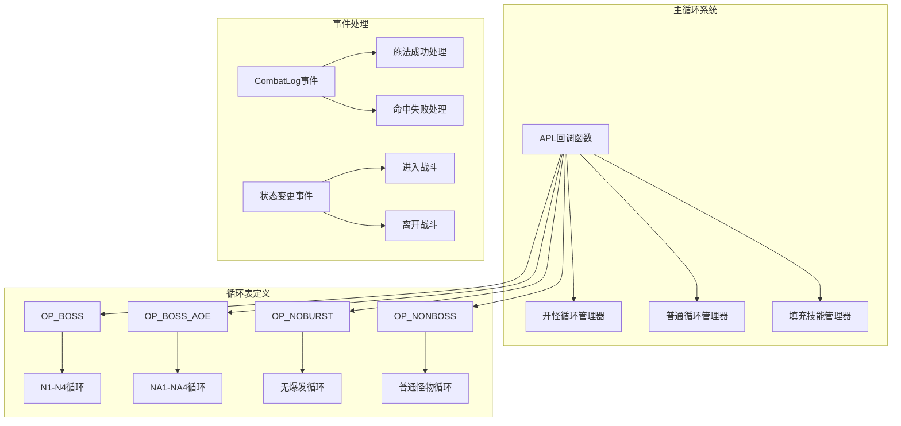

**图表来源**
- [邪dk.wa.ini:552-575](file://邪dk.wa.ini#L552-L575)
- [邪dk.wa.ini:85-250](file://邪dk.wa.ini#L85-L250)

**章节来源**
- [邪dk.wa.ini:1-606](file://邪dk.wa.ini#L1-L606)

## 核心组件

### 循环表数据结构

系统使用统一的循环表格式，每个循环项包含三个关键字段：
- `spell`: 技能名称
- `id`: 技能ID
- `r`: 执行说明标签

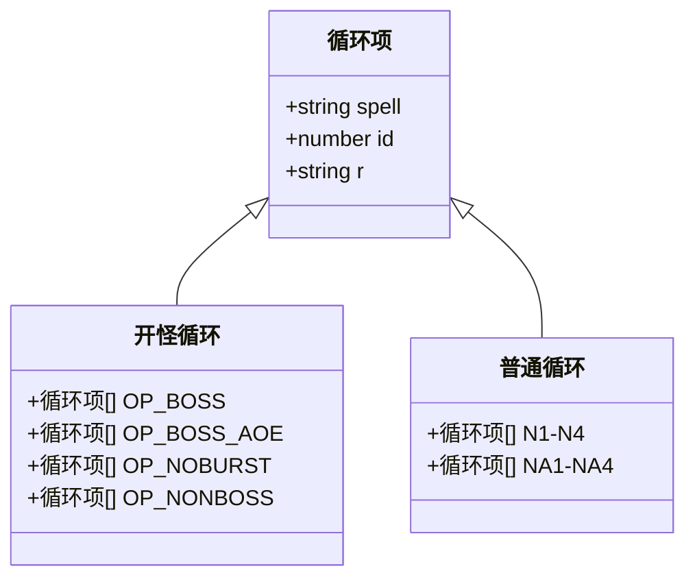

**图表来源**
- [邪dk.wa.ini:86-88](file://邪dk.wa.ini#L86-L88)
- [邪dk.wa.ini:90-181](file://邪dk.wa.ini#L90-L181)

### 技能常量定义

系统维护了完整的技能常量映射，确保技能识别的准确性：

| 技能类别 | 常量名 | 技能ID | 功能描述 |
|---------|--------|--------|----------|
| 基础攻击 | IC | 冰冷触摸 | 主要伤害技能 |
| 基础攻击 | PS | 暗影打击 | 主要伤害技能 |
| 基础攻击 | BS | 鲜血打击 | 主要伤害技能 |
| 基础攻击 | SS | 天灾打击 | 主要伤害技能 |
| 爆发技能 | BB | 血液沸腾 | 爆发技能 |
| AoE技能 | DN | 枯萎凋零 | AoE伤害技能 |
| AoE技能 | DC | 凋零缠绕 | AoE伤害技能 |
| AoE技能 | PE | 传染 | AoE伤害技能 |
| 特殊技能 | HN | 寒冬号角 | 急速增益 |
| 特殊技能 | GA | 召唤石像鬼 | 召唤宠物 |
| 特殊技能 | EW | 符文武器增效 | 急速增益 |
| 特殊技能 | AR | 亡者大军 | 强力AoE技能 |
| 特殊技能 | GF | 食尸鬼狂乱 | 爆发技能 |
| 特殊技能 | BT | 活力分流 | 爆发技能 |

**章节来源**
- [邪dk.wa.ini:21-42](file://邪dk.wa.ini#L21-L42)

## 架构概览

系统采用事件驱动的架构模式，通过WeakAuras框架提供的事件接口实现智能的战斗循环管理：

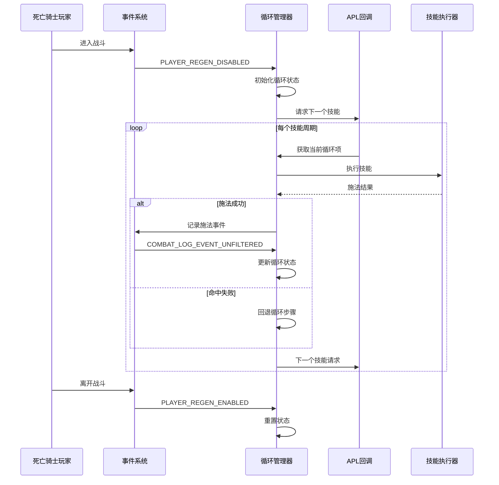

**图表来源**
- [邪dk.wa.ini:350-362](file://邪dk.wa.ini#L350-L362)
- [邪dk.wa.ini:284-348](file://邪dk.wa.ini#L284-L348)

## 详细组件分析

### 开怪循环管理系统

开怪循环系统针对不同战斗类型提供了专门的策略：

#### BOSS战开怪循环

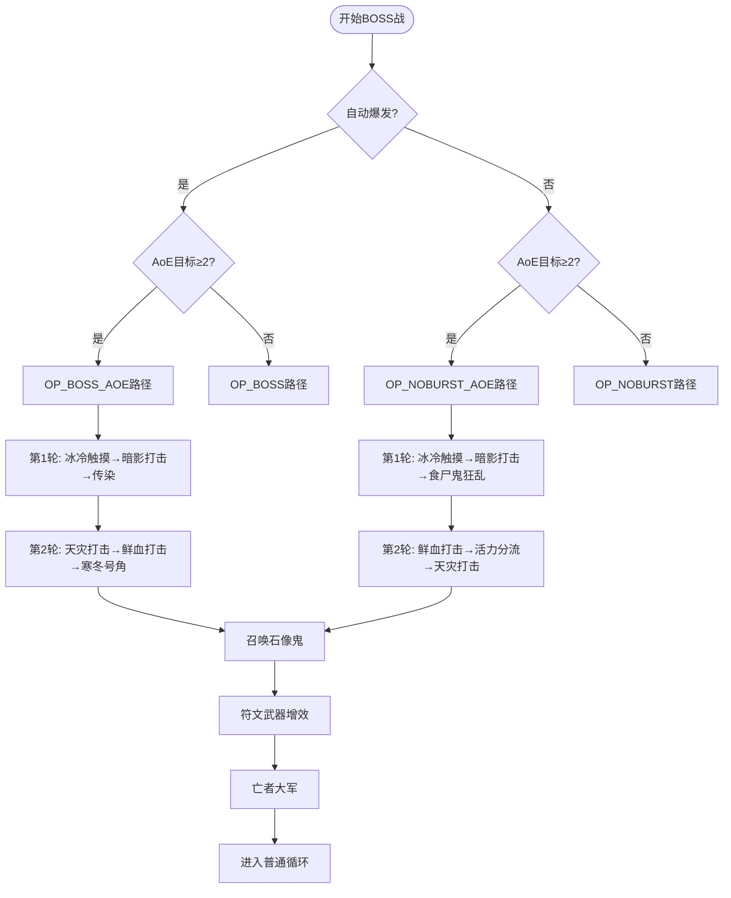

**图表来源**
- [邪dk.wa.ini:90-141](file://邪dk.wa.ini#L90-L141)
- [邪dk.wa.ini:263-275](file://邪dk.wa.ini#L263-L275)

#### 普通怪物开怪循环

普通怪物战使用简化的开怪序列，专注于快速清理单体目标：

**图表来源**
- [邪dk.wa.ini:142-149](file://邪dk.wa.ini#L142-L149)

**章节来源**
- [邪dk.wa.ini:90-181](file://邪dk.wa.ini#L90-L181)

### 普通循环管理系统

普通循环系统实现了四轮循环机制，每轮包含不同的技能组合：

#### N1-N4循环策略

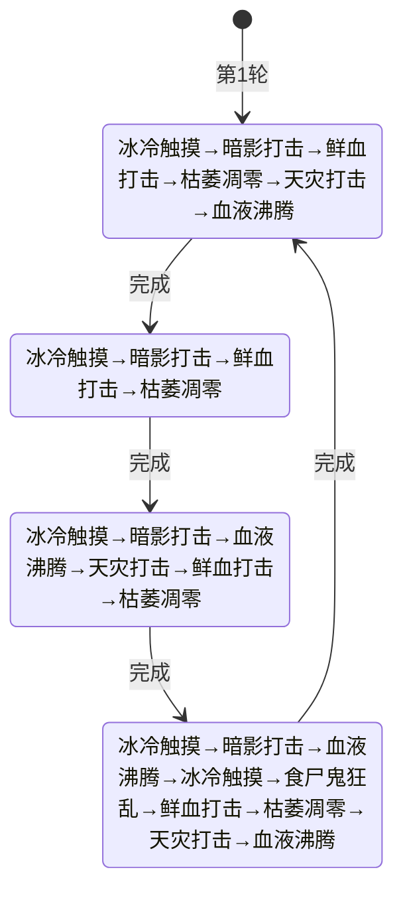

**图表来源**
- [邪dk.wa.ini:182-214](file://邪dk.wa.ini#L182-L214)

#### NA1-NA4 AoE循环策略

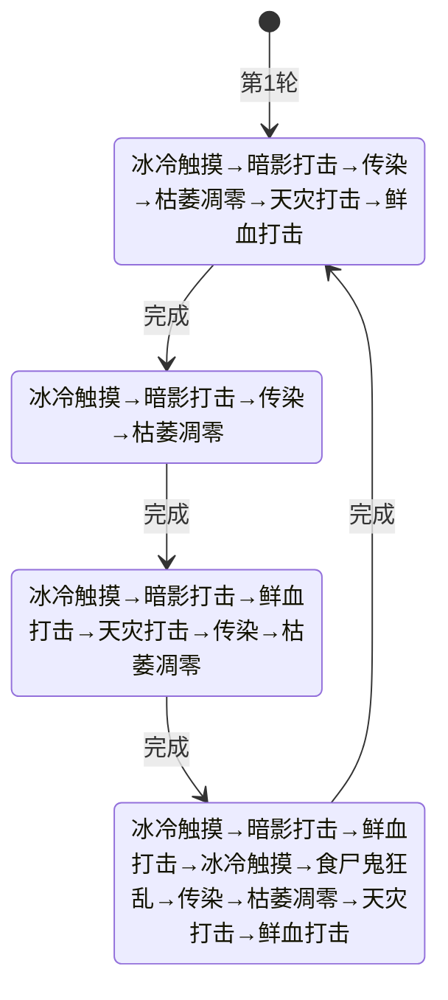

**图表来源**
- [邪dk.wa.ini:215-247](file://邪dk.wa.ini#L215-L247)

**章节来源**
- [邪dk.wa.ini:182-247](file://邪dk.wa.ini#L182-L247)

### 填充技能循环系统

填充技能系统用于处理技能冷却期间的空闲时间，提供最优的替代技能：

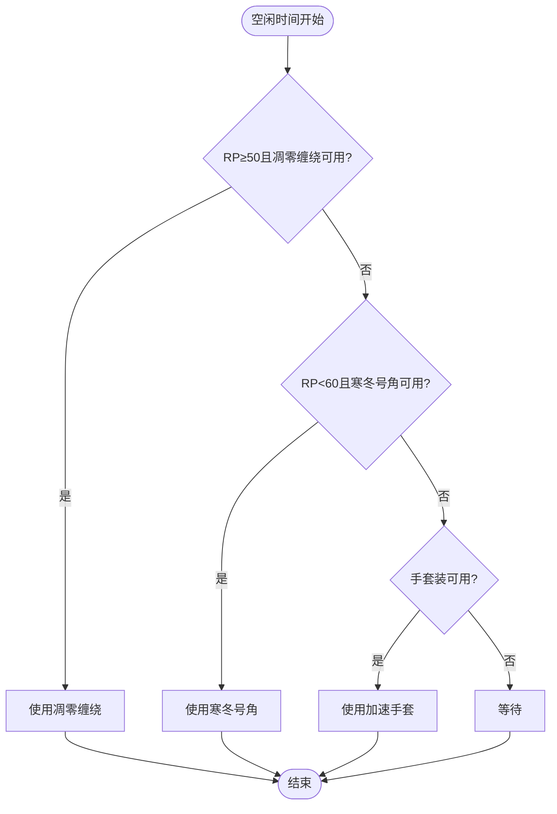

**图表来源**
- [邪dk.wa.ini:365-377](file://邪dk.wa.ini#L365-L377)

**章节来源**
- [邪dk.wa.ini:365-377](file://邪dk.wa.ini#L365-L377)

### 爆发期优化系统

系统实现了智能的爆发期优化，包括手套装的时机控制和狂乱buff的补充机制：

#### 手套装使用策略

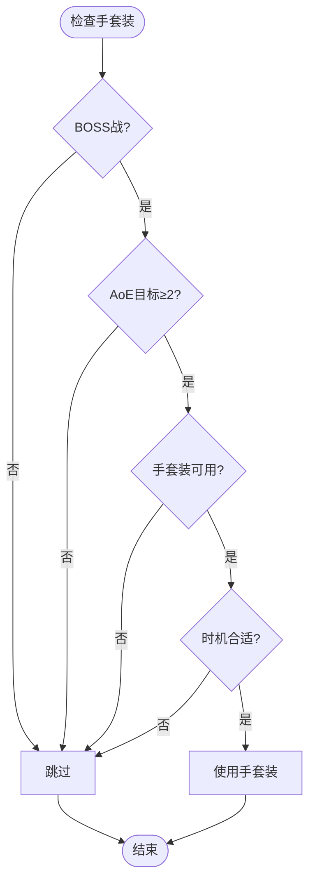

**图表来源**
- [邪dk.wa.ini:470-477](file://邪dk.wa.ini#L470-L477)

#### 狂乱buff补充机制

系统实现了智能的狂乱buff检测和补充逻辑：

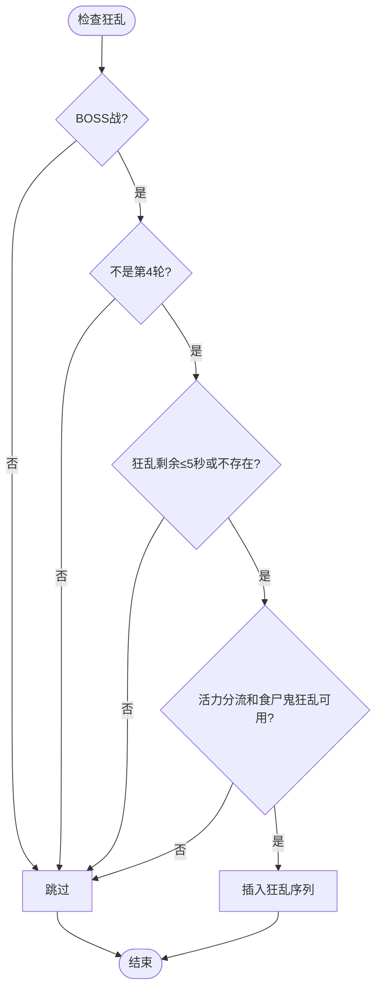

**图表来源**
- [邪dk.wa.ini:401-405](file://邪dk.wa.ini#L401-L405)

**章节来源**
- [邪dk.wa.ini:470-477](file://邪dk.wa.ini#L470-L477)
- [邪dk.wa.ini:401-405](file://邪dk.wa.ini#L401-L405)

### AoE检测算法

系统实现了精确的AoE目标检测算法：

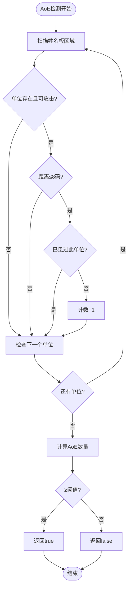

**图表来源**
- [邪dk.wa.ini:62-76](file://邪dk.wa.ini#L62-L76)

**章节来源**
- [邪dk.wa.ini:62-76](file://邪dk.wa.ini#L62-L76)

### 事件处理器

系统通过事件驱动的方式处理战斗中的各种情况：

#### 施法成功事件处理

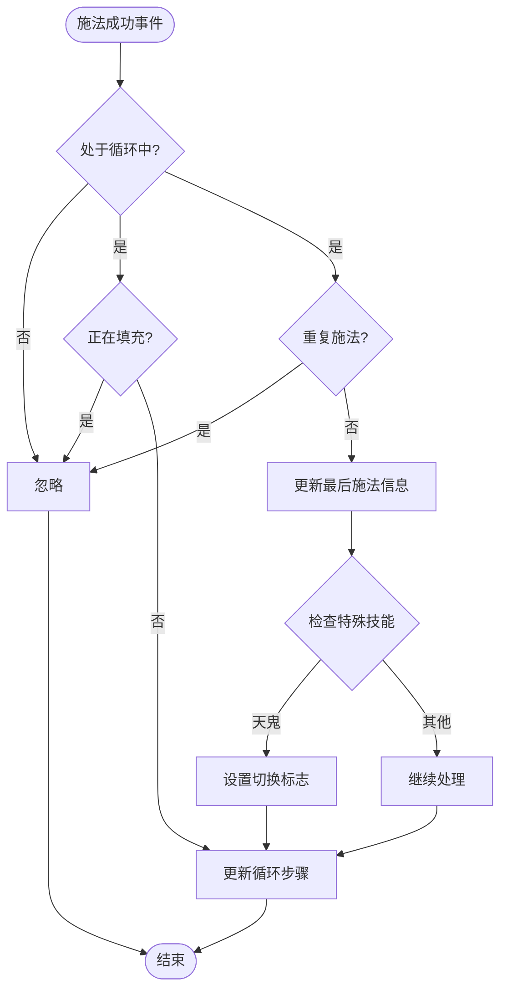

**图表来源**
- [邪dk.wa.ini:284-321](file://邪dk.wa.ini#L284-L321)

#### 命中失败事件处理

系统能够智能地处理各种命中失败情况，包括闪避、格挡、未命中等：

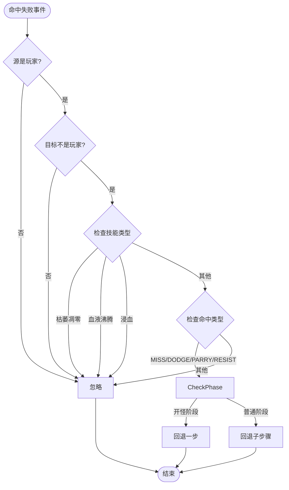

**图表来源**
- [邪dk.wa.ini:323-348](file://邪dk.wa.ini#L323-L348)

**章节来源**
- [邪dk.wa.ini:284-348](file://邪dk.wa.ini#L284-L348)

## 依赖关系分析

系统通过WeakAuras框架提供的API实现功能：

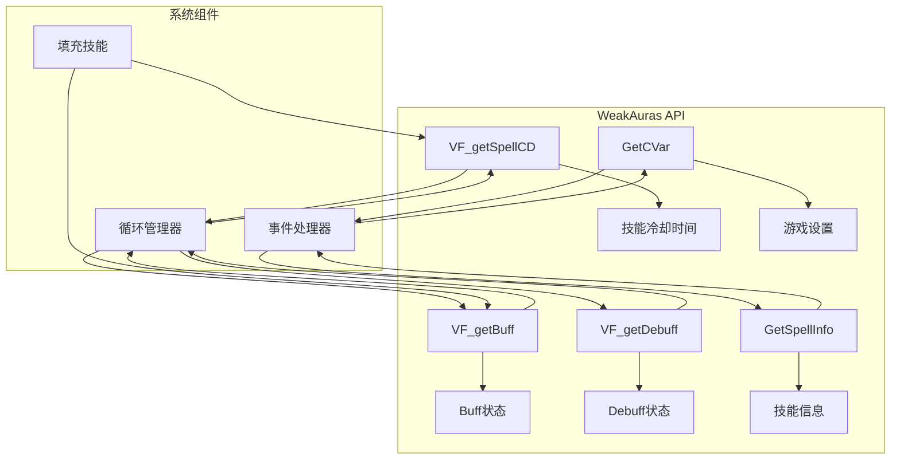

**图表来源**
- [邪dk.wa.ini:17-18](file://邪dk.wa.ini#L17-L18)
- [邪dk.wa.ini:54-60](file://邪dk.wa.ini#L54-L60)

**章节来源**
- [邪dk.wa.ini:17-18](file://邪dk.wa.ini#L17-L18)
- [邪dk.wa.ini:54-60](file://邪dk.wa.ini#L54-L60)

## 性能考量

### 循环优化策略

1. **智能AoE检测**: 使用范围检查和目标计数算法，避免不必要的AoE技能使用
2. **冷却时间优化**: 通过技能冷却时间查询避免无效的技能尝试
3. **状态缓存**: 维护循环状态和期望技能，减少重复计算
4. **事件过滤**: 仅处理相关的战斗日志事件，提高响应效率

### 内存使用优化

- 使用局部变量减少全局状态污染
- 循环表采用紧凑的数据结构
- 条件判断优化，避免深层嵌套

### 性能调优建议

1. **AoE阈值调整**: 根据实际战斗环境调整AoE触发阈值
2. **循环轮次优化**: 根据BOSS特性调整循环轮次的优先级
3. **技能冷却监控**: 实时监控技能冷却状态，避免无效尝试
4. **事件处理优化**: 合理过滤战斗日志事件，减少处理负担

## 故障排除指南

### 常见问题诊断

#### 循环卡顿问题

**症状**: 循环在某个步骤停滞不前
**可能原因**: 
- 技能冷却时间查询异常
- Buff状态检测错误
- 事件处理延迟

**解决方法**:
1. 检查技能ID映射是否正确
2. 验证Buff检测逻辑
3. 确认事件注册状态

#### AoE检测失效

**症状**: AoE技能无法正常触发
**可能原因**:
- 目标检测范围设置不当
- 名称板扫描逻辑错误
- 距离计算精度问题

**解决方法**:
1. 调整检测范围参数
2. 检查单位过滤条件
3. 验证距离计算逻辑

#### 手套装使用时机错误

**症状**: 手套装在不合适的时机使用
**可能原因**:
- 爆发期判断逻辑错误
- 时机检测条件不满足
- 距离和范围检查失败

**解决方法**:
1. 检查BOSS战判定逻辑
2. 验证AoE目标数量
3. 确认手套装可用状态

**章节来源**
- [邪dk.wa.ini:263-275](file://邪dk.wa.ini#L263-L275)
- [邪dk.wa.ini:470-477](file://邪dk.wa.ini#L470-L477)

## 结论

该死亡骑士自动战斗脚本系统展现了高度的智能化和适应性。通过精心设计的循环表结构、智能的AoE检测算法和事件驱动的架构模式，系统能够在不同战斗场景下自动选择最优的技能执行策略。

系统的主要优势包括：
- **模块化设计**: 清晰的组件分离和职责划分
- **智能决策**: 基于战斗状态和环境条件的动态决策
- **性能优化**: 高效的事件处理和状态管理
- **可扩展性**: 易于添加新的循环策略和技能支持

对于初学者，建议从简单的循环表理解开始，逐步掌握事件处理和状态管理的核心概念。对于有经验的开发者，可以在此基础上扩展更多高级功能，如自定义循环策略、更精细的AoE检测等。