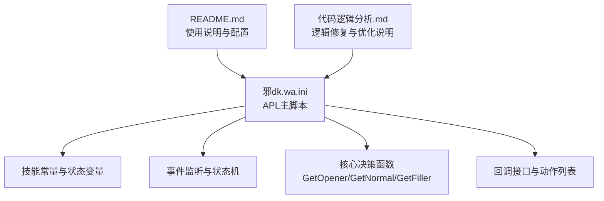
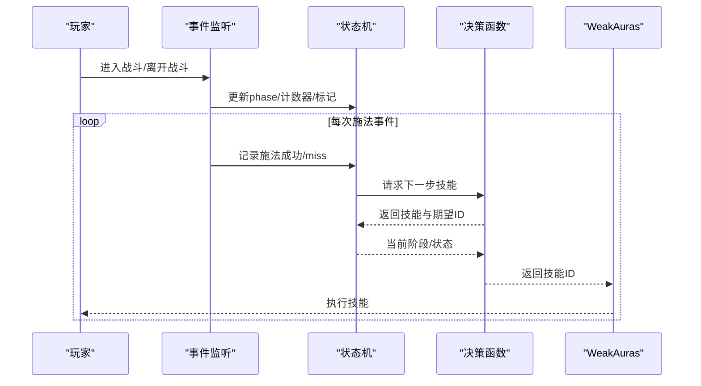
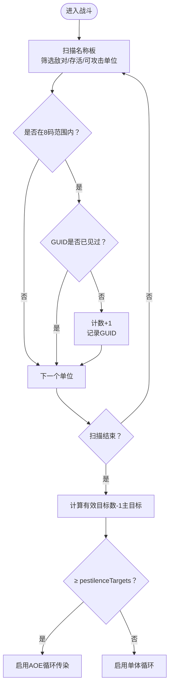
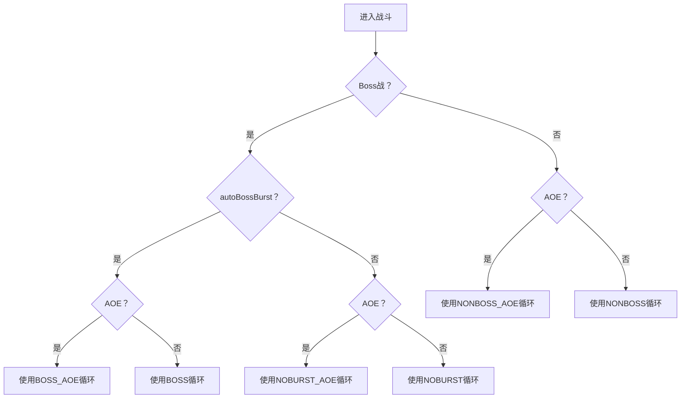
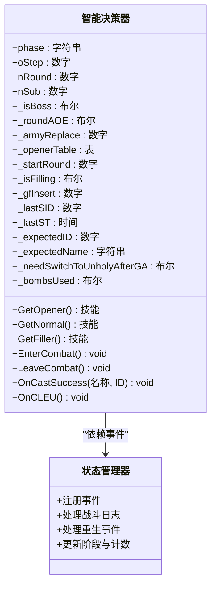
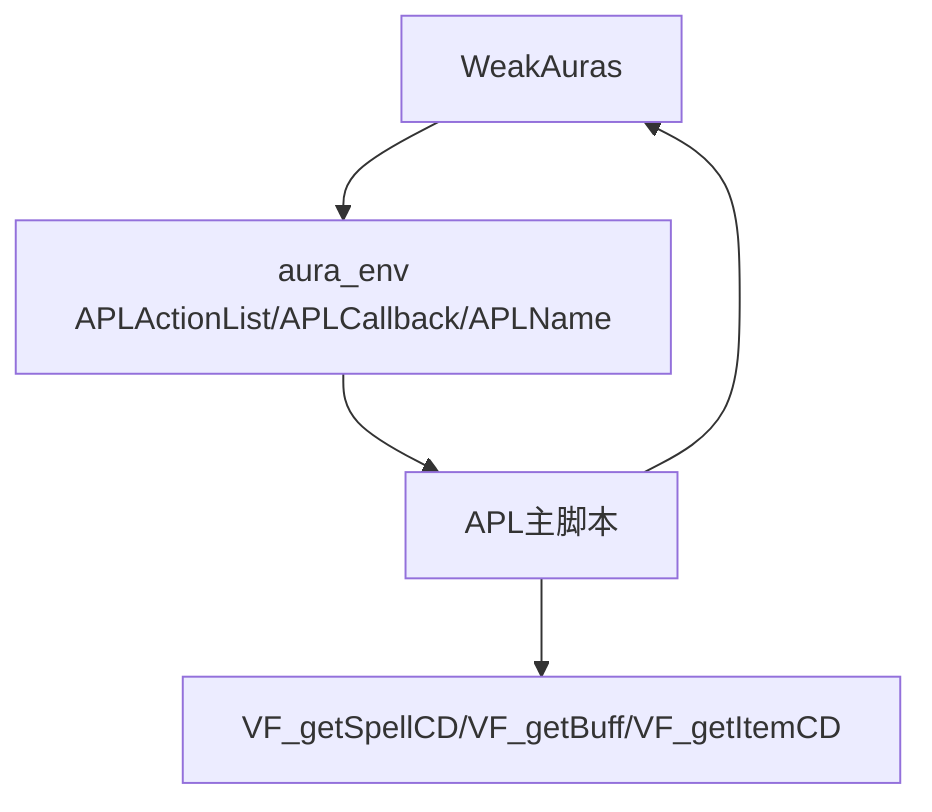

# 智能决策系统

<cite>
**本文引用的文件**
- [邪dk.wa.ini](file://邪dk.wa.ini)
- [README.md](file://README.md)
- [代码逻辑分析.md](file://代码逻辑分析.md)
</cite>

## 目录
1. [简介](#简介)
2. [项目结构](#项目结构)
3. [核心组件](#核心组件)
4. [架构总览](#架构总览)
5. [详细组件分析](#详细组件分析)
6. [依赖关系分析](#依赖关系分析)
7. [性能考量](#性能考量)
8. [故障排查指南](#故障排查指南)
9. [结论](#结论)
10. [附录](#附录)

## 简介
本文件面向“死亡骑士自动战斗脚本智能决策系统”，围绕AoE条件检测（PestInfo）、爆发期判断、技能组合优化与服务器适配逻辑展开，系统性解析智能决策算法、场景识别逻辑与策略选择机制。文档同时提供来自实际代码库的具体示例路径，记录关键决策参数、配置选项与判断条件，并阐明智能决策器与状态管理器的交互关系，最后给出优化建议与自适应调整方案，兼顾初学者与有经验开发者的阅读需求。

## 项目结构
该仓库包含一个完整的APL（Action Priority List）脚本文件，以及配套的使用说明与逻辑分析文档。核心文件如下：
- 邪dk.wa.ini：APL主脚本，包含技能常量、状态变量、事件处理、核心决策函数与回调接口。
- README.md：使用说明、配置参数、技能优先级与预期收益等。
- 代码逻辑分析.md：对关键逻辑修复点与优化点的分析说明。

图表来源
- [邪dk.wa.ini:1-599](file://邪dk.wa.ini#L1-L599)
- [README.md:1-420](file://README.md#L1-L420)
- [代码逻辑分析.md:1-218](file://代码逻辑分析.md#L1-L218)

章节来源
- [邪dk.wa.ini:1-599](file://邪dk.wa.ini#L1-L599)
- [README.md:1-420](file://README.md#L1-L420)
- [代码逻辑分析.md:1-218](file://代码逻辑分析.md#L1-L218)

## 核心组件
- 技能常量与状态变量：集中定义所有可用技能ID与全局状态，便于统一调度与判断。
- 事件监听与状态机：通过注册战斗日志与重生事件，驱动进入/离开战斗、记录施法成功与miss等事件，维护阶段与步进。
- 核心决策函数：根据当前阶段与状态，选择最优技能；包含爆发期判断、AOE阈值检测、资源管理与容错回退。
- 回调接口与动作列表：向WeakAuras提供可执行的技能ID与宏命令，完成最终的动作输出。

章节来源
- [邪dk.wa.ini:21-83](file://邪dk.wa.ini#L21-L83)
- [邪dk.wa.ini:252-362](file://邪dk.wa.ini#L252-L362)
- [邪dk.wa.ini:365-568](file://邪dk.wa.ini#L365-L568)

## 架构总览
APL采用“事件驱动 + 状态机 + 决策函数”的分层架构：
- 事件层：监听战斗日志与玩家重生事件，更新内部状态。
- 状态层：维护阶段（idle/opener/normal）、回合与子步、AOE标记、爆发期标记等。
- 决策层：根据状态与配置，选择下一步技能；在空窗期自动填充，遇到抵抗自动回退。
- 输出层：通过回调返回技能ID，配合WeakAuras执行。

图表来源
- [邪dk.wa.ini:350-362](file://邪dk.wa.ini#L350-L362)
- [邪dk.wa.ini:284-348](file://邪dk.wa.ini#L284-L348)
- [邪dk.wa.ini:545-568](file://邪dk.wa.ini#L545-L568)

## 详细组件分析

### AoE条件检测（PestInfo）
- 目标扫描：遍历名称板，过滤敌对且未死亡单位，计算8码范围内有效目标数量（去重）。
- AOE阈值：当有效目标数减去1（主目标）达到配置阈值（默认2）时，启用AOE循环（使用“传染”）。
- 切换逻辑：进入战斗时根据PestInfo与配置决定使用AOE或单体循环表。

图表来源
- [邪dk.wa.ini:62-76](file://邪dk.wa.ini#L62-L76)
- [邪dk.wa.ini:263](file://邪dk.wa.ini#L263)

章节来源
- [邪dk.wa.ini:62-76](file://邪dk.wa.ini#L62-L76)
- [README.md:24-26](file://README.md#L24-L26)

### 爆发期判断与技能组合优化
- 爆发期判定：Boss战且开启自动爆发时，使用包含“召唤石像鬼”“符文武器增效”“枯萎凋零”“亡者大军”等技能的爆发循环表；否则使用蓄力循环表。
- 爆发期手套使用：在开怪第8-9步之间，若满足条件（近战范围内、未使用过、物品CD就绪），自动使用加速手套+炸弹，使“亡者大军”享受15秒急速增益。
- 狂乱补充：当宠物食尸鬼狂乱buff剩余≤5秒或不存在时，在非N4轮次自动插入“活力分流+食尸鬼狂乱”，避免浪费分流。
- 天鬼后切绿脸：召唤石像鬼后立即切换到邪恶灵气，确保天鬼获得实时急速增益。

图表来源
- [邪dk.wa.ini:264-275](file://邪dk.wa.ini#L264-L275)
- [邪dk.wa.ini:472-477](file://邪dk.wa.ini#L472-L477)
- [README.md:19-22](file://README.md#L19-L22)

章节来源
- [邪dk.wa.ini:264-275](file://邪dk.wa.ini#L264-L275)
- [邪dk.wa.ini:403-405](file://邪dk.wa.ini#L403-L405)
- [README.md:19-22](file://README.md#L19-L22)

### 智能决策算法与策略选择机制
- 阶段化策略：
  - idle：无目标或骨盾/天鬼/绿脸准备，必要时自动施放。
  - opener：开怪爆发阶段，按循环表推进，支持“亡者大军失败补偿”与“寒冬号角CD跳过”等优化。
  - normal：常规循环阶段，按N1/N2/N3/N4或NA1/NA2/NA3/NA4轮次执行，动态切换AOE。
- 容错与回退：当技能被抵抗/未命中时，自动回退一步，避免卡顿。
- 资源管理：在空窗期使用凋零缠绕/寒冬号角/手套填充；RP≥90时强制泄能；战斗中根据AOE阈值切换循环。

图表来源
- [邪dk.wa.ini:44-52](file://邪dk.wa.ini#L44-L52)
- [邪dk.wa.ini:350-362](file://邪dk.wa.ini#L350-L362)
- [邪dk.wa.ini:365-568](file://邪dk.wa.ini#L365-L568)

章节来源
- [邪dk.wa.ini:350-362](file://邪dk.wa.ini#L350-L362)
- [邪dk.wa.ini:365-568](file://邪dk.wa.ini#L365-L568)

### 服务器适配逻辑
- 项目限定：仅在WLK（燃烧远征）项目下运行，避免与其他版本冲突。
- 服务器适配：针对“泰坦重铸·时光”服务器的25人副本环境优化，包括：
  - AOE阈值：从1目标提升至2目标，更贴近高密度战斗。
  - 泄能阈值：从100RP降至90RP，减少RP溢出风险。
  - 自动切绿脸：天鬼后自动切换，最大化天鬼伤害。
  - 爆发期手套使用：在石像鬼后、大军前使用，确保“亡者大军”享受15秒急速。

章节来源
- [README.md:5-12](file://README.md#L5-L12)
- [README.md:390-397](file://README.md#L390-L397)
- [README.md:384-388](file://README.md#L384-L388)

## 依赖关系分析
- WeakAuras集成：通过aura_env暴露APLActionList与APLCallback，供WA执行。
- 自定义API依赖：使用VF_getSpellCD、VF_getBuff、VF_getItemCD、WeakAuras.CheckRange等函数进行状态查询与范围检测。
- 插件依赖：需要WeakAuras插件及相应扩展函数支持。

图表来源
- [邪dk.wa.ini:595-598](file://邪dk.wa.ini#L595-L598)
- [README.md:328-331](file://README.md#L328-L331)

章节来源
- [README.md:328-331](file://README.md#L328-L331)
- [邪dk.wa.ini:595-598](file://邪dk.wa.ini#L595-L598)

## 性能考量
- 事件频率：战斗日志事件频繁，需避免在每次事件中做重型计算；当前通过状态缓存与简单布尔判断降低开销。
- AOE扫描：PestInfo遍历最多40个名称板，建议在低帧环境下适当提高阈值或减少扫描范围。
- 爆发期优化：扩大手套使用窗口（oStep 8-9）与跳过N4轮次动态补充，减少重复与浪费。
- 资源管理：在空窗期使用低耗能技能填充，避免长时间等待CD。

## 故障排查指南
- 天鬼后未切绿脸：确认“召唤石像鬼”施法成功后，系统会设置标志并在下一帧切换；若未生效，检查姿态切换宏或WA配置。
- 手套未使用：检查useGlovesAuto、物品CD、目标距离（≤5码）与_bombsUsed标志；确保在oStep 8-9之间。
- 爆发期未使用手套：确认未在开怪第1步使用过，且当前处于爆发循环表。
- AOE未触发：确认usePestilence开启，且有效目标数达到配置阈值（默认2）。
- 抗拒/未命中导致卡顿：系统会自动回退一步，若持续出现，检查WA宏与目标状态。

章节来源
- [邪dk.wa.ini:297-299](file://邪dk.wa.ini#L297-L299)
- [邪dk.wa.ini:472-477](file://邪dk.wa.ini#L472-L477)
- [README.md:309-312](file://README.md#L309-L312)

## 结论
该智能决策系统通过事件驱动的状态机与多策略循环表，实现了对AoE阈值、爆发期、技能组合与服务器特性的自适应适配。其核心优势在于：
- 动态场景识别与策略切换（单体/AOE）。
- 爆发期与常规期的差异化优化（手套时机、狂乱补充、天鬼后切绿脸）。
- 容错与资源管理的闭环设计（空窗填充、泄能、回退）。

建议在实际使用中结合服务器环境与个人习惯，微调阈值与开关，以获得更佳的DPS表现。

## 附录

### 决策参数与配置选项
- useGlovesAuto：启用自动手套/炸弹（默认true）
- autoBossBurst：启用Boss自动爆发（默认true）
- usePestilence：启用AOE（默认true）
- pestilenceTargets：AOE阈值（默认2）
- useDeathCoil：启用凋零缠绕泄能（默认true）
- useSpeedPotion：使用速度药水（默认true）

章节来源
- [README.md:266-275](file://README.md#L266-L275)

### 关键判断条件与示例路径
- AoE阈值检测：[PestInfo函数:62-76](file://邪dk.wa.ini#L62-L76)，[进入战斗时的AOE判定](file://邪dk.wa.ini#L263)
- 爆发期技能组合：[开怪爆发循环表:90-141](file://邪dk.wa.ini#L90-L141)，[常规爆发循环（手套使用）:472-477](file://邪dk.wa.ini#L472-L477)
- 狂乱补充：[动态补充逻辑（N4跳过）:403-405](file://邪dk.wa.ini#L403-L405)
- 服务器适配：[项目限定与适配说明:5-12](file://README.md#L5-L12)