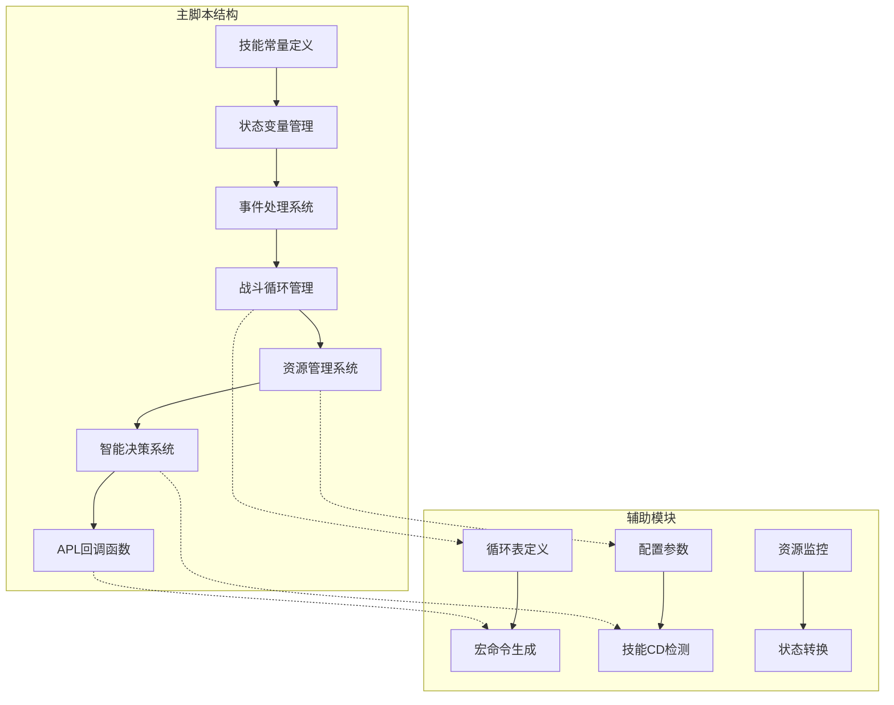
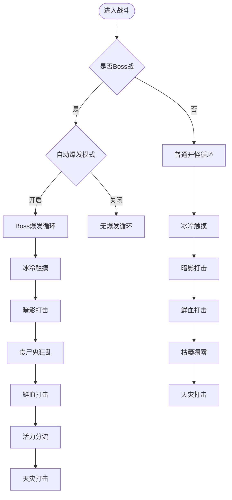
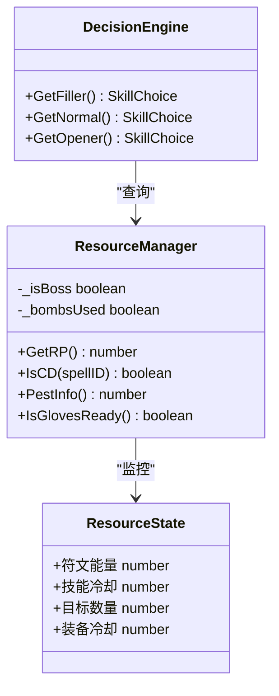
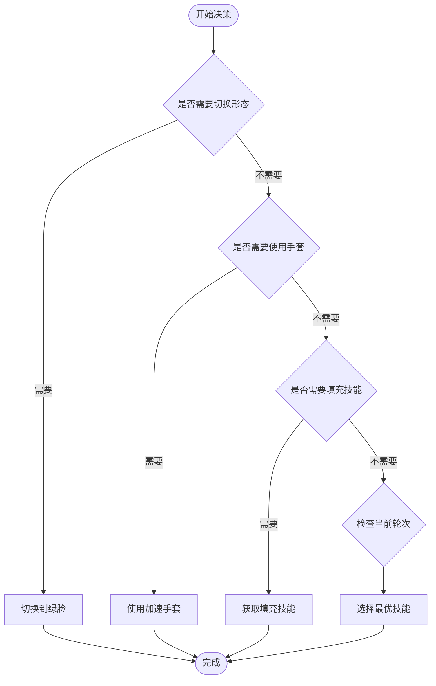
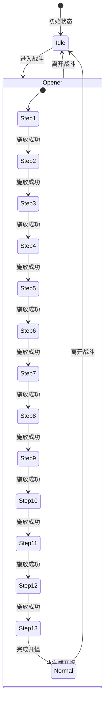
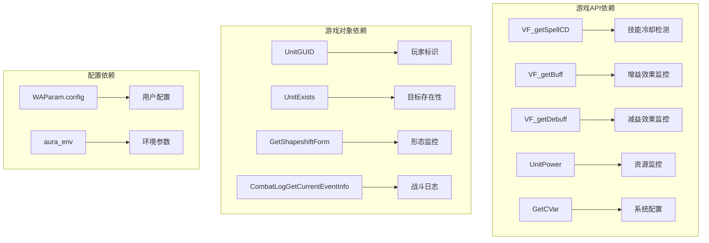
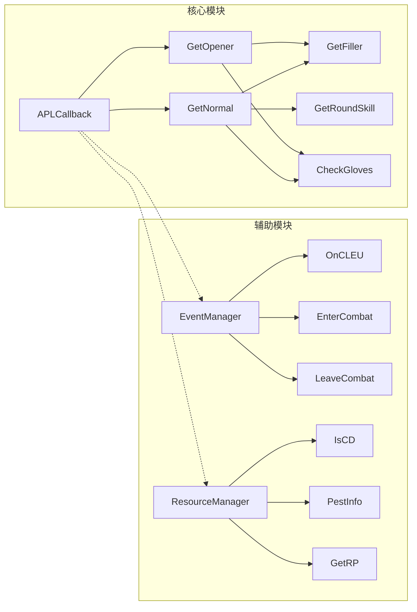

# 核心功能模块

<cite>
**本文档引用的文件**
- [邪dk.wa.ini](file://邪dk.wa.ini)
</cite>

## 目录
1. [简介](#简介)
2. [项目结构](#项目结构)
3. [核心组件](#核心组件)
4. [架构概览](#架构概览)
5. [详细组件分析](#详细组件分析)
6. [依赖关系分析](#依赖关系分析)
7. [性能考虑](#性能考虑)
8. [故障排除指南](#故障排除指南)
9. [结论](#结论)

## 简介

这是一个基于魔兽世界巫妖王之怒版本（Wrath of the Lich King）的死亡骑士自动战斗脚本（APL - Action Priority List）。该脚本实现了完整的战斗自动化系统，包括战斗循环管理、资源管理、智能决策和事件处理四大核心模块。脚本针对时光服服务器进行了专门优化，包含了爆发期管理、AOE阈值调整、资源监控等高级功能。

## 项目结构

该脚本采用单文件架构设计，所有功能都集中在同一个 `.ini` 文件中，通过模块化的方式组织代码：



**图表来源**
- [邪dk.wa.ini:21-42](file://邪dk.wa.ini#L21-L42)
- [邪dk.wa.ini:44-53](file://邪dk.wa.ini#L44-L53)
- [邪dk.wa.ini:350-362](file://邪dk.wa.ini#L350-L362)

**章节来源**
- [邪dk.wa.ini:14-15](file://邪dk.wa.ini#L14-L15)
- [邪dk.wa.ini:21-42](file://邪dk.wa.ini#L21-L42)
- [邪dk.wa.ini:44-53](file://邪dk.wa.ini#L44-L53)

## 核心组件

### 战斗循环管理系统

战斗循环管理系统负责维护和执行完整的战斗序列，包括开怪循环、普通循环和爆发期管理。系统通过状态机模式实现，支持多种战斗场景：

- **开怪循环**：针对Boss战的高爆发序列
- **普通循环**：标准的单目标战斗序列  
- **AOE循环**：多目标战斗序列
- **爆发期管理**：特殊时间段的技能优先级调整

### 资源管理系统

资源管理系统监控和控制死亡骑士的关键资源：
- **符文能量（Runic Power）**：主要攻击资源
- **符文冷却时间**：技能可用性检测
- **宠物状态**：食尸鬼和石像鬼的状态监控
- **装备冷却**：手套等物品的使用时机

### 智能决策系统

智能决策系统根据当前战斗状态动态选择最优技能：
- **技能优先级判断**：基于CD和资源状态
- **战斗场景识别**：Boss战与普通战的区别
- **AOE阈值计算**：基于目标数量的技能切换
- **爆发期优化**：特定时间段的技能组合

### 事件处理系统

事件处理系统监听游戏事件并做出相应响应：
- **战斗开始/结束**：状态机切换
- **技能施放成功**：循环步骤推进
- **技能缺失**：循环回退机制
- **战斗日志**：精确的技能执行跟踪

**章节来源**
- [邪dk.wa.ini:85-250](file://邪dk.wa.ini#L85-L250)
- [邪dk.wa.ini:251-362](file://邪dk.wa.ini#L251-L362)
- [邪dk.wa.ini:364-575](file://邪dk.wa.ini#L364-L575)

## 架构概览

该脚本采用模块化架构设计，各个组件通过清晰的接口进行交互：

```mermaid
sequenceDiagram
participant Game as 游戏引擎
participant Event as 事件处理器
participant Loop as 循环管理器
participant Resource as 资源管理器
participant Decision as 决策系统
participant APL as APL回调
Game->>Event : COMBAT_LOG_EVENT_UNFILTERED
Event->>Loop : OnCLEU()
Loop->>Loop : 更新循环状态
Loop->>Resource : 检查资源状态
Resource->>Decision : 提供资源数据
Decision->>APL : 返回技能ID
APL->>Game : 执行技能
Game->>Event : PLAYER_REGEN_DISABLED
Event->>Loop : EnterCombat()
Loop->>Loop : 初始化战斗状态
```

**图表来源**
- [邪dk.wa.ini:350-362](file://邪dk.wa.ini#L350-L362)
- [邪dk.wa.ini:252-282](file://邪dk.wa.ini#L252-L282)
- [邪dk.wa.ini:364-575](file://邪dk.wa.ini#L364-L575)

## 详细组件分析

### 战斗循环管理系统

#### 开怪循环（Opener）

开怪循环针对Boss战设计，包含完整的爆发序列：



**图表来源**
- [邪dk.wa.ini:90-157](file://邪dk.wa.ini#L90-L157)
- [邪dk.wa.ini:252-276](file://邪dk.wa.ini#L252-L276)

#### 普通循环（Normal Rounds）

普通循环包含多个轮次，每轮包含不同的技能序列：

| 轮次 | 技能序列 | AOE模式 |
|------|----------|---------|
| N1 | 冰冷触摸 → 暗影打击 → 鲜血打击 → 枯萎凋零 → 天灾打击 → 血液沸腾 | 单目标 |
| N2 | 冰冷触摸 → 暗影打击 → 鲜血打击 → 枯萎凋零 | 单目标 |
| N3 | 冰冷触摸 → 暗影打击 → 血液沸腾 → 天灾打击 → 鲜血打击 → 枯萎凋零 | 单目标 |
| N4 | 冰冷触摸 → 暗影打击 → 血液沸腾 → 冰冷触摸 → 食尸鬼狂乱 → 鲜血打击 → 枯萎凋零 → 天灾打击 → 血液沸腾 | 单目标 |

**章节来源**
- [邪dk.wa.ini:182-249](file://邪dk.wa.ini#L182-L249)
- [邪dk.wa.ini:252-276](file://邪dk.wa.ini#L252-L276)

### 资源管理系统

#### 资源监控机制

资源管理系统通过以下函数监控关键资源：



**图表来源**
- [邪dk.wa.ini:58-83](file://邪dk.wa.ini#L58-L83)
- [邪dk.wa.ini:365-377](file://邪dk.wa.ini#L365-L377)

#### 资源阈值配置

系统支持灵活的资源阈值配置：

- **泄能阈值**：默认90符文能量
- **AOE阈值**：默认2个目标
- **爆发期阈值**：石像鬼后、大军前使用手套
- **狂乱补充阈值**：剩余≤5秒时自动补充

**章节来源**
- [邪dk.wa.ini:58-83](file://邪dk.wa.ini#L58-L83)
- [邪dk.wa.ini:401-405](file://邪dk.wa.ini#L401-L405)

### 智能决策系统

#### 技能选择算法

智能决策系统采用优先级队列算法，根据以下因素确定技能选择：



**图表来源**
- [邪dk.wa.ini:379-455](file://邪dk.wa.ini#L379-L455)
- [邪dk.wa.ini:457-551](file://邪dk.wa.ini#L457-L551)

#### 形态切换逻辑

系统支持三种死亡骑士形态的智能切换：

- **鲜血形态**：主要用于生存和伤害输出
- **邪恶形态**：用于爆发和AOE伤害
- **冰霜形态**：用于控制和减速效果

**章节来源**
- [邪dk.wa.ini:381-390](file://邪dk.wa.ini#L381-L390)
- [邪dk.wa.ini:537-541](file://邪dk.wa.ini#L537-L541)

### 事件处理系统

#### 事件监听机制

事件处理系统通过注册游戏事件来响应战斗变化：



**图表来源**
- [邪dk.wa.ini:350-362](file://邪dk.wa.ini#L350-L362)
- [邪dk.wa.ini:252-282](file://邪dk.wa.ini#L252-L282)

#### 错误处理机制

系统包含完善的错误处理和容错机制：

- **技能缺失处理**：当技能不可用时自动回退
- **循环同步**：通过期望ID确保循环同步
- **状态重置**：战斗结束时重置所有状态
- **异常恢复**：检测到异常时自动恢复

**章节来源**
- [邪dk.wa.ini:284-348](file://邪dk.wa.ini#L284-L348)
- [邪dk.wa.ini:301-321](file://邪dk.wa.ini#L301-L321)

## 依赖关系分析

### 外部依赖

该脚本依赖于以下外部系统和API：



**图表来源**
- [邪dk.wa.ini:17-18](file://邪dk.wa.ini#L17-L18)
- [邪dk.wa.ini:54-56](file://邪dk.wa.ini#L54-L56)
- [邪dk.wa.ini:263-264](file://邪dk.wa.ini#L263-L264)

### 内部模块依赖



**图表来源**
- [邪dk.wa.ini:552-575](file://邪dk.wa.ini#L552-L575)
- [邪dk.wa.ini:251-362](file://邪dk.wa.ini#L251-L362)
- [邪dk.wa.ini:364-455](file://邪dk.wa.ini#L364-L455)

**章节来源**
- [邪dk.wa.ini:552-575](file://邪dk.wa.ini#L552-L575)
- [邪dk.wa.ini:251-362](file://邪dk.wa.ini#L251-L362)

## 性能考虑

### 优化策略

1. **事件过滤优化**：只处理玩家相关的战斗日志事件
2. **CD检测缓存**：减少重复的CD查询操作
3. **状态机优化**：通过状态变量避免不必要的计算
4. **循环表优化**：使用预定义的循环表减少运行时计算

### 内存使用

- **全局变量**：仅使用必要的状态变量
- **循环表**：预分配固定大小的数组
- **事件处理**：及时清理不再使用的状态

### 执行效率

- **早期退出**：在满足条件时立即返回结果
- **批量检查**：一次检查多个条件
- **缓存机制**：缓存昂贵的操作结果

## 故障排除指南

### 常见问题及解决方案

#### 技能顺序错误

**问题描述**：技能执行顺序不符合预期
**可能原因**：
- CD检测失败
- 形态切换延迟
- 循环同步问题

**解决方案**：
- 检查技能ID映射
- 验证CD检测函数
- 确认期望ID设置

#### 资源管理问题

**问题描述**：符文能量或技能冷却显示异常
**可能原因**：
- 资源监控函数错误
- 缓存数据过期
- 系统时间差异

**解决方案**：
- 验证资源监控函数
- 检查缓存更新机制
- 对齐系统时间

#### AOE阈值问题

**问题描述**：AOE技能切换时机不正确
**可能原因**：
- 目标计数错误
- 距离检测问题
- 配置参数设置

**解决方案**：
- 验证目标检测逻辑
- 检查距离计算函数
- 调整AOE阈值配置

### 调试技巧

1. **启用调试输出**：添加日志语句跟踪状态变化
2. **单元测试**：为关键函数编写测试用例
3. **性能分析**：监控执行时间和内存使用
4. **边界测试**：测试极端情况下的行为

**章节来源**
- [邪dk.wa.ini:284-348](file://邪dk.wa.ini#L284-L348)
- [邪dk.wa.ini:401-405](file://邪dk.wa.ini#L401-L405)

## 结论

这个死亡骑士自动战斗脚本展现了现代游戏AI系统的最佳实践，通过模块化设计实现了高度可维护性和扩展性。脚本的核心优势包括：

1. **完整的功能覆盖**：从基础的技能选择到复杂的战斗场景处理
2. **智能的决策机制**：基于实时状态的动态决策
3. **稳健的错误处理**：完善的容错和恢复机制
4. **优秀的性能表现**：高效的算法和优化策略

该脚本为死亡骑士玩家提供了专业级的自动化战斗体验，同时保持了足够的灵活性以适应不同的战斗场景和玩家偏好。通过深入理解其架构设计和实现细节，开发者可以进一步扩展和定制这个系统以满足更复杂的需求。