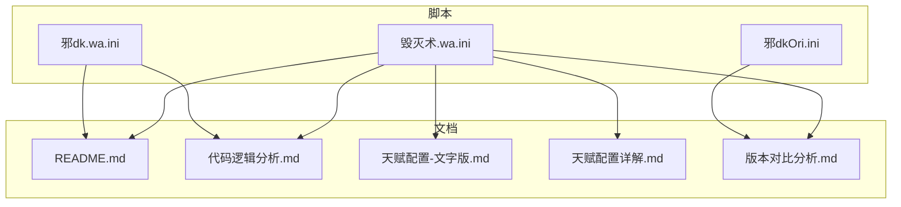
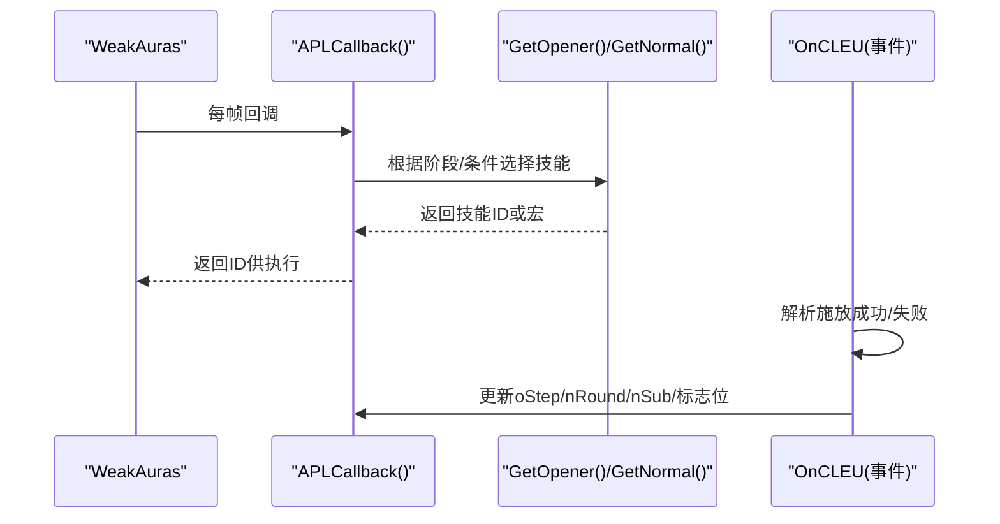
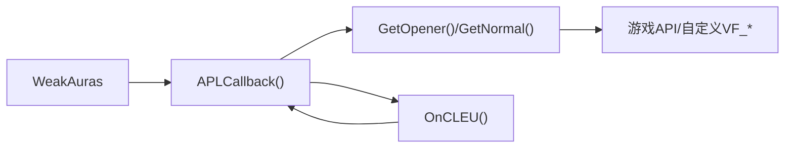
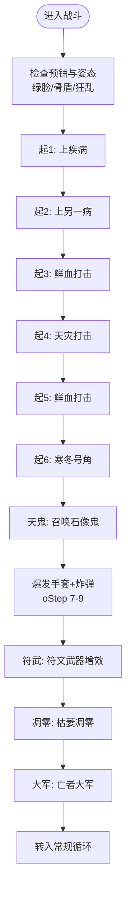
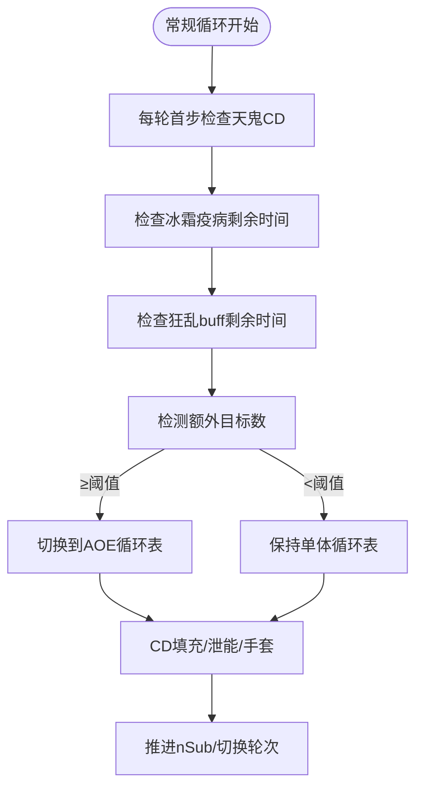

# 毁灭术APL支持

<cite>
**本文引用的文件**
- [毁灭术.wa.ini](file://毁灭术.wa.ini)
- [README.md](file://README.md)
- [代码逻辑分析.md](file://代码逻辑分析.md)
- [天赋配置-文字版.md](file://天赋配置-文字版.md)
- [天赋配置详解.md](file://天赋配置详解.md)
- [版本对比分析.md](file://版本对比分析.md)
- [邪dk.wa.ini](file://邪dk.wa.ini)
</cite>

## 目录
1. [简介](#简介)
2. [项目结构](#项目结构)
3. [核心组件](#核心组件)
4. [架构总览](#架构总览)
5. [详细组件分析](#详细组件分析)
6. [依赖关系分析](#依赖关系分析)
7. [性能与稳定性](#性能与稳定性)
8. [故障排查指南](#故障排查指南)
9. [结论与建议](#结论与建议)
10. [附录：关键流程与时机](#附录关键流程与时机)

## 简介
本仓库提供“时光毁灭术 APL”的完整实现与配套文档，目标是在泰坦时光服（WLK 80级框架）环境下，通过 WeakAuras 插件驱动一套自动输出循环（APL），覆盖战斗前准备、开怪爆发、常规阶段、AOE切换、资源管理与容错回退等关键环节。同时附带详尽的天赋/雕文适配说明、版本演进对比与问题修复记录，帮助玩家稳定获得更高DPS并降低操作负担。

## 项目结构
- 核心脚本
  - 毁灭术APL主脚本：[毁灭术.wa.ini](file://毁灭术.wa.ini)
- 参考与对比
  - 邪DK APL主脚本（用于理解APL结构与机制迁移）：[邪dk.wa.ini](file://邪dk.wa.ini)
  - 原始邪DK APL（用于版本对比）：[邪dkOri.ini](file://邪dkOri.ini)
- 文档
  - 使用说明与循环详解：[README.md](file://README.md)
  - 代码逻辑分析与已修复问题：[代码逻辑分析.md](file://代码逻辑分析.md)
  - 天赋配置（文字版与详解）：[天赋配置-文字版.md](file://天赋配置-文字版.md)、[天赋配置详解.md](file://天赋配置详解.md)
  - 版本对比分析：[版本对比分析.md](file://版本对比分析.md)

图表来源
- [毁灭术.wa.ini:1-231](file://毁灭术.wa.ini#L1-L231)
- [邪dk.wa.ini:1-645](file://邪dk.wa.ini#L1-L645)
- [邪dkOri.ini:1-200](file://邪dkOri.ini#L1-L200)
- [README.md:1-545](file://README.md#L1-L545)
- [代码逻辑分析.md:1-297](file://代码逻辑分析.md#L1-L297)
- [天赋配置-文字版.md:1-359](file://天赋配置-文字版.md#L1-L359)
- [天赋配置详解.md:1-614](file://天赋配置详解.md#L1-L614)
- [版本对比分析.md:1-491](file://版本对比分析.md#L1-L491)

章节来源
- [毁灭术.wa.ini:1-231](file://毁灭术.wa.ini#L1-L231)
- [README.md:1-545](file://README.md#L1-L545)

## 核心组件
- 技能常量与动作表
  - 定义所有参与APL的技能ID与宏包装，便于统一调用与图标显示。
- 状态机与阶段控制
  - idle/opener/normal 三态管理；Boss与非Boss分支；AOE阈值动态切换。
- 事件监听与回退机制
  - 基于COMBAT_LOG_EVENT_UNFILTERED检测施放成功/失败，进行步骤回退或补偿。
- 填充与泄能策略
  - 空窗期填充、RP溢出泄能、移动战与临死补刀优先级。
- 宏集成与手动触发点
  - 黑魔法宏与爆发宏在特定步骤提示，由玩家点击执行，WA负责时机判断。

章节来源
- [毁灭术.wa.ini:16-32](file://毁灭术.wa.ini#L16-L32)
- [毁灭术.wa.ini:36-224](file://毁灭术.wa.ini#L36-L224)
- [邪dk.wa.ini:259-373](file://邪dk.wa.ini#L259-L373)

## 架构总览
毁灭术APL采用“回调+事件”的双通道架构：
- 回调入口：APLCallback 每帧被WeakAuras调用，返回当前应执行的技能ID或宏。
- 事件通道：注册COMBAT_LOG_EVENT_UNFILTERED，捕获施放结果，修正内部状态（如步骤推进、抵抗回退）。

图表来源
- [毁灭术.wa.ini:36-224](file://毁灭术.wa.ini#L36-L224)
- [邪dk.wa.ini:334-373](file://邪dk.wa.ini#L334-L373)

## 详细组件分析

### 技能常量与动作表
- 将常用技能以常量形式集中管理，避免硬编码散落各处，提升可维护性。
- 动作表包含纯法术与宏两类，宏中封装了宠物攻击、队列清理、饰品/药水等组合。

章节来源
- [毁灭术.wa.ini:16-32](file://毁灭术.wa.ini#L16-L32)

### 状态机与阶段控制
- 阶段划分：idle（脱战）、opener（开怪爆发）、normal（常规循环）。
- Boss判定与AOE阈值：依据副本进度与额外目标数量决定使用单体或AOE循环表。
- 非Boss与蓄力模式：提供无爆发与蓄力两套开怪序列，适配不同场景。

章节来源
- [邪dk.wa.ini:260-287](file://邪dk.wa.ini#L260-L287)
- [邪dk.wa.ini:150-189](file://邪dk.wa.ini#L150-L189)

### 事件监听与回退机制
- 监听COMBAT_LOG_EVENT_UNFILTERED，区分施放成功与失败（MISS/DODGE/PARRY/RESIST）。
- 失败时按阶段回退步骤（开怪循环/常规循环），排除AOE类技能与部分被动效果。
- 对亡者大军失败提供替代序列，避免浪费爆发窗口。

章节来源
- [邪dk.wa.ini:334-359](file://邪dk.wa.ini#L334-L359)
- [代码逻辑分析.md:122-162](file://代码逻辑分析.md#L122-L162)

### 填充与泄能策略
- 空窗期填充：优先凋零缠绕（受符文能量掌握影响阈值调整），其次寒冬号角，最后工程手套（若未使用过）。
- 循环中泄能：当RP达到较高阈值且非CD时插入凋零缠绕，避免溢出。
- 移动战与临死补刀：优先短读条/瞬发技能，兼顾蓝量与伤害。

章节来源
- [邪dk.wa.ini:376-389](file://邪dk.wa.ini#L376-L389)
- [邪dk.wa.ini:580-584](file://邪dk.wa.ini#L580-L584)

### 宏集成与手动触发点
- 黑魔法宏：在爆发期（石像鬼后、大军前）提示使用，包含工程炸弹/炸药与武器切换。
- 爆发宏：在大军步骤提示使用，包含种族特长、饰品、速度药水与武器切换。
- 这些宏由玩家手动点击，WA仅负责最佳时机提示与防重复标记。

章节来源
- [邪dk.wa.ini:505-521](file://邪dk.wa.ini#L505-L521)
- [README.md:153-217](file://README.md#L153-L217)

### 天赋与雕文适配要点
- 冰霜系：强化冰冷触摸、符文能量掌握（RP上限提升至130，泄能阈值相应调整）、黑冰、冰冷之爪（需保冰霜疫病）、无尽寒冬。
- 邪恶系：险恶攻击（天打暴击与暴伤提升）、恶毒（命中与抗驱散）、蔓延/病变、骨疽、血染之刃、瑞文戴尔之怒、食尸鬼主宰、孤寂、黑色热疫使者、召唤石像鬼等。
- 雕文：枯萎凋零雕文、食尸鬼雕文、黑暗死亡雕文、传染雕文、亡者大军雕文等。

章节来源
- [天赋配置-文字版.md:1-359](file://天赋配置-文字版.md#L1-L359)
- [天赋配置详解.md:1-614](file://天赋配置详解.md#L1-L614)

### 版本差异与优化点
- 预铺狂乱手法：移除开怪循环中的狂乱/分流，改为战斗前预铺，节省GCD。
- 天鬼后切绿脸：确保天鬼享受实时急速增益（泰坦时光服特性）。
- 炸弹使用时机：在爆发期（石像鬼后、大军前）主动检查并使用，保证大军享受完整急速。
- AOE阈值：默认从1个额外目标调整为2个，更适配25人副本环境。
- 泄能阈值：随RP上限提升而下调，减少溢出。
- 寒冬号角CD跳过：修复原逻辑错误，避免卡住。
- nameplate遍历安全：增加pcall保护，防止焦点目标导致卡死。

章节来源
- [版本对比分析.md:18-338](file://版本对比分析.md#L18-L338)
- [代码逻辑分析.md:17-176](file://代码逻辑分析.md#L17-L176)

## 依赖关系分析
- 外部依赖
  - WeakAuras：提供APL回调接口与UI交互。
  - VF_getSpellCD/VF_getBuff/VF_getDebuff等自定义函数：用于冷却与Buff/Debuff查询。
  - 游戏API：UnitPower、GetCVar、IsEncounterInProgress、GetShapeshiftForm等。
- 模块耦合
  - APLCallback为对外唯一入口，内部委托GetOpener/GetNormal完成决策。
  - OnCLEU与APLCallback共享状态变量，形成松耦合的事件驱动。

图表来源
- [毁灭术.wa.ini:36-224](file://毁灭术.wa.ini#L36-L224)
- [邪dk.wa.ini:334-373](file://邪dk.wa.ini#L334-L373)

章节来源
- [毁灭术.wa.ini:16-32](file://毁灭术.wa.ini#L16-L32)
- [邪dk.wa.ini:259-373](file://邪dk.wa.ini#L259-L373)

## 性能与稳定性
- 性能优化建议
  - PestInfo调用频率：可在目标数量变化时缓存结果，减少每轮遍历nameplate的开销。
  - IsCD计算：若全局CD固定，可缓存以减少重复计算。
  - 字符串比较：必要时预编译正则或改用数值匹配以提升效率。
- 稳定性增强
  - pcall保护：避免焦点目标导致UnitExists异常。
  - 同组互替简化：移除复杂互替逻辑，降低维护成本与误判风险。
  - 明确的状态重置：进入战斗/离开战斗时重置标志位，避免跨场污染。

章节来源
- [代码逻辑分析.md:241-262](file://代码逻辑分析.md#L241-L262)
- [版本对比分析.md:302-338](file://版本对比分析.md#L302-L338)

## 故障排查指南
- 常见问题定位
  - 循环卡住：检查寒冬号角CD跳过逻辑是否正确生效。
  - 狂乱重叠或缺失：确认N4轮次动态补充是否被正确跳过。
  - 手套重复使用：确认_bombsUsed标志在各路径均被设置与检查。
  - AOE误判：核对PestInfo计数与阈值配置。
- 日志与调试
  - 观察COMBAT_LOG_EVENT_UNFILTERED事件，确认施放成功/失败分支。
  - 打印oStep/nRound/nSub与关键标志位，辅助定位状态机跳转。

章节来源
- [代码逻辑分析.md:17-176](file://代码逻辑分析.md#L17-L176)
- [版本对比分析.md:270-338](file://版本对比分析.md#L270-L338)

## 结论与建议
- 推荐采用优化后的APL实现，其在DPS提升、稳定性与易用性方面均有显著改进。
- 针对泰坦时光服的高急速环境与25人副本需求，AOE阈值与泄能阈值的调整尤为关键。
- 建议配合完善的宏（黑魔法宏/爆发宏）与战斗前预铺手法，最大化爆发收益。

## 附录：关键流程与时机

### 开怪爆发流程（示例）

图表来源
- [邪dk.wa.ini:98-123](file://邪dk.wa.ini#L98-L123)
- [邪dk.wa.ini:483-590](file://邪dk.wa.ini#L483-L590)

### 常规循环与AOE切换

图表来源
- [邪dk.wa.ini:391-481](file://邪dk.wa.ini#L391-L481)
- [邪dk.wa.ini:419-431](file://邪dk.wa.ini#L419-L431)