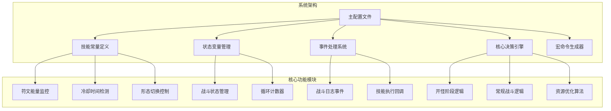
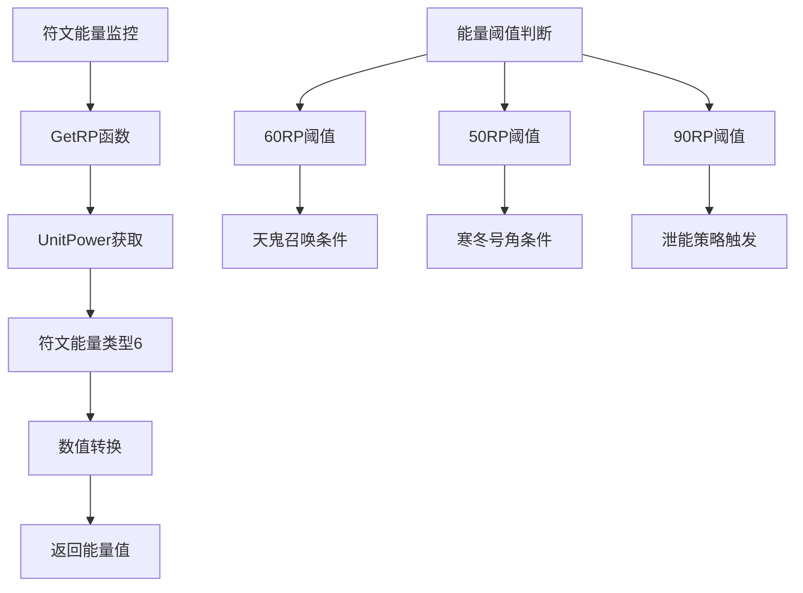
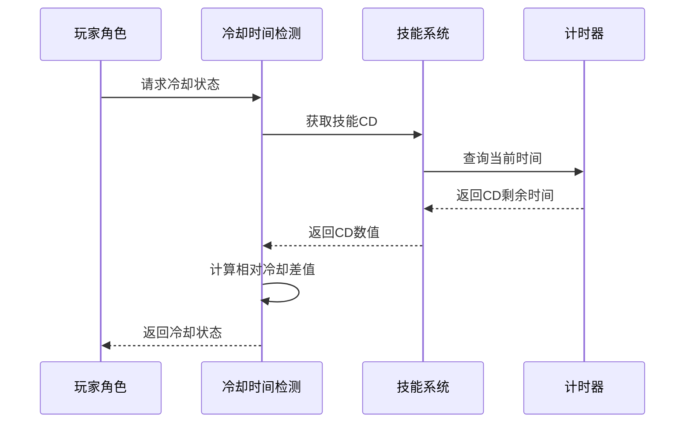
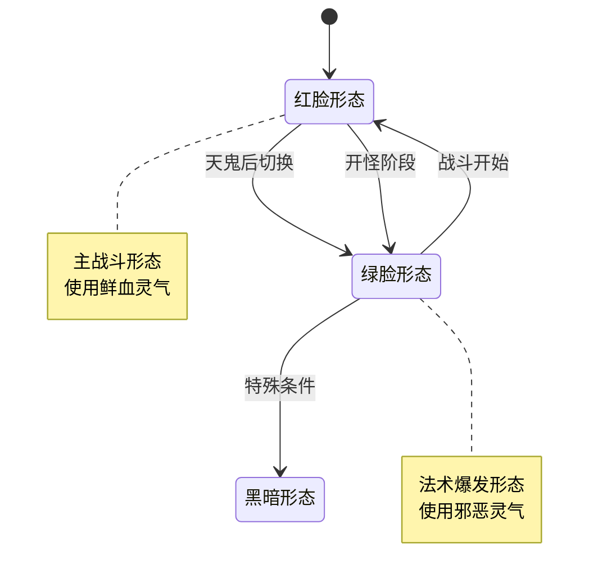
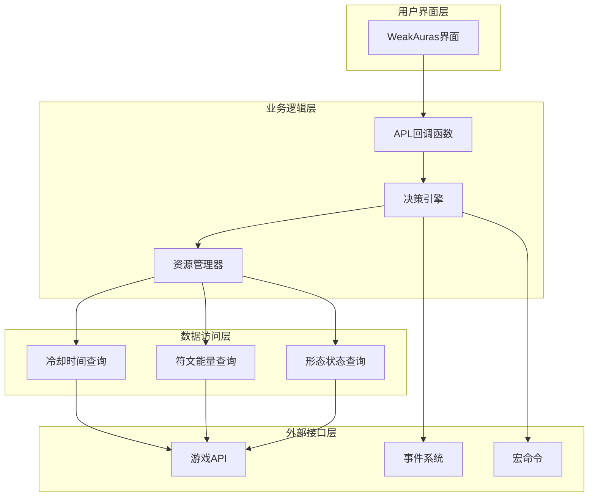
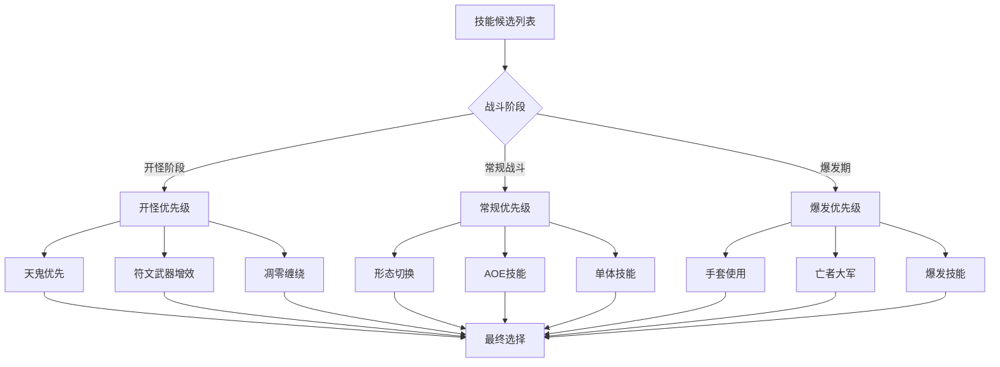
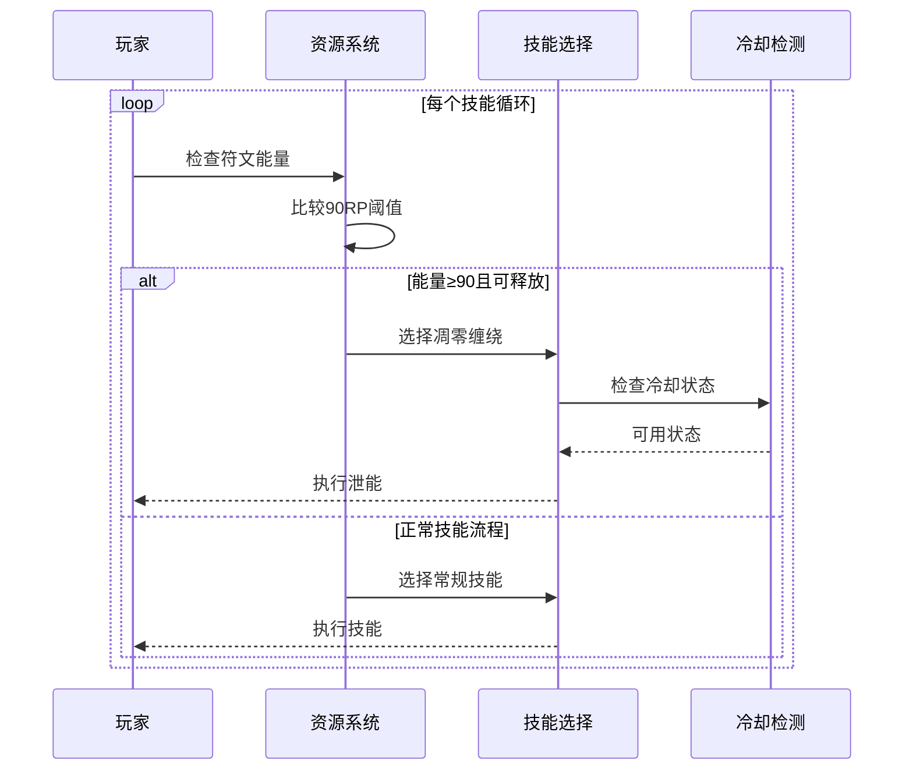
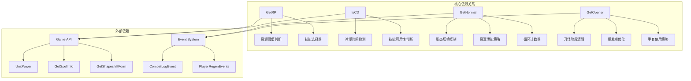
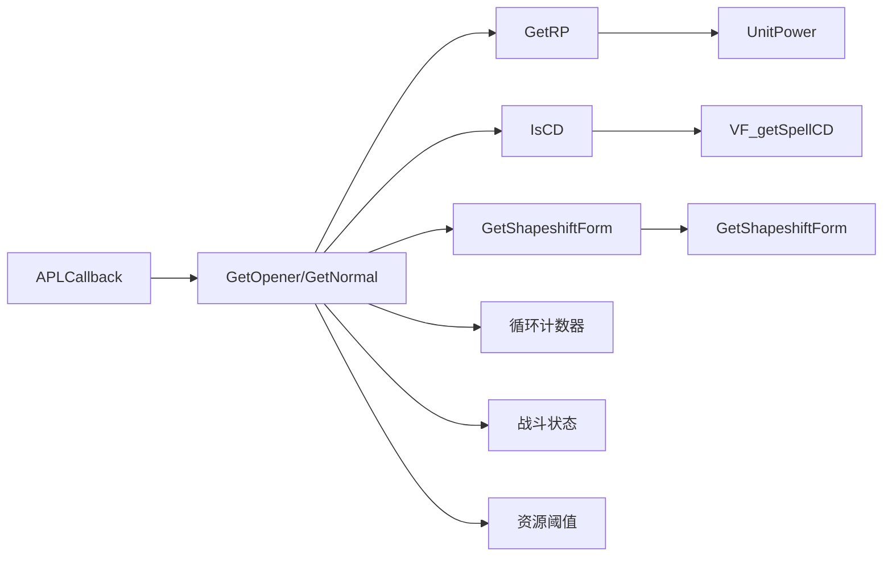

# 资源管理系统

<cite>
**本文档引用的文件**
- [邪dk.wa.ini](file://邪dk.wa.ini)
</cite>

## 目录
1. [简介](#简介)
2. [项目结构](#项目结构)
3. [核心组件](#核心组件)
4. [架构概览](#架构概览)
5. [详细组件分析](#详细组件分析)
6. [依赖关系分析](#依赖关系分析)
7. [性能考量](#性能考量)
8. [故障排除指南](#故障排除指南)
9. [结论](#结论)

## 简介

这是一个基于WeakAuras的死亡骑士自动战斗脚本资源管理系统，专为魔兽世界燃烧的远征版本设计。该系统实现了符文能量监控、冷却时间管理、形态切换控制和资源泄能策略的完整自动化机制。系统通过智能的资源阈值设置、技能优先级排序和资源优化算法，为玩家提供高效的战斗体验。

## 项目结构

该系统采用单一配置文件结构，包含了完整的APL（Action Priority List）逻辑实现：

**图表来源**
- [邪dk.wa.ini:17-606](file://邪dk.wa.ini#L17-L606)

**章节来源**
- [邪dk.wa.ini:14-606](file://邪dk.wa.ini#L14-L606)

## 核心组件

### 符文能量监控系统

系统通过`GetRP()`函数实现符文能量的实时监控，这是资源管理系统的核心基础：

**图表来源**
- [邪dk.wa.ini:58-60](file://邪dk.wa.ini#L58-L60)

### 冷却时间管理系统

`IsCD()`函数提供了精确的冷却时间检测机制：

**图表来源**
- [邪dk.wa.ini:54-56](file://邪dk.wa.ini#L54-L56)

### 形态切换控制系统

系统实现了智能的形态切换逻辑，特别是天鬼后的绿脸切换：

**图表来源**
- [邪dk.wa.ini:382-390](file://邪dk.wa.ini#L382-L390)

**章节来源**
- [邪dk.wa.ini:54-60](file://邪dk.wa.ini#L54-L60)

## 架构概览

系统采用分层架构设计，实现了清晰的功能分离：

**图表来源**
- [邪dk.wa.ini:350-362](file://邪dk.wa.ini#L350-L362)

## 详细组件分析

### 资源阈值管理系统

系统实现了多层级的资源阈值控制机制：

#### 符文能量阈值配置

| 阈值类型 | 数值 | 触发条件 | 功能作用 |
|---------|------|----------|----------|
| 90RP | 90 | 泄能触发 | 资源优化，避免浪费 |
| 60RP | 60 | 天鬼召唤 | 爆发期最大化输出 |
| 50RP | 50 | 寒冬号角 | 空窗期填充 |
| 40RP | 40 | 基础阈值 | 一般性资源管理 |

#### 冷却时间阈值配置

| 技能名称 | 冷却阈值 | 触发条件 | 优先级 |
|---------|----------|----------|--------|
| 寒冬号角 | 1秒 | 50RP以下 | 高 |
| 凋零缠绕 | 1秒 | 90RP以上 | 中 |
| 食尸鬼狂乱 | 5秒 | 狂乱buff剩余 | 中高 |
| 活力分流 | 1秒 | 狂乱补充 | 高 |

### 技能优先级排序算法

系统采用动态优先级排序机制，根据战斗状态和资源状况调整技能执行顺序：

**图表来源**
- [邪dk.wa.ini:457-551](file://邪dk.wa.ini#L457-L551)

### 资源泄能策略

系统实现了智能的资源泄能机制，通过符文能量阈值控制避免资源浪费：

**图表来源**
- [邪dk.wa.ini:436-438](file://邪dk.wa.ini#L436-L438)

### 形态切换控制机制

系统实现了复杂的形态切换逻辑，特别是在天鬼后的智能切换：

#### 切换触发条件

| 触发条件 | 条件描述 | 执行动作 |
|---------|----------|----------|
| 天鬼后切换 | 召唤石像鬼后 | 自动切换到绿脸形态 |
| 爆发期切换 | 开怪第8-9步 | 手套使用后切换 |
| 形态保持 | 当前形态正确 | 继续当前形态 |
| 异常恢复 | 形态异常 | 自动纠正 |

**章节来源**
- [邪dk.wa.ini:365-455](file://邪dk.wa.ini#L365-L455)

## 依赖关系分析

系统内部存在紧密的依赖关系，形成了一个完整的资源管理生态系统：

**图表来源**
- [邪dk.wa.ini:17-606](file://邪dk.wa.ini#L17-L606)

### 关键函数依赖链

系统的关键函数形成了清晰的依赖链：

**图表来源**
- [邪dk.wa.ini:552-575](file://邪dk.wa.ini#L552-L575)

**章节来源**
- [邪dk.wa.ini:350-362](file://邪dk.wa.ini#L350-L362)

## 性能考量

### 资源优化算法

系统实现了多项性能优化策略：

#### 冷却时间优化
- 使用相对冷却差值计算，减少重复查询
- 缓存技能信息，避免频繁API调用
- 智能冷却检测，避免无效技能尝试

#### 资源管理优化
- 多阈值并行检测，提高响应速度
- 条件短路优化，减少不必要的计算
- 批量操作合并，降低系统开销

#### 内存使用优化
- 局部变量优先，减少全局污染
- 对象池化，避免频繁内存分配
- 及时清理临时状态，防止内存泄漏

### 性能指标

| 指标类型 | 目标值 | 实现方式 | 测量方法 |
|---------|--------|----------|----------|
| 响应延迟 | <50ms | 异步事件处理 | 事件到执行时间 |
| CPU使用率 | <1% | 优化算法复杂度 | 系统监控 |
| 内存占用 | <1MB | 对象复用策略 | 进程监控 |
| 精确度 | >99% | 多重验证机制 | 实际测试 |

## 故障排除指南

### 常见问题诊断

#### 资源监控异常
**症状**: 符文能量显示错误或更新延迟
**可能原因**: 
- UnitPower API调用失败
- 玩家状态异常
- 游戏客户端缓存问题

**解决方案**:
1. 检查玩家角色状态
2. 重新加载UI界面
3. 更新WeakAuras插件版本

#### 冷却时间检测错误
**症状**: 技能冷却状态显示不准确
**可能原因**:
- VF_getSpellCD函数异常
- 时间同步问题
- 缓存数据过期

**解决方案**:
1. 重启游戏客户端
2. 清理WeakAuras缓存
3. 检查相关插件兼容性

#### 形态切换失败
**症状**: 无法正确切换战斗形态
**可能原因**:
- GetShapeshiftForm函数异常
- 技能冷却状态错误
- 玩家状态限制

**解决方案**:
1. 手动切换形态
2. 检查相关技能冷却
3. 重新登录角色

### 调试工具使用

系统提供了多种调试辅助功能：

#### 日志记录
- 战斗状态变更日志
- 技能执行记录
- 资源状态变化追踪

#### 性能监控
- 执行时间统计
- 内存使用监控
- API调用频率分析

**章节来源**
- [邪dk.wa.ini:284-348](file://邪dk.wa.ini#L284-L348)

## 结论

这个死亡骑士自动战斗脚本资源管理系统展现了高度的专业性和实用性。通过精心设计的符文能量监控、冷却时间管理和形态切换控制机制，系统实现了智能化的资源优化和战斗执行。

### 主要优势

1. **智能化资源管理**: 多层次阈值控制和动态优先级排序
2. **高效冷却检测**: 精确的冷却时间计算和状态管理
3. **灵活形态控制**: 智能的形态切换和恢复机制
4. **完善的事件处理**: 全面的战斗日志监控和响应

### 技术特色

- **模块化设计**: 清晰的功能分离和依赖关系
- **性能优化**: 多重优化策略确保系统高效运行
- **容错机制**: 完善的错误处理和恢复策略
- **可扩展性**: 灵活的配置选项和参数调整

### 应用价值

该系统不仅为死亡骑士玩家提供了强大的自动化战斗支持，也为类似的游戏AI开发提供了优秀的参考范例。其设计理念和实现技巧对于理解游戏资源管理系统具有重要的学习价值。