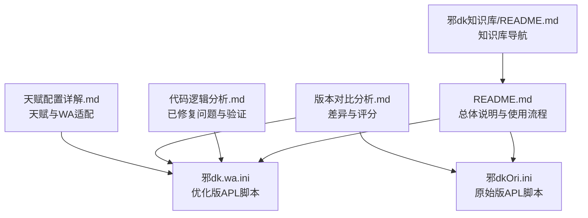
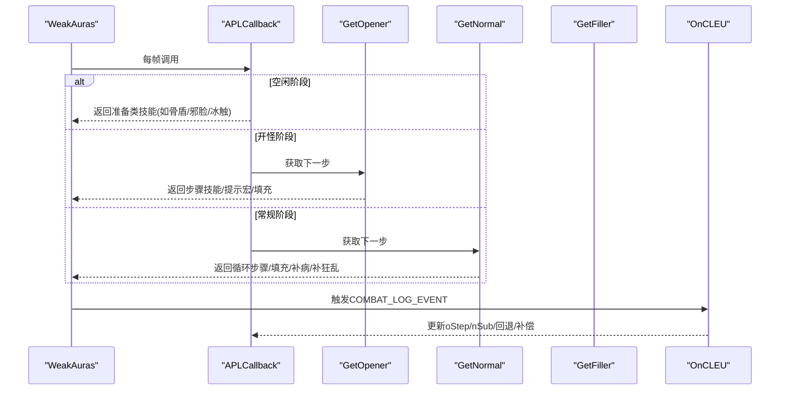
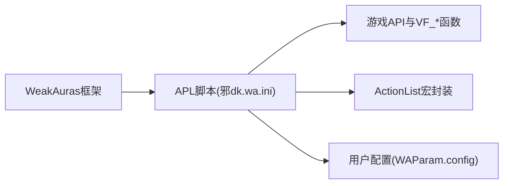

# 邪DK APL脚本重大优化

<cite>
**本文引用的文件**
- [README.md](file://README.md)
- [邪dk.wa.ini](file://邪dk.wa.ini)
- [邪dkOri.ini](file://邪dkOri.ini)
- [代码逻辑分析.md](file://代码逻辑分析.md)
- [天赋配置详解.md](file://天赋配置详解.md)
- [版本对比分析.md](file://版本对比分析.md)
- [邪dk知识库/README.md](file://邪dk知识库/README.md)
</cite>

## 目录
1. [引言](#引言)
2. [项目结构](#项目结构)
3. [核心组件](#核心组件)
4. [架构总览](#架构总览)
5. [详细组件分析](#详细组件分析)
6. [依赖关系分析](#依赖关系分析)
7. [性能与稳定性考量](#性能与稳定性考量)
8. [故障排查指南](#故障排查指南)
9. [结论与建议](#结论与建议)
10. [附录](#附录)

## 引言
本项目为魔兽世界泰坦时光服（基于WLK 80级框架）的“天打流”邪DK自动输出循环APL，通过WeakAuras插件实现智能技能优先级管理。优化版在原版基础上引入多项关键改进：支持战斗前预铺狂乱、天鬼后自动切绿脸、爆发期手套炸弹最佳时机、动态AOE切换、更合理的泄能阈值与容错回退机制等。整体目标是在保证稳定性的前提下最大化DPS并降低操作负担。

## 项目结构
仓库包含使用说明、两套APL脚本（原始与优化）、代码逻辑分析与版本对比文档、以及知识库索引。核心可执行脚本位于根目录的ini文件中，配套说明文档提供背景、差异与排障信息。

图表来源
- [README.md:1-545](file://README.md#L1-L545)
- [邪dk.wa.ini:1-645](file://邪dk.wa.ini#L1-L645)
- [邪dkOri.ini:1-561](file://邪dkOri.ini#L1-L561)
- [代码逻辑分析.md:1-297](file://代码逻辑分析.md#L1-L297)
- [版本对比分析.md:1-491](file://版本对比分析.md#L1-L491)
- [天赋配置详解.md:1-614](file://天赋配置详解.md#L1-L614)
- [邪dk知识库/README.md:1-161](file://邪dk知识库/README.md#L1-L161)

章节来源
- [README.md:1-545](file://README.md#L1-L545)
- [邪dk知识库/README.md:1-161](file://邪dk知识库/README.md#L1-L161)

## 核心组件
- 技能常量与宏定义：集中定义技能ID与ActionList宏，便于统一管理与扩展。
- 状态机与阶段控制：idle/opener/normal三态，配合oStep/nRound/nSub推进循环。
- 循环表：OP_BOSS/OP_BOSS_AOE/N_ROUNDS/NA_ROUNDS等，覆盖开怪、常规、AOE场景。
- 事件监听：COMBAT_LOG_EVENT_UNFILTERED、进入/退出战斗事件驱动状态迁移。
- 核心决策函数：GetOpener、GetNormal、GetFiller负责选择下一步动作。
- 回调接口：APLCallback与aura_env暴露给WeakAuras执行。

章节来源
- [邪dk.wa.ini:20-58](file://邪dk.wa.ini#L20-L58)
- [邪dk.wa.ini:93-258](file://邪dk.wa.ini#L93-L258)
- [邪dk.wa.ini:259-373](file://邪dk.wa.ini#L259-L373)
- [邪dk.wa.ini:375-614](file://邪dk.wa.ini#L375-L614)
- [邪dk.wa.ini:616-645](file://邪dk.wa.ini#L616-L645)

## 架构总览
优化版APL采用“事件驱动 + 状态机 + 循环表”的架构：
- 事件层：捕获施法成功、抵抗/未命中、进入/退出战斗等事件，更新内部状态。
- 决策层：根据当前阶段、目标数量、资源情况、CD与buff状态，返回下一步技能或填充。
- 执行层：通过ActionList将技能映射到宏，统一处理宠物攻击、队列清理等。

图表来源
- [邪dk.wa.ini:259-373](file://邪dk.wa.ini#L259-L373)
- [邪dk.wa.ini:375-614](file://邪dk.wa.ini#L375-L614)
- [邪dk.wa.ini:616-645](file://邪dk.wa.ini#L616-L645)

## 详细组件分析

### 状态机与阶段控制
- 阶段：idle（空闲）、opener（开怪）、normal（常规）。
- 推进：通过OnCastSuccess和OnCLEU维护oStep、nRound、nSub；抵抗/未命中时回退一步，保障容错。
- 特殊标志：_needSwitchToUnholyAfterGA（天鬼后切绿脸）、_gfInsert（动态补充狂乱）、_bombsUsed/_blackMagicUsed/_burstMacroUsed（爆发期宏标记）。

章节来源
- [邪dk.wa.ini:47-58](file://邪dk.wa.ini#L47-L58)
- [邪dk.wa.ini:259-373](file://邪dk.wa.ini#L259-L373)
- [代码逻辑分析.md:99-176](file://代码逻辑分析.md#L99-L176)

### 循环表与多场景适配
- 开怪循环：OP_BOSS/OP_BOSS_AOE，移除开怪时的狂乱/分流，改为战斗前预铺与动态补充。
- 常规循环：N_ROUNDS/NA_ROUNDS四轮换行，N4轮次固定补狂乱；AOE用传染替代部分单体技能。
- 非Boss与蓄力循环：OP_NONBOSS系列与OP_NOBURST系列，满足不同战斗需求。

章节来源
- [邪dk.wa.ini:93-258](file://邪dk.wa.ini#L93-L258)
- [README.md:39-121](file://README.md#L39-L121)
- [README.md:230-330](file://README.md#L230-L330)

### 爆发期优化与宏集成
- 手套炸弹时机：在oStep 7-9之间检查并使用，确保大军享受完整急速增益；常规循环中若已使用则跳过。
- 黑魔法宏与爆发宏：在oStep 8-9与oStep 10分别提示手动触发，避免自动装备切换风险。
- 大军补偿：若大军CD不可用，插入3步替代序列，避免浪费爆发窗口。

章节来源
- [邪dk.wa.ini:483-590](file://邪dk.wa.ini#L483-L590)
- [README.md:153-217](file://README.md#L153-L217)
- [版本对比分析.md:160-196](file://版本对比分析.md#L160-L196)

### 动态AOE与目标检测
- 目标计数：PestInfo()遍历nameplate，统计8码内可攻击且非死亡的目标数，返回额外目标数。
- 阈值设置：默认≥2个额外目标（共3目标）切换AOE，适配泰坦时光服25人环境。
- 实时回退：若即将释放传染但目标不足，回退至鲜血打击，避免误切AOE。

章节来源
- [邪dk.wa.ini:67-84](file://邪dk.wa.ini#L67-L84)
- [邪dk.wa.ini:419-421](file://邪dk.wa.ini#L419-L421)
- [版本对比分析.md:200-226](file://版本对比分析.md#L200-L226)

### 资源管理与泄能策略
- RP上限：符文能量掌握天赋使RP上限提升至130。
- 空窗期泄能：RP≥60时使用凋零缠绕；循环中RP≥120强制泄能，避免溢出。
- 填充优先级：凋零缠绕→寒冬号角→加速手套→等待。

章节来源
- [邪dk.wa.ini:375-389](file://邪dk.wa.ini#L375-L389)
- [邪dk.wa.ini:461-464](file://邪dk.wa.ini#L461-L464)
- [天赋配置详解.md:24-31](file://天赋配置详解.md#L24-L31)

### 姿态管理与疾病保活
- 天鬼后切绿脸：召唤石像鬼后立即切换邪恶灵气，让天鬼享受实时急速增益。
- 冰霜疫病保活：当冰霜疫病剩余≤3秒时优先补冰冷触摸，确保冰冷之爪增益持续。

章节来源
- [邪dk.wa.ini:307-310](file://邪dk.wa.ini#L307-L310)
- [邪dk.wa.ini:393-402](file://邪dk.wa.ini#L393-L402)
- [邪dk.wa.ini:410-417](file://邪dk.wa.ini#L410-L417)

### 容错与回退机制
- 抵抗/未命中：检测MISS/DODGE/PARRY/RESIST，开怪与常规阶段分别回退oStep/nSub。
- 排除AOE：枯萎凋零、血液沸腾及部分浸血效果不参与回退判断。
- 大军失败补偿：插入3步替代序列，随后恢复正常流程。

章节来源
- [邪dk.wa.ini:334-359](file://邪dk.wa.ini#L334-L359)
- [代码逻辑分析.md:122-176](file://代码逻辑分析.md#L122-L176)

### ActionList与宏封装
- 统一宏封装：为各技能生成宏，包含宠物攻击、队列清理等通用逻辑。
- 特殊宏：枯萎凋零@player无引导、召唤石像鬼含种族特长与饰品、亡者大军含速度药水与武器切换。
- 工程物品：加速手套+炸药/炸弹宏，用于爆发期快速触发。

章节来源
- [邪dk.wa.ini:616-645](file://邪dk.wa.ini#L616-L645)

## 依赖关系分析
- WeakAuras框架：依赖VF_getSpellCD、VF_getBuff、VF_getDebuff等自定义函数，建议使用哀冬虚空之花框架。
- 游戏API：CombatLogGetCurrentEventInfo、UnitPower、GetShapeshiftForm、WeakAuras.CheckRange等。
- 外部依赖：工程学物品（加速手套、炸药/炸弹），可选种族特长宏。

图表来源
- [邪dk.wa.ini:17-18](file://邪dk.wa.ini#L17-L18)
- [邪dk.wa.ini:616-645](file://邪dk.wa.ini#L616-L645)
- [README.md:436-440](file://README.md#L436-L440)

章节来源
- [邪dk.wa.ini:17-18](file://邪dk.wa.ini#L17-L18)
- [README.md:436-440](file://README.md#L436-L440)

## 性能与稳定性考量
- 名称板遍历安全：对UnitExists进行保护，遇到无效单位立即退出，避免卡死。
- 减少字符串比较：OnCLEU中对特定技能名进行过滤，降低匹配开销。
- 缓存建议：PestInfo与IsCD可考虑缓存结果以降低频繁调用成本（需权衡准确性）。

章节来源
- [邪dk.wa.ini:67-84](file://邪dk.wa.ini#L67-L84)
- [代码逻辑分析.md:241-262](file://代码逻辑分析.md#L241-L262)

## 故障排查指南
- 症状：循环卡在寒冬号角步骤
  - 原因：原版本oStep判断错误导致无法跳过CD
  - 解决：优化版在oStep==6时检查号角CD并跳过
- 症状：焦点目标导致脚本卡死
  - 原因：nameplate遍历未保护
  - 解决：增加pcall保护并提前break
- 症状：狂乱重复或遗漏
  - 原因：N4轮次动态补充冲突
  - 解决：N4轮次跳过动态补充，仅在buff消失时补充
- 症状：手套未在爆发期使用
  - 原因：检查窗口过窄
  - 解决：扩大至oStep 7-9，并在常规循环中检查_bombsUsed标志

章节来源
- [代码逻辑分析.md:19-94](file://代码逻辑分析.md#L19-L94)
- [版本对比分析.md:270-337](file://版本对比分析.md#L270-L337)

## 结论与建议
- 优化版在DPS提升、稳定性与易用性方面全面优于原始版本，尤其适合泰坦时光服的25人副本环境与高急速成长特性。
- 推荐直接使用优化版（邪dk.wa.ini v2.4），并根据自身天赋与雕文保持双病与孤寂覆盖、合理预铺狂乱、把握爆发期手套炸弹时机。
- 对于其他WLK怀旧服玩家，可按需调整AOE阈值与泄能阈值以适配不同服务器特性。

[本节不直接分析具体文件，无需章节来源]

## 附录

### 主要差异对比摘要
- 开怪循环：移除开怪时的狂乱/分流，改为战斗前预铺与动态补充，节省GCD。
- 天鬼后切绿脸：新增最高优先级逻辑，适配泰坦时光服实时急速增益。
- 手套炸弹时机：爆发期主动使用，确保大军享受完整急速。
- AOE阈值：默认≥2额外目标，适配25人本。
- 泄能阈值：空窗期60、循环中120，适配RP上限130。
- 稳定性：修复寒冬号角CD判断错误、nameplate遍历卡死等问题。

章节来源
- [版本对比分析.md:16-196](file://版本对比分析.md#L16-L196)
- [版本对比分析.md:200-337](file://版本对比分析.md#L200-L337)