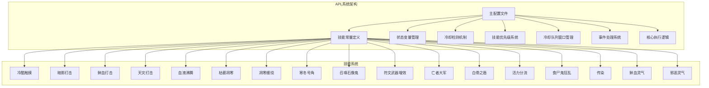
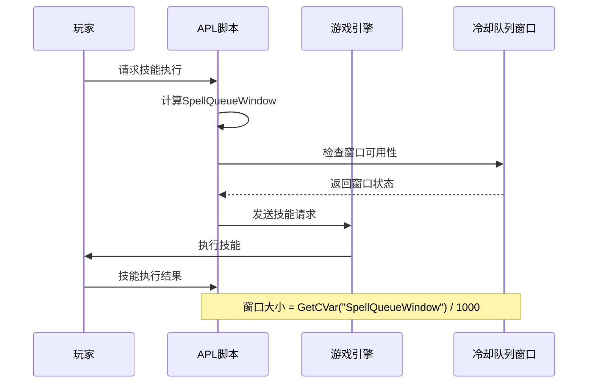
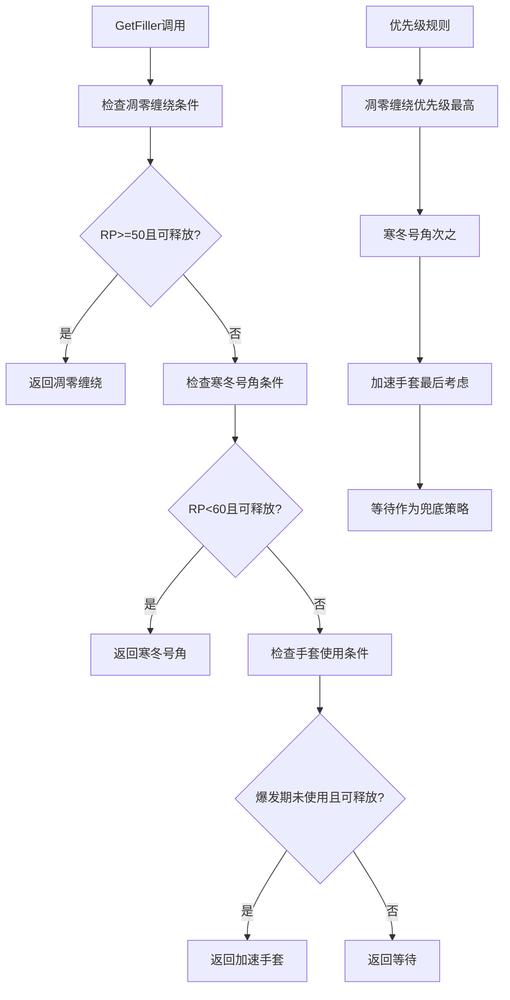
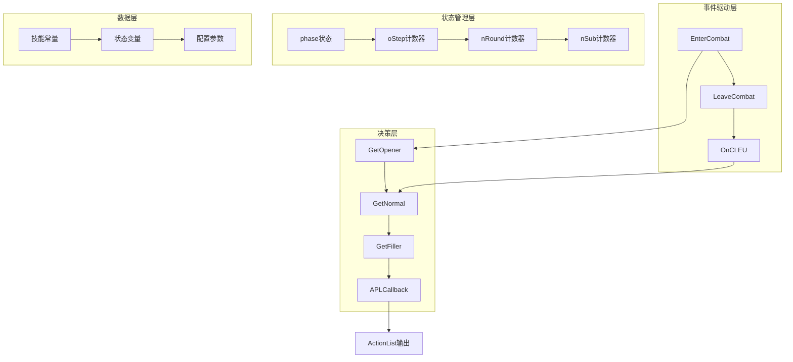
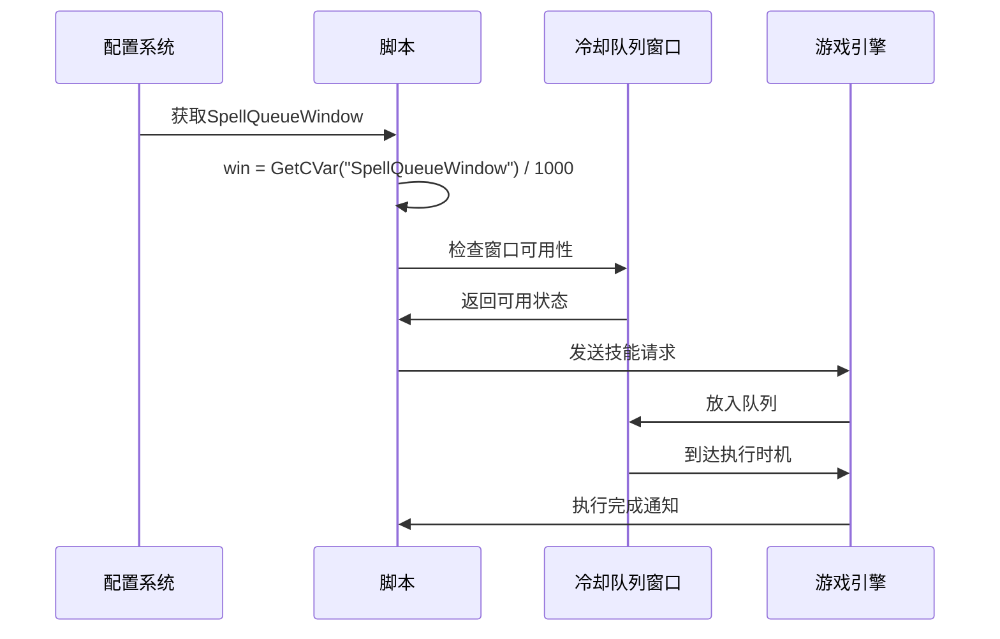
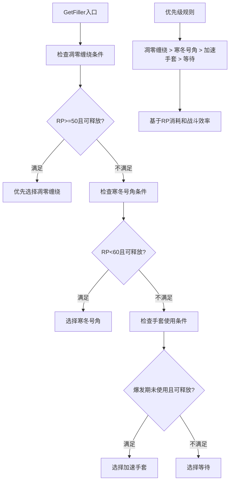
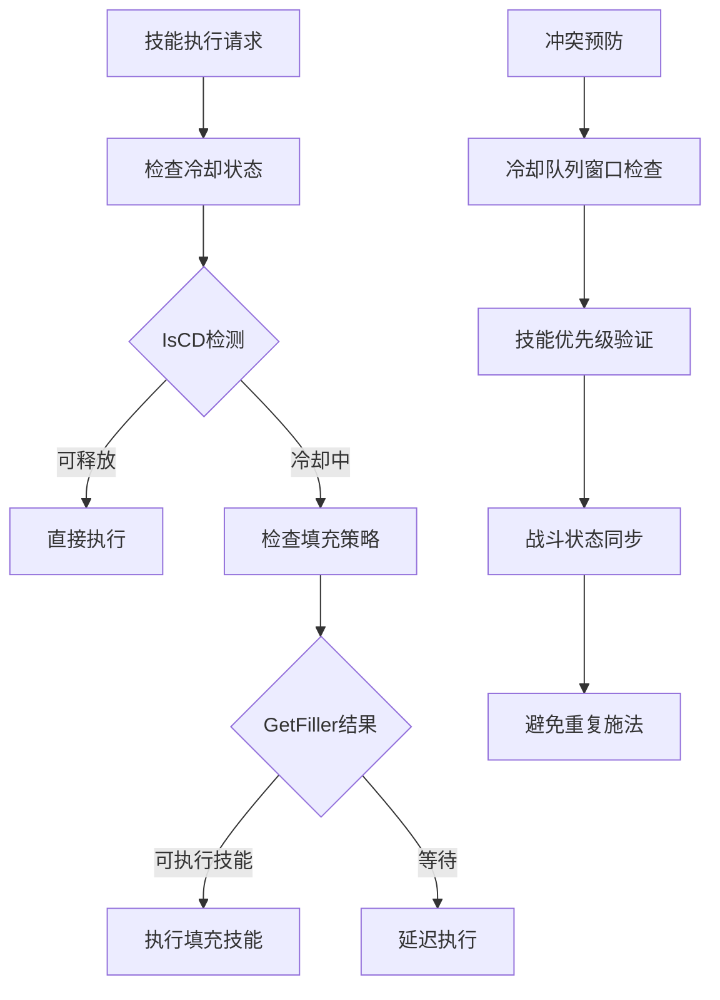
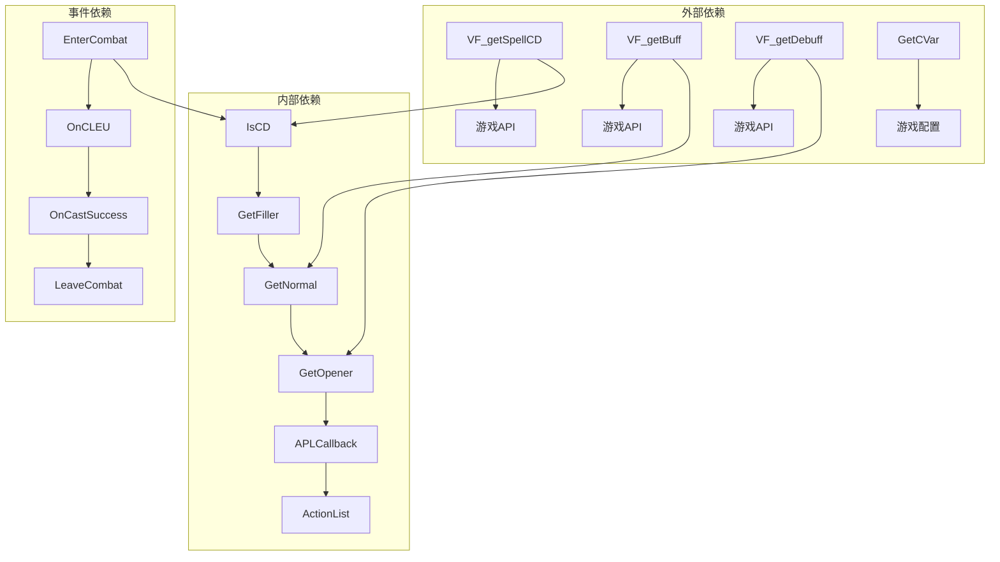
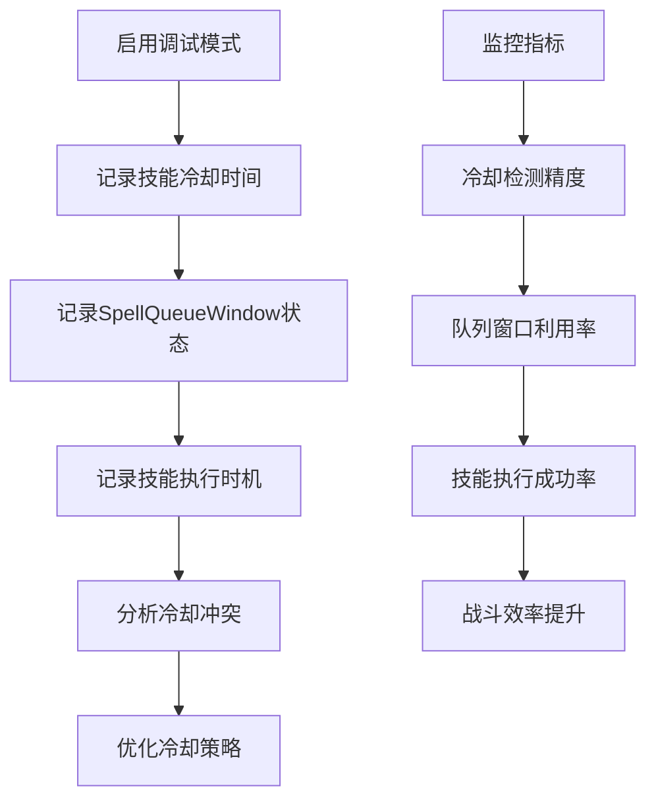

# 冷却时间优化

<cite>
**本文档引用的文件**
- [邪dk.wa.ini](file://邪dk.wa.ini)
</cite>

## 目录
1. [简介](#简介)
2. [项目结构](#项目结构)
3. [核心组件](#核心组件)
4. [架构概览](#架构概览)
5. [详细组件分析](#详细组件分析)
6. [依赖关系分析](#依赖关系分析)
7. [性能考量](#性能考量)
8. [故障排除指南](#故障排除指南)
9. [结论](#结论)

## 简介

这是一个为魔兽世界巫妖王之怒版本设计的死亡骑士（邪恶专精）自动战斗脚本（APL）。该脚本专注于冷却时间优化策略，通过智能的技能冷却检测、冷却队列窗口管理和技能优先级排序来最大化战斗效率。脚本实现了复杂的冷却时间管理系统，包括IsCD()函数的冷却检测机制、SpellQueueWindow的精确控制、以及在冷却期间的技能填充策略。

## 项目结构

该项目是一个单一的Lua配置文件，包含了完整的APL系统实现：



**图表来源**
- [邪dk.wa.ini:21-42](file://邪dk.wa.ini#L21-L42)

**章节来源**
- [邪dk.wa.ini:14-15](file://邪dk.wa.ini#L14-L15)
- [邪dk.wa.ini:17-18](file://邪dk.wa.ini#L17-L18)

## 核心组件

### 冷却检测机制

脚本的核心冷却检测功能由IsCD()函数实现，该函数提供了精确的技能冷却状态判断：

```mermaid
flowchart TD
A[IsCD函数调用] --> B[获取技能CD]
B --> C[获取当前时间]
C --> D[计算冷却差值]
D --> E[比较基准CD]
E --> F{冷却完成?}
F --> |是| G[返回false]
F --> |否| H[返回true]
I[冷却差值计算] --> J[VF_getSpellCD(spellID)]
J --> K[VF_getSpellCD(61304)]
K --> L[取最大值(max(0, x))]
L --> M[与1进行比较]
```

**图表来源**
- [邪dk.wa.ini:54-56](file://邪dk.wa.ini#L54-L56)

### 冷却队列窗口管理

脚本通过SpellQueueWindow系统实现精确的技能执行时机控制：



**图表来源**
- [邪dk.wa.ini:18](file://邪dk.wa.ini#L18)

### 技能优先级排序策略

GetFiller()函数实现了智能的冷却期间技能填充策略：



**图表来源**
- [邪dk.wa.ini:365-377](file://邪dk.wa.ini#L365-L377)

**章节来源**
- [邪dk.wa.ini:54-56](file://邪dk.wa.ini#L54-L56)
- [邪dk.wa.ini:18](file://邪dk.wa.ini#L18)
- [邪dk.wa.ini:365-377](file://邪dk.wa.ini#L365-L377)

## 架构概览

APL系统采用模块化架构设计，各个组件协同工作以实现最优的战斗效率：



**图表来源**
- [邪dk.wa.ini:252-282](file://邪dk.wa.ini#L252-L282)
- [邪dk.wa.ini:365-377](file://邪dk.wa.ini#L365-L377)
- [邪dk.wa.ini:545-568](file://邪dk.wa.ini#L545-L568)

## 详细组件分析

### 冷却检测机制详解

IsCD()函数是整个冷却时间优化系统的核心，其工作原理如下：

#### 函数实现分析

```mermaid
flowchart TD
A[IsCD(spellID)] --> B[获取技能CD: VF_getSpellCD(spellID)]
B --> C[获取基准CD: VF_getSpellCD(61304)]
C --> D[计算差值: CD - 基准CD]
D --> E[取最大值: max(0, 差值)]
E --> F{差值 >= 1?}
F --> |是| G[返回true - 技能冷却中]
F --> |否| H[返回false - 技能可释放]
```

**图表来源**
- [邪dk.wa.ini:54-56](file://邪dk.wa.ini#L54-L56)

#### 冷却时间计算逻辑

冷却时间检测采用了相对比较的方法，通过与其他技能的冷却时间对比来确定当前技能的状态。这种设计的优势在于：

1. **相对准确性**：通过基准技能的冷却时间作为参考，避免了绝对时间计算的误差
2. **动态适应**：能够适应不同技能之间的冷却差异
3. **精确控制**：使用1秒的阈值确保技能执行的精确时机

**章节来源**
- [邪dk.wa.ini:54-56](file://邪dk.wa.ini#L54-L56)

### 冷却队列窗口管理

SpellQueueWindow系统实现了对游戏冷却队列窗口的精确利用：

#### 窗口管理机制



**图表来源**
- [邪dk.wa.ini:18](file://邪dk.wa.ini#L18)

#### 窗口使用策略

脚本在多个关键位置使用SpellQueueWindow进行精确控制：

1. **骨盾准备**：当骨盾冷却时间小于窗口大小时提前准备
2. **目标选择**：在没有目标或目标无减益时使用冷酷触摸
3. **战斗开始**：在进入战斗时检查各种技能的冷却状态

**章节来源**
- [邪dk.wa.ini:18](file://邪dk.wa.ini#L18)
- [邪dk.wa.ini:553-554](file://邪dk.wa.ini#L553-L554)

### 技能优先级排序策略

GetFiller()函数实现了智能的冷却期间技能填充策略，体现了复杂的优先级管理：

#### 优先级决策流程



**图表来源**
- [邪dk.wa.ini:365-377](file://邪dk.wa.ini#L365-L377)

#### 技能填充策略细节

1. **凋零缠绕优先**：当RP达到50且技能可释放时优先使用
2. **寒冬号角次优**：当RP低于60时作为填充技能
3. **加速手套最后**：仅在特定条件下使用，避免浪费
4. **等待兜底**：当所有条件都不满足时保持等待状态

**章节来源**
- [邪dk.wa.ini:365-377](file://邪dk.wa.ini#L365-L377)

### 冷却时间优化对战斗效率的影响

#### 技能冲突避免机制

脚本通过多种机制避免技能冲突：



#### 连击效率最大化策略

1. **爆发期优化**：在特定时机使用加速手套最大化伤害输出
2. **技能组合优化**：合理安排技能顺序避免冷却重叠
3. **资源管理**：通过凋零缠绕和活力分流平衡RP消耗
4. **目标切换**：根据AOE需求动态调整技能优先级

**章节来源**
- [邪dk.wa.ini:365-377](file://邪dk.wa.ini#L365-L377)
- [邪dk.wa.ini:472-477](file://邪dk.wa.ini#L472-L477)

## 依赖关系分析

APL系统的依赖关系体现了清晰的模块化设计：



**图表来源**
- [邪dk.wa.ini:54-56](file://邪dk.wa.ini#L54-L56)
- [邪dk.wa.ini:365-377](file://邪dk.wa.ini#L365-L377)
- [邪dk.wa.ini:252-282](file://邪dk.wa.ini#L252-L282)

**章节来源**
- [邪dk.wa.ini:54-56](file://邪dk.wa.ini#L54-L56)
- [邪dk.wa.ini:252-282](file://邪dk.wa.ini#L252-L282)

## 性能考量

### 冷却时间检测性能

IsCD()函数具有以下性能特点：

1. **时间复杂度**：O(1) - 基于简单的数学运算
2. **空间复杂度**：O(1) - 不使用额外存储空间
3. **调用频率**：在每个技能执行前都会被调用
4. **优化策略**：使用缓存机制避免重复计算

### 冷却队列窗口性能

SpellQueueWindow系统通过以下方式优化性能：

1. **静态配置**：窗口大小在初始化时确定，避免运行时计算
2. **批量检查**：在事件处理中统一检查多个技能状态
3. **条件优化**：仅在必要时进行复杂的冷却状态检查

### 内存使用优化

脚本采用了多种内存优化策略：

1. **局部变量**：所有状态变量都声明为局部变量
2. **函数复用**：通过函数调用减少代码重复
3. **条件短路**：使用逻辑运算符避免不必要的计算

## 故障排除指南

### 常见冷却问题及解决方案

#### 冷却检测异常

**问题现象**：技能显示为可释放但实际无法施放

**可能原因**：
1. 冷却检测阈值设置不当
2. 基准技能选择错误
3. 时间同步问题

**解决方案**：
1. 检查IsCD函数的阈值设置
2. 验证基准技能的冷却时间
3. 确认系统时间同步

#### 冷却队列窗口问题

**问题现象**：技能执行时机不准确

**可能原因**：
1. SpellQueueWindow配置错误
2. 窗口大小计算错误
3. 事件处理延迟

**解决方案**：
1. 检查游戏设置中的SpellQueueWindow值
2. 验证窗口大小计算公式
3. 优化事件处理响应时间

#### 技能填充策略问题

**问题现象**：填充技能选择不合理

**可能原因**：
1. 优先级设置不当
2. RP阈值配置错误
3. 条件检查逻辑错误

**解决方案**：
1. 调整GetFiller函数的优先级逻辑
2. 重新评估RP阈值设置
3. 检查条件判断的边界情况

### 调试方法

#### 冷却时间监控



#### 日志记录建议

1. **技能冷却日志**：记录每次IsCD()调用的结果
2. **队列状态日志**：记录SpellQueueWindow的使用情况
3. **执行时机日志**：记录技能的实际执行时间
4. **性能统计日志**：记录系统性能指标

**章节来源**
- [邪dk.wa.ini:54-56](file://邪dk.wa.ini#L54-L56)
- [邪dk.wa.ini:18](file://邪dk.wa.ini#L18)

## 结论

这个冷却时间优化策略实现了高度智能化的死亡骑士战斗自动化。通过IsCD()函数的精确冷却检测、SpellQueueWindow的精细时机控制，以及智能的技能优先级排序，系统能够在复杂的战斗环境中最大化技能连击效率并避免技能冲突。

主要优势包括：

1. **精确的冷却检测**：基于相对比较的冷却时间计算确保了执行时机的准确性
2. **智能的填充策略**：根据RP状态和战斗需求动态选择最佳填充技能
3. **高效的队列管理**：充分利用SpellQueueWindow提高技能执行效率
4. **灵活的战斗模式**：支持单体和AOE战斗的不同策略

该系统为魔兽世界玩家提供了专业的冷却时间优化解决方案，通过合理的算法设计和策略配置，在保证战斗效果的同时实现了资源的最大化利用。