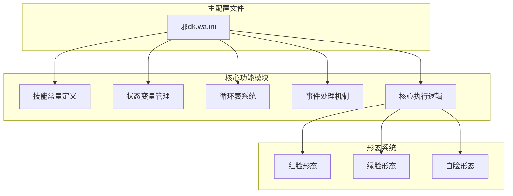
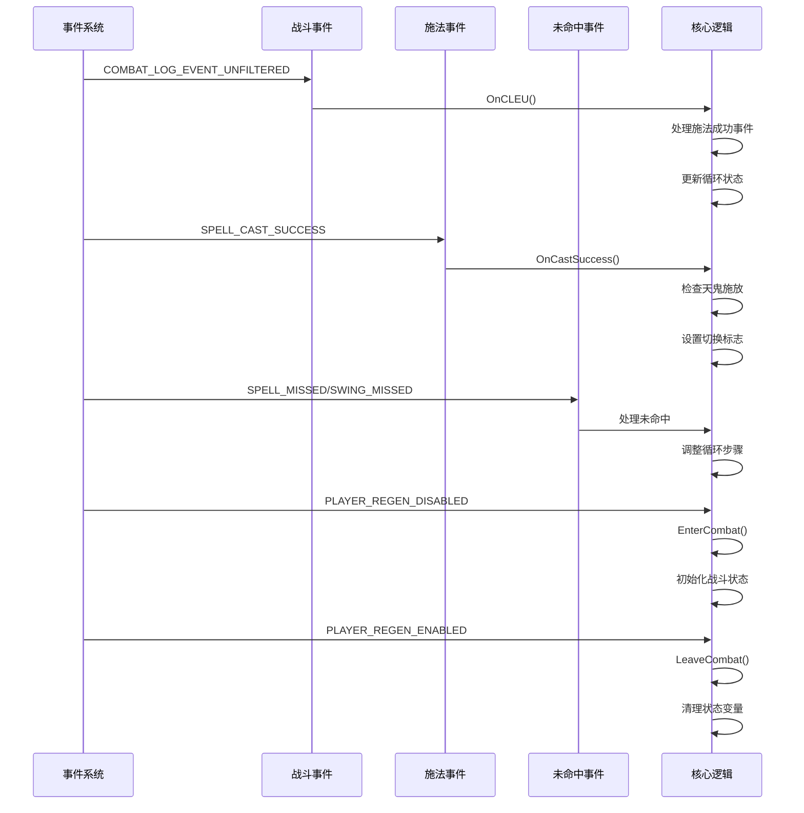
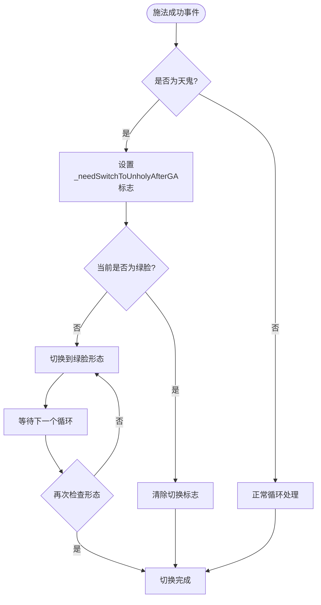
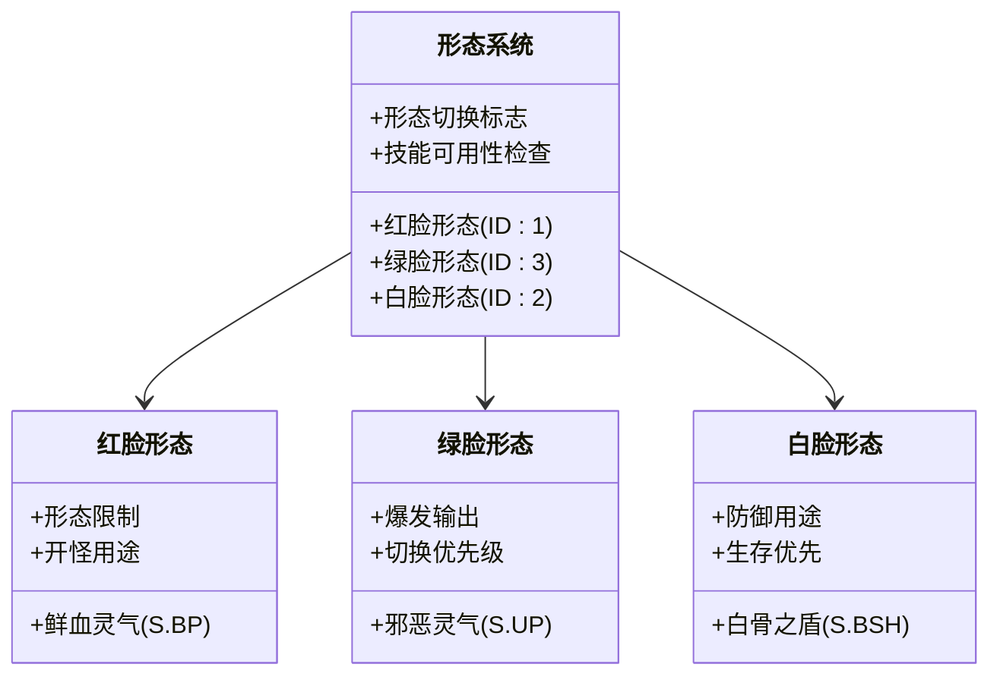
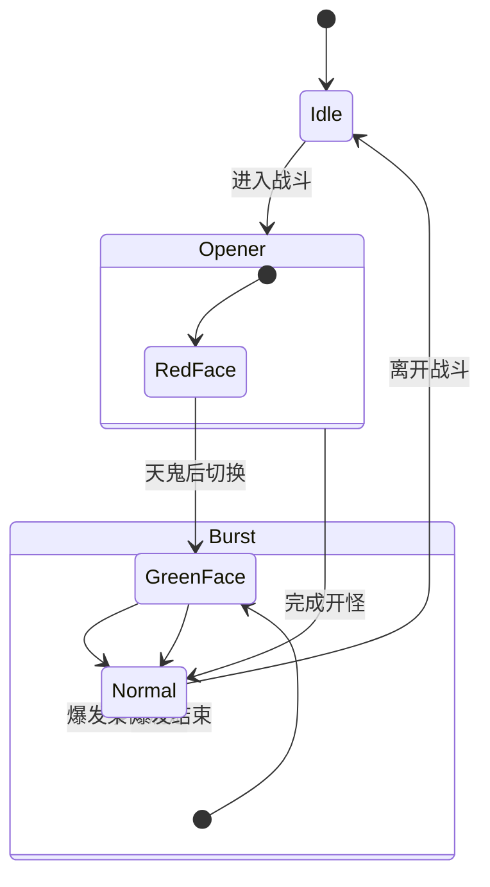
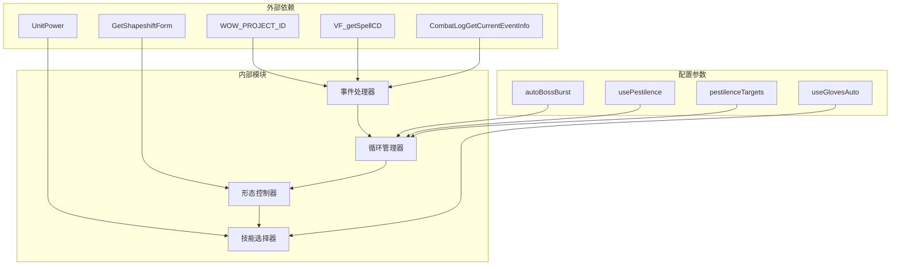

# 形态切换逻辑

<cite>
**本文档引用的文件**
- [邪dk.wa.ini](file://邪dk.wa.ini)
</cite>

## 目录
1. [简介](#简介)
2. [项目结构](#项目结构)
3. [核心组件](#核心组件)
4. [架构概览](#架构概览)
5. [详细组件分析](#详细组件分析)
6. [依赖关系分析](#依赖关系分析)
7. [性能考虑](#性能考虑)
8. [故障排除指南](#故障排除指南)
9. [结论](#结论)

## 简介

本文档深入分析了魔兽世界燃烧远征版本中死亡骑士的形态切换逻辑。该系统实现了三种形态（红脸、绿脸、白脸）之间的智能切换，特别针对"天打邪"专精进行了深度优化。文档重点解释了以下关键机制：

- 三种形态的切换条件和时机选择机制
- 天鬼后自动切换绿脸的完整逻辑流程
- `_needSwitchToUnholyAfterGA` 标志的作用和切换触发条件
- 形态切换对技能可用性的直接影响
- 不同战斗阶段的最优形态选择策略
- 形态切换的监控和调试方法

## 项目结构

该项目是一个单一的配置文件，包含了完整的死亡骑士APL（Action Priority List）逻辑实现：

**图表来源**
- [邪dk.wa.ini:1-599](file://邪dk.wa.ini#L1-L599)

**章节来源**
- [邪dk.wa.ini:1-599](file://邪dk.wa.ini#L1-L599)

## 核心组件

### 技能常量系统

系统定义了完整的技能常量映射，为所有形态切换逻辑提供基础支撑：

- **主要技能常量**：冰冷触摸、暗影打击、鲜血打击、天灾打击、血液沸腾、枯萎凋零、凋零缠绕、寒冬号角、召唤石像鬼、符文武器增效、亡者大军、白骨之盾、活力分流、食尸鬼狂乱、传染、鲜血灵气、邪恶灵气、亡者复生
- **装备常量**：加速手套（物品ID -112）
- **效果常量**：冰冷触摸负面效果（ID 55095）

### 状态变量管理

系统维护了关键的状态变量来跟踪战斗状态：

- **战斗阶段**：`phase`（idle/opener/normal）
- **循环计数器**：`oStep`（开怪步骤）、`nRound`（普通循环轮次）、`nSub`（子步骤）
- **特殊标志**：
  - `_needSwitchToUnholyAfterGA`：天鬼后切换绿脸的标志
  - `_bombsUsed`：标记炸弹是否已使用
  - `_isBoss`：标识是否为Boss战
  - `_roundAOE`：标记当前是否为AOE循环
  - `_armyReplace`：用于亡者大军替换的计数器

**章节来源**
- [邪dk.wa.ini:21-52](file://邪dk.wa.ini#L21-L52)

## 架构概览

系统的整体架构采用事件驱动的设计模式，通过多个事件处理器协调不同的战斗阶段：

**图表来源**
- [邪dk.wa.ini:251-362](file://邪dk.wa.ini#L251-L362)

**章节来源**
- [邪dk.wa.ini:251-362](file://邪dk.wa.ini#L251-L362)

## 详细组件分析

### 天鬼后自动切换绿脸机制

这是系统最复杂的形态切换逻辑，实现了精确的时机控制：

#### 核心切换流程

**图表来源**
- [邪dk.wa.ini:296-300](file://邪dk.wa.ini#L296-L300)
- [邪dk.wa.ini:381-390](file://邪dk.wa.ini#L381-L390)
- [邪dk.wa.ini:459-468](file://邪dk.wa.ini#L459-L468)

#### 切换触发条件

1. **天鬼施放检测**：当检测到召唤石像鬼（S.GA）施法成功时，立即设置切换标志
2. **形态验证**：检查当前是否已经是绿脸形态（ID 3）
3. **优先级处理**：在所有其他操作之前，优先处理形态切换
4. **循环等待**：在下一个循环周期重新检查形态状态

#### `_needSwitchToUnholyAfterGA` 标志详解

该标志是整个切换机制的核心，具有以下特性：

- **生命周期**：从设置到形态切换完成自动清除
- **作用域**：在整个战斗期间有效
- **优先级**：高于所有其他操作
- **状态同步**：与实际形态状态保持同步

**章节来源**
- [邪dk.wa.ini:296-300](file://邪dk.wa.ini#L296-L300)
- [邪dk.wa.ini:381-390](file://邪dk.wa.ini#L381-L390)
- [邪dk.wa.ini:459-468](file://邪dk.wa.ini#L459-L468)

### 形态切换对技能可用性的影响

不同形态下可使用的技能存在显著差异：

#### 红脸形态（ID 1）
- **可用技能**：鲜血灵气（S.BP）
- **限制**：不能使用邪恶灵气
- **用途**：主要用于开怪阶段的形态转换

#### 绿脸形态（ID 3）
- **可用技能**：邪恶灵气（S.UP）
- **限制**：不能使用鲜血灵气
- **用途**：爆发期的主要形态，最大化伤害输出

#### 白脸形态（ID 2）
- **可用技能**：白骨之盾（S.BSH）
- **限制**：主要用于防御
- **用途**：生存优先的场合

**图表来源**
- [邪dk.wa.ini:530-534](file://邪dk.wa.ini#L530-L534)
- [邪dk.wa.ini:550-552](file://邪dk.wa.ini#L550-L552)

**章节来源**
- [邪dk.wa.ini:530-534](file://邪dk.wa.ini#L530-L534)
- [邪dk.wa.ini:550-552](file://邪dk.wa.ini#L550-L552)

### 战斗策略与形态选择

系统根据不同的战斗阶段采用最优的形态策略：

#### 开怪阶段（Opener）
- **目标**：快速建立优势
- **策略**：优先使用红脸形态进行形态转换
- **时机**：在开怪循环中使用鲜血灵气进行形态切换

#### 爆发阶段（Burst）
- **目标**：最大化伤害输出
- **策略**：使用绿脸形态进行爆发
- **时机**：在天鬼后立即切换到绿脸

#### 常规阶段（Normal）
- **目标**：维持稳定的输出
- **策略**：根据资源和冷却时间动态切换
- **时机**：在循环中根据需要进行形态调整

**图表来源**
- [邪dk.wa.ini:252-276](file://邪dk.wa.ini#L252-L276)
- [邪dk.wa.ini:517-520](file://邪dk.wa.ini#L517-L520)

**章节来源**
- [邪dk.wa.ini:252-276](file://邪dk.wa.ini#L252-L276)
- [邪dk.wa.ini:517-520](file://邪dk.wa.ini#L517-L520)

### 循环表系统

系统实现了复杂的循环表来管理不同战斗阶段的操作序列：

#### 主要循环表类型

1. **Boss战循环**：包含完整的开怪和爆发序列
2. **非Boss战循环**：简化版的循环序列
3. **AOE循环**：针对多目标战斗的优化序列
4. **无爆发循环**：在特定配置下的循环序列

每个循环表都包含详细的步骤定义，包括技能名称、ID和执行顺序。

**章节来源**
- [邪dk.wa.ini:90-250](file://邪dk.wa.ini#L90-L250)

## 依赖关系分析

系统的依赖关系相对简单但功能强大：

**图表来源**
- [邪dk.wa.ini:14-18](file://邪dk.wa.ini#L14-L18)
- [邪dk.wa.ini:54-60](file://邪dk.wa.ini#L54-L60)
- [邪dk.wa.ini:350-362](file://邪dk.wa.ini#L350-L362)

**章节来源**
- [邪dk.wa.ini:14-18](file://邪dk.wa.ini#L14-L18)
- [邪dk.wa.ini:54-60](file://邪dk.wa.ini#L54-L60)
- [邪dk.wa.ini:350-362](file://邪dk.wa.ini#L350-L362)

## 性能考虑

系统在设计时充分考虑了性能优化：

### 事件处理优化
- 使用事件驱动架构减少轮询开销
- 合理的事件过滤机制避免不必要的处理
- 批量状态更新减少函数调用次数

### 内存管理
- 局部变量的合理使用减少内存占用
- 状态变量的生命周期管理
- 循环表的静态定义避免运行时分配

### 计算效率
- 缓存常用的技能信息和状态
- 优化的条件判断顺序
- 减少重复计算的逻辑设计

## 故障排除指南

### 常见问题诊断

#### 形态切换失败
**症状**：天鬼后无法切换到绿脸形态
**可能原因**：
1. `_needSwitchToUnholyAfterGA` 标志未正确设置
2. 形态切换请求被更高优先级的操作覆盖
3. 系统处于空闲状态无法执行形态切换

**解决方案**：
1. 检查天鬼施法事件处理逻辑
2. 验证形态切换的优先级设置
3. 确认系统处于活跃的战斗状态

#### 循环状态异常
**症状**：循环步骤错乱或重复执行
**可能原因**：
1. 事件处理顺序问题
2. 状态变量更新冲突
3. 条件判断逻辑错误

**解决方案**：
1. 检查事件处理函数的执行顺序
2. 验证状态变量的原子性更新
3. 审核条件判断的逻辑完整性

### 调试方法

#### 实时监控
- 监控 `_needSwitchToUnholyAfterGA` 标志的状态变化
- 跟踪 `phase` 和循环计数器的变化
- 观察形态ID的实时变化

#### 日志记录
- 记录关键事件的时间戳
- 跟踪状态变量的变更历史
- 记录技能选择的决策过程

#### 性能分析
- 分析事件处理的响应时间
- 监控内存使用情况
- 评估CPU占用率

**章节来源**
- [邪dk.wa.ini:284-348](file://邪dk.wa.ini#L284-L348)
- [邪dk.wa.ini:545-568](file://邪dk.wa.ini#L545-L568)

## 结论

该死亡骑士形态切换系统展现了高度的复杂性和精密性。通过事件驱动的架构设计、精确的时机控制和智能的状态管理，系统实现了最优的战斗策略执行。

### 主要成就

1. **精确的时机控制**：天鬼后的自动形态切换确保了最佳的伤害输出时机
2. **智能的状态管理**：通过标志位和状态变量实现了复杂的切换逻辑
3. **灵活的战斗适应**：根据不同战斗阶段自动调整形态策略
4. **高效的事件处理**：最小化了系统开销同时保证了响应速度

### 设计亮点

- **优先级层次清晰**：形态切换具有最高的执行优先级
- **状态同步机制**：确保逻辑状态与实际游戏状态一致
- **容错设计**：具备良好的错误恢复和状态清理机制
- **可扩展性**：模块化的架构便于后续的功能扩展

该系统为死亡骑士玩家提供了专业级的战斗辅助，特别是在高难度内容的挑战中能够发挥重要作用。