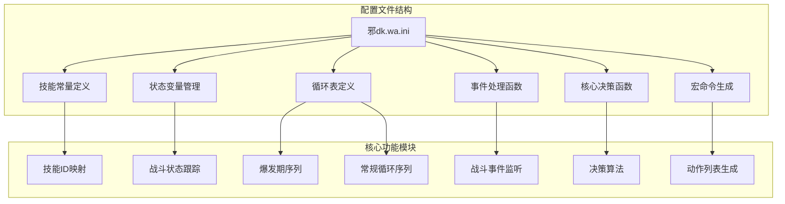
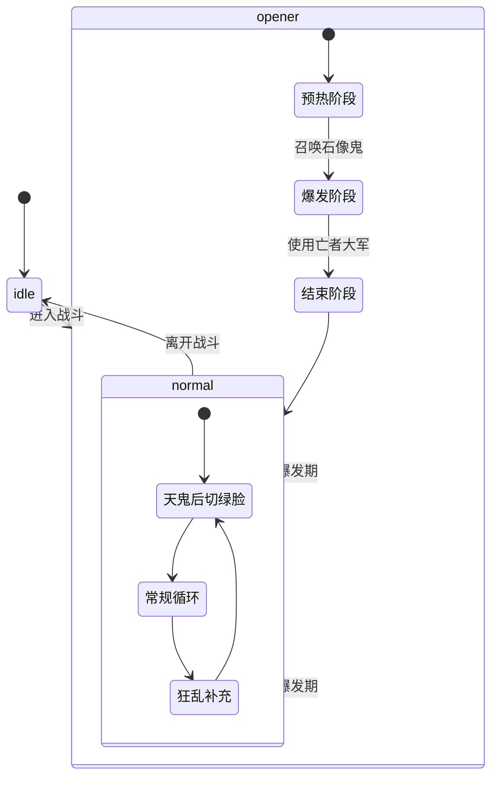
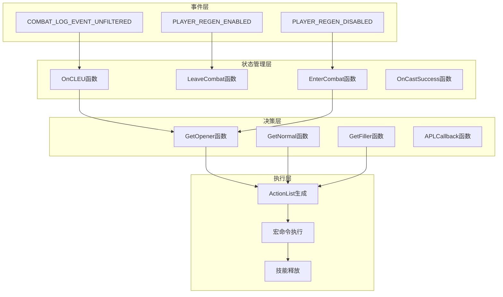
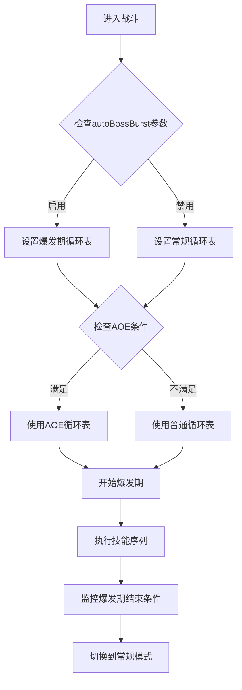
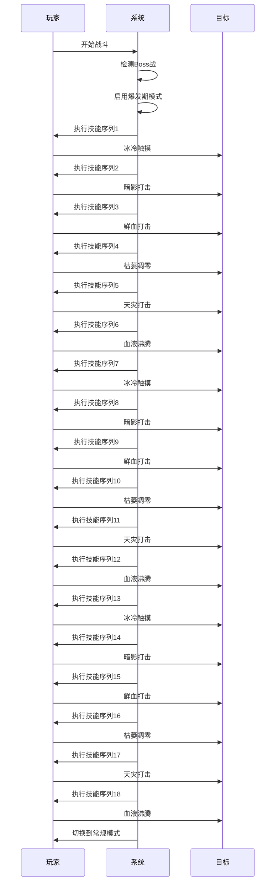
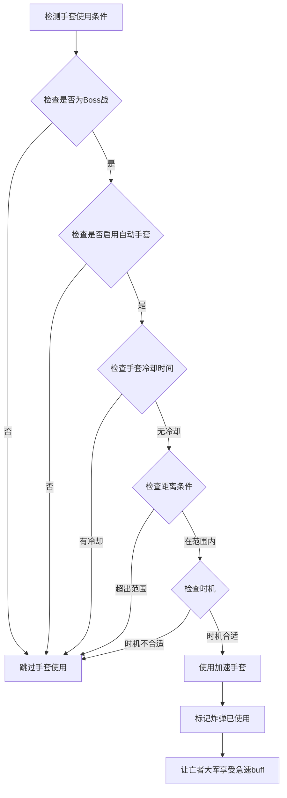
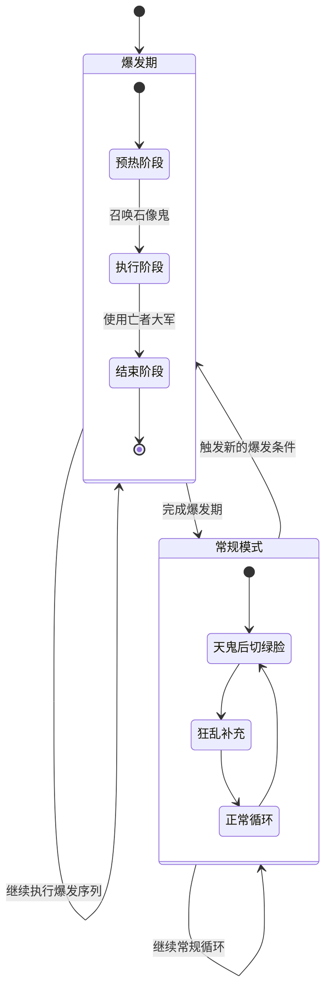
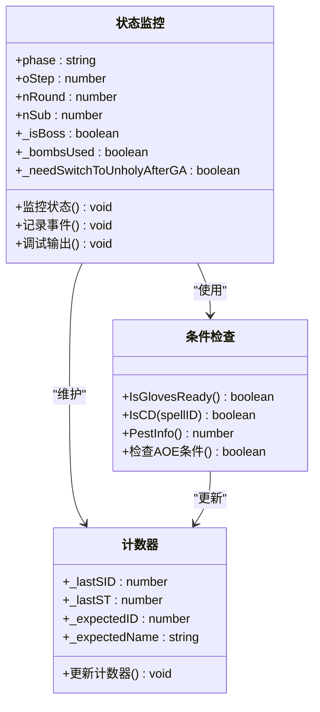
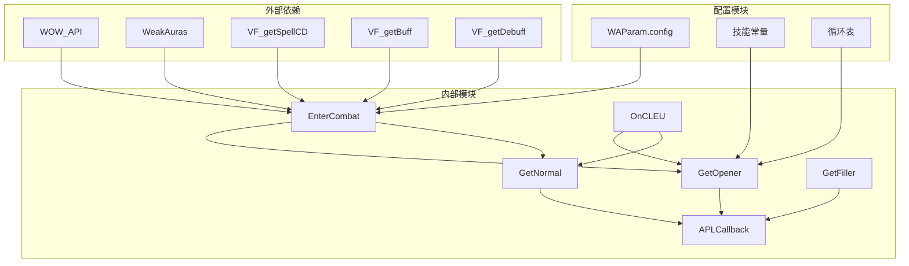

# 爆发期优化

<cite>
**本文档引用的文件**
- [邪dk.wa.ini](file://邪dk.wa.ini)
</cite>

## 目录
1. [简介](#简介)
2. [项目结构](#项目结构)
3. [核心组件](#核心组件)
4. [架构概览](#架构概览)
5. [详细组件分析](#详细组件分析)
6. [依赖关系分析](#依赖关系分析)
7. [性能考量](#性能考量)
8. [故障排除指南](#故障排除指南)
9. [结论](#结论)

## 简介

本文件详细阐述了魔兽世界巫妖王之怒版本中邪DK的爆发期优化方案。该优化方案专注于Boss战中的爆发期识别和最大化伤害输出策略，包括autoBossBurst参数的作用机制、爆发期技能组合的最优配置、手套使用的战术性应用，以及爆发期与常规循环的智能转换逻辑。

该系统通过复杂的条件判断和状态管理，在关键时刻自动识别Boss战并执行最优的爆发期序列，同时保持与常规战斗模式的无缝切换。

## 项目结构

该项目采用单一配置文件架构，包含了完整的APL（Action Priority List）逻辑实现：

**图表来源**
- [邪dk.wa.ini:21-42](file://邪dk.wa.ini#L21-L42)
- [邪dk.wa.ini:44-53](file://邪dk.wa.ini#L44-L53)
- [邪dk.wa.ini:85-181](file://邪dk.wa.ini#L85-L181)

**章节来源**
- [邪dk.wa.ini:1-15](file://邪dk.wa.ini#L1-L15)
- [邪dk.wa.ini:21-53](file://邪dk.wa.ini#L21-L53)

## 核心组件

### 技能常量系统

系统定义了完整的技能ID映射表，为所有相关技能提供了统一的引用接口：

| 技能名称 | 技能ID | 功能描述 |
|---------|--------|----------|
| 冰冷触摸 | 49909 | 主要伤害技能，用于起手攻击 |
| 暗影打击 | 49921 | 主要伤害技能，配合其他技能使用 |
| 鲜血打击 | 49930 | 主要伤害技能，用于连击循环 |
| 天灾打击 | 55271 | 高伤害技能，爆发期核心技能 |
| 血液沸腾 | 48721 | 法力回复技能，用于维持循环 |
| 枯萎凋零 | 49938 | 控场技能，可造成伤害和控制 |
| 凋零缠绕 | 49895 | 法力消耗技能，用于泄能 |
| 寒冬号角 | 57623 | 法力回复技能，提供额外法力 |
| 召唤石像鬼 | 49206 | 召唤宠物技能，爆发期关键节点 |
| 符文武器增效 | 47568 | 提供额外伤害增益 |
| 亡者大军 | 42650 | 群体伤害技能，爆发期核心技能 |
| 白骨之盾 | 49222 | 防护技能，提供伤害减免 |
| 活力分流 | 45529 | 爆发期增益技能，提供急速加成 |
| 食尸鬼狂乱 | 63560 | 爆发期增益技能，提供急速加成 |
| 传染 | 50842 | AOE伤害技能，用于群体战斗 |

**章节来源**
- [邪dk.wa.ini:21-42](file://邪dk.wa.ini#L21-L42)

### 状态管理系统

系统维护了多个关键状态变量来跟踪战斗进程：

**图表来源**
- [邪dk.wa.ini:45-53](file://邪dk.wa.ini#L45-L53)
- [邪dk.wa.ini:252-282](file://邪dk.wa.ini#L252-L282)

**章节来源**
- [邪dk.wa.ini:45-53](file://邪dk.wa.ini#L45-L53)
- [邪dk.wa.ini:252-282](file://邪dk.wa.ini#L252-L282)

## 架构概览

系统采用分层架构设计，实现了清晰的功能分离：

**图表来源**
- [邪dk.wa.ini:350-362](file://邪dk.wa.ini#L350-L362)
- [邪dk.wa.ini:457-544](file://邪dk.wa.ini#L457-L544)
- [邪dk.wa.ini:545-568](file://邪dk.wa.ini#L545-L568)

系统的核心决策流程遵循以下模式：
1. **事件驱动**：通过战斗日志事件触发状态更新
2. **状态判断**：根据当前战斗状态选择合适的循环策略
3. **优先级排序**：按照预定义的优先级列表执行技能
4. **动态调整**：根据实时条件动态调整执行策略

**章节来源**
- [邪dk.wa.ini:350-362](file://邪dk.wa.ini#L350-L362)
- [邪dk.wa.ini:457-568](file://邪dk.wa.ini#L457-L568)

## 详细组件分析

### 爆发期识别与autoBossBurst参数

#### autoBossBurst参数机制

autoBossBurst参数控制着系统对Boss战的自动识别和响应机制：

**图表来源**
- [邪dk.wa.ini:264-275](file://邪dk.wa.ini#L264-L275)
- [邪dk.wa.ini:263-263](file://邪dk.wa.ini#L263-L263)

#### 爆发期触发条件

系统通过以下条件自动识别Boss战并启用爆发期：

1. **战斗环境检测**：`IsEncounterInProgress()` 或 `IsResting() and UnitLevel("target") == -1`
2. **AOE能力评估**：`WAParam.config.usePestilence and PestInfo() >= (WAParam.config.pestilenceTargets or 2)`
3. **资源条件满足**：`GetRP() >= 60` 且 `VF_getSpellCD(S.GA) <= 0`

当满足这些条件时，系统会：
- 设置 `_openerTable` 为爆发期循环表
- 将 `_startRound` 设为1，立即开始爆发期
- 跳过开怪循环中的食尸鬼狂乱和活力分流

**章节来源**
- [邪dk.wa.ini:263-275](file://邪dk.wa.ini#L263-L275)

### 爆发期技能组合最大化方案

#### 技能序列优化

系统定义了专门的爆发期技能序列，确保在最佳时机使用关键技能：

**图表来源**
- [邪dk.wa.ini:90-115](file://邪dk.wa.ini#L90-L115)
- [邪dk.wa.ini:116-141](file://邪dk.wa.ini#L116-L141)

#### 关键技能的最优使用顺序

系统在爆发期中对关键技能进行了精心安排：

1. **起手技能**：冰冷触摸 → 暗影打击 → 鲜血打击
2. **爆发核心**：天灾打击 → 血液沸腾
3. **收尾技能**：重复上述模式直到完成爆发期

这种序列确保了：
- **伤害最大化**：在爆发期使用高伤害技能
- **资源优化**：合理分配法力和符文能量
- **时机把握**：在最佳时机使用关键增益技能

**章节来源**
- [邪dk.wa.ini:90-141](file://邪dk.wa.ini#L90-L141)

### 爆发期手套使用的优化策略

#### 加速手套的战术性使用

系统实现了精确的手套使用策略，确保在关键时刻发挥最大效益：

**图表来源**
- [邪dk.wa.ini:78-83](file://邪dk.wa.ini#L78-L83)
- [邪dk.wa.ini:470-477](file://邪dk.wa.ini#L470-L477)

#### 石像鬼后、大军前的时机优化

系统特别设计了在特定时机使用加速手套的策略：

1. **时机检测**：在 `oStep >= 8 and oStep <= 9` 期间检查
2. **条件验证**：确保有足够的时间使用手套
3. **效果最大化**：让加速手套的15秒急速buff覆盖亡者大军的施放

这种设计确保了：
- **效率最大化**：手套效果完全发挥
- **团队收益**：让整个团队都能享受加速效果
- **时机精准**：在石像鬼后、大军前的最佳时机使用

**章节来源**
- [邪dk.wa.ini:470-477](file://邪dk.wa.ini#L470-L477)

### 爆发期与常规循环的转换逻辑

#### 智能转换机制

系统实现了复杂的转换逻辑，确保在适当的时候从爆发模式切换到常规模式：

**图表来源**
- [邪dk.wa.ini:517-520](file://邪dk.wa.ini#L517-L520)
- [邪dk.wa.ini:381-390](file://邪dk.wa.ini#L381-L390)

#### 转换触发条件

系统通过以下条件判断何时从爆发模式切换到常规模式：

1. **序列完成**：`_openerTable[oStep]` 返回 `nil`
2. **状态重置**：将 `phase` 设为 `"normal"`
3. **循环初始化**：设置 `nRound = _startRound` 和 `nSub = 1`

这种设计确保了：
- **无缝切换**：从爆发期自然过渡到常规模式
- **状态一致性**：正确重置所有相关状态变量
- **循环连续性**：保持正常的战斗节奏

**章节来源**
- [邪dk.wa.ini:517-520](file://邪dk.wa.ini#L517-L520)

### 爆发期效果监控与调试

#### 实时状态监控

系统提供了多层次的状态监控机制：

**图表来源**
- [邪dk.wa.ini:45-53](file://邪dk.wa.ini#L45-L53)
- [邪dk.wa.ini:54-76](file://邪dk.wa.ini#L54-L76)

#### 调试功能实现

系统内置了多种调试和监控功能：

1. **事件追踪**：通过 `OnCLEU` 函数监控所有战斗事件
2. **状态记录**：记录关键状态变化和决策过程
3. **条件验证**：实时验证各种触发条件
4. **性能监控**：跟踪技能冷却时间和资源使用情况

这些功能为开发者和用户提供了一个完整的调试工具集，便于分析和优化APL行为。

**章节来源**
- [邪dk.wa.ini:323-348](file://邪dk.wa.ini#L323-L348)
- [邪dk.wa.ini:45-53](file://邪dk.wa.ini#L45-L53)

## 依赖关系分析

系统展现了清晰的模块化设计，各组件之间的依赖关系如下：

**图表来源**
- [邪dk.wa.ini:17-18](file://邪dk.wa.ini#L17-L18)
- [邪dk.wa.ini:457-568](file://邪dk.wa.ini#L457-L568)

系统的主要依赖关系特点：
- **低耦合**：各模块职责明确，相互独立
- **高内聚**：每个模块专注于特定功能
- **事件驱动**：通过战斗事件驱动状态变化
- **配置导向**：通过WAParam.config控制行为

**章节来源**
- [邪dk.wa.ini:17-18](file://邪dk.wa.ini#L17-L18)
- [邪dk.wa.ini:457-568](file://邪dk.wa.ini#L457-L568)

## 性能考量

### 时间复杂度分析

系统的决策算法具有以下时间复杂度特征：

- **事件处理**：O(1) - 每个战斗事件的处理时间为常数时间
- **状态检查**：O(1) - 状态查询和条件判断为常数时间
- **循环查找**：O(1) - 循环表访问为数组索引操作
- **整体性能**：O(1) - 整体决策过程为常数时间复杂度

### 空间复杂度分析

- **状态存储**：O(1) - 固定数量的状态变量
- **循环表存储**：O(n) - n为循环步骤的数量（约20-30个）
- **内存占用**：主要由循环表和状态变量决定

### 优化策略

1. **缓存机制**：利用WOW API的缓存特性减少重复查询
2. **早期退出**：在条件不满足时快速返回，避免不必要的计算
3. **批量处理**：将相关的状态检查合并进行
4. **延迟计算**：只在必要时计算昂贵的操作

## 故障排除指南

### 常见问题诊断

#### 爆发期未触发

**可能原因**：
1. `autoBossBurst` 参数未启用
2. Boss战检测失败
3. AOE条件不满足
4. 资源不足

**解决方案**：
- 检查WAParam.config.autoBossBurst设置
- 确认IsEncounterInProgress()返回true
- 验证PestInfo() >= pestilenceTargets
- 确保GetRP() >= 60

#### 手套使用时机错误

**可能原因**：
1. 距离条件不满足
2. 手套冷却时间未结束
3. 时机判断逻辑错误

**解决方案**：
- 检查WeakAuras.CheckRange("target", 5, "<=")返回值
- 验证VF_getItemCD(10) == 0
- 确认oStep在8-9范围内

#### 技能顺序异常

**可能原因**：
1. 状态变量未正确更新
2. 循环表索引错误
3. 条件判断逻辑问题

**解决方案**：
- 检查oStep和nSub的递增逻辑
- 验证循环表的完整性
- 确认条件判断的先后顺序

**章节来源**
- [邪dk.wa.ini:263-275](file://邪dk.wa.ini#L263-L275)
- [邪dk.wa.ini:470-477](file://邪dk.wa.ini#L470-L477)

### 调试技巧

1. **事件日志**：通过COMBAT_LOG_EVENT_UNFILTERED事件查看详细战斗信息
2. **状态监控**：定期检查关键状态变量的值
3. **条件验证**：逐个验证触发条件的真假值
4. **性能测试**：在不同环境下测试系统的响应时间

## 结论

该爆发期优化方案展现了高度的工程化设计和深度的战斗理解。通过精心设计的autoBossBurst参数、精确的技能序列优化、战术性的手套使用策略，以及智能的模式转换逻辑，系统能够在Boss战中实现最大化的伤害输出。

关键创新点包括：
- **智能识别**：通过多维度条件自动识别最佳爆发时机
- **精确时机**：在石像鬼后、大军前使用加速手套，最大化团队收益
- **无缝转换**：从爆发模式到常规模式的平滑过渡
- **全面监控**：提供完整的状态监控和调试功能

这套方案不仅提升了战斗效率，也为类似的职业APL开发提供了优秀的参考模板。通过持续的优化和改进，该系统能够适应不同的战斗环境和挑战需求。