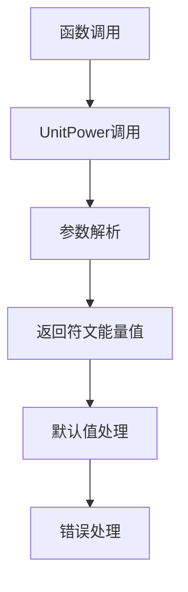
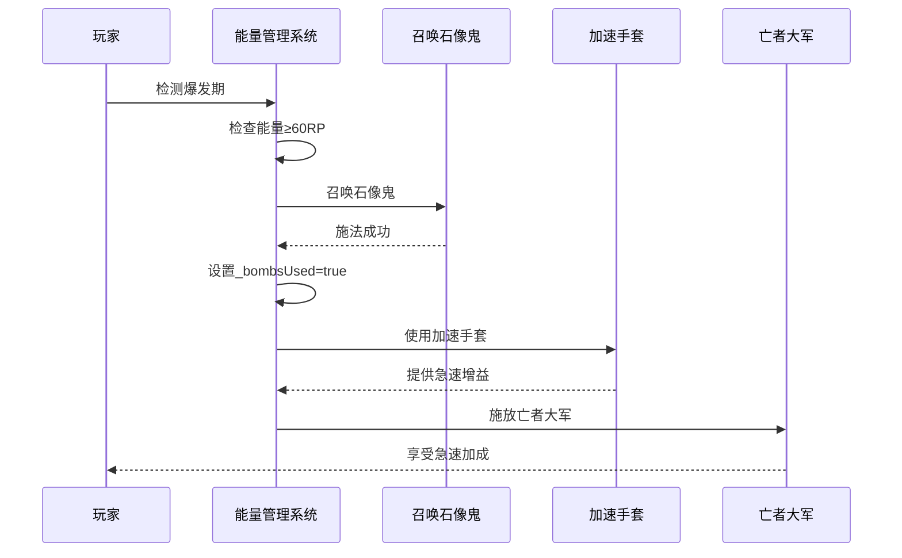
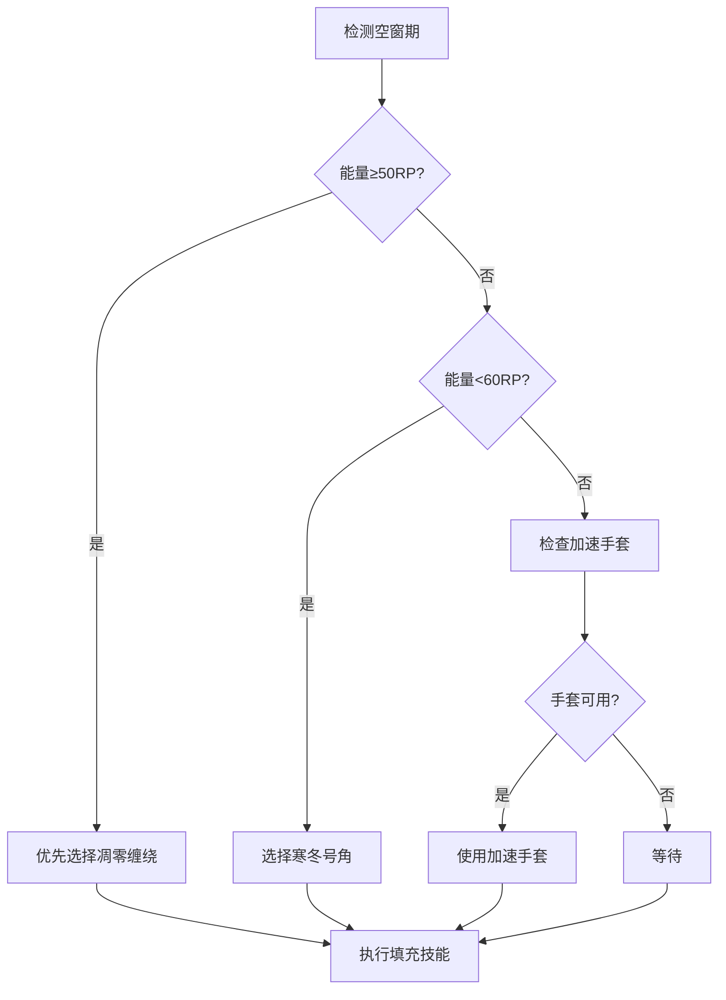
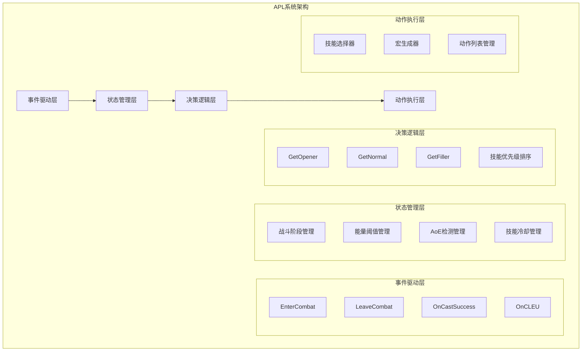
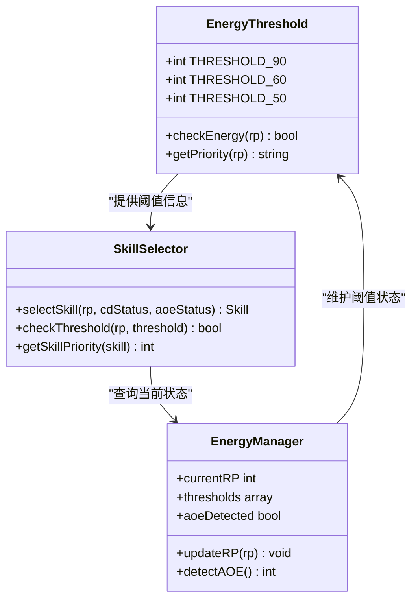
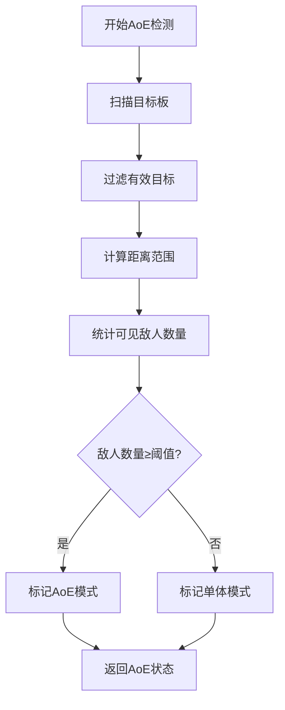
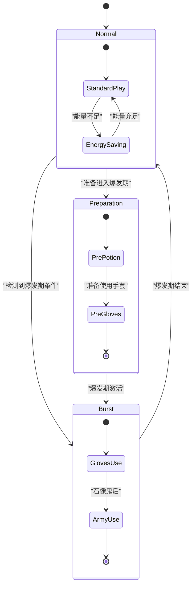
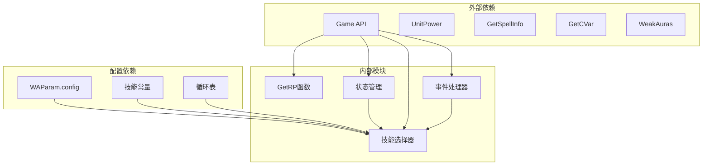

# 符文能量管理

<cite>
**本文档引用的文件**
- [邪dk.wa.ini](file://邪dk.wa.ini)
</cite>

## 目录
1. [简介](#简介)
2. [项目结构](#项目结构)
3. [核心组件](#核心组件)
4. [架构概览](#架构概览)
5. [详细组件分析](#详细组件分析)
6. [依赖关系分析](#依赖关系分析)
7. [性能考虑](#性能考虑)
8. [故障排除指南](#故障排除指南)
9. [结论](#结论)

## 简介

本文档深入解析了魔兽世界巫妖王之怒版本中邪DK的符文能量（Runic Power, RP）管理系统。该系统实现了复杂的能量监控机制，包括能量值获取、阈值判断、技能选择逻辑和能量分配策略。文档特别关注以下关键功能：

- **GetRP()函数**的实现原理和能量值获取方式
- **不同阈值下的技能选择逻辑**（90RP用于凋零缠绕泄能、60RP用于召唤石像鬼等）
- **能量管理的优先级规则**，包括爆发期最大化利用和低RP状态下的资源保存
- **能量管理与AoE检测的关系**，说明不同战斗环境下的差异化策略
- **性能监控方法和调试技巧**

## 项目结构

该项目采用单一配置文件结构，包含了完整的APL（Archeology Priority List）系统实现：

```mermaid
graph TB
subgraph "APL系统架构"
A[主配置文件<br/>邪dk.wa.ini] --> B[技能常量定义]
A --> C[状态变量管理]
A --> D[核心函数模块]
A --> E[事件处理系统]
A --> F[循环表定义]
end
subgraph "核心功能模块"
B --> B1[技能ID映射]
C --> C1[战斗状态管理]
C --> C2[能量阈值管理]
D --> D1[GetRP()函数]
D --> D2[GetFiller()函数]
D --> D3[GetNormal()函数]
D --> D4[GetOpener()函数]
E --> E1[EnterCombat事件]
E --> E2[LeaveCombat事件]
E --> E3[OnCastSuccess事件]
E --> E4[OnCLEU事件]
end
```

**图表来源**
- [邪dk.wa.ini:58-606](file://邪dk.wa.ini#L58-L606)

**章节来源**
- [邪dk.wa.ini:1-606](file://邪dk.wa.ini#L1-L606)

## 核心组件

### 符文能量监控系统

符文能量监控系统是整个APL系统的核心，负责实时跟踪和管理玩家的符文能量状态。

#### GetRP()函数实现

GetRP()函数是能量监控系统的基础，通过调用`UnitPower("player", 6)`获取当前玩家的符文能量值。该函数直接封装了游戏API，提供了简洁的能量值访问接口。



**图表来源**
- [邪dk.wa.ini:58-60](file://邪dk.wa.ini#L58-L60)

#### 能量阈值管理系统

系统实现了多层次的能量阈值判断机制：

| 阈值 | 功能 | 触发条件 | 作用 |
|------|------|----------|------|
| 90RP | 凋零缠绕泄能 | 能量≥90且可施放 | 高效消耗多余能量 |
| 60RP | 召唤石像鬼 | 能量≥60且冷却完成 | 爆发期关键技能 |
| 50RP | 凋零缠绕填充 | 能量≥50且冷却完成 | 空窗期能量利用 |
| 60RP | 寒冬号角 | 能量<60且冷却完成 | 资源保存策略 |

**章节来源**
- [邪dk.wa.ini:58-60](file://邪dk.wa.ini#L58-L60)
- [邪dk.wa.ini:365-377](file://邪dk.wa.ini#L365-L377)
- [邪dk.wa.ini:436-438](file://邪dk.wa.ini#L436-L438)

### 技能选择逻辑系统

系统根据不同的战斗状态和能量水平，智能选择最优技能组合。

#### 爆发期能量管理

在爆发期（石像鬼后、大军前），系统采用激进的能量使用策略：



**图表来源**
- [邪dk.wa.ini:470-477](file://邪dk.wa.ini#L470-L477)
- [邪dk.wa.ini:472-476](file://邪dk.wa.ini#L472-L476)

#### 空窗期填充策略

当检测到空窗期（技能冷却或CD期间），系统会自动寻找合适的填充技能：



**图表来源**
- [邪dk.wa.ini:365-377](file://邪dk.wa.ini#L365-L377)

**章节来源**
- [邪dk.wa.ini:365-377](file://邪dk.wa.ini#L365-L377)
- [邪dk.wa.ini:436-447](file://邪dk.wa.ini#L436-L447)

## 架构概览

APL系统采用了模块化设计，将不同的功能职责分离到独立的模块中：



**图表来源**
- [邪dk.wa.ini:251-362](file://邪dk.wa.ini#L251-L362)
- [邪dk.wa.ini:364-551](file://邪dk.wa.ini#L364-L551)

### 事件处理系统

系统通过注册多种事件来响应战斗状态变化：

| 事件类型 | 触发条件 | 处理逻辑 |
|----------|----------|----------|
| COMBAT_LOG_EVENT_UNFILTERED | 战斗日志更新 | 更新技能施放状态和命中情况 |
| PLAYER_REGEN_DISABLED | 进入战斗状态 | 初始化战斗参数和循环表 |
| PLAYER_REGEN_ENABLED | 离开战斗状态 | 清理状态变量和重置系统 |

**章节来源**
- [邪dk.wa.ini:350-362](file://邪dk.wa.ini#L350-L362)
- [邪dk.wa.ini:252-282](file://邪dk.wa.ini#L252-L282)

## 详细组件分析

### 能量阈值管理系统

#### 阈值定义与优先级

系统实现了多层级的能量阈值管理，每个阈值都有特定的作用和触发条件：



**图表来源**
- [邪dk.wa.ini:58-60](file://邪dk.wa.ini#L58-L60)
- [邪dk.wa.ini:365-377](file://邪dk.wa.ini#L365-L377)

#### 能量分配策略

系统根据不同的战斗场景采用差异化的能量分配策略：

**高RP状态策略（≥90RP）**：
- 优先选择凋零缠绕进行能量泄能
- 避免能量浪费，保持稳定的伤害输出
- 在爆发期配合其他技能最大化伤害

**中等RP状态策略（60-89RP）**：
- 优先考虑爆发期技能（如召唤石像鬼）
- 平衡能量消耗和技能冷却时间
- 为后续爆发期做准备

**低RP状态策略（<60RP）**：
- 优先选择资源保存技能（如寒冬号角）
- 避免在能量不足时强行施放技能
- 利用空窗期进行能量恢复

**章节来源**
- [邪dk.wa.ini:436-438](file://邪dk.wa.ini#L436-L438)
- [邪dk.wa.ini:369-371](file://邪dk.wa.ini#L369-L371)
- [邪dk.wa.ini:393-396](file://邪dk.wa.ini#L393-L396)

### AoE检测与能量管理

#### AoE检测机制

系统实现了智能的AoE检测功能，通过扫描目标板来确定敌人数量：



**图表来源**
- [邪dk.wa.ini:62-76](file://邪dk.wa.ini#L62-L76)
- [邪dk.wa.ini:263](file://邪dk.wa.ini#L263)

#### 不同战斗环境下的策略

**单体战斗策略**：
- 专注于高伤害单体技能
- 合理使用凋零缠绕进行能量泄能
- 保持稳定的连击节奏

**AoE战斗策略**：
- 优先考虑群体伤害技能
- 调整能量阈值以适应群体输出
- 优化技能顺序提高整体效率

**章节来源**
- [邪dk.wa.ini:263](file://邪dk.wa.ini#L263)
- [邪dk.wa.ini:116-141](file://邪dk.wa.ini#L116-L141)

### 爆发期管理机制

#### 爆发期识别与激活

系统能够智能识别爆发期并激活相应的能量管理策略：



**图表来源**
- [邪dk.wa.ini:470-477](file://邪dk.wa.ini#L470-L477)
- [邪dk.wa.ini:482-484](file://邪dk.wa.ini#L482-L484)

#### 爆发期优化策略

在爆发期，系统采用以下优化策略：

1. **手套使用时机**：在石像鬼后、大军前使用加速手套
2. **急速增益最大化**：确保亡者大军能享受15秒急速buff
3. **技能顺序优化**：调整技能施放顺序以最大化伤害输出

**章节来源**
- [邪dk.wa.ini:470-477](file://邪dk.wa.ini#L470-L477)
- [邪dk.wa.ini:472-476](file://邪dk.wa.ini#L472-L476)

## 依赖关系分析

### 核心依赖关系

APL系统的依赖关系相对简单，主要依赖于游戏API和内部状态管理：



**图表来源**
- [邪dk.wa.ini:17-42](file://邪dk.wa.ini#L17-L42)
- [邪dk.wa.ini:58-60](file://邪dk.wa.ini#L58-L60)

### 内部耦合度分析

系统的设计体现了良好的内聚性和低耦合性：

- **函数内聚性**：每个函数都有明确的单一职责
- **状态管理**：集中管理所有全局状态变量
- **事件驱动**：通过事件系统解耦不同功能模块
- **配置驱动**：通过WAParam.config实现灵活的参数控制

**章节来源**
- [邪dk.wa.ini:44-52](file://邪dk.wa.ini#L44-L52)
- [邪dk.wa.ini:17](file://邪dk.wa.ini#L17)

## 性能考虑

### 时间复杂度分析

系统各主要函数的时间复杂度分析：

| 函数 | 时间复杂度 | 空间复杂度 | 说明 |
|------|------------|------------|------|
| GetRP() | O(1) | O(1) | 直接调用游戏API |
| PestInfo() | O(n) | O(n) | 扫描目标板，n为目标数量 |
| GetFiller() | O(1) | O(1) | 常数时间阈值判断 |
| GetNormal() | O(k) | O(1) | k为循环步数，通常很小 |
| GetOpener() | O(m) | O(1) | m为开怪步骤数，通常很小 |

### 内存使用优化

系统采用了多项内存优化策略：

1. **局部变量管理**：所有状态变量都声明为局部变量，避免全局污染
2. **循环表复用**：多个循环表共享基础结构，减少内存占用
3. **事件处理优化**：只注册必要的事件，避免不必要的回调

### 性能监控建议

为了更好地监控APL系统的性能，建议采用以下方法：

1. **日志记录**：添加关键决策点的日志输出
2. **性能计时**：对耗时较长的操作进行计时
3. **状态监控**：定期检查关键状态变量的变化
4. **阈值验证**：验证能量阈值判断的准确性

## 故障排除指南

### 常见问题诊断

#### 能量值获取异常

**症状**：GetRP()函数返回异常值或0

**可能原因**：
1. 游戏API调用失败
2. 玩家状态异常
3. 系统初始化问题

**解决方法**：
1. 检查游戏连接状态
2. 重新加载界面
3. 验证APL配置正确性

#### 技能选择错误

**症状**：系统选择错误的技能或时机不当

**可能原因**：
1. 能量阈值判断错误
2. AoE检测失败
3. 技能冷却状态异常

**解决方法**：
1. 检查WAParam.config配置
2. 验证技能冷却状态
3. 更新AoE检测逻辑

#### 爆发期管理问题

**症状**：爆发期能量管理效果不佳

**可能原因**：
1. 爆发期识别错误
2. 手套使用时机不当
3. 急速增益未正确应用

**解决方法**：
1. 检查爆发期触发条件
2. 验证手套使用逻辑
3. 确认急速增益应用

### 调试技巧

#### 日志调试

建议在关键位置添加调试输出：

```lua
-- 添加到重要决策点
print("Debug: 当前RP=" .. GetRP() .. ", 阈值=" .. threshold .. ", 技能=" .. skillName)
```

#### 状态监控

定期检查关键状态变量：

```lua
-- 监控AoE状态
print("Debug: AoE检测结果=" .. pestCount .. ", 阈值=" .. pestTargets)
```

#### 性能测试

使用以下方法测试系统性能：

1. **压力测试**：在大量敌人环境下测试系统表现
2. **边界测试**：测试极端RP值下的系统行为
3. **回归测试**：验证修复后的功能正常

**章节来源**
- [邪dk.wa.ini:284-348](file://邪dk.wa.ini#L284-L348)

## 结论

符文能量管理系统展现了优秀的工程设计，通过模块化架构和智能决策算法实现了高效的APL系统。系统的主要优势包括：

1. **精确的能量监控**：通过GetRP()函数提供准确的能量状态
2. **灵活的阈值管理**：支持多层级的能量阈值和动态调整
3. **智能的技能选择**：根据战斗状态和能量水平自动选择最优技能
4. **优秀的性能表现**：低复杂度算法确保实时响应能力
5. **完善的事件处理**：全面的事件驱动架构支持各种战斗场景

该系统为邪DK玩家提供了强大的自动化战斗辅助，通过合理的能量管理和技能调度，在不同战斗环境下都能实现最优的输出效率。建议玩家根据实际游戏环境调整相关配置参数，以获得最佳的游戏体验。