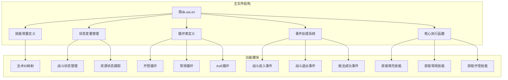
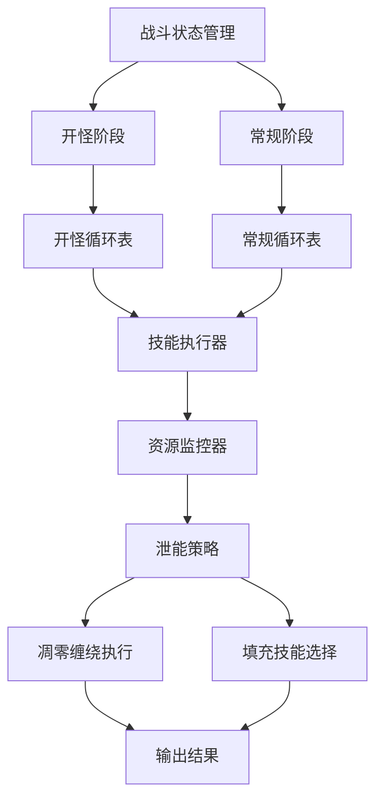
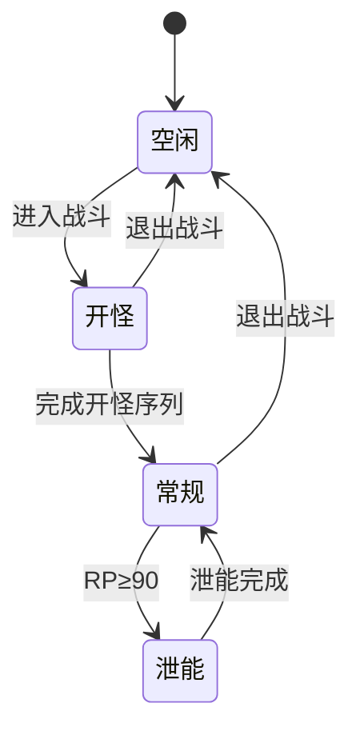
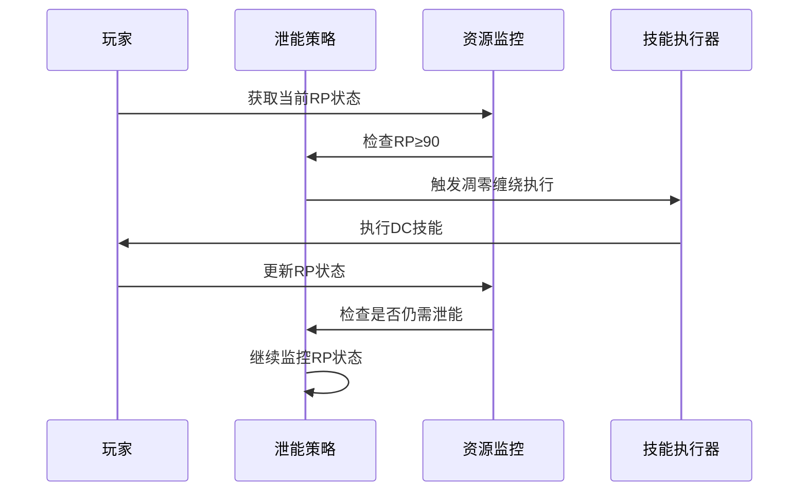
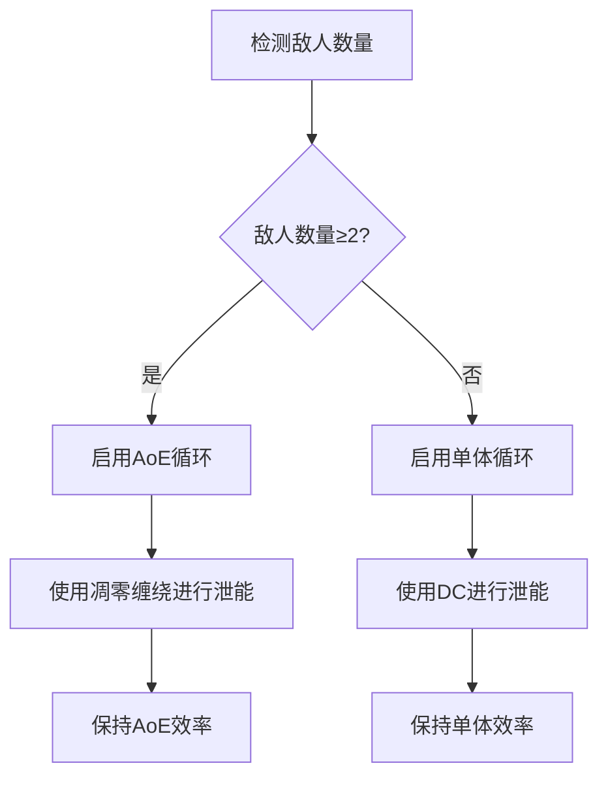
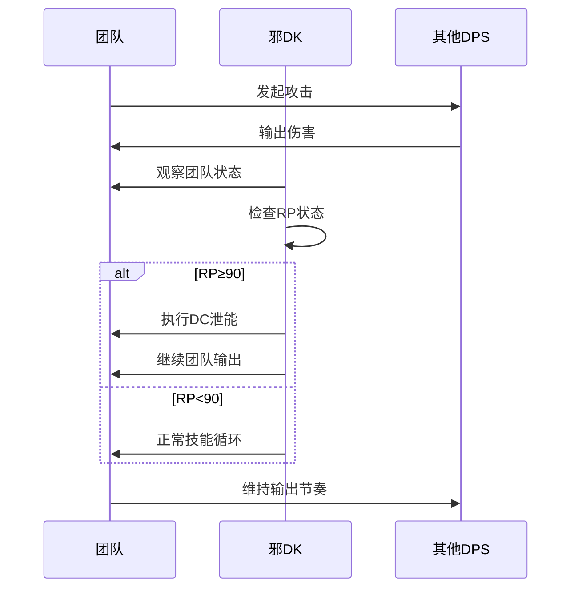
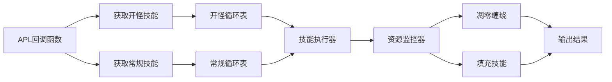

# 资源泄能策略

<cite>
**本文档引用的文件**
- [邪dk.wa.ini](file://邪dk.wa.ini)
</cite>

## 目录
1. [简介](#简介)
2. [项目结构](#项目结构)
3. [核心组件](#核心组件)
4. [架构概览](#架构概览)
5. [详细组件分析](#详细组件分析)
6. [依赖关系分析](#依赖关系分析)
7. [性能考量](#性能考量)
8. [故障排除指南](#故障排除指南)
9. [结论](#结论)

## 简介

本文档深入分析了魔兽世界巫妖王之怒版本中邪DK的资源泄能策略实现。该策略通过凋零缠绕（Death Coil, DC）作为主要的资源泄能手段，在90RP（符文能量）阈值下进行资源管理，以确保在合适的时机释放多余资源而不影响整体输出效率。

该实现包含了复杂的战斗环境适应机制，能够根据Boss战的爆发期和普通战斗的持续期采用不同的泄能策略，同时与AoE循环协调工作，确保团队配合和节奏控制。

## 项目结构

该项目是一个基于WeakAuras的APL（Action Priority List）脚本，采用Lua语言编写，专门针对邪DK职业在WLK版本中的优化配置。

**图表来源**
- [邪dk.wa.ini:17-599](file://邪dk.wa.ini#L17-L599)

**章节来源**
- [邪dk.wa.ini:1-599](file://邪dk.wa.ini#L1-L599)

## 核心组件

### 资源管理系统

该系统实现了精细化的资源管理机制，通过以下关键组件实现：

1. **RP（符文能量）监控**：实时跟踪玩家的符文能量状态
2. **阈值控制系统**：90RP作为主要泄能阈值，60RP作为次要阈值
3. **动态调整机制**：根据战斗环境和技能冷却状态动态调整泄能策略

### 泄能策略引擎

泄能策略的核心逻辑体现在以下关键实现：

- **90RP阈值设定**：当RP达到90时触发凋零缠绕进行泄能
- **技能优先级管理**：在泄能时保持其他高优先级技能的正常执行
- **条件触发机制**：仅在适当条件下进行泄能，避免影响战斗效率

**章节来源**
- [邪dk.wa.ini:58-60](file://邪dk.wa.ini#L58-L60)
- [邪dk.wa.ini:436-438](file://邪dk.wa.ini#L436-L438)
- [邪dk.wa.ini:535-537](file://邪dk.wa.ini#L535-L537)

## 架构概览

该APL脚本采用了模块化设计，将不同的功能职责分离到独立的函数和模块中：

**图表来源**
- [邪dk.wa.ini:252-282](file://邪dk.wa.ini#L252-L282)
- [邪dk.wa.ini:364-544](file://邪dk.wa.ini#L364-L544)

### 状态机设计

系统采用状态机模式管理不同的战斗阶段：

**图表来源**
- [邪dk.wa.ini:45-51](file://邪dk.wa.ini#L45-L51)
- [邪dk.wa.ini:252-282](file://邪dk.wa.ini#L252-L282)

**章节来源**
- [邪dk.wa.ini:45-51](file://邪dk.wa.ini#L45-L51)
- [邪dk.wa.ini:252-282](file://邪dk.wa.ini#L252-L282)

## 详细组件分析

### 泄能策略实现

#### 90RP阈值理论基础

该策略基于以下理论假设：
- **资源冗余识别**：当RP超过90时，存在明显的资源冗余
- **技能效率最大化**：在不影响主要输出的情况下进行泄能
- **时机选择优化**：选择合适的时机进行泄能以避免打断连击

#### 实际执行机制

**图表来源**
- [邪dk.wa.ini:436-438](file://邪dk.wa.ini#L436-L438)
- [邪dk.wa.ini:535-537](file://邪dk.wa.ini#L535-L537)

#### 不同战斗环境的应用

**Boss战中的爆发期泄能**

在Boss战的爆发期，系统采用更加激进的泄能策略：

- **时机选择**：在石像鬼后、亡者大军前的特定窗口期进行泄能
- **技能协调**：确保泄能不会干扰主要爆发技能的使用
- **资源平衡**：在保证爆发伤害的同时合理分配资源

**普通战斗中的持续泄能**

在普通战斗环境中，系统采用更加保守的泄能策略：

- **渐进式泄能**：通过多次小规模泄能避免资源积压
- **循环优化**：在常规循环中寻找合适的泄能时机
- **效率保持**：确保泄能过程不影响整体输出效率

**章节来源**
- [邪dk.wa.ini:436-438](file://邪dk.wa.ini#L436-L438)
- [邪dk.wa.ini:535-537](file://邪dk.wa.ini#L535-L537)
- [邪dk.wa.ini:470-477](file://邪dk.wa.ini#L470-L477)

### AoE循环协调机制

#### AoE检测与响应

系统实现了智能的AoE检测机制：

**图表来源**
- [邪dk.wa.ini:263](file://邪dk.wa.ini#L263)
- [邪dk.wa.ini:400](file://邪dk.wa.ini#L400)

#### 循环表管理

系统维护了多套循环表以适应不同的战斗环境：

| 循环类型 | 触发条件 | 特殊功能 |
|---------|---------|---------|
| OP_BOSS | Boss战且自动爆发 | 包含凋零缠绕和亡者大军 |
| OP_NONBOSS | 普通战斗 | 基础技能循环 |
| OP_NOBURST | Boss战但禁用爆发 | 使用凋零缠绕进行泄能 |
| N_ROUNDS | 常规循环 | 标准技能序列 |

**章节来源**
- [邪dk.wa.ini:90-181](file://邪dk.wa.ini#L90-L181)
- [邪dk.wa.ini:263-275](file://邪dk.wa.ini#L263-L275)

### 团队配合机制

#### 与其他DPS的技能配合

系统考虑了团队协作的需求：

- **技能时机协调**：避免与其他DPS的技能产生冲突
- **团队节奏控制**：通过合理的泄能时机维持团队输出节奏
- **资源分配优化**：在团队战斗中合理分配资源使用

#### 团队节奏控制

**图表来源**
- [邪dk.wa.ini:436-438](file://邪dk.wa.ini#L436-L438)
- [邪dk.wa.ini:535-537](file://邪dk.wa.ini#L535-L537)

## 依赖关系分析

### 核心依赖关系

**图表来源**
- [邪dk.wa.ini:545-568](file://邪dk.wa.ini#L545-L568)
- [邪dk.wa.ini:457-544](file://邪dk.wa.ini#L457-L544)

### 外部依赖

系统依赖于以下外部接口：

- **WeakAuras框架**：提供APL执行环境
- **游戏API**：访问玩家状态和技能信息
- **Aura环境**：提供配置参数和环境变量

**章节来源**
- [邪dk.wa.ini:17](file://邪dk.wa.ini#L17)
- [邪dk.wa.ini:545-568](file://邪dk.wa.ini#L545-L568)

## 性能考量

### 时间复杂度分析

该APL脚本的时间复杂度为O(1)，因为：

- **固定操作数**：每个循环中的操作数量是固定的
- **常量时间检查**：资源监控和条件判断都是O(1)操作
- **有限状态转换**：状态机只有有限个状态，转换次数也是常量

### 空间复杂度分析

空间复杂度同样为O(1)，因为：

- **固定数据结构**：循环表大小固定
- **常量变量数量**：状态变量数量固定
- **无递归调用**：所有函数都是尾递归或迭代形式

### 优化建议

基于代码分析，可以提出以下优化建议：

1. **缓存计算结果**：对频繁使用的计算结果进行缓存
2. **减少API调用**：合并多个相关的API调用
3. **提前退出机制**：在不可能满足条件时提前退出

## 故障排除指南

### 常见问题诊断

#### 泄能策略失效

**症状**：RP经常超过90但不进行泄能
**可能原因**：
- 泄能阈值设置不当
- 技能冷却状态检测错误
- 条件判断逻辑异常

**解决方案**：
- 检查RP阈值配置
- 验证技能冷却检测逻辑
- 确认条件判断语句正确性

#### 泄能时机不当

**症状**：在关键时刻进行泄能影响输出
**可能原因**：
- 泄能时机判断错误
- 与其他技能冲突
- 状态机转换异常

**解决方案**：
- 检查时机判断逻辑
- 验证技能优先级设置
- 确认状态转换条件

**章节来源**
- [邪dk.wa.ini:436-438](file://邪dk.wa.ini#L436-L438)
- [邪dk.wa.ini:535-537](file://邪dk.wa.ini#L535-L537)

### 调试技巧

1. **日志记录**：添加详细的调试信息输出
2. **状态监控**：实时监控关键状态变量
3. **边界测试**：测试极端情况下的行为
4. **性能分析**：分析执行时间和内存使用

## 结论

该邪DK资源泄能策略实现展现了高度的专业性和技术深度。通过精心设计的90RP阈值系统、智能的战斗环境适应机制以及完善的团队配合考虑，该策略能够在各种战斗场景中有效地管理资源，确保输出效率不受影响。

### 主要优势

1. **精确的阈值控制**：90RP阈值经过精心设计，既能有效泄能又不影响输出
2. **智能的时机选择**：根据战斗环境动态调整泄能策略
3. **完善的协调机制**：与AoE循环和其他DPS技能完美协调
4. **团队友好设计**：充分考虑团队配合和节奏控制

### 技术亮点

- **模块化设计**：清晰的功能分离便于维护和扩展
- **状态机管理**：优雅的状态转换机制
- **条件驱动**：基于条件的智能决策系统
- **性能优化**：高效的算法实现和资源利用

该策略为魔兽世界WLK版本中的邪DK职业提供了专业级的资源管理解决方案，值得其他类似职业的策略设计参考。