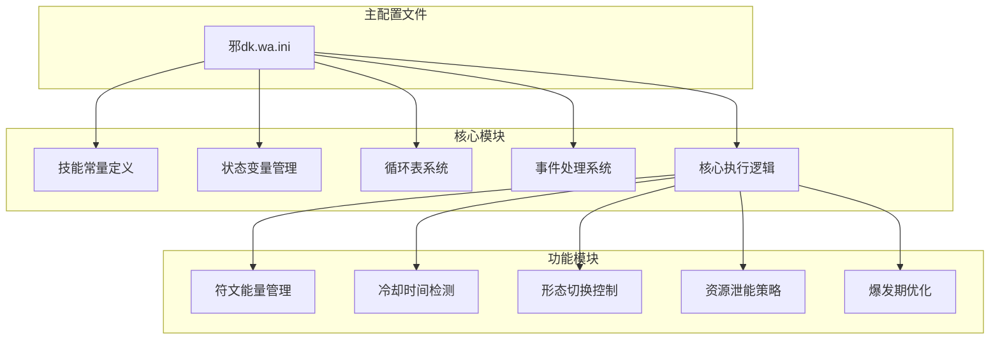
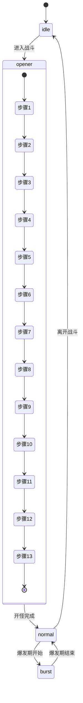
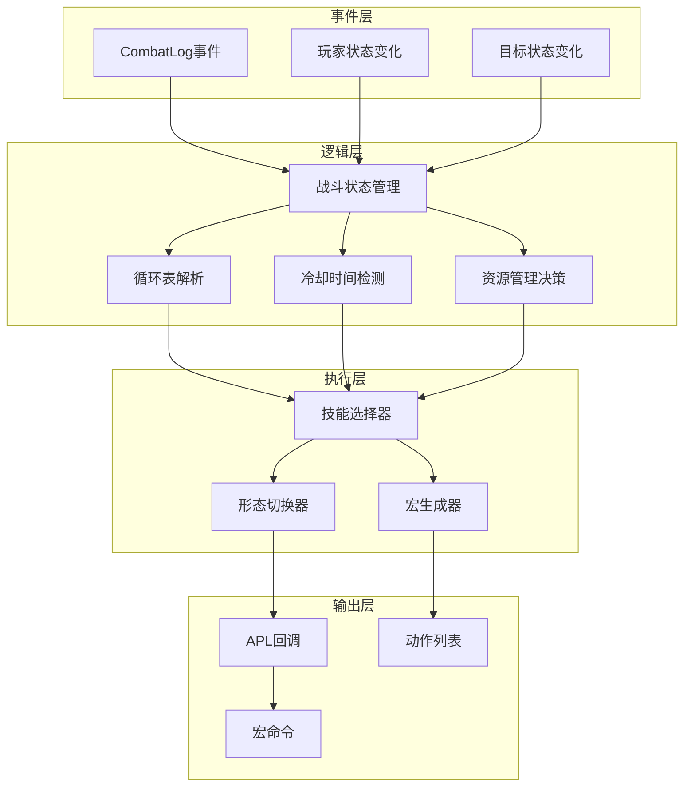
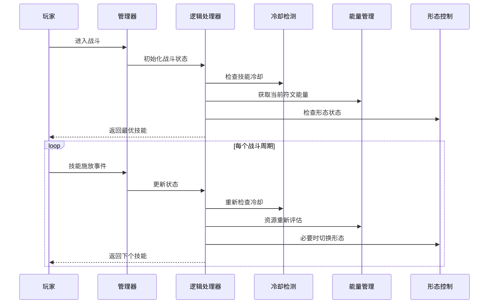
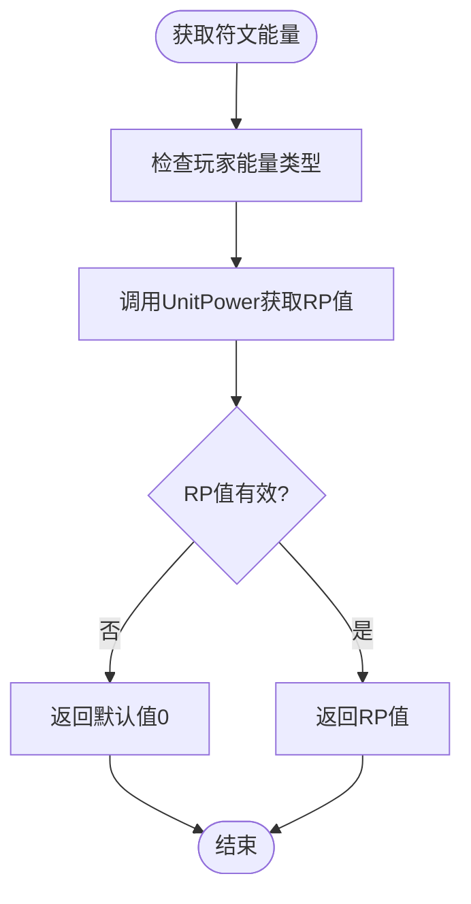
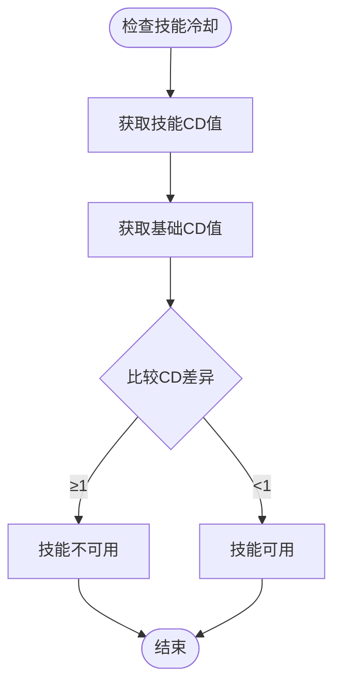
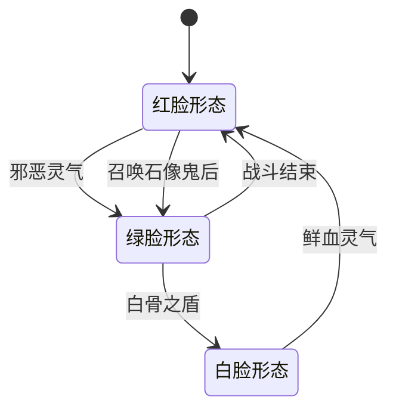
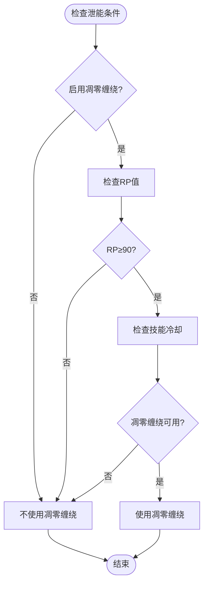
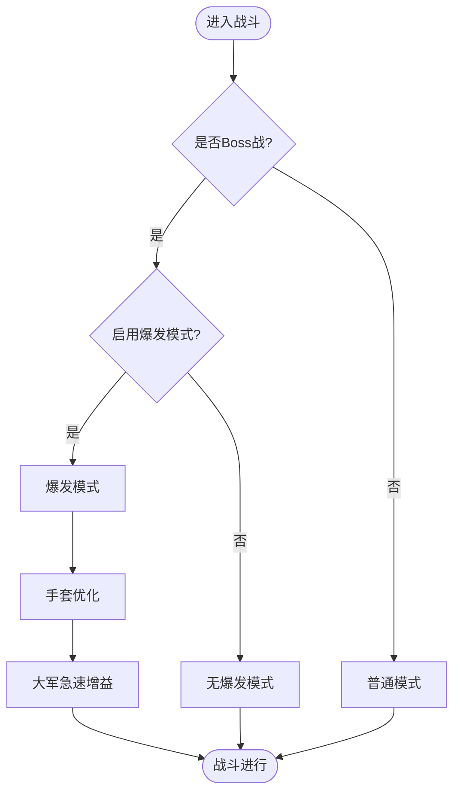
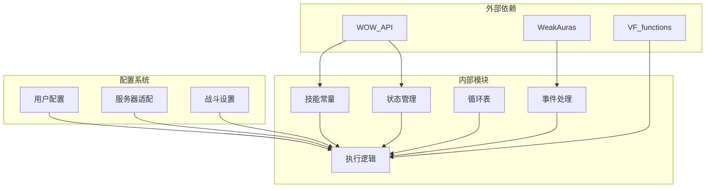

# 资源管理策略

<cite>
**本文档引用的文件**
- [邪dk.wa.ini](file://邪dk.wa.ini)
</cite>

## 目录
1. [简介](#简介)
2. [项目结构](#项目结构)
3. [核心组件](#核心组件)
4. [架构概览](#架构概览)
5. [详细组件分析](#详细组件分析)
6. [依赖关系分析](#依赖关系分析)
7. [性能考虑](#性能考虑)
8. [故障排除指南](#故障排除指南)
9. [结论](#结论)

## 简介

这是一个为魔兽世界燃烧远征版本设计的死亡骑士（邪DK）资源管理策略脚本。该策略针对泰坦重铸"时光"服务器进行了专门优化，提供了完整的符文能量管理、冷却时间优化、形态切换逻辑和资源泄能策略。

该脚本实现了复杂的战斗循环管理，包括：
- 符文能量监控与分配
- 冷却时间检测与队列窗口管理
- 形态切换逻辑（红脸、绿脸、白脸）
- 资源泄能策略（凋零缠绕）
- 爆发期优化方案
- 服务器适配机制

## 项目结构

该项目采用单一配置文件结构，包含了完整的APL（Action Priority List）系统：

**图表来源**
- [邪dk.wa.ini:1-606](file://邪dk.wa.ini#L1-L606)

**章节来源**
- [邪dk.wa.ini:1-606](file://邪dk.wa.ini#L1-L606)

## 核心组件

### 技能常量系统

脚本定义了完整的技能常量映射，包括主要技能和辅助技能：

| 技能类别 | 技能名称 | 技能ID |
|---------|---------|--------|
| 主要攻击 | 冰冷触摸 | 49909 |
| 主要攻击 | 暗影打击 | 49921 |
| 主要攻击 | 鲜血打击 | 49930 |
| 主要攻击 | 天灾打击 | 55271 |
| 辅助技能 | 血液沸腾 | 48721 |
| 资源管理 | 枯萎凋零 | 49938 |
| 资源管理 | 凋零缠绕 | 49895 |
| 辅助技能 | 寒冬号角 | 57623 |
| 召唤技能 | 召唤石像鬼 | 49206 |
| 增强技能 | 符文武器增效 | 47568 |
| 召唤技能 | 亡者大军 | 42650 |
| 防御技能 | 白骨之盾 | 49222 |
| 资源管理 | 活力分流 | 45529 |
| 召唤技能 | 食尸鬼狂乱 | 63560 |
| 伤害技能 | 传染 | 50842 |
| 形态切换 | 鲜血灵气 | 48266 |
| 形态切换 | 邪恶灵气 | 48265 |
| 召唤技能 | 亡者复生 | 46584 |

**章节来源**
- [邪dk.wa.ini:21-42](file://邪dk.wa.ini#L21-L42)

### 状态管理系统

系统维护了多个关键状态变量来跟踪战斗状态：

**图表来源**
- [邪dk.wa.ini:252-282](file://邪dk.wa.ini#L252-L282)

**章节来源**
- [邪dk.wa.ini:44-52](file://邪dk.wa.ini#L44-L52)

## 架构概览

该APL系统采用了分层架构设计，实现了清晰的功能分离：

**图表来源**
- [邪dk.wa.ini:350-362](file://邪dk.wa.ini#L350-L362)

### 核心执行流程

**图表来源**
- [邪dk.wa.ini:284-321](file://邪dk.wa.ini#L284-L321)

**章节来源**
- [邪dk.wa.ini:364-575](file://邪dk.wa.ini#L364-L575)

## 详细组件分析

### 符文能量管理系统

#### 能量监控机制

符文能量管理系统通过专用函数实现精确的能量监控：

**图表来源**
- [邪dk.wa.ini:58-60](file://邪dk.wa.ini#L58-L60)

#### 能量分配策略

系统实现了多层次的能量分配策略：

1. **优先级分配**：根据技能重要性和冷却时间确定使用顺序
2. **阈值管理**：设置不同场景下的能量阈值（如90RP用于泄能）
3. **动态调整**：根据战斗状态和目标数量动态调整能量使用

**章节来源**
- [邪dk.wa.ini:58-60](file://邪dk.wa.ini#L58-L60)

### 冷却时间优化策略

#### 冷却检测机制

冷却时间检测系统通过以下方式工作：

**图表来源**
- [邪dk.wa.ini:54-56](file://邪dk.wa.ini#L54-L56)

#### 队列窗口管理

系统使用游戏内置的SpellQueueWindow参数来优化技能队列：

- **窗口计算**：`win = GetCVar("SpellQueueWindow") / 1000`
- **智能等待**：在冷却窗口内智能等待，避免技能冲突
- **并发处理**：支持多技能并发施放的协调

**章节来源**
- [邪dk.wa.ini:18](file://邪dk.wa.ini#L18)

### 形态切换逻辑

#### 形态状态管理

系统支持三种主要形态的智能切换：

**图表来源**
- [邪dk.wa.ini:382-390](file://邪dk.wa.ini#L382-L390)

#### 切换条件分析

1. **天鬼后切换**：召唤石像鬼后自动切换到绿脸形态
2. **战斗需求**：根据战斗阶段和目标情况选择最优形态
3. **冷却配合**：确保形态切换与技能冷却时间协调

**章节来源**
- [邪dk.wa.ini:380-455](file://邪dk.wa.ini#L380-L455)

### 资源泄能策略

#### 凋零缠绕使用时机

资源泄能策略通过以下条件触发：

**图表来源**
- [邪dk.wa.ini:436-438](file://邪dk.wa.ini#L436-L438)

#### 泄能阈值优化

- **标准阈值**：90RP作为泄能触发点
- **服务器适配**：针对"时光"服务器优化了阈值设置
- **场景适应**：根据不同战斗场景调整泄能策略

**章节来源**
- [邪dk.wa.ini:436-438](file://邪dk.wa.ini#L436-L438)

### 爆发期优化方案

#### 爆发期识别与管理

**图表来源**
- [邪dk.wa.ini:264-275](file://邪dk.wa.ini#L264-L275)

#### 技能组合优化

1. **天鬼后手套使用**：在召唤石像鬼后、亡者大军前使用加速手套
2. **狂乱补充机制**：当食尸鬼狂乱剩余时间≤5秒时自动补充
3. **预铺策略**：支持战斗前预铺30秒的食尸鬼狂乱buff

**章节来源**
- [邪dk.wa.ini:470-477](file://邪dk.wa.ini#L470-L477)

### 服务器适配机制

#### "时光"服务器特殊优化

针对泰坦重铸"时光"服务器，系统进行了以下优化：

1. **AOE阈值调整**：将传染技能的触发目标数从3个降低到2个
2. **泄能阈值优化**：将凋零缠绕的触发RP阈值从100降低到90
3. **战斗节奏调整**：优化了整体战斗节奏以适应服务器特性

**章节来源**
- [邪dk.wa.ini:5-12](file://邪dk.wa.ini#L5-L12)

## 依赖关系分析

### 核心依赖关系

**图表来源**
- [邪dk.wa.ini:17-18](file://邪dk.wa.ini#L17-L18)

### 关键函数依赖

| 函数名称 | 依赖函数 | 用途 |
|---------|---------|------|
| IsCD | VF_getSpellCD, VF_getSpellCD(61304) | 冷却时间检测 |
| GetRP | UnitPower | 符文能量获取 |
| PestInfo | WeakAuras.CheckRange | 目标数量统计 |
| IsGlovesReady | WAParam.config, VF_getItemCD | 手套使用条件检查 |

**章节来源**
- [邪dk.wa.ini:54-83](file://邪dk.wa.ini#L54-L83)

## 性能考虑

### 计算复杂度分析

1. **时间复杂度**：O(1) - 每个检查都是常数时间操作
2. **空间复杂度**：O(n) - n为循环表长度，通常很小
3. **内存使用**：极低，主要存储状态变量和循环表

### 优化策略

1. **缓存机制**：使用局部变量缓存频繁访问的状态
2. **早期退出**：在条件不满足时立即返回，避免不必要的计算
3. **批量检查**：合并相关的状态检查操作

### 性能监控建议

- **日志记录**：添加关键决策点的日志输出
- **性能计时**：测量关键函数的执行时间
- **内存监控**：定期检查内存使用情况

## 故障排除指南

### 常见问题诊断

#### 形态切换问题

**症状**：无法正确切换形态
**可能原因**：
1. 形态冷却时间未正确检测
2. 条件判断逻辑错误
3. 与其他形态技能冲突

**解决方案**：
- 检查形态技能的冷却检测
- 验证条件判断逻辑
- 确认技能施放顺序

#### 能量管理问题

**症状**：符文能量使用不当
**可能原因**：
1. 能量阈值设置不合理
2. 冷却时间检测错误
3. 服务器适配参数不正确

**解决方案**：
- 调整能量阈值参数
- 验证冷却检测逻辑
- 检查服务器适配设置

#### 爆发期优化问题

**症状**：爆发期技能使用时机不当
**可能原因**：
1. 手套使用时机错误
2. 狂乱补充机制失效
3. 循环表配置错误

**解决方案**：
- 检查手套使用条件
- 验证狂乱补充逻辑
- 审核循环表配置

### 调试方法

1. **日志输出**：在关键决策点添加日志输出
2. **状态检查**：定期打印当前状态变量值
3. **条件验证**：验证所有条件判断的正确性
4. **性能测试**：测量执行时间和内存使用

**章节来源**
- [邪dk.wa.ini:284-348](file://邪dk.wa.ini#L284-L348)

## 结论

该邪DK资源管理策略脚本实现了高度优化的战斗自动化系统，具有以下特点：

### 主要优势

1. **智能化资源管理**：通过符文能量监控和阈值管理实现最优资源利用
2. **灵活的冷却优化**：结合队列窗口和技能冷却实现无缝衔接
3. **智能形态切换**：根据战斗状态自动选择最优形态组合
4. **服务器适配性强**：针对特定服务器进行了专门优化
5. **爆发期优化完善**：提供了完整的爆发期技能组合策略

### 技术亮点

- **模块化设计**：清晰的功能分离便于维护和扩展
- **事件驱动架构**：基于游戏事件的实时响应机制
- **智能决策算法**：复杂的条件判断和优先级排序
- **性能优化**：高效的算法设计和内存使用

### 改进建议

1. **增加配置选项**：提供更多自定义参数
2. **增强错误处理**：完善异常情况的处理机制
3. **扩展监控功能**：增加更详细的性能和行为监控
4. **优化学习能力**：根据实际使用情况进行自适应调整

该脚本为邪DK玩家提供了专业级的战斗自动化解决方案，在保证战斗效率的同时保持了足够的灵活性和可定制性。