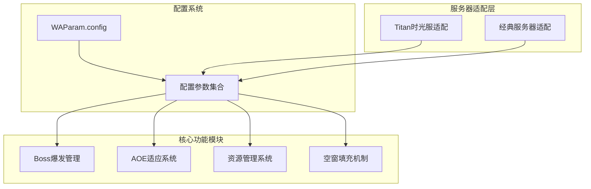
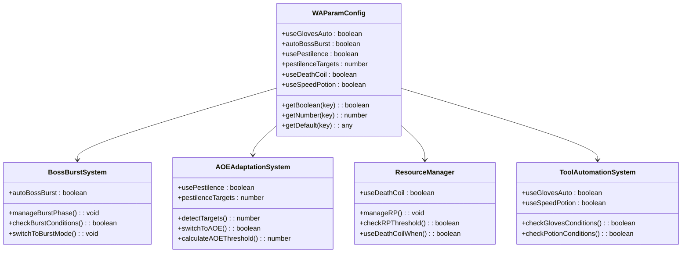
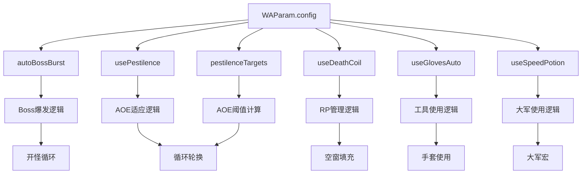
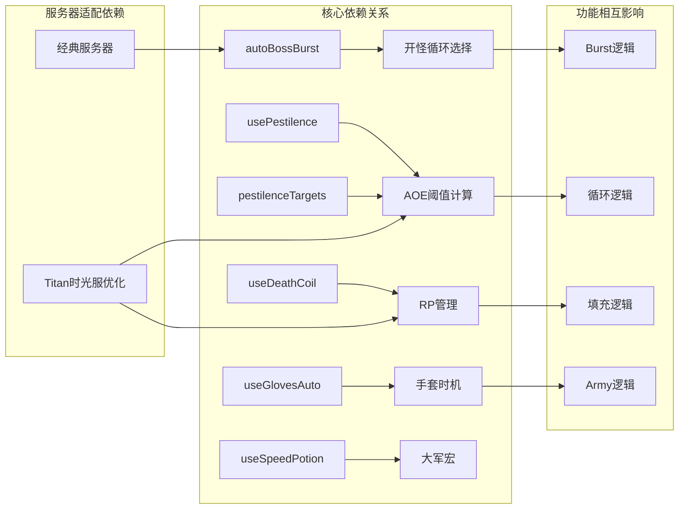

# 配置参数详解

<cite>
**本文档引用的文件**
- [邪dk.wa.ini](file://邪dk.wa.ini)
- [README.md](file://README.md)
</cite>

## 目录
1. [简介](#简介)
2. [项目结构](#项目结构)
3. [核心组件](#核心组件)
4. [架构概览](#架构概览)
5. [详细组件分析](#详细组件分析)
6. [依赖关系分析](#依赖关系分析)
7. [性能考虑](#性能考虑)
8. [故障排除指南](#故障排除指南)
9. [结论](#结论)
10. [附录](#附录)

## 简介

本文档详细解析WAParam.config配置参数系统，这是一个为魔兽世界WLK版本设计的邪DK自动输出循环（APL）脚本的核心配置系统。该系统通过WeakAuras插件实现智能技能优先级管理，特别针对泰坦重铸"时光"服务器进行了深度优化。

该配置系统提供了100%可定制化的参数控制，允许玩家根据个人游戏习惯、服务器特点和具体战斗场景调整输出策略。系统包含自动爆发管理、AOE适应、资源管理和容错机制等多个维度的配置选项。

## 项目结构

该项目采用模块化设计，主要包含以下核心组件：

**图表来源**
- [邪dk.wa.ini:17-18](file://邪dk.wa.ini#L17-L18)
- [README.md:264-275](file://README.md#L264-L275)

**章节来源**
- [邪dk.wa.ini:1-606](file://邪dk.wa.ini#L1-L606)
- [README.md:1-420](file://README.md#L1-L420)

## 核心组件

### WAParam.config系统概述

WAParam.config是整个APL脚本的核心配置容器，通过aura_env访问，提供以下关键功能：

- **参数访问接口**：统一的配置参数访问方式
- **运行时动态调整**：支持在战斗中动态启用/禁用功能
- **默认值处理**：提供合理的默认值和后备机制
- **类型安全保证**：确保参数类型的一致性和有效性

### 配置参数分类

系统将配置参数分为以下几类：

1. **爆发管理参数**：控制Boss战爆发阶段的行为
2. **AOE适应参数**：管理多目标战斗的适应性
3. **资源管理参数**：控制符文能量的使用策略
4. **工具使用参数**：管理工程装备的自动使用
5. **服务器适配参数**：针对特定服务器的优化设置

**章节来源**
- [README.md:268-274](file://README.md#L268-L274)
- [邪dk.wa.ini:262-275](file://邪dk.wa.ini#L262-L275)

## 架构概览

### 配置参数架构图

**图表来源**
- [README.md:268-274](file://README.md#L268-L274)
- [邪dk.wa.ini:262-275](file://邪dk.wa.ini#L262-L275)

### 参数依赖关系图

**图表来源**
- [README.md:268-274](file://README.md#L268-L274)
- [邪dk.wa.ini:262-275](file://邪dk.wa.ini#L262-L275)

## 详细组件分析

### autoBossBurst参数详解

#### 参数作用
控制Boss战中自动爆发模式的启用状态，决定是否使用完整的爆发循环而非蓄力循环。

#### 默认值与取值范围
- **默认值**：true
- **取值范围**：boolean (true/false)
- **实际行为**：true启用爆发模式，false启用蓄力模式

#### 适用场景
- **推荐设置**：true（默认）
- **适用情况**：
  - 高难度Boss战
  - 需要最大化爆发伤害的场合
  - 服务器环境适合爆发输出
- **不适用情况**：
  - 低等级Boss战
  - 需要精确控制的机制战
  - 服务器环境不适合爆发

#### 性能影响
- **正面影响**：提升爆发阶段伤害输出
- **负面影响**：增加技能复杂度，可能增加失误风险

**章节来源**
- [README.md:269](file://README.md#L269)
- [README.md:390-397](file://README.md#L390-L397)
- [邪dk.wa.ini:264-271](file://邪dk.wa.ini#L264-L271)

### usePestilence参数详解

#### 参数作用
控制是否启用传染（Pestilence）技能的自动使用，用于AOE输出循环。

#### 默认值与取值范围
- **默认值**：true
- **取值范围**：boolean (true/false)
- **实际行为**：true启用AOE循环，false使用单体循环

#### 适用场景
- **推荐设置**：true（默认）
- **适用情况**：
  - 2个及以上额外目标时
  - 多目标战斗环境
  - 需要最大化AOE伤害的场合
- **不适用情况**：
  - 单目标战斗
  - 服务器环境不适合AOE
  - 个人偏好单体输出

#### 性能影响
- **正面影响**：提升AOE伤害输出
- **负面影响**：增加技能选择复杂度

**章节来源**
- [README.md:270](file://README.md#L270)
- [README.md:390-397](file://README.md#L390-L397)
- [邪dk.wa.ini:262-263](file://邪dk.wa.ini#L262-L263)

### pestilenceTargets参数详解

#### 参数作用
设置使用AOE循环所需的最小额外目标数量阈值。

#### 默认值与取值范围
- **默认值**：2
- **取值范围**：number (≥1)
- **实际行为**：≥2个额外目标时启用AOE循环

#### 服务器适配
- **泰坦时光服**：经过特殊优化，阈值从1目标调整为2目标
- **原因**：适应25人副本环境的多目标战斗特点

#### 适用场景
- **推荐设置**：2（默认，泰坦时光服优化）
- **适用情况**：
  - 25人副本环境
  - 多目标战斗频繁的场合
  - 需要平衡AOE和单体输出的场合
- **调整建议**：
  - 1目标：更激进的AOE策略
  - 3目标：更保守的AOE策略

#### 性能影响
- **正面影响**：避免不必要的AOE切换
- **负面影响**：可能导致AOE机会的错过

**章节来源**
- [README.md:271](file://README.md#L271)
- [README.md:391-392](file://README.md#L391-L392)
- [README.md:390-397](file://README.md#L390-L397)
- [邪dk.wa.ini:262-263](file://邪dk.wa.ini#L262-L263)

### useDeathCoil参数详解

#### 参数作用
控制是否启用凋零缠绕（Death Coil）进行符文能量泄能。

#### 默认值与取值范围
- **默认值**：true
- **取值范围**：boolean (true/false)
- **实际行为**：true启用泄能机制，false禁用

#### 资源管理策略
- **空窗期泄能**：RP ≥ 50时使用凋零缠绕
- **循环中泄能**：RP ≥ 90时强制使用凋零缠绕
- **目的**：避免符文能量溢出，保持资源利用率

#### 适用场景
- **推荐设置**：true（默认）
- **适用情况**：
  - 需要精确资源管理的场合
  - 高RP溢出风险的战斗
  - 服务器环境适合泄能策略
- **不适用情况**：
  - 低RP需求的战斗
  - 服务器环境不适合泄能

#### 性能影响
- **正面影响**：提升资源利用效率
- **负面影响**：可能影响伤害输出节奏

**章节来源**
- [README.md:272](file://README.md#L272)
- [README.md:393](file://README.md#L393)
- [README.md:390-397](file://README.md#L390-L397)
- [邪dk.wa.ini:365-367](file://邪dk.wa.ini#L365-L367)
- [邪dk.wa.ini:435-438](file://邪dk.wa.ini#L435-L438)
- [邪dk.wa.ini:541-544](file://邪dk.wa.ini#L541-L544)

### useGlovesAuto参数详解

#### 参数作用
控制是否启用自动使用加速手套和萨隆邪铁炸弹的功能。

#### 默认值与取值范围
- **默认值**：true
- **取值范围**：boolean (true/false)
- **实际行为**：true启用自动工具使用，false禁用

#### 使用时机
- **爆发期使用**：在召唤石像鬼后、亡者大军前自动使用
- **使用条件**：
  - Boss战且开启自动爆发
  - 手套CD为0
  - 目标距离≤5码
- **目的**：让亡者大军享受15秒急速buff

#### 服务器适配
- **泰坦时光服**：经过特殊优化，扩大了使用时机窗口
- **改进**：oStep 8-9之间都可使用，避免错过最佳时机

#### 适用场景
- **推荐设置**：true（默认）
- **适用情况**：
  - 需要最大化爆发伤害的场合
  - 服务器环境适合工具使用
  - 个人偏好自动化工具使用
- **不适用情况**：
  - 服务器环境不适合工具使用
  - 个人偏好手动控制

#### 性能影响
- **正面影响**：提升爆发伤害输出
- **负面影响**：可能增加工具使用复杂度

**章节来源**
- [README.md:268](file://README.md#L268)
- [README.md:394-397](file://README.md#L394-L397)
- [README.md:386-388](file://README.md#L386-L388)
- [邪dk.wa.ini:78-83](file://邪dk.wa.ini#L78-L83)
- [邪dk.wa.ini:471-477](file://邪dk.wa.ini#L471-L477)
- [邪dk.wa.ini:439-447](file://邪dk.wa.ini#L439-L447)

### useSpeedPotion参数详解

#### 参数作用
控制是否在亡者大军时自动使用速度药水。

#### 默认值与取值范围
- **默认值**：true
- **取值范围**：boolean (true/false)
- **实际行为**：true启用速度药水使用，false禁用

#### 使用时机
- **触发条件**：在亡者大军宏中自动添加
- **使用条件**：满足使用速度药水的前置条件
- **目的**：进一步提升亡者大军的伤害输出

#### 适用场景
- **推荐设置**：true（默认）
- **适用情况**：
  - 需要最大化亡者大军伤害的场合
  - 服务器环境适合速度药水
  - 个人偏好自动化药水使用
- **不适用情况**：
  - 服务器环境不适合速度药水
  - 个人偏好手动控制药水使用

#### 性能影响
- **正面影响**：小幅提升亡者大军伤害
- **负面影响**：可能增加药水使用复杂度

**章节来源**
- [README.md:273](file://README.md#L273)
- [README.md:390-397](file://README.md#L390-L397)
- [邪dk.wa.ini:589-591](file://邪dk.wa.ini#L589-L591)

## 依赖关系分析

### 参数间依赖关系

**图表来源**
- [README.md:390-397](file://README.md#L390-L397)
- [README.md:391-392](file://README.md#L391-L392)
- [README.md:393](file://README.md#L393)

### 参数冲突与兼容性

| 参数组合 | 兼容性 | 影响说明 |
|---------|--------|----------|
| autoBossBurst=true + usePestilence=true | 完全兼容 | 标准爆发AOE组合 |
| autoBossBurst=false + usePestilence=true | 部分兼容 | 蓄力AOE组合，效果减弱 |
| useDeathCoil=false + useGlovesAuto=true | 部分兼容 | 可能错过泄能机会 |
| useGlovesAuto=false + useSpeedPotion=true | 完全兼容 | 大军宏独立工作 |

**章节来源**
- [README.md:268-274](file://README.md#L268-L274)
- [README.md:390-397](file://README.md#L390-L397)

## 性能考虑

### 参数调优策略

#### 服务器适配优化

**泰坦时光服特殊配置**：
- AOE阈值：从1目标调整为2目标
- 泄能阈值：从100RP降低为90RP
- 爆发时机：优化手套使用时机窗口

#### 性能调优建议

1. **基础调优**：
   - 保持autoBossBurst=true（默认）
   - 保持usePestilence=true（默认）
   - 保持useDeathCoil=true（默认）

2. **高级调优**：
   - pestilenceTargets：根据服务器环境调整（1-3）
   - useGlovesAuto：根据个人习惯调整
   - useSpeedPotion：根据服务器环境调整

3. **性能监控指标**：
   - AOE触发频率
   - 爆发伤害峰值
   - 资源利用率
   - 错误率统计

**章节来源**
- [README.md:390-397](file://README.md#L390-L397)
- [README.md:391-392](file://README.md#L391-L392)
- [README.md:393](file://README.md#L393)

## 故障排除指南

### 常见配置问题

#### 问题1：AOE功能不生效
**症状**：即使有多个目标也不切换到AOE循环
**可能原因**：
- usePestilence设置为false
- pestilenceTargets设置过高
- 目标检测失败

**解决方案**：
1. 确认usePestilence=true
2. 检查pestilenceTargets设置（建议2）
3. 验证目标检测逻辑

#### 问题2：爆发功能异常
**症状**：Boss战不进入爆发模式
**可能原因**：
- autoBossBurst设置为false
- 手套使用条件不满足
- 形态切换失败

**解决方案**：
1. 确认autoBossBurst=true
2. 检查useGlovesAuto设置
3. 验证形态切换逻辑

#### 问题3：资源管理问题
**症状**：RP溢出或不足
**可能原因**：
- useDeathCoil设置不当
- 泄能阈值设置不合理
- 资源管理逻辑错误

**解决方案**：
1. 确认useDeathCoil=true
2. 检查RP阈值设置（默认90）
3. 验证资源管理逻辑

**章节来源**
- [README.md:302-323](file://README.md#L302-L323)
- [README.md:326-342](file://README.md#L326-L342)

### 调试方法

#### 参数验证
1. 在WA界面中查看当前配置值
2. 检查参数是否正确加载
3. 验证参数类型和范围

#### 功能测试
1. 创建测试环境
2. 执行基本功能测试
3. 观察参数变化对行为的影响

#### 日志分析
1. 查看APL执行日志
2. 分析参数使用记录
3. 识别异常行为模式

## 结论

WAParam.config配置系统为邪DK玩家提供了高度可定制化的输出策略控制。通过合理配置这些参数，玩家可以在不同服务器环境和战斗场景下实现最优的输出表现。

### 关键要点总结

1. **默认配置优化**：所有参数默认值都经过泰坦时光服优化，适合大多数玩家使用
2. **服务器适配**：针对泰坦重铸"时光"服务器进行了专门优化
3. **功能完整性**：涵盖了从爆发管理到资源控制的所有核心功能
4. **安全性保证**：提供合理的默认值和后备机制，确保脚本稳定性

### 推荐配置组合

#### 新手推荐
- autoBossBurst: true（默认）
- usePestilence: true（默认）
- pestilenceTargets: 2（默认）
- useDeathCoil: true（默认）
- useGlovesAuto: true（默认）
- useSpeedPotion: true（默认）

#### 高级玩家配置
- 根据服务器环境微调pestilenceTargets
- 根据个人习惯调整useGlovesAuto
- 在特定战斗中临时调整useDeathCoil

## 附录

### 参数完整列表

| 参数名 | 类型 | 默认值 | 作用描述 |
|--------|------|--------|----------|
| useGlovesAuto | boolean | true | 自动使用加速手套/炸弹 |
| autoBossBurst | boolean | true | Boss战自动爆发模式 |
| usePestilence | boolean | true | 启用AOE传染功能 |
| pestilenceTargets | number | 2 | AOE触发的目标数量阈值 |
| useDeathCoil | boolean | true | 启用符文能量泄能 |
| useSpeedPotion | boolean | true | 大军时使用速度药水 |

### 自定义配置指导

#### 安全修改原则
1. **渐进式调整**：每次只修改一个参数
2. **充分测试**：在安全环境下验证修改效果
3. **备份配置**：修改前备份原始配置
4. **监控效果**：密切观察修改后的表现

#### 修改流程
1. 在WA界面中找到"疯狂念秋"aura
2. 展开"选项"面板
3. 修改目标参数值
4. 保存配置并测试
5. 根据效果进行微调

#### 注意事项
- 避免同时修改多个参数
- 考虑服务器环境特点
- 保留必要的默认值
- 定期评估配置效果

**章节来源**
- [README.md:368-373](file://README.md#L368-L373)
- [README.md:360-380](file://README.md#L360-L380)