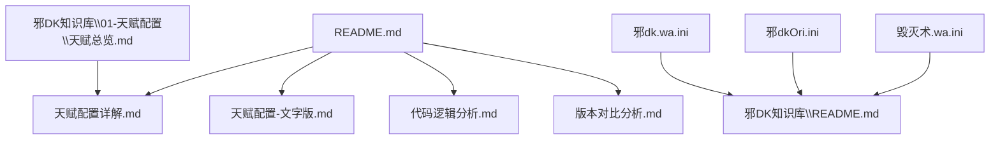
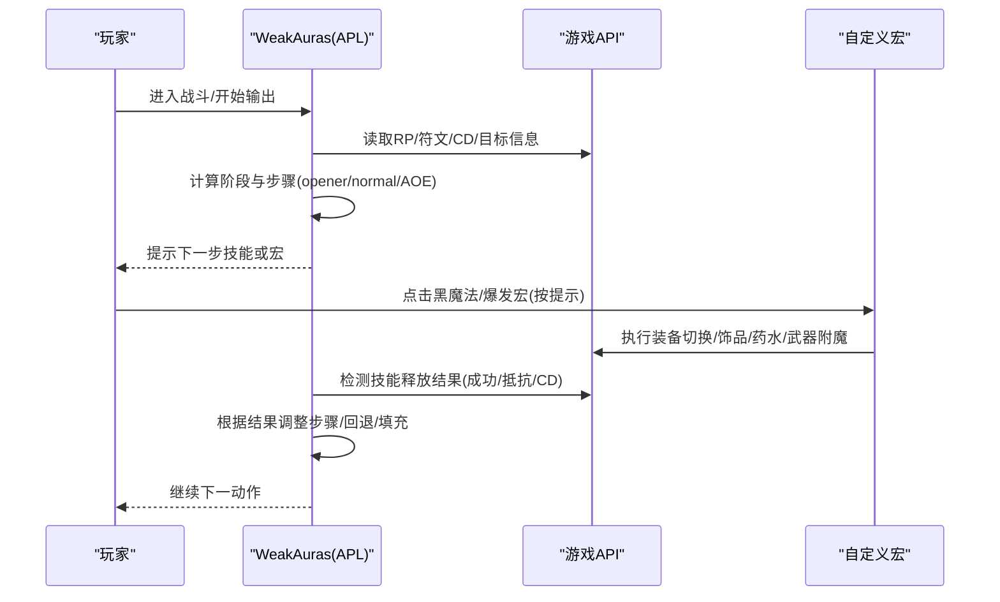
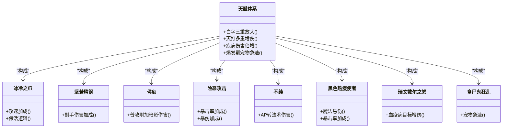
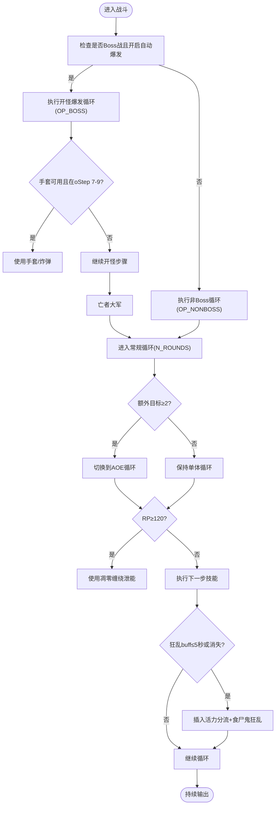
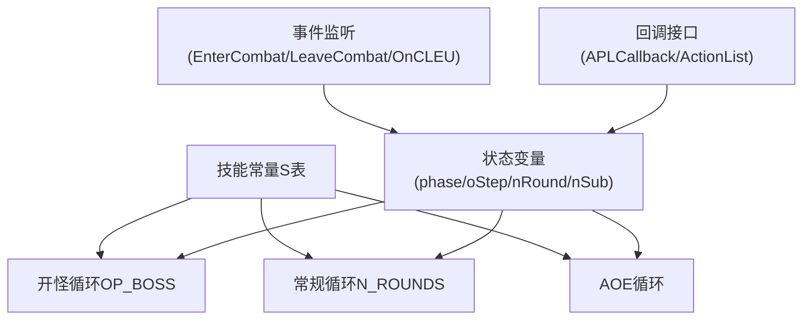

# 天赋配置详解文档

<cite>
**本文引用的文件**
- [README.md](file://README.md)
- [天赋配置详解.md](file://天赋配置详解.md)
- [天赋配置-文字版.md](file://天赋配置-文字版.md)
- [代码逻辑分析.md](file://代码逻辑分析.md)
- [版本对比分析.md](file://版本对比分析.md)
- [邪dk.wa.ini](file://邪dk.wa.ini)
- [邪dkOri.ini](file://邪dkOri.ini)
- [毁灭术.wa.ini](file://毁灭术.wa.ini)
- [邪DK知识库\README.md](file://邪DK知识库/README.md)
- [邪DK知识库\01-天赋配置\天赋总览.md](file://邪DK知识库/01-天赋配置/天赋总览.md)
</cite>

## 目录
1. [引言](#引言)
2. [项目结构](#项目结构)
3. [核心组件](#核心组件)
4. [架构总览](#架构总览)
5. [详细组件分析](#详细组件分析)
6. [依赖关系分析](#依赖关系分析)
7. [性能与优化建议](#性能与优化建议)
8. [故障排查指南](#故障排查指南)
9. [结论](#结论)
10. [附录](#附录)

## 引言
本文件围绕“不死亡灵骑士（邪DK）”在泰坦时光服（WLK 80级框架）下的天赋配置、雕文搭配与自动化输出循环进行系统化说明。内容涵盖：
- 天赋树分配与协同效应
- 雕文选择与收益评估
- WA脚本的循环策略、状态管理与容错机制
- 版本差异与优化点
- 实战使用流程与常见问题处理

目标读者包括新手玩家与进阶用户，力求以循序渐进的方式呈现技术细节与实战要点。

## 项目结构
仓库包含以下关键资料与实现：
- 顶层说明与主文档：README.md、天赋配置详解.md、天赋配置-文字版.md、代码逻辑分析.md、版本对比分析.md
- WA脚本实现：邪dk.wa.ini（优化版）、邪dkOri.ini（原始版）、毁灭术.wa.ini（参考实现）
- 知识库组织：邪DK知识库/README.md 与各子模块文档索引

图示来源
- [README.md:1-50](file://README.md#L1-L50)
- [邪DK知识库\README.md:1-60](file://邪DK知识库/README.md#L1-L60)

章节来源
- [README.md:1-50](file://README.md#L1-L50)
- [邪DK知识库\README.md:1-60](file://邪DK知识库/README.md#L1-L60)

## 核心组件
- 天赋体系：冰霜系18点 + 邪恶系53点，构建白字放大、天打增伤、疾病伤害倍增与爆发期宠物急速四大协同体系
- 雕文体系：大雕文聚焦凋零增伤、宠物属性提升与死缠增伤；小雕文优化大军嘲讽、复生消耗与传染范围
- WA循环：开怪爆发、常规四轮换行、AOE自动切换、资源泄能与容错回退
- 宏集成：黑魔法宏与爆发宏提示时机，确保手套/炸弹/饰品/药水等最佳使用时机

章节来源
- [天赋配置详解.md:1-120](file://天赋配置详解.md#L1-L120)
- [天赋配置-文字版.md:1-120](file://天赋配置-文字版.md#L1-L120)
- [邪dk.wa.ini:1-120](file://邪dk.wa.ini#L1-L120)

## 架构总览
WA脚本采用事件驱动与状态机结合的模式：
- 事件监听：进入战斗、离开战斗、技能命中/抵抗事件
- 状态变量：阶段(phase)、开怪步骤(oStep)、常规轮次(nRound)、子步骤(nSub)等
- 循环表：OP_BOSS、N_ROUNDS(多轮)、AOE变体与非Boss变体
- 回调接口：APLCallback/ActionList 提供优先级决策

图示来源
- [邪dk.wa.ini:1-120](file://邪dk.wa.ini#L1-L120)
- [代码逻辑分析.md:90-180](file://代码逻辑分析.md#L90-L180)

章节来源
- [邪dk.wa.ini:1-120](file://邪dk.wa.ini#L1-L120)
- [代码逻辑分析.md:90-180](file://代码逻辑分析.md#L90-L180)

## 详细组件分析

### 天赋体系与协同效应
- 白字三重放大：冰冷之爪(攻速+20%) × 坚若精钢(副手+25%) × 骨疽(普攻附加暗影伤害)，形成白字DPS显著放大
- 天打多重增伤：险恶攻击(暴击率+6%、暴伤+30%) × 不纯(AP×20%法术伤害) × 黑色热疫使者(魔法易伤13%+暴击3%) × 瑞文戴尔之怒(血疫病目标+10%)
- 疾病伤害倍增：墓穴热病(+30%) × 黑色热疫使者(转化后魔法易伤) × 瑞文戴尔之怒(血疫病目标+10%)
- 爆发期宠物急速：食尸鬼狂乱(25%急速) + 绿脸(15%急速) + 加速手套(15%急速) = 55%急速叠加，最大化亡者大军期间宠物输出

图示来源
- [天赋配置详解.md:120-220](file://天赋配置详解.md#L120-L220)
- [天赋配置-文字版.md:120-220](file://天赋配置-文字版.md#L120-L220)
- [邪DK知识库\01-天赋配置\天赋总览.md:100-178](file://邪DK知识库/01-天赋配置/天赋总览.md#L100-L178)

章节来源
- [天赋配置详解.md:120-220](file://天赋配置详解.md#L120-L220)
- [天赋配置-文字版.md:120-220](file://天赋配置-文字版.md#L120-L220)
- [邪DK知识库\01-天赋配置\天赋总览.md:100-178](file://邪DK知识库/01-天赋配置/天赋总览.md#L100-L178)

### 雕文配置与收益
- 大雕文：枯萎凋零雕文(凋零伤害+20%)、食尸鬼雕文(宠物属性+40%)、黑暗死亡雕文(死缠伤害+15%)
- 小雕文：亡者大军雕文(骷髅不嘲讽)、亡者复生雕文(节省材料)、传染雕文(传染范围+5码)
- 协同：凋零增伤+病变(CD缩短)+传染范围扩展，显著提升AOE效率；死缠增伤配合病变与不纯，提高泄能收益

章节来源
- [天赋配置详解.md:480-600](file://天赋配置详解.md#L480-L600)
- [天赋配置-文字版.md:180-220](file://天赋配置-文字版.md#L180-L220)

### WA循环与状态管理
- 开怪爆发(OP_BOSS)：移除开怪时的狂乱与分流，支持战斗前预铺30秒狂乱；手套/炸弹在oStep 7-9之间插入；大军前确保15秒急速覆盖
- 常规循环(N_ROUNDS)：四轮换行，第4轮固定补充狂乱；动态补充逻辑避免重复与遗漏
- AOE自动切换：当额外目标≥2时切换到AOE循环，使用传染扩散疾病
- 资源管理：空窗期泄能阈值降低至60RP，循环中泄能阈值120RP（适配符文能量掌握天赋）
- 容错机制：技能抵抗/未命中时回退步骤；寒冬号角CD卡住时跳过；同符文组互替机制在优化版中简化以提升稳定性

图示来源
- [邪dk.wa.ini:90-220](file://邪dk.wa.ini#L90-L220)
- [代码逻辑分析.md:120-220](file://代码逻辑分析.md#L120-L220)

章节来源
- [邪dk.wa.ini:90-220](file://邪dk.wa.ini#L90-L220)
- [代码逻辑分析.md:120-220](file://代码逻辑分析.md#L120-L220)

### 宏集成与爆发时机
- 黑魔法宏：在oStep 8-9提示使用，包含凋零缠绕、工程炸药/炸弹、切换黑魔法武器
- 爆发宏：在oStep 10提示使用，包含种族特长、手套、饰品、速度药水、切换十字军武器
- 目的：确保手套/炸弹在大军前生效，使12个骷髅享受完整15秒急速增益

章节来源
- [README.md:150-220](file://README.md#L150-L220)

### 版本差异与优化点
- 开怪爆发：优化版移除开怪时的狂乱与分流，改为战斗前预铺，节省2个GCD
- 天鬼后切绿脸：优化版新增自动切绿脸逻辑，让天鬼享受实时急速增益
- 手套使用时机：从单一oStep=8扩展到oStep 7-9，提高成功率
- AOE阈值：默认从1改为2，适配泰坦时光服25人副本环境
- 泄能阈值：空窗期50→50，循环中100→90（后续适配符文能量掌握调整为60/120）
- 寒冬号角CD：修复错误判断，避免卡住循环
- nameplate遍历：增加pcall保护，防止焦点目标导致卡死

章节来源
- [版本对比分析.md:15-200](file://版本对比分析.md#L15-L200)
- [代码逻辑分析.md:180-297](file://代码逻辑分析.md#L180-L297)

## 依赖关系分析
- 外部依赖：WeakAuras插件、VF_getSpellCD等自定义函数、哀冬虚空之花框架
- 内部依赖：技能常量S表、状态变量(phase/oStep/nRound/nSub)、循环表(OP_BOSS/N_ROUNDS等)、回调接口(APLCallback/ActionList)
- 耦合与内聚：各循环表相对独立，通过状态变量协调；事件监听与状态更新紧密耦合，保证容错与回退

图示来源
- [邪dk.wa.ini:1-120](file://邪dk.wa.ini#L1-L120)
- [毁灭术.wa.ini:1-120](file://毁灭术.wa.ini#L1-L120)

章节来源
- [邪dk.wa.ini:1-120](file://邪dk.wa.ini#L1-L120)
- [毁灭术.wa.ini:1-120](file://毁灭术.wa.ini#L1-L120)

## 性能与优化建议
- PestInfo调用频率：可缓存检测结果，仅在目标数量变化时重新扫描
- IsCD函数优化：全局CD值可缓存，减少重复计算
- 字符串比较优化：对OnCLEU中的名称匹配可使用预编译模式
- 手套使用时机：扩大窗口到oStep 7-9，避免错过爆发期
- 狂乱补充逻辑：在N4轮次跳过动态补充，避免重复浪费

章节来源
- [代码逻辑分析.md:240-297](file://代码逻辑分析.md#L240-L297)

## 故障排查指南
- 技能抵抗/未命中：检查OnCLEU事件处理，确认回退逻辑是否正确触发
- 寒冬号角卡住：验证oStep==6时的CD判断，确保CD>1时跳过
- 焦点目标卡死：确认PestInfo中使用pcall保护，避免无效单位访问
- 狂乱重复/遗漏：检查_gfInsert标志与nRound条件，确保N4轮次正确处理
- 手套重复尝试：确认_bombsUsed标志在爆发期使用后阻止常规循环再次尝试

章节来源
- [代码逻辑分析.md:120-220](file://代码逻辑分析.md#L120-L220)

## 结论
本天赋配置与WA循环方案针对泰坦时光服进行了深度优化，涵盖天赋协同、雕文选择、自动化循环与容错机制。相比原始版本，优化版在DPS提升、稳定性与易用性方面均有显著改进，适合追求极致输出的玩家使用。

## 附录
- 快速上手：导入WA脚本 → 配置参数 → 战斗前预铺宏 → 开怪后自动化输出
- 参考资料：天赋模拟器、WA插件、脚本版本历史与更新日志

章节来源
- [README.md:460-545](file://README.md#L460-L545)
- [邪DK知识库\README.md:100-161](file://邪DK知识库/README.md#L100-L161)