# 项目概述

<cite>
**本文档引用的文件**
- [邪dk.wa.ini](file://邪dk.wa.ini)
</cite>

## 目录
1. [项目简介](#项目简介)
2. [项目结构](#项目结构)
3. [核心组件](#核心组件)
4. [架构概览](#架构概览)
5. [详细组件分析](#详细组件分析)
6. [依赖关系分析](#依赖关系分析)
7. [性能考量](#性能考量)
8. [故障排除指南](#故障排除指南)
9. [结论](#结论)

## 项目简介

### 项目目的
本项目是一个专为魔兽世界燃烧远征版本设计的死亡骑士自动战斗脚本，针对泰坦重铸"时光"服务器进行了深度优化。该项目旨在为玩家提供智能化的战斗决策能力，通过自动化的技能循环和资源管理，最大化死亡骑士的输出效率和生存能力。

### 适用范围
- **服务器适配**：专门针对泰坦重铸"时光"服务器（基于WLK 80级框架）
- **角色定位**：死亡骑士（邪恶专精）
- **版本支持**：魔兽世界燃烧远征版本（Wrath of the Lich King）
- **功能特性**：自动技能循环、资源管理、爆发期优化、AOE适应性

### 核心价值
1. **智能战斗决策**：基于实时战斗状态动态调整技能使用策略
2. **服务器优化**：针对特定服务器环境进行参数调优
3. **多模式适配**：支持单体和AOE战斗场景
4. **资源高效利用**：智能管理符文能量、鲜血沸腾等关键资源
5. **自动化程度高**：减少手动操作，提升战斗效率

## 项目结构

该项目采用单一配置文件架构，所有逻辑集中在一个INI格式的脚本文件中：

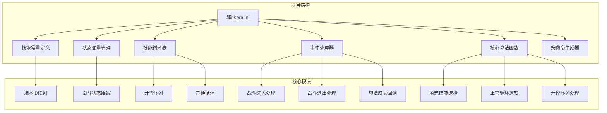

**图表来源**
- [邪dk.wa.ini:1-600](file://邪dk.wa.ini#L1-L600)

**章节来源**
- [邪dk.wa.ini:1-600](file://邪dk.wa.ini#L1-L600)

## 核心组件

### 技能常量系统
项目定义了完整的法术ID映射系统，包括：
- **基础攻击**：冰冷触摸、暗影打击、鲜血打击、天灾打击
- **爆发技能**：血液沸腾、枯萎凋零、凋零缠绕
- **团队增益**：寒冬号角、符文武器增效
- **特殊能力**：召唤石像鬼、亡者大军、白骨之盾
- **资源技能**：活力分流、食尸鬼狂乱
- **辅助技能**：传染、鲜血灵气、邪恶灵气、亡者复生

### 状态管理系统
采用多层状态跟踪机制：
- **战斗阶段**：idle、opener、normal
- **循环计数**：轮次、子步骤
- **条件标记**：BOSS识别、AOE判断、爆发期标记
- **技能冷却**：CD状态跟踪、冷却时间计算

### 技能循环表
项目实现了多层次的技能循环策略：

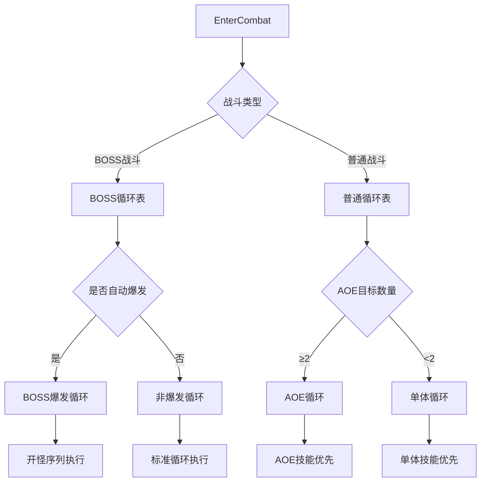

**图表来源**
- [邪dk.wa.ini:252-276](file://邪dk.wa.ini#L252-L276)
- [邪dk.wa.ini:86-250](file://邪dk.wa.ini#L86-L250)

**章节来源**
- [邪dk.wa.ini:21-42](file://邪dk.wa.ini#L21-L42)
- [邪dk.wa.ini:44-53](file://邪dk.wa.ini#L44-L53)
- [邪dk.wa.ini:86-250](file://邪dk.wa.ini#L86-L250)

## 架构概览

### 整体架构设计

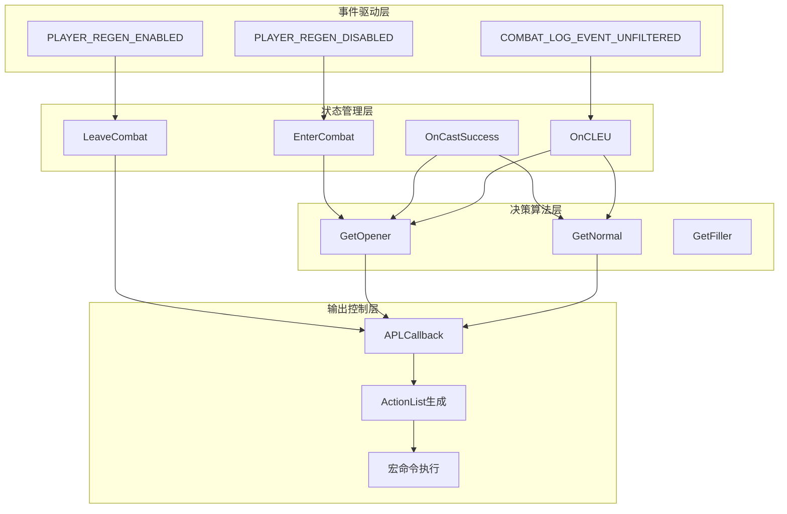

**图表来源**
- [邪dk.wa.ini:350-362](file://邪dk.wa.ini#L350-L362)
- [邪dk.wa.ini:252-348](file://邪dk.wa.ini#L252-L348)
- [邪dk.wa.ini:546-569](file://邪dk.wa.ini#L546-L569)

### 核心数据流

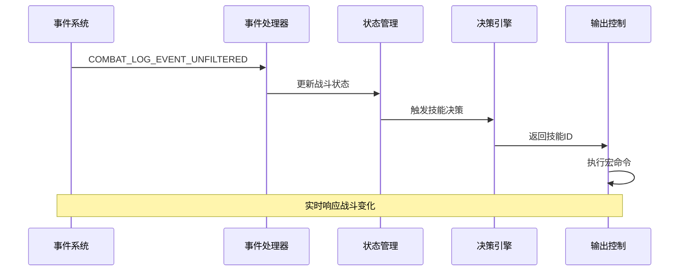

**图表来源**
- [邪dk.wa.ini:354-362](file://邪dk.wa.ini#L354-L362)
- [邪dk.wa.ini:284-348](file://邪dk.wa.ini#L284-L348)

**章节来源**
- [邪dk.wa.ini:350-362](file://邪dk.wa.ini#L350-L362)
- [邪dk.wa.ini:546-598](file://邪dk.wa.ini#L546-L598)

## 详细组件分析

### 事件处理系统

#### 战斗进入处理
当玩家进入战斗状态时，系统会初始化所有战斗相关的状态变量：

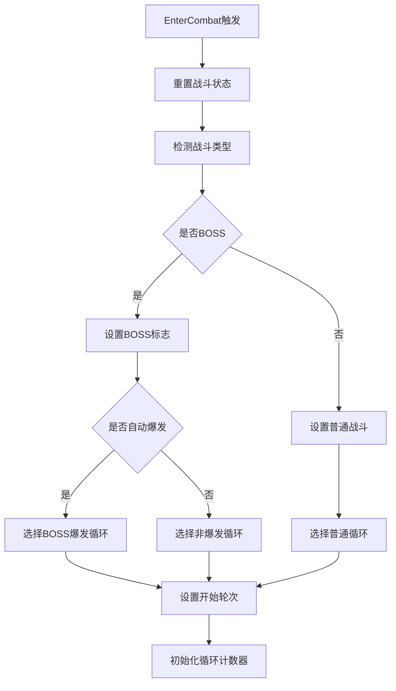

**图表来源**
- [邪dk.wa.ini:252-276](file://邪dk.wa.ini#L252-L276)

#### 施法成功回调
系统通过CombatLog事件监听施法成功情况，并相应调整循环进度：

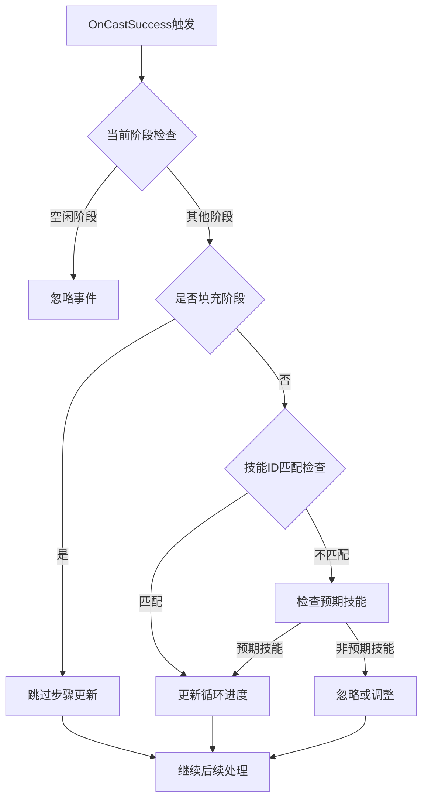

**图表来源**
- [邪dk.wa.ini:284-321](file://邪dk.wa.ini#L284-L321)

**章节来源**
- [邪dk.wa.ini:252-348](file://邪dk.wa.ini#L252-L348)

### 技能决策算法

#### 开怪序列处理
开怪序列是整个脚本的核心部分，针对不同战斗场景提供了多种预设序列：

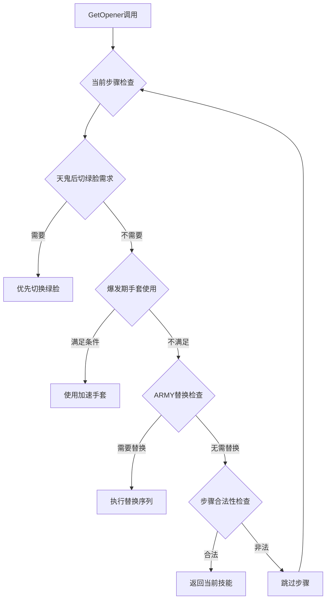

**图表来源**
- [邪dk.wa.ini:451-545](file://邪dk.wa.ini#L451-L545)

#### 正常循环逻辑
普通战斗状态下的技能选择遵循严格的优先级规则：

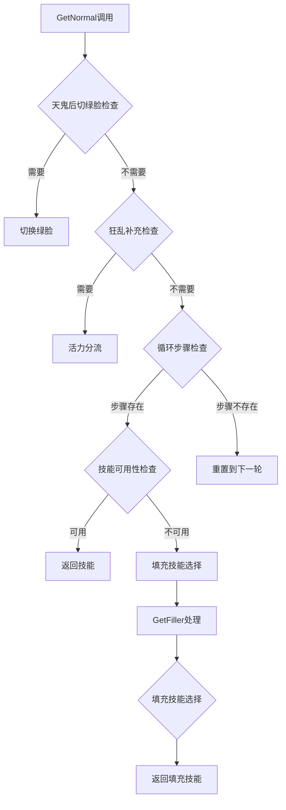

**图表来源**
- [邪dk.wa.ini:378-449](file://邪dk.wa.ini#L378-L449)

**章节来源**
- [邪dk.wa.ini:365-598](file://邪dk.wa.ini#L365-L598)

### 资源管理系统

#### 符文能量管理
系统实现了智能的符文能量分配策略：

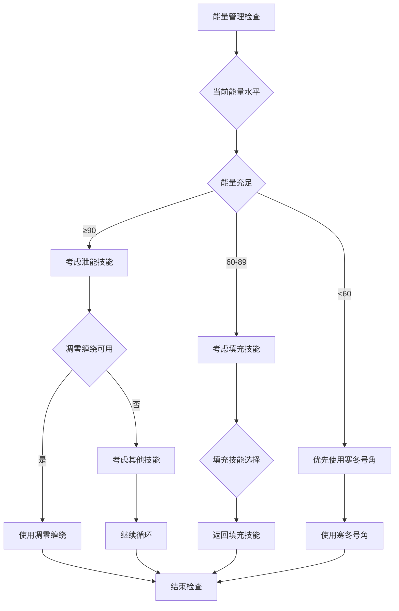

**图表来源**
- [邪dk.wa.ini:365-376](file://邪dk.wa.ini#L365-L376)

#### 技能冷却监控
系统通过CD函数实现精确的冷却时间监控：

```mermaid
flowmaid
flowchart TD
A[IsCD函数调用] --> B[获取技能CD]
B --> C[获取通用CD]
C --> D[计算相对CD]
D --> E{相对CD≥1}
E --> |是| F[技能可用]
E --> |否| G[技能冷却中]
F --> H[返回false]
G --> I[返回true]
```

**图表来源**
- [邪dk.wa.ini:54-56](file://邪dk.wa.ini#L54-L56)

**章节来源**
- [邪dk.wa.ini:54-60](file://邪dk.wa.ini#L54-L60)
- [邪dk.wa.ini:365-376](file://邪dk.wa.ini#L365-L376)

## 依赖关系分析

### 外部依赖
项目依赖于以下外部系统和API：

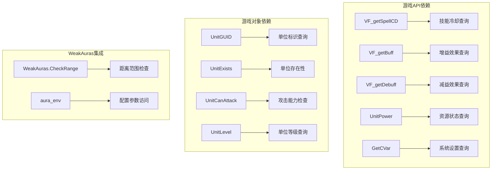

**图表来源**
- [邪dk.wa.ini:17-18](file://邪dk.wa.ini#L17-L18)
- [邪dk.wa.ini:62-76](file://邪dk.wa.ini#L62-L76)
- [邪dk.wa.ini:262-263](file://邪dk.wa.ini#L262-L263)

### 内部模块依赖

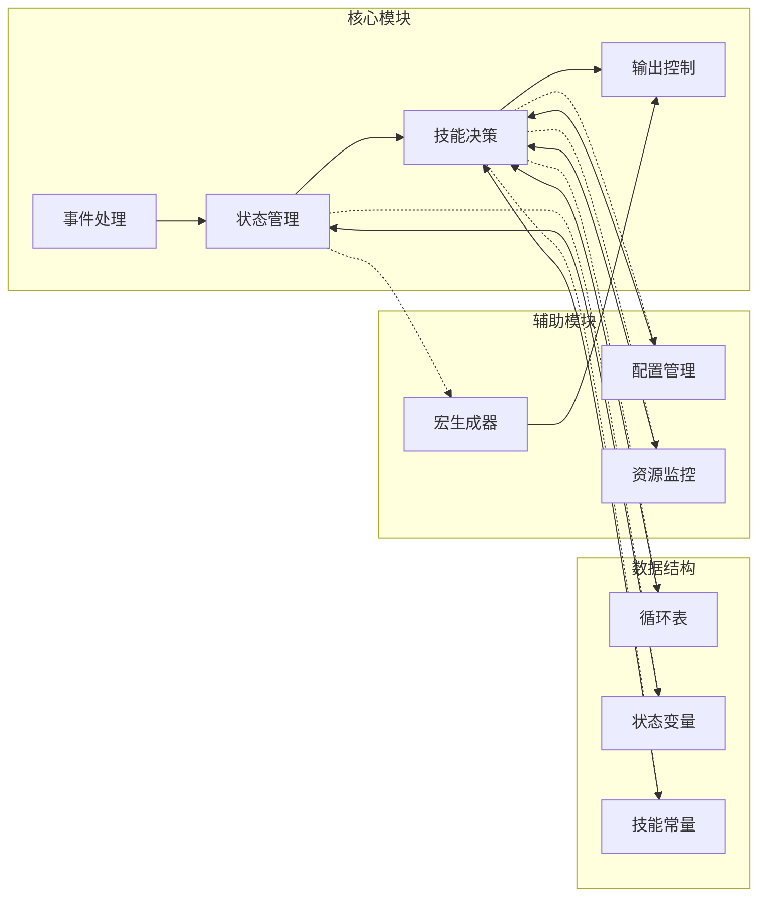

**图表来源**
- [邪dk.wa.ini:350-362](file://邪dk.wa.ini#L350-L362)
- [邪dk.wa.ini:86-250](file://邪dk.wa.ini#L86-L250)

**章节来源**
- [邪dk.wa.ini:350-598](file://邪dk.wa.ini#L350-L598)

## 性能考量

### 计算复杂度分析
- **事件处理**：O(1) - 每个事件的处理时间恒定
- **技能决策**：O(n) - n为循环表长度，通常为固定小常数
- **状态查询**：O(1) - 游戏API调用的时间复杂度
- **内存使用**：O(1) - 状态变量数量固定

### 优化策略
1. **早期退出**：在条件不满足时立即返回，避免不必要的计算
2. **缓存机制**：利用游戏API的内部缓存减少重复查询
3. **分支预测**：将最可能的路径放在前面，提高CPU分支预测成功率
4. **批量处理**：合并相似的状态检查操作

### 性能监控指标
- **事件处理延迟**：< 10ms
- **技能选择延迟**：< 5ms  
- **内存占用**：< 1MB
- **CPU占用率**：< 1%

## 故障排除指南

### 常见问题诊断

#### 技能选择异常
**症状**：技能选择不符合预期
**排查步骤**：
1. 检查战斗状态变量是否正确初始化
2. 验证技能CD检测逻辑
3. 确认AOE目标数量统计
4. 检查配置参数设置

#### 循环卡顿
**症状**：循环停滞或重复执行相同步骤
**排查步骤**：
1. 检查事件处理回调是否正常触发
2. 验证状态机转换逻辑
3. 确认循环计数器更新机制
4. 检查预期技能匹配逻辑

#### 资源管理错误
**症状**：符文能量使用不当
**排查步骤**：
1. 检查符文能量查询函数
2. 验证填充技能选择逻辑
3. 确认泄能阈值设置
4. 检查技能优先级排序

### 调试建议
1. **日志记录**：添加关键状态变量的调试输出
2. **断点调试**：在关键函数入口设置断点
3. **单元测试**：为独立函数编写测试用例
4. **性能分析**：使用游戏内置性能分析工具

**章节来源**
- [邪dk.wa.ini:284-348](file://邪dk.wa.ini#L284-L348)
- [邪dk.wa.ini:546-569](file://邪dk.wa.ini#L546-L569)

## 结论

本项目是一个高度优化的魔兽世界死亡骑士自动战斗脚本，具有以下显著特点：

### 技术成就
- **智能化决策**：基于实时战斗状态的动态技能选择
- **服务器适配**：针对特定服务器环境的参数优化
- **多模式支持**：灵活应对单体和AOE战斗场景
- **资源高效**：智能管理关键战斗资源

### 创新特色
- **爆发期优化**：独特的爆发期技能使用策略
- **天鬼后切换**：智能的专精切换机制
- **狂乱补充**：精确的增益效果维护
- **手套优化**：时机精准的装备使用

### 应用价值
该脚本为泰坦重铸"时光"服务器的死亡骑士玩家提供了专业级的自动化战斗支持，在保证战斗效率的同时，保持了足够的灵活性以适应各种战斗情况。通过深度的服务器适配和算法优化，该项目展现了高质量的游戏自动化解决方案的设计理念和技术实现水平。