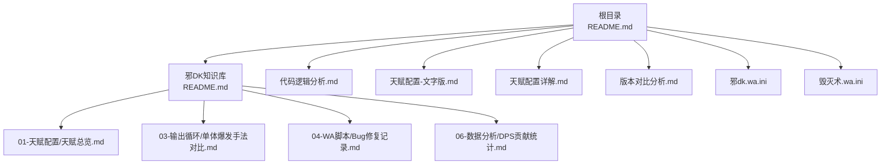
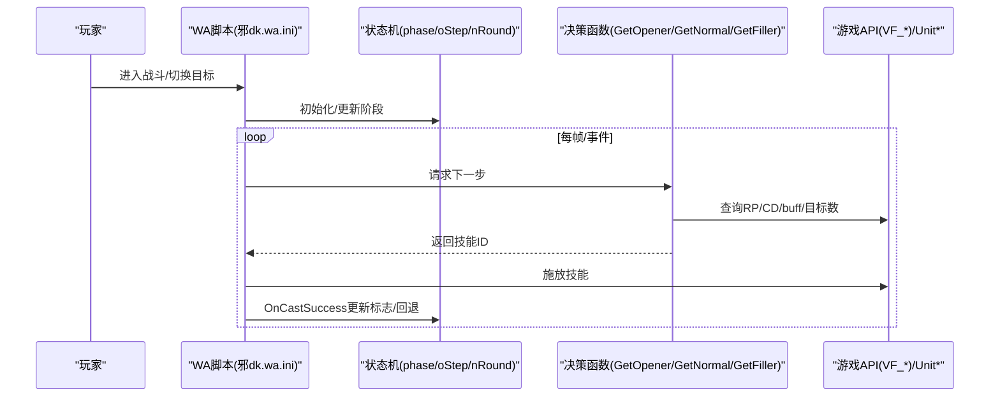
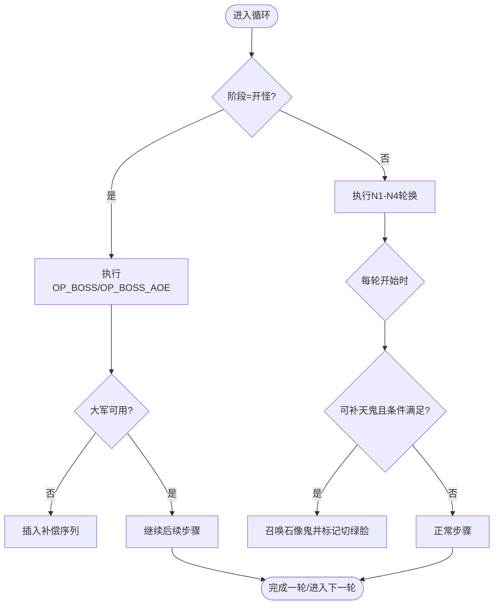
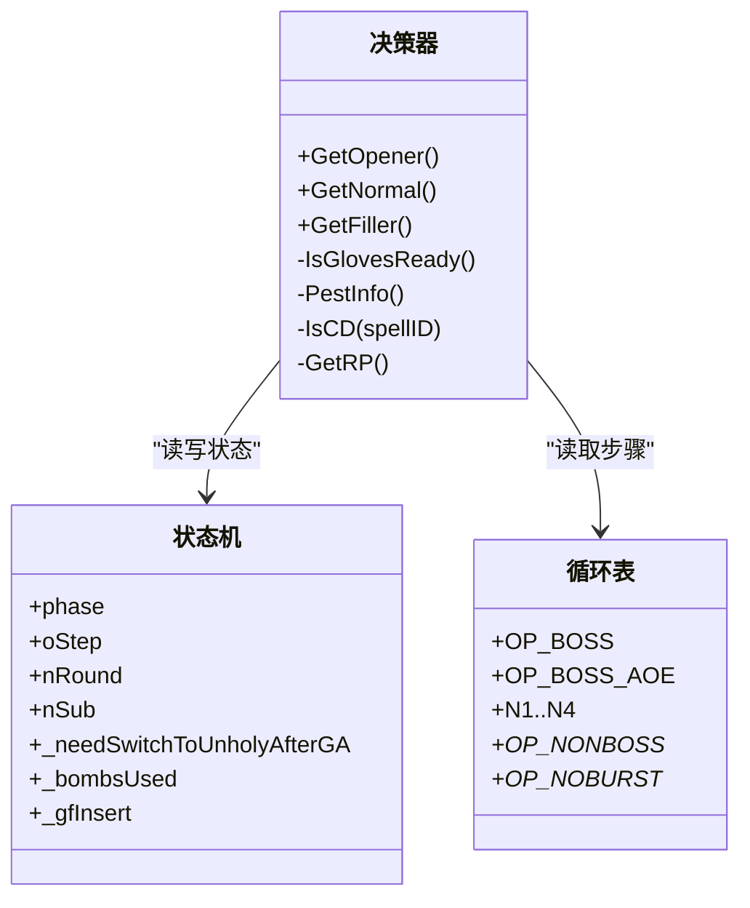
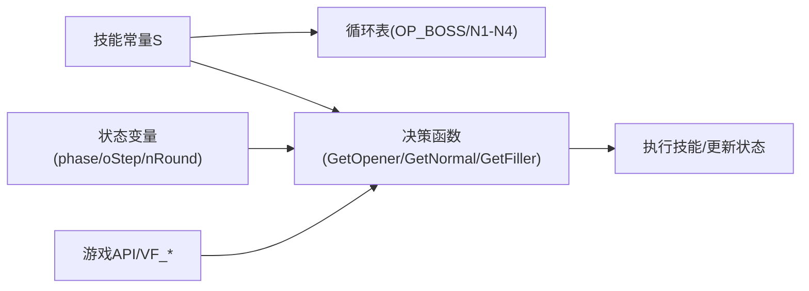

# 完整知识库系统

<cite>
**本文引用的文件**   
- [README.md](file://README.md)
- [邪DK知识库/README.md](file://邪DK知识库/README.md)
- [代码逻辑分析.md](file://代码逻辑分析.md)
- [天赋配置-文字版.md](file://天赋配置-文字版.md)
- [天赋配置详解.md](file://天赋配置详解.md)
- [版本对比分析.md](file://版本对比分析.md)
- [邪DK知识库/01-天赋配置/天赋总览.md](file://邪DK知识库/01-天赋配置/天赋总览.md)
- [邪DK知识库/03-输出循环/单体爆发手法对比.md](file://邪DK知识库/03-输出循环/单体爆发手法对比.md)
- [邪DK知识库/04-WA脚本/Bug修复记录.md](file://邪DK知识库/04-WA脚本/Bug修复记录.md)
- [邪DK知识库/06-数据分析/DPS贡献统计.md](file://邪DK知识库/06-数据分析/DPS贡献统计.md)
- [邪dk.wa.ini](file://邪dk.wa.ini)
- [毁灭术.wa.ini](file://毁灭术.wa.ini)
</cite>

## 目录
1. [引言](#引言)
2. [项目结构](#项目结构)
3. [核心组件](#核心组件)
4. [架构总览](#架构总览)
5. [详细组件分析](#详细组件分析)
6. [依赖关系分析](#依赖关系分析)
7. [性能与稳定性](#性能与稳定性)
8. [故障排查指南](#故障排查指南)
9. [结论与建议](#结论与建议)
10. [附录](#附录)

## 引言
本仓库为“魔兽世界泰坦时光服”（基于WLK 80级框架）的“不死亡灵骑士（邪DK）天打流”自动化输出循环（APL）及配套知识库。内容涵盖：
- 天赋与雕文配置说明
- 输出循环策略（单体、AOE、非Boss、蓄力开怪等）
- WA脚本实现与优化点
- 版本演进与差异对比
- 实战技巧与DPS贡献分析

该知识库旨在帮助玩家快速上手并稳定发挥最高输出，同时为二次开发和维护提供清晰的技术文档。

## 项目结构
仓库采用“主文档 + 知识库子目录 + 脚本配置文件”的组织方式：
- 根目录：主说明文档、WA脚本配置、版本与逻辑分析文档
- 邪DK知识库：按主题分文件夹的天赋、雕文、循环、WA脚本、实战技巧、数据分析等知识文档
- 其他职业脚本：如毁灭术WA脚本示例，便于参考或复用

图表来源
- [README.md:1-545](file://README.md#L1-L545)
- [邪DK知识库/README.md:1-161](file://邪DK知识库/README.md#L1-L161)

章节来源
- [README.md:1-545](file://README.md#L1-L545)
- [邪DK知识库/README.md:1-161](file://邪DK知识库/README.md#L1-L161)

## 核心组件
- 技能常量与状态管理：集中定义技能ID、全局状态变量（阶段、步骤、轮次等），并提供冷却检测、RP读取、目标数量检测等工具函数
- 循环表：针对Boss单体、Boss AOE、非Boss、蓄力开怪等场景分别定义固定顺序的技能序列
- 事件监听与回调：在战斗开始/结束、技能释放成功、CLEU事件等时机更新状态与执行优先级判断
- 智能决策函数：GetOpener（开怪）、GetNormal（常规）、GetFiller（填充/泄能）等，负责根据当前状态选择下一步动作
- 容错与补偿：抵抗回退、大军失败补偿、号角CD跳过、手套使用时机窗口扩大、动态狂乱补充等
- 配置项：通过WA参数控制是否自动使用手套/炸弹、是否开启Boss自动爆发、AOE阈值、泄能阈值等

章节来源
- [邪dk.wa.ini:1-200](file://邪dk.wa.ini#L1-L200)
- [代码逻辑分析.md:1-297](file://代码逻辑分析.md#L1-L297)

## 架构总览
整体流程围绕“事件驱动 + 状态机 + 循环表 + 决策函数”展开：
- 进入战斗后初始化阶段与循环表
- 每帧或事件触发时调用决策函数，返回下一个应执行的技能
- 技能释放成功后更新状态（如标记需要切绿脸、回退步骤等）
- 根据实时资源与环境（RP、CD、目标数、buff/debuff）动态调整

图表来源
- [邪dk.wa.ini:1-200](file://邪dk.wa.ini#L1-L200)
- [代码逻辑分析.md:1-297](file://代码逻辑分析.md#L1-L297)

## 详细组件分析

### 组件A：循环表与阶段管理
- 循环表覆盖多场景：Boss单体、Boss AOE、非Boss、蓄力开怪；每个表由mks构造的步骤组成，包含技能名、ID、步骤描述
- 阶段管理：phase区分opener/normal/idle等；oStep表示当前步骤；nRound/nSub用于常规循环的轮次与子步
- 特殊处理：
  - 天鬼后自动切绿脸：OnCastSuccess设置标志，GetOpener/GetNormal中最高优先级检查并执行
  - 寒冬号角CD跳过：在对应步骤前检测CD，必要时跳过
  - 亡者大军失败补偿：若大军CD不可用，插入替代序列避免浪费爆发窗口

图表来源
- [邪dk.wa.ini:98-200](file://邪dk.wa.ini#L98-L200)
- [代码逻辑分析.md:140-176](file://代码逻辑分析.md#L140-L176)

章节来源
- [邪dk.wa.ini:98-200](file://邪dk.wa.ini#L98-L200)
- [代码逻辑分析.md:140-176](file://代码逻辑分析.md#L140-L176)

### 组件B：智能决策与容错机制
- GetOpener：开怪爆发序列，支持寒冬号角CD跳过、天鬼后切绿脸、手套+炸弹最佳时机窗口（oStep 7-9）
- GetNormal：常规四轮换行，含冰霜疫病保活（≤3秒优先补冰触）、动态狂乱补充（≤5秒或消失时插入分流+狂乱，但避开N4固定轮次以免重复）
- GetFiller：空窗期泄能与填充，依据RP阈值与CD情况选择凋零缠绕/号角/手套等
- 容错：
  - 技能抵抗/未命中：回退到上一步重新执行（排除部分AOE技能）
  - 同符文组互替：原始版本有，优化版移除以降低复杂度
  - nameplate遍历安全：对无效单位进行保护，防止卡死

图表来源
- [邪dk.wa.ini:1-200](file://邪dk.wa.ini#L1-L200)
- [代码逻辑分析.md:1-297](file://代码逻辑分析.md#L1-L297)

章节来源
- [代码逻辑分析.md:1-297](file://代码逻辑分析.md#L1-L297)
- [邪DK知识库/04-WA脚本/Bug修复记录.md:1-255](file://邪DK知识库/04-WA脚本/Bug修复记录.md#L1-L255)

### 组件C：天赋与雕文适配
- 关键天赋：
  - 冰冷之爪(5/5)：需全程保持冰霜疫病，脚本已添加保活逻辑
  - 坚若精钢(3/3)：副手伤害+25%，双持核心
  - 险恶攻击(2/2)：天打暴击+6%、暴伤+30%
  - 骨疽(5/5)、不纯(5/5)、黑色热疫使者(3/3)、瑞文戴尔之怒(5/5)等增伤体系
  - 食尸鬼狂乱(1/1)：支持预铺30秒，动态补充
  - 召唤石像鬼(1/1)：快照攻强、实时急速，脚本支持战后切绿脸
- 雕文：枯萎凋零雕文、食尸鬼雕文、黑暗死亡雕文等，配合天赋最大化收益
- 属性优先级（泰坦时光服初期）：命中(8%) > 力量 > 急速 > 精准(26) > 暴击 > 破甲

章节来源
- [天赋配置详解.md:1-614](file://天赋配置详解.md#L1-L614)
- [天赋配置-文字版.md:1-359](file://天赋配置-文字版.md#L1-L359)
- [邪DK知识库/01-天赋配置/天赋总览.md:1-178](file://邪DK知识库/01-天赋配置/天赋总览.md#L1-L178)
- [邪DK知识库/06-数据分析/DPS贡献统计.md:1-167](file://邪DK知识库/06-数据分析/DPS贡献统计.md#L1-L167)

### 组件D：版本对比与优化要点
- 相比原始版本的主要改进：
  - 开怪爆发移除狂乱/分流，改为战斗前预铺，节省2个GCD
  - 天鬼后自动切绿脸，提升宠物实时急速收益
  - 动态狂乱补充，避免重叠或缺失
  - 手套+炸弹在爆发期最佳时机使用，确保大军享受15秒急速
  - AOE阈值从1调整为2（适配25人副本）
  - 泄能阈值降低以适应高急速成长
  - 修复寒冬号角CD判断错误、nameplate遍历卡死等问题

章节来源
- [版本对比分析.md:1-491](file://版本对比分析.md#L1-L491)
- [README.md:1-545](file://README.md#L1-L545)

### 组件E：实战手法对比与优化建议
- 对比玩家手动手法与WA脚本的差异：
  - 缺少寒冬号角、符文武器增效时机不当、过渡技能不完整等
  - 推荐完全采用WA脚本或采用混合方案（加入号角、调整符武时机、补齐过渡）
- DPS影响估算：缺失号角约损失5-8%，符武时机不当约2-3%，过渡不完整约1-2%

章节来源
- [邪DK知识库/03-输出循环/单体爆发手法对比.md:1-269](file://邪DK知识库/03-输出循环/单体爆发手法对比.md#L1-L269)

## 依赖关系分析
- 外部依赖：
  - WeakAuras插件与VF_getSpellCD等自定义函数（哀冬虚空之花框架）
  - 游戏API：UnitExists、UnitCanAttack、UnitIsDead、WeakAuras.CheckRange等
- 内部依赖：
  - 技能常量S被所有决策函数和循环表引用
  - 状态变量在各函数间共享，保证一致性
  - PestInfo用于AOE判定，IsGlovesReady用于手套时机判断

图表来源
- [邪dk.wa.ini:1-200](file://邪dk.wa.ini#L1-L200)

章节来源
- [邪dk.wa.ini:1-200](file://邪dk.wa.ini#L1-L200)

## 性能与稳定性
- 性能优化点：
  - 减少PestInfo调用频率（可考虑缓存结果）
  - 优化IsCD计算（缓存全局CD）
  - 减少字符串比较开销（预编译模式）
- 稳定性增强：
  - pcall保护nameplate遍历，避免焦点目标导致卡死
  - 技能抵抗回退机制，避免循环中断
  - 号角CD跳过，避免卡住爆发窗口

章节来源
- [代码逻辑分析.md:241-262](file://代码逻辑分析.md#L241-L262)
- [邪DK知识库/04-WA脚本/Bug修复记录.md:134-154](file://邪DK知识库/04-WA脚本/Bug修复记录.md#L134-L154)

## 故障排查指南
- 常见问题与解决方案：
  - N4轮次狂乱重复：已在v2.1修复，动态补充时跳过N4（除非buff消失）
  - 手套使用时机过窄：v2.2扩大至oStep 7-9，确保爆发期使用
  - 常规循环手套重复尝试：增加_bombsUsed标志检查
  - 寒冬号角CD卡住：v2.2修复oStep判断，正确跳过
  - 焦点卡死：v2.2添加pcall保护，安全退出
- 调试建议：
  - 观察oStep与nRound变化，确认阶段推进是否正常
  - 检查RP阈值与CD状态，确认泄能时机是否合理
  - 关注冰霜疫病剩余时间，确保保活逻辑生效

章节来源
- [邪DK知识库/04-WA脚本/Bug修复记录.md:1-255](file://邪DK知识库/04-WA脚本/Bug修复记录.md#L1-L255)
- [代码逻辑分析.md:179-239](file://代码逻辑分析.md#L179-L239)

## 结论与建议
- 优化版本在DPS、稳定性、易用性方面全面优于原始版本，特别适合泰坦时光服的25人副本环境
- 推荐玩家直接采用WA脚本，减少手动操作失误，获得8-14%的综合提升
- 对于追求极致的手动玩家，可参考混合方案，至少加入寒冬号角与正确的符武时机

[本节不直接分析具体文件，无需列出章节来源]

## 附录
- 相关资源链接与参考：
  - 原始脚本：邪dk.wa.ini
  - 知识库入口：邪DK知识库/README.md
  - 代码逻辑分析：代码逻辑分析.md
  - 版本对比：版本对比分析.md
  - 天赋详解：天赋配置详解.md

[本节不直接分析具体文件，无需列出章节来源]