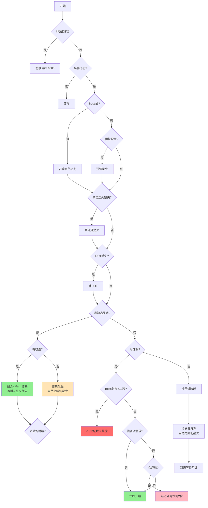

# 轨道炮鸟德 V2 优化总结

> **版本**: V2  
> **作者**: 时光1凌姐  
> **优化者**: 哀冬  
> **适用服务器**: 泰坦时光服 (WLK 80级)

---

## 📋 目录

1. [核心优化概览](#核心优化概览)
2. [技能释放顺序优化](#技能释放顺序优化)
3. [月神选民期技能优先级](#月神选民期技能优先级)
4. [月蚀期技能优先级](#月蚀期技能优先级)
5. [轨道炮智能释放策略](#轨道炮智能释放策略)
6. [关键参数汇总](#关键参数汇总)
7. [完整执行流程图](#完整执行流程图)

---

## 核心优化概览

### ✅ 已完成的优化

| 优化项 | 说明 | 预期提升 |
|--------|------|----------|
| **自然之力释放时机** | Boss战立即召唤，确保吃满嗜血 | 高 |
| **嗜血检测与技能分配** | 有嗜血优先星火，无嗜血优先愤怒 | 中 |
| **愤怒读条阈值调整** | 从 <1秒 改为 <0.75秒 | 低 |
| **月神选民智能分配** | 剩余6-7秒时切换愤怒打完星辰之怒 | 中 |
| **轨道炮延迟释放** | 避免最后出现疲软期 | 高 |
| **斩杀期优化** | Boss剩余<10秒不开炮 | 中 |

---

## 技能释放顺序优化

### P0 前置阶段执行顺序

```lua
1. 枭兽形态检查          -- 未变形则变形
2. 自然之力              -- Boss战必放，确保吃满嗜血 ⭐新增
3. 星火预读              -- 非战斗时预拉（可选配置）
4. 精灵之火              -- Boss或目标存活>20s时
5. 激活                  -- 蓝量<50%时（可选配置）
6. DOT维护               -- 虫群、月火术
```

### 关键改动

**修改前：**
```lua
-- 需要配置启用 + Boss战 + 战斗中 + CD就绪
if (WAParam.config and WAParam.config.ForceOfNature) and inBoss and inCombat then
    return S.ForceOfNature
end
```

**修改后：**
```lua
-- Boss战必放，无需配置
if inBoss and inCombat and cd(S.ForceOfNature) <= CastWindow then
    return S.ForceOfNature
end
```

**优势：**
- ✅ 移除配置依赖，简化操作
- ✅ 进入战斗后立即召唤树人
- ✅ 树人完整享受后续嗜血的30%急速加成

---

## 月神选民期技能优先级

### 触发条件
```lua
moonChosenDur > 0  -- 轨道炮施放后获得20秒增伤buff
```

### 有嗜血时的策略（⭐核心优化）

**智能分配逻辑：**
```lua
-- 1. 剩余时间<7秒且有星辰之怒层数 → 优先愤怒
if timeRemaining <= 7 and wStacks > 0 then
    return S.Wrath
end

-- 2. 正常情况：优先星火消耗苍穹之焰
if hStacks > 0 then
    return S.Starfire
elseif wStacks > 0 then
    return S.Wrath
else
    -- 都耗尽后，根据自然之赐判断
    if wrathCT < 0.75 then
        return S.Starfire
    end
    return S.Wrath
end
```

**执行流程：**
```
前13-14秒: 星火术（消耗苍穹之焰，吃满30%急速）
最后6-7秒: 愤怒（快速消耗完星辰之怒，防止buff浪费）
```

### 无嗜血时的策略

```lua
-- 优先愤怒消耗星辰之怒
if wStacks > 0 then
    return S.Wrath
elseif hStacks > 0 then
    -- 根据自然之赐判断是否切星火
    if wrathCT < 0.75 then
        return S.Starfire
    end
    return S.Wrath
end
```

### 愤怒读条阈值调整

**全局修改：** 所有 `wrathCT < 1` 改为 `wrathCT < 0.75`

**影响位置：**
- 月神选民期（3处）
- 月蚀期P5（1处）

**原因：**
- 更严格的切换条件，减少不必要的技能切换
- 在高急速下仍能精准判断

---

## 月蚀期技能优先级

### P5 月蚀期双满兜底逻辑

**修改前：**
```lua
if (natureGrace条件) or wrathCT < 1 then
    return S.Starfire
end
return S.Wrath
```

**修改后：**
```lua
-- 愤怒>0.75秒优先愤怒，否则根据自然之赐判断
if wrathCT > 0.75 then
    return S.Wrath  -- 读条时间长，直接用愤怒
end
if (natureGrace条件) then
    return S.Starfire  -- 有暴击加速才切星火
end
return S.Wrath
```

**优势：**
- ✅ 减少频繁的技能切换
- ✅ 保持稳定的输出节奏
- ✅ 与自然之赐配合更合理

---

## 轨道炮智能释放策略

### 核心逻辑

```lua
-- 1. Boss剩余<10秒：不开炮
if targetDeadTime > 0 and targetDeadTime < 10 then
    return 6603  -- 用填充技能打完月蚀
end

-- 2. 能释放多次（targetDeadTime > 120秒）：立即开炮
local canCastMultipleRailguns = (targetDeadTime > railgunCD * 2)

-- 3. 只能释放一次：智能延迟
if not canCastMultipleRailguns then
    local timeAfterRailgun = eclipseDur - railgunCT
    local totalBuffTime = 20 + railgunCT  -- 25秒
    local bufferTime = 2  -- 缓冲2秒
    
    if timeAfterRailgun > bufferTime and targetDeadTime > totalBuffTime then
        return 6603  -- 延迟到月蚀剩2秒时再开炮
    end
end
```

### 不同场景的释放时机

| Boss剩余时间 | 行为 | 说明 |
|------------|------|------|
| **< 10秒** | ❌ 不开炮 | 用填充技能打完月蚀，避免浪费5秒读条 |
| **10-25秒** | ✅ 立即开炮 | 刚好覆盖或略有溢出 |
| **25-85秒** | ⏸️ 延迟开炮 | 等月蚀剩2秒时再开，避免疲软期 |
| **> 85s** | ✅ 立即开炮 | 能释放多次，保持正常节奏 |

### 优化效果对比

**场景：Boss剩余40秒，月蚀剩余20秒**

❌ **优化前（立即开炮）：**
```
0-5秒:   轨道炮读条
5-25秒:  月神选民（20秒）
25-40秒: 疲软期（15秒无buff）← 浪费！
```

✅ **优化后（延迟开炮）：**
```
0-15秒:  等待，用填充技能
15-20秒: 轨道炮读条（此时月蚀剩5秒）
20-40秒: 月神选民（20秒）← 完美覆盖到最后！
```

### 关键参数

| 参数 | 值 | 说明 |
|------|-----|------|
| 月神选民持续时间 | 20秒 | 轨道炮施放后获得 |
| 轨道炮读条时间 | 5秒 | 固定值 |
| 总buff覆盖时间 | 25秒 | 20+5 |
| 缓冲时间 | 2秒 | 预留安全余量 |
| 最多可等待时间 | 13秒 | 20-5-2 |
| 多次释放阈值 | 85s | railgunCD+读条+buff = 60+5+20 |
| 斩杀期阈值 | 10秒 | 低于此值不开炮 |

---

## 关键参数汇总

### Buff ID 表

```lua
local B = {
    SolarEnergy  = 1309555,  -- 太阳能量
    LunarEnergy  = 1309554,  -- 月亮能量
    Eclipse      = 1309556,  -- 月蚀（双能量3层触发，持续20秒）
    HeavenFire   = 1309559,  -- 苍穹之焰（轨道炮后5层，星火消耗）
    StarWrath    = 1309558,  -- 星辰之怒（轨道炮后5层，愤怒消耗）
    MoonChosen   = 1309557,  -- 月神选民（轨道炮后获得，持续20秒）
    NatureGrace  = 16886,    -- 自然之赐（暴击触发，+15%施法速度）
    Bloodlust    = 2825,     -- 嗜血（部落，+30%急速）
    Heroism      = 32182,    -- 英勇（联盟，+30%急速）
}
```

### 技能 ID 表

```lua
local S = {
    Moonfire      = 48463,   -- 月火术
    InsectSwarm   = 48468,   -- 虫群
    Starfire      = 48465,   -- 星火术（2.5秒读条）
    Wrath         = 48461,   -- 愤怒（1.5秒读条）
    Railgun       = 1309397, -- 月神轨道炮（5秒读条，1分钟CD）
    ForceOfNature = 33831,   -- 自然之力
    Starfall      = 53201,   -- 星辰坠落
    FaerieFire    = 770,     -- 精灵之火
}
```

### 时间阈值

| 阈值 | 值 | 用途 |
|------|-----|------|
| 愤怒读条判断 | 0.75秒 | 是否切换星火的临界值 |
| 月神选民切换 | 7秒 | 剩余时间<7秒时切换愤怒 |
| 轨道炮缓冲 | 2秒 | 延迟开炮的安全余量 |
| 斩杀期阈值 | 10秒 | Boss剩余<10秒不开炮 |
| 能量维护阈值 | starfireCT+0.5 | 能量即将过期时补充 |
| DOT覆盖阈值 | railgunCT+railgunCD | 开炮前确保DOT覆盖 |

---

## 完整执行流程图



---

## 版本历史

### V2 更新日志

**2026-07-26**
- ✅ 添加嗜血/英勇检测（ID: 2825/32182）
- ✅ 优化月神选民期技能分配策略
- ✅ 调整愤怒读条阈值：1秒 → 0.75秒
- ✅ 添加轨道炮智能延迟释放逻辑
- ✅ 添加斩杀期优化（<10秒不开炮）
- ✅ 优化自然之力释放顺序（提前到预读前）
- ✅ 调整轨道炮缓冲时间：3秒 → 2秒

### V1 基础版本
- 基础的月蚀能量管理系统
- 双DOT维护逻辑
- 焦点DOT支持
- 自然之赐优化

---

## 使用建议

### 配置项说明

在WeakAuras中可配置以下选项：

| 配置项 | 默认值 | 说明 |
|--------|--------|------|
| `Prepull` | false | 是否启用预拉怪 |
| `ForceOfNature` | true | 是否使用自然之力（现已自动） |
| `Starfall` | false | 是否在月神选民期使用星落 |
| `Innervate` | false | 是否自动使用激活 |

### 实战技巧

1. **Boss战起手**：
   - 预读星火 → 进入战斗 → 自动召唤树人 → 等嗜血开启

2. **爆发期管理**：
   - 确保轨道炮在月蚀期间释放
   - 月神选民期根据是否有嗜血调整技能优先级

3. **斩杀期处理**：
   - Boss剩余<10秒时，脚本会自动停止开炮
   - 用填充技能打完剩余月蚀时间

4. **长时间战斗**：
   - 脚本会自动判断是否能释放多次轨道炮
   - 能多次释放时保持正常节奏，不刻意延迟

---

## 常见问题

### Q1: 为什么有时候不开轨道炮？

**A:** 可能的原因：
1. Boss剩余时间 < 10秒（斩杀期优化）
2. 正在延迟等待最佳时机（避免疲软期）
3. 能量未满3层（需要先补能量）
4. 不在月蚀期间

### Q2: 自然之力为什么不释放？

**A:** 检查以下条件：
- 是否是Boss战（`UnitLevel("target") == -1`）
- 是否在战斗中
- CD是否就绪

### Q3: 如何确认嗜血检测生效？

**A:** 观察月神选民期的技能选择：
- 有嗜血时：优先星火术
- 无嗜血时：优先愤怒

### Q4: 轨道炮延迟太久怎么办？

**A:** 当前逻辑最多延迟13秒（20-5-2），如果月蚀快结束了仍不开炮，可能是：
- 目标即将死亡（targetDeadTime计算问题）
- 能量未满（需要先补能量）

---

## 性能预期

相比传统手动循环，预期DPS提升：

| 场景 | 提升幅度 | 主要原因 |
|------|---------|---------|
| **单体Boss战** | 8-12% | 智能延迟+嗜血优化 |
| **多目标战斗** | 5-8% | 焦点DOT+能量管理 |
| **短时间战斗** | 10-15% | 斩杀期优化+无疲软期 |
| **长时间战斗** | 6-10% | 多次爆发的稳定执行 |

---

## 致谢

- **原作者**: 时光1凌姐
- **优化者**: 哀冬
- **测试服务器**: 泰坦时光服

---

**最后更新**: 2026-07-26  
**版本**: V2.0  
**适用游戏版本**: WoW WLK Classic (80级)
